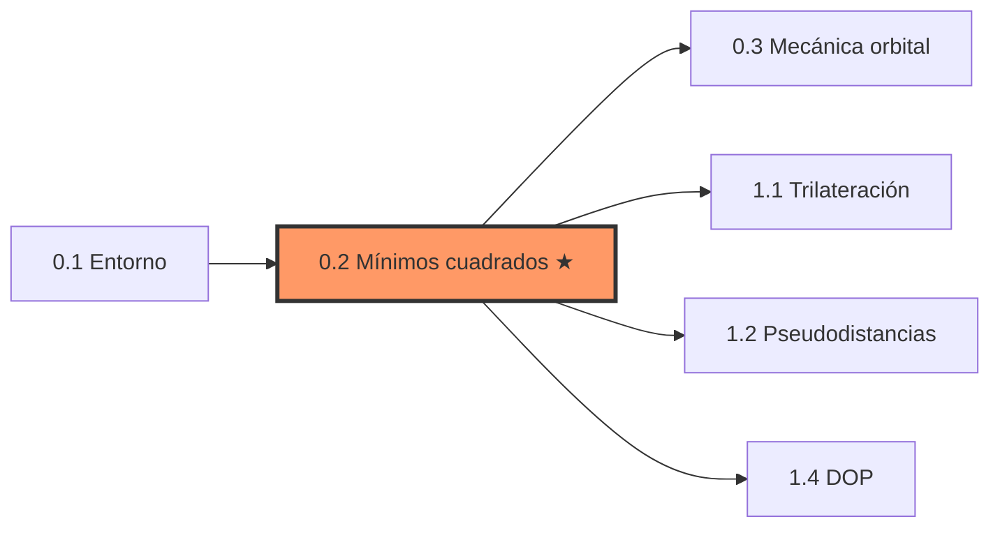
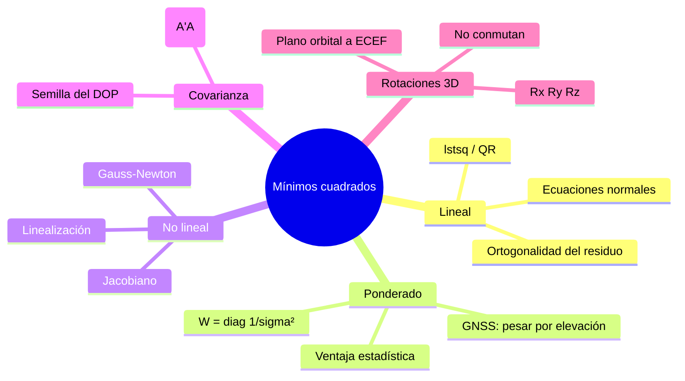

# Clase 0.2 — Mínimos cuadrados, Gauss-Newton y rotaciones 3D

> **Módulo 0 — Prerrequisitos** · Prerrequisito de: 1.1, 1.2, 1.4 (todo el módulo 1) · Duración estimada: 3–4 h

Esta clase es el **motor matemático** de todo el curso. El posicionamiento GNSS
es, en el fondo, un problema de mínimos cuadrados no lineal que se resuelve
linealizando e iterando. Acá construís ese motor con las manos: ecuaciones
normales, ponderación, Gauss-Newton, covarianza del estimador y rotaciones 3D.

---

## 1. Objetivos

Al terminar esta clase vas a poder:

- [ ] Resolver un ajuste lineal por **ecuaciones normales** (AᵀA)x̂ = Aᵀb y explicar la ortogonalidad Aᵀr = 0.
- [ ] Implementar **mínimos cuadrados ponderados** con W = diag(1/σ²) y justificar por qué la ventaja es estadística (no de una tirada).
- [ ] Escribir **Gauss-Newton a mano**: residuo → jacobiano → (JᵀJ)δ = Jᵀr → iterar.
- [ ] Verificar por Monte Carlo que cov(x̂) = σ²(AᵀA)⁻¹ — la fórmula que en la clase 1.4 se convierte en el **DOP**.
- [ ] Construir Rx, Ry, Rz y demostrar que **no conmutan** (lo vas a necesitar en 0.3 para pasar de plano orbital a ECEF).
- [ ] Conectar **condicionamiento** de una matriz con geometría de las mediciones.

## 2. Dónde estás en el mapa

## 3. Teoría (para completar leyendo y haciendo)

### 3.1 El problema lineal

Dado un modelo y = a + b·x con más mediciones que incógnitas, buscamos el
x̂ que minimiza ‖Ax − b‖². La solución cumple las **ecuaciones normales**:

$$ (A^\top A)\,\hat{x} = A^\top b $$

La lectura geométrica: Ax̂ es la **proyección ortogonal** de b sobre el
espacio columna de A. Por eso el residuo r = b − Ax̂ satisface

$$ A^\top r = \mathbf{B1: \_\_\_\_} $$

*(completá B1 después de correr la Parte A del lab)*

### 3.2 Ponderado

Si cada medición tiene su propio σᵢ, minimizamos ‖W^{1/2}(Ax − b)‖² con
W = diag(1/σᵢ²):

$$ (A^\top W A)\,\hat{x} = A^\top W b $$

**Trampa conceptual**: en UNA realización el estimador sin pesos puede dar
más cerca de la verdad. La ventaja de ponderar es sobre el **conjunto** de
realizaciones: reduce la varianza. En el lab lo verificás con 1000 tiradas
Monte Carlo. En GNSS esto reaparece como "pesar por elevación": los
satélites bajos son más ruidosos (más atmósfera, más multipath).

### 3.3 Gauss-Newton: linealizar e iterar

Con un modelo no lineal f(x, p), alrededor de un punto p₀:

$$ f(x, p_0 + \delta) \approx f(x, p_0) + J\,\delta $$

donde J = ∂f/∂p es el **jacobiano**. Sustituyendo en el problema de
mínimos cuadrados queda un problema LINEAL en δ:

$$ (J^\top J)\,\delta = J^\top r, \qquad r = y - f(x, p_0) $$

Se actualiza p ← p + δ y se repite. Cerca de la solución la convergencia
es casi **cuadrática**: la norma del paso cae como B2: \_\_\_\_
*(mirá la secuencia de ‖δ‖ que imprime la Parte C: 2.7e-1 → … → 2e-9)*.

**Este loop es literalmente el PVT**: en la clase 1.2, f son las
pseudodistancias predichas y p = (x, y, z, c·dt).

### 3.4 La covarianza del estimador

Si b = Ax_verdad + ε con ε ~ N(0, σ²I):

$$ \mathrm{cov}(\hat{x}) = \sigma^2 (A^\top A)^{-1} $$

La geometría de A (¡solo la geometría!) decide cuánto se amplifica el
ruido. En la clase 1.4, con A = matriz de geometría receptor-satélites,
√tr de esta matriz se llama B3: \_\_\_\_.

### 3.5 Rotaciones

Las matrices de rotación elementales (convención activa, mano derecha):

$$ R_z(\theta) = \begin{pmatrix} \cos\theta & -\sin\theta & 0 \\ \sin\theta & \cos\theta & 0 \\ 0 & 0 & 1 \end{pmatrix} $$

Propiedades: RᵀR = I, det R = +1, y **no conmutan**. La composición
3-1-3 (Rz·Rx·Rz) es la que lleva del plano orbital al sistema inercial
en la clase 0.3.

## 4. Lab

Archivos:

- `lab/lab_minimos_cuadrados_TODO.py` / `.ipynb` — completá los TODO.
- `lab/soluciones/lab_minimos_cuadrados_solucion.py` — solución de referencia.
- `data/generar_datos_ajuste.py` → `data/datos_ajuste.json` (ya generado, seed 42).

**Regla**: nada de `scipy.optimize` ni `np.polyfit`. `np.linalg.lstsq`
solo para cotejar.

### Tabla de validación (tus números deben coincidir)

| Parte | Métrica | Valor de referencia |
|---|---|---|
| A | recta (a, b) | **2.011, 3.062** (verdad: 2, 3) |
| A | máx \|Aᵀr\| | **7.7e-13** (~0) |
| B | una tirada, con pesos | 1.886, 2.989 |
| B | MC 1000: RMS sin / con pesos | **0.512 / 0.280** (mejora ×1.8) |
| C | Gauss-Newton (p0, p1) | **2.0278, 0.4968** en **8** iteraciones |
| C | secuencia ‖δ‖ | 2.7e-1, 5.7e-1, 3.4e-1, 1.7e-2, 9.6e-5, 7.8e-7, 2.0e-9 |
| D | var(a): teórica / empírica | 0.18571 / 0.18628 → cociente **1.003** |
| E | Rz(90°)Rx(90°)ẑ vs Rx(90°)Rz(90°)ẑ | (1, 0, 0) vs (0, −1, 0) |
| F | cond(M) a 90° / 30° / 5° | **1.00 / 3.73 / 22.90** |
| F | √tr((MᵀM)⁻¹) a 90° / 30° / 5° | 1.41 / 2.83 / 16.23 |

## 5. Ejercicios a mano (papel, sin Python)

**E1.** Con A = [[1,0],[0,1],[1,1]] y b = (1, 1, 3):
armá AᵀA y Aᵀb, resolvé el sistema 2×2 y verificá que Aᵀr = 0.

**E2.** Calculá el gradiente de f(x, y) = √(x² + y²) en el punto (3, 4).
(Pista: es el vector unitario desde el origen. Lo volvés a ver en la
clase 1.2 como fila del jacobiano de una pseudodistancia.)

**E3.** Un paso de Gauss-Newton para "resolver" x² = 9 desde x₀ = 2:
f(x) = x², r = 9 − f(x₀), J = 2x₀. Calculá x₁ y después x₂.
¿Qué notás sobre la velocidad a la que se acerca a 3?

## 6. Estimaciones Fermi

**F1.** Si querés la mitad de error en los parámetros, ¿cuántas veces más
mediciones necesitás? (El error baja como 1/√n.)

**F2.** Ajustás una recta con 2 puntos exactos vs 100 puntos ruidosos.
¿Cuál preferís para *predecir* y por qué? ¿Qué te dan los residuos?

**F3.** Sin calcular exactamente: ¿del orden de cuánto es cond(M) si las
dos columnas unitarias forman 1°? (Referencia: a 5° dio ~23.)

## 7. Preguntas conceptuales

<b>C1.</b> ¿Por qué el residuo de mínimos cuadrados es ortogonal a las columnas de A?

Porque Ax̂ es la proyección ortogonal de b sobre col(A): si r tuviera
componente dentro de col(A), podrías moverte en esa dirección y reducir
‖r‖², contradiciendo que x̂ es el mínimo. Algebraicamente sale de derivar
‖Ax−b‖² e igualar a cero: 2Aᵀ(Ax̂−b) = 0.

<b>C2.</b> ¿Ponderar garantiza un resultado mejor en cada experimento?

No. Garantiza menor **varianza del estimador** (es el BLUE si los pesos
son 1/σ² correctos). En una realización puntual el azar puede favorecer
al no ponderado — por eso el lab lo verifica con Monte Carlo y no con
una tirada.

<b>C3.</b> ¿Qué puede salir mal en Gauss-Newton?

Si el punto inicial está lejos, la linealización es mala y puede
diverger u oscilar; si JᵀJ es casi singular (mal condicionamiento,
geometría pobre), el paso δ explota. Remedios clásicos: amortiguar el
paso (Levenberg-Marquardt) o mejorar la geometría. En GNSS: geometría
pobre = DOP alto.

<b>C4.</b> ¿Por qué cov(x̂) = σ²(AᵀA)⁻¹ no depende de b?

Porque x̂ es lineal en b: x̂ = (AᵀA)⁻¹Aᵀb, y la covarianza de una
transformación lineal Lb es L cov(b) Lᵀ. Con cov(b) = σ²I queda
σ²(AᵀA)⁻¹AᵀA(AᵀA)⁻¹ = σ²(AᵀA)⁻¹. Solo importa la GEOMETRÍA (A) y el
nivel de ruido (σ). Exactamente la separación σ × DOP de la clase 1.4.

<b>C5.</b> ¿Por qué las rotaciones 3D no conmutan y las 2D sí?

En 2D todas las rotaciones comparten el mismo eje (el perpendicular al
plano): son giros de un solo parámetro que se suman. En 3D cada rotación
mueve el eje de la siguiente: el grupo SO(3) no es abeliano. Consecuencia
práctica: el orden Rz(Ω)·Rx(i)·Rz(ω) de la clase 0.3 no es negociable.

## 8. Preguntas de entrevista

1. Derivá las ecuaciones normales desde ‖Ax−b‖².
2. ¿Cuándo usarías QR o SVD en lugar de ecuaciones normales? (Estabilidad: cond(AᵀA) = cond(A)².)
3. Explicá Gauss-Newton en 60 segundos a alguien que sabe cálculo.
4. ¿Qué es el número de condición y qué te dice de tu sistema?
5. ¿Cómo elegirías los pesos en un ajuste con mediciones heterogéneas?

## 9. Mini-simulacro (8 min, aprobás con 4/5)

1. Escribí las ecuaciones normales ponderadas. *(1 pt)*
2. ¿Qué propiedad cumple el residuo respecto de col(A)? *(1 pt)*
3. En Gauss-Newton, ¿qué sistema lineal se resuelve en cada iteración? *(1 pt)*
4. ¿Cuál es la covarianza del estimador LS con ruido σ²I? *(1 pt)*
5. Verdadero/Falso: Rx(90°)Rz(90°) = Rz(90°)Rx(90°). Justificá con un vector. *(1 pt)*

## 10. Figuras

| Figura | Qué muestra |
|---|---|
| `img/fig1_recta_ponderada.svg` | Datos con barras de error por σ, verdad vs LS simple vs ponderado |
| `img/fig2_convergencia_gn.svg` | ‖δ‖ por iteración (semilog): convergencia casi cuadrática |
| `img/fig3_condicionamiento.svg` | Nubes de soluciones con columnas a 90° vs 10°: el error se estira |

Regenerar: `cd img && python3 make_figures.py`

## 11. Caso real: Gauss, Ceres y el nacimiento de los mínimos cuadrados (1801)

El 1 de enero de 1801 Piazzi descubrió Ceres y lo siguió 41 días antes de
perderlo detrás del Sol. Con ese arco mínimo de observaciones, Gauss
—24 años— combinó mecánica kepleriana con su método de minimizar la suma
de cuadrados de los residuos y predijo dónde reaparecería. Olbers lo
reencontró a fin de año, a medio grado de la predicción.

La moraleja para este curso: **mínimos cuadrados nació resolviendo una
órbita** — la misma dupla (dinámica orbital + ajuste de observaciones
redundantes) que hoy calcula tu posición con GNSS. La clase 0.3 pone la
parte orbital; el módulo 1, el ajuste.

## 12. Glosario ES/EN

| Español | English |
|---|---|
| mínimos cuadrados | least squares (LS) |
| ecuaciones normales | normal equations |
| ponderado | weighted (WLS) |
| residuo | residual |
| jacobiano | Jacobian |
| linealización | linearization |
| matriz de diseño | design matrix |
| número de condición | condition number |
| covarianza del estimador | estimator covariance |
| matriz de rotación | rotation matrix |

## 13. Cheat sheet

$$ (A^\top A)\hat{x} = A^\top b \qquad (A^\top W A)\hat{x} = A^\top W b, \; W = \mathrm{diag}(1/\sigma_i^2) $$

$$ \text{GN: } (J^\top J)\delta = J^\top r, \quad p \leftarrow p + \delta \qquad \mathrm{cov}(\hat{x}) = \sigma^2 (A^\top A)^{-1} $$

$$ R_x(\theta)=\!\begin{pmatrix}1&0&0\\0&c&-s\\0&s&c\end{pmatrix}\; R_y(\theta)=\!\begin{pmatrix}c&0&s\\0&1&0\\-s&0&c\end{pmatrix}\; R_z(\theta)=\!\begin{pmatrix}c&-s&0\\s&c&0\\0&0&1\end{pmatrix} $$

## 14. Errores comunes

- **Invertir AᵀA explícitamente** en lugar de `np.linalg.solve`: menos estable y más lento.
- **Pesar por σ en vez de 1/σ²** (o al revés): verificá unidades mentales — más ruido ⇒ menos peso.
- **Concluir de una sola tirada** que ponderar "no sirve": la ventaja es en varianza, se ve con Monte Carlo.
- **Olvidar actualizar el jacobiano** dentro del loop de GN: J depende de p.
- **Confundir convención activa/pasiva** en rotaciones: acá rotamos el VECTOR (activa).
- **Chequear convergencia con el residuo** en vez de ‖δ‖: el residuo no tiende a cero con datos ruidosos; el paso sí.

## 15. Referencias

- Strang, *Linear Algebra and Its Applications* — cap. de proyecciones y LS.
- Nocedal & Wright, *Numerical Optimization* — cap. 10 (Gauss-Newton, LM).
- Misra & Enge, *GPS: Signals, Measurements, and Performance* — apéndice de LS (la conexión GNSS directa).
- Teunissen & Montenbruck (eds.), *Springer Handbook of GNSS* — cap. de estimación.

## 16. Flashcards y bitácora

- `flashcards_anki.csv` — importalo en Anki (deck sugerido `GNSS::M0::0.2`).
- `bitacora.md` — anotá tus números contra la tabla de validación y qué te costó.

**Próxima clase → 0.3 Mecánica orbital mínima**: Kepler, anomalías M/E/ν
y por qué la efeméride trae OMEGA_DOT. Las rotaciones de la Parte E son
el puente.
