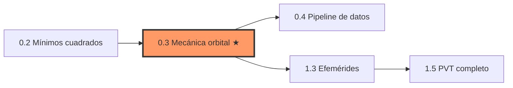
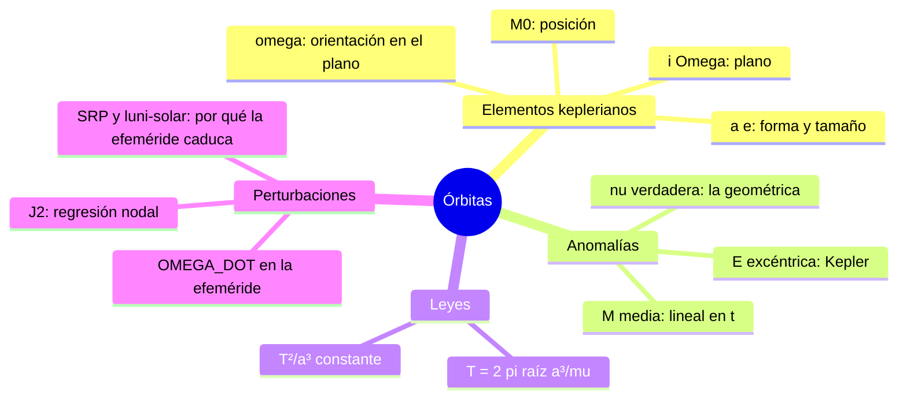

# Clase 0.3 — Mecánica orbital mínima (para leer una efeméride)

> **Módulo 0 — Prerrequisitos** · Requiere: 0.2 (rotaciones) · Prerrequisito de: 1.3 · Duración estimada: 3–4 h

Objetivo quirúrgico: **lo justo** de mecánica orbital para que una
efeméride broadcast deje de ser una sopa de parámetros. Elementos
keplerianos, la cadena M → E → ν, los periodos que importan, y por qué
la Tierra achatada (J2) obliga a que la efeméride traiga OMEGA_DOT.

---

## 1. Objetivos

Al terminar esta clase vas a poder:

- [ ] Nombrar los **6 elementos keplerianos** y decir qué fija cada uno (forma, tamaño, orientación, posición).
- [ ] Resolver la **ecuación de Kepler** M = E − e·sin(E) por Newton y explicar por qué con e~0.01 (GNSS) converge en 2-3 iteraciones.
- [ ] Ejecutar la cadena **M → E → ν** con la fórmula del semiángulo.
- [ ] Calcular periodo y velocidad de ISS/GPS/Galileo/GEO y verificar la **tercera ley**.
- [ ] Calcular la **regresión nodal por J2** y conectarla con el campo OMEGA_DOT de la efeméride.
- [ ] Explicar por qué GPS eligió medio día sidéreo y Galileo lo evitó.

## 2. Dónde estás en el mapa

## 3. Teoría (para completar leyendo y haciendo)

### 3.1 Los seis elementos

Una órbita kepleriana queda definida por:

| Elemento | Símbolo | Qué fija |
|---|---|---|
| semieje mayor | a | tamaño (y el periodo, por la 3ª ley) |
| excentricidad | e | forma (0 = círculo) |
| inclinación | i | inclinación del plano respecto del ecuador |
| ascensión recta del nodo | Ω | dónde el plano cruza el ecuador |
| argumento del perigeo | ω | orientación de la elipse EN el plano |
| anomalía media en época | M₀ | dónde está el satélite |

La efeméride GNSS transmite exactamente esto (√a, e, i₀, Ω₀, ω, M₀) más
correcciones — la clase 1.3 las aplica una por una según el ICD.

### 3.2 Las tres anomalías

- **M (media)**: crece LINEAL con el tiempo, M = M₀ + n·(t − t₀), con
  n = √(μ/a³). No es un ángulo geométrico: es un reloj.
- **E (excéntrica)**: el ángulo auxiliar sobre el círculo circunscripto.
  Se obtiene resolviendo Kepler: M = E − e·sin(E) — trascendente, se
  resuelve por B1: \_\_\_\_ *(¿qué método usa el lab y cuántas
  iteraciones necesita con e = 0.01?)*.
- **ν (verdadera)**: el ángulo REAL foco→satélite medido desde el
  perigeo. Del semiángulo: ν = 2·atan2(√(1+e)·sin(E/2), √(1−e)·cos(E/2)).

### 3.3 Periodos

$$ T = 2\pi\sqrt{a^3/\mu}, \qquad v_{circ} = \sqrt{\mu/a} $$

GPS (a = 26 560 km) da T ≈ B2: \_\_\_\_ — medio día **sidéreo**, no
solar: el ground track se repite cada día (ventaja operativa, pero
resonancia 2:1 con la rotación terrestre que amplifica perturbaciones).
Galileo (29 600 km, T ≈ 14h04m) eligió una resonancia 17:10 justamente
para no repetir traza cada día.

### 3.4 J2: la Tierra no es una esfera

El achatamiento terrestre (J2 = 1.08263×10⁻³) hace **precesar el nodo**:

$$ \dot{\Omega} = -\tfrac{3}{2}\, J_2 \left(\tfrac{R_e}{p}\right)^2 n \cos i $$

Para GPS: ≈ B3: \_\_\_\_ °/día. Chico pero acumulativo: en semanas son
grados. **Por eso la efeméride broadcast incluye OMEGA_DOT** — y también
idot, y correcciones armónicas (Cuc, Cus, …) para el resto de las
perturbaciones (luni-solar, presión de radiación solar). Una efeméride
es un ajuste local válido ~4 h, no una órbita eterna.

## 4. Lab

Archivos:

- `lab/lab_kepler_TODO.py` / `.ipynb` — completá los TODO.
- `lab/soluciones/lab_kepler_solucion.py` — solución de referencia.

Sin dependencias de datos: todo se deriva de las constantes
(μ, Re, J2, ω⊕).

### Tabla de validación

| Parte | Métrica | Valor de referencia |
|---|---|---|
| A | E(M=1) para e = 0.001 / 0.01 / 0.3 / 0.7 | 1.000842 / 1.008460 / 1.288091 / 1.694639 |
| A | iteraciones respectivas | **3 / 3 / 5 / 6** |
| B | ν(M=1, e=0.7) | **2.4310 rad = 139.3°** |
| C | T: ISS / GPS / Galileo / GEO | 1h32m / **11h57m** / 14h04m / 23h56m |
| C | v: ISS / GPS / Galileo / GEO | 7.66 / **3.87** / 3.67 / 3.07 km/s |
| D | T²/a³ | **9.904e-14** = 4π²/μ |
| E | Ω̇: GPS / Galileo / ISS | **−0.039 / −0.026 / −4.952 °/día** |
| F | 1 paso Newton (M=1, e=0.1) | E₁ = 1.08895 vs exacto 1.08860 (err 3.6e-4) |

## 5. Ejercicios a mano (papel, sin Python)

**E1.** Tercera ley sin μ: sabiendo que GPS tiene a = 26 560 km y
T = 43 077 s, y que Galileo tiene T = 50 686 s, calculá a_Galileo con
a₂ = a₁·(T₂/T₁)^(2/3). ¿Da cerca de 29 600 km?

**E2.** Un paso de Newton para Kepler con M = 1, e = 0.1, desde E₀ = M:
E₁ = E₀ + (M − (E₀ − e·sin E₀)) / (1 − e·cos E₀). Calculalo con
sin(1) ≈ 0.8415, cos(1) ≈ 0.5403. (La Parte F del lab te lo verifica.)

**E3.** Tiempo de vuelo de la señal GPS: en el cénit la distancia es
a − Re ≈ 20 200 km; en el horizonte es √(a² − Re²). Calculá ambos
tiempos con c = 3×10⁵ km/s. (Estos números vuelven en la clase 1.2:
son el rango de las pseudodistancias.)

## 6. Estimaciones Fermi

**F1.** ¿Cuántas vueltas COMPLETAS da un satélite GPS por día? ¿Por día
solar o sidéreo? ¿Qué implica para el ground track?

**F2.** ¿Por qué elegir T = medio día sidéreo hace que la traza se
repita, y qué costo tiene? (Pista: resonancia 2:1 con la rotación.)

**F3.** Orden de magnitud del Doppler máximo de un satélite GPS en L1
(1575.42 MHz), sabiendo que la componente radial de velocidad hacia un
usuario en superficie llega a ~0.9 km/s. (Conecta con la clase 1.2 y
con adquisición de señal en el módulo 2.)

## 7. Preguntas conceptuales

<b>C1.</b> ¿Por qué M no es un ángulo geométrico y ν sí?

M es tiempo disfrazado de ángulo: crece uniformemente (M = n·Δt) sin
importar dónde esté el satélite. ν es el ángulo físico foco→satélite:
crece rápido en el perigeo y lento en el apogeo (2ª ley de Kepler,
conservación de momento angular). E es el puente matemático entre ambos.

<b>C2.</b> ¿Por qué Newton converge tan rápido para Kepler con e chico?

Con e→0, la ecuación es casi lineal (M ≈ E) y E₀ = M ya está casi en la
solución; además f'(E) = 1 − e·cos(E) ≈ 1 nunca se acerca a cero. Con
e = 0.01 el error inicial ya es ~e y Newton lo eleva al cuadrado en cada
paso: 3 iteraciones sobran para 1e-12. Con e = 0.7 el punto inicial es
peor y f' puede ser chico: 6 iteraciones.

<b>C3.</b> ¿Por qué la efeméride broadcast "caduca" (~4 h)?

Porque es un AJUSTE kepleriano local + correcciones de primer orden, no
una integración de todas las fuerzas. J2 de orden superior, atracción
luni-solar, presión de radiación solar y marea terrestre se acumulan.
El segmento de control re-sube efemérides frescas antes de que el error
supere el metro. (En 1.3 vas a medir ese error contra órbitas precisas SP3.)

<b>C4.</b> ¿Qué pasaría si la efeméride no incluyera OMEGA_DOT?

Para GPS, Ω̇ ≈ −0.039°/día ≈ −0.0016°/h. A distancia GPS (26 560 km),
0.0016° ≈ 750 m de desplazamiento del plano en una hora. Como el error
de posición del satélite entra casi directo en la pseudodistancia, el
posicionamiento se degradaría a cientos de metros dentro de la validez
de la efeméride. Inaceptable: por eso se transmite.

<b>C5.</b> ¿Por qué las rotaciones de 0.2 aparecen acá?

Pasar del plano orbital (perifocal) a coordenadas inerciales es la
composición 3-1-3: Rz(Ω)·Rx(i)·Rz(ω). Como no conmutan, el orden es
parte de la definición. Después, inercial→ECEF es otra Rz(−θ) con el
ángulo sidéreo. La figura 3 (ground track) hace exactamente esto.

## 8. Preguntas de entrevista

1. Definí los 6 elementos keplerianos en 60 segundos.
2. ¿Cómo resolvés la ecuación de Kepler y qué convergencia tiene?
3. ¿Por qué GPS y Galileo tienen periodos distintos? ¿Qué es la resonancia con la rotación terrestre?
4. ¿Qué perturba una órbita MEO y cómo lo maneja la efeméride broadcast?
5. ¿Diferencia entre efeméride broadcast y órbita precisa (SP3)? ¿Cuándo usás cada una?

## 9. Mini-simulacro (8 min, aprobás con 4/5)

1. Escribí la ecuación de Kepler e identificá cada símbolo. *(1 pt)*
2. Ordená M, E, ν en la cadena de cálculo y decí qué representa cada una. *(1 pt)*
3. ¿Cuál es el periodo de GPS y por qué ese valor no es casual? *(1 pt)*
4. Escribí la fórmula de la regresión nodal por J2 y el signo para órbitas progradas. *(1 pt)*
5. ¿Qué campo de la efeméride existe por culpa de J2? *(1 pt)*

## 10. Figuras

| Figura | Qué muestra |
|---|---|
| `img/fig1_anomalias.svg` | Elipse e=0.5 con círculo auxiliar: ν, E y la posición que dictaría M |
| `img/fig2_newton_vs_e.svg` | Iteraciones de Newton vs excentricidad, con la zona GNSS marcada |
| `img/fig3_ground_track.svg` | Ground track 24 h de una órbita tipo GPS (i=55°): la traza se repite |

Regenerar: `cd img && python3 make_figures.py`

## 11. Caso real: Galileo 5 y 6 — la órbita equivocada que midió la relatividad (2014)

En agosto de 2014, los satélites Galileo 5 y 6 (Doresa y Milena) quedaron
en una órbita elíptica errónea (e ≈ 0.23, en vez de casi circular) por
una falla en la etapa Fregat del Soyuz: combustible congelado en una
línea de hidracina montada demasiado cerca de una línea de helio frío.

El rescate fue mecánica orbital aplicada: una serie de maniobras subió el
perigeo ~3500 km para sacarlos de los cinturones de radiación y hacer la
órbita utilizable. Pero lo memorable es el premio consuelo científico:
con una órbita elíptica, los relojes atómicos suben y bajan en el pozo
gravitatorio dos veces por día. Dos equipos (Delva et al. y Herrmann et
al., *Physical Review Letters*, 2018) usaron años de datos de esos relojes
para verificar el corrimiento al rojo gravitacional ~5× mejor que el
experimento Gravity Probe A de 1976.

Moraleja doble para este curso: (1) los elementos keplerianos no son
abstracciones — una e incorrecta casi mata una misión de mil millones;
(2) los relojes GNSS son tan buenos que una órbita "fallida" se convierte
en un laboratorio de relatividad. El módulo 1 usa las dos ideas.

## 12. Glosario ES/EN

| Español | English |
|---|---|
| elementos keplerianos | Keplerian elements |
| anomalía media / excéntrica / verdadera | mean / eccentric / true anomaly |
| semieje mayor | semi-major axis |
| excentricidad | eccentricity |
| nodo ascendente | ascending node |
| argumento del perigeo | argument of perigee |
| regresión nodal | nodal regression |
| achatamiento (J2) | oblateness (J2) |
| efeméride | ephemeris |
| traza en tierra | ground track |

## 13. Cheat sheet

$$ M = M_0 + n(t - t_0), \quad n = \sqrt{\mu/a^3} \qquad M = E - e\sin E $$

$$ \nu = 2\,\mathrm{atan2}\!\left(\sqrt{1+e}\,\sin\tfrac{E}{2},\; \sqrt{1-e}\,\cos\tfrac{E}{2}\right) \qquad r = a(1 - e\cos E) $$

$$ T = 2\pi\sqrt{a^3/\mu} \qquad \dot{\Omega} = -\tfrac{3}{2} J_2 \left(\tfrac{R_e}{p}\right)^2 n \cos i, \; p = a(1-e^2) $$

Constantes: μ = 3.986004418×10¹⁴ m³/s² · Re = 6 378 137 m · J2 = 1.08263×10⁻³ · ω⊕ = 7.2921151467×10⁻⁵ rad/s

## 14. Errores comunes

- **Grados vs radianes**: Kepler y las anomalías viven en radianes; las efemérides GPS transmiten en semicírculos (×π). Error clásico de la clase 1.3 — vacunate acá.
- **Confundir M con ν** "porque para e chico son parecidas": para e=0.01 difieren hasta ~1.1° — a distancia GPS son cientos de km.
- **atan en vez de atan2** en la anomalía verdadera: perdés el cuadrante.
- **Usar día solar (86 400 s)** para razonar la repetición de traza GPS: es sidéreo (86 164 s).
- **Olvidar p = a(1−e²)** en la fórmula de J2 y usar a directamente (para e chico casi no cambia, pero el hábito importa).
- **Creer que la efeméride es una órbita integrada**: es un ajuste local con fecha de vencimiento.

## 15. Referencias

- Curtis, *Orbital Mechanics for Engineering Students* — caps. 2–4 (Kepler, anomalías).
- Vallado, *Fundamentals of Astrodynamics and Applications* — perturbaciones y J2.
- IS-GPS-200 / Galileo OS-SIS-ICD — el algoritmo de usuario de efemérides (lo implementás en 1.3).
- Delva et al., PRL 121, 231101 (2018); Herrmann et al., PRL 121, 231102 (2018) — el test de relatividad con Galileo 5/6.

## 16. Flashcards y bitácora

- `flashcards_anki.csv` — deck sugerido `GNSS::M0::0.3`.
- `bitacora.md` — tus números vs la tabla de validación.

**Próxima clase → 0.4 Pipeline de datos**: de dónde bajar RINEX, SP3 y
CLK reales (BKG, CDDIS, RAMSAC) y el script `tools/fetch_data.py` que
va a alimentar las clases 1.3 y 1.5.
