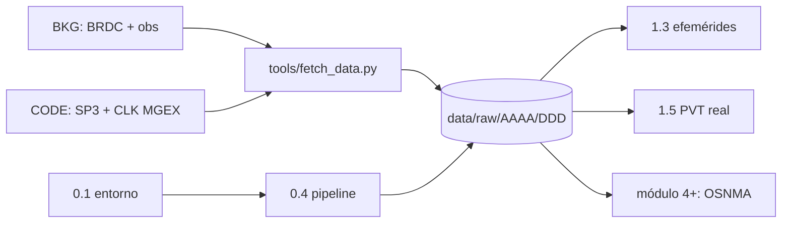

# Clase 0.4 — Pipeline de datos GNSS reales

> Bloque del máster: Prerrequisitos (transversal)

Cierre del Módulo 0: dejar funcionando la descarga automática de datos
GNSS reales para que **todas** las clases que siguen (1.3, 1.5, y el
módulo 4 de OSNMA) trabajen con archivos de verdad y no con juguetes.

**Tiempo estimado**: 1.5–2.5 h (formatos y fuentes 30' · fetch + lab 45–60' · ejercicios y simulacro 30' · caso y cierre 15').

## 1. Objetivos

- [ ] Distinguir los formatos: RINEX nav, RINEX obs, Hatanaka, SP3, CLK
- [ ] Conocer las fuentes públicas y sus latencias (broadcast / rapid / final)
- [ ] Usar `tools/fetch_data.py` para bajar un día real de datos
- [ ] Verificar el contenido con un censo por constelación y georinex
- [ ] Reproducir el censo a mano en `lab/lab_pipeline_TODO.py` (4 TODO con auto-tests)

## 2. Dónde estás en el mapa



La clase no tiene teoría de posicionamiento: es el **eslabón logístico**
entre internet y los labs. Lo que sí tiene es el mapa mental de qué
archivo contiene qué, quién lo produce y cuánto tarda en existir.

## 3. Los formatos (qué es cada archivo)

| Formato | Extensión típica | Qué contiene | Lo usamos en |
|---|---|---|---|
| RINEX nav | `.rnx` (`_MN` = mixto) | Efemérides broadcast: los parámetros keplerianos + correcciones que transmite cada satélite | 1.3 |
| RINEX obs | `.rnx` / `.crx` | Observables del receptor: pseudodistancias, fase, Doppler, C/N0 | 1.5 |
| Hatanaka | `.crx` | RINEX obs comprimido (formato de Yuki Hatanaka); se descomprime con `hatanaka` | 1.5 |
| SP3 | `.SP3` | Órbitas **precisas** post-procesadas: posición ECEF de cada satélite cada 5–15 min | 1.3 (verdad de referencia) |
| CLK | `.CLK` | Relojes precisos de satélites y estaciones, cada 30 s | 1.5 |

La pareja clave del curso: la **efeméride broadcast** (lo que el satélite
dice de sí mismo, disponible al instante) contra el **SP3 final** (lo que
una red global de análisis calculó después, con error de ~2–3 cm). La
clase 1.3 es exactamente ese versus.

## 4. Las fuentes (verificadas por HTTP el 2026-07-02)

| Fuente | Acceso | Qué tiene | Latencia |
|---|---|---|---|
| **BKG** (Alemania) `igs.bkg.bund.de/root_ftp/IGS/BRDC/` | HTTPS anónimo | BRDC nav multi-GNSS diario | horas |
| **CODE/AIUB** (Berna) `ftp.aiub.unibe.ch/CODE_MGEX/CODE/` | HTTP anónimo | SP3 + CLK **MGEX finales** (GPS+GLO+GAL+BDS+QZSS) | ~2 semanas |
| **BKG** `.../IGS/products/<semana>/` | HTTPS anónimo | SP3 rápido IGS (**solo GPS**) | ~1 día |
| CDDIS (NASA) | cuenta Earthdata | todo el archivo IGS | — |
| **RAMSAC** (IGN Argentina) | portal con formulario | RINEX obs de la red CORS argentina (para la 1.5: estación con coordenadas oficiales) | ~1 día |
| galmon.eu | web/API | telemetría Galileo en vivo, páginas OSNMA | tiempo real |

Regla práctica: para tener **Galileo con órbita precisa** hay que usar los
finales MGEX de CODE → el lab trabaja con una fecha ~3 semanas atrás
(2026-06-15, DOY 166) donde ya está todo publicado.

## 5. Uso de `tools/fetch_data.py`

```bash
# desde la raíz del repo — baja nav + órbitas + relojes de un día
python3 tools/fetch_data.py --date 2026-06-15 --que brdc,sp3,clk

# observación RINEX 30 s de una estación IGS (p. ej. las argentinas
# LPGS/CORD/UNSA/MGUE/RIO2/RGDG) — usada desde la clase 1.5:
python3 tools/fetch_data.py --date 2026-06-15 --que obs --estacion CORD00ARG

# deja todo descomprimido en data/raw/2026/166/ (ignorado por git)
```

El script es idempotente (saltea lo ya bajado), usa solo stdlib, y si el
final MGEX todavía no existe cae solo al SP3 rápido de IGS avisando que
es solo GPS. Para `--que obs` el archivo viene en Hatanaka: si el
paquete `hatanaka` está instalado queda directamente el `.rnx`; si no,
queda el `.crx` y el script imprime cómo convertirlo.

## 6. Lab

Dos piezas, en este orden:

**(a) El verificador de la clase** — corre el censo completo (incluye
georinex):

```bash
python3 clases/mod0-prerrequisitos/clase0.4-pipeline-datos/lab/inspeccionar_datos.py data/raw/2026/166
```

Salida real (2026-06-15, recortada):

```
== BRDC00IGS_R_20261660000_01D_MN.rnx
  BeiDou      901 efemerides
  Galileo   11119 efemerides
  GPS         450 efemerides
  ...
== COD0MGXFIN_20261660000_01D_05M_ORB.SP3
  116 satelites: BeiDou 30, Galileo 30, GPS 32, QZSS 3, GLONASS 21
== georinex (solo Galileo; puede tardar ~1 min)
  30 satelites Galileo unicos (120 registros; los sufijos
  _N que agrega georinex son mensajes duplicados del mismo sv/epoca,
  p.ej. I/NAV vs F/NAV -- ojo con esto en la clase 1.3):
  E02 E03 E04 E05 E06 E07 E08 E09 E10 E11 E12 E13 E14 E15 E16 E18
  E19 E21 E23 E25 E26 E27 E28 E29 E30 E31 E32 E33 E34 E36
```

**(b) Tu turno** — `lab/lab_pipeline_TODO.py` / `.ipynb` reconstruye ese
censo **sin librerías** (4 TODO con auto-tests): parsear las cabeceras del
RINEX nav crudo, leer los satélites del header SP3, cruzar ambas fuentes
y calcular la tasa de re-emisión por constelación. La solución de
referencia está en `lab/soluciones/lab_pipeline_solucion.py`.

### Tabla de validación (tus números deben coincidir)

| Métrica | Valor de referencia |
|---|---|
| Efemérides GPS / BeiDou / Galileo en el BRDC | **450 / 901 / 11 119** |
| Satélites declarados en el SP3 final MGEX | **116** (G 32, R 21, E 30, C 30, J 3) |
| Cruce Galileo nav ∩ SP3 | **30**, sin diferencias |
| Tasa GPS / Galileo | ~**14** / ~**371** efem por sat/día (una cada ~102 / ~4 min) |

Chequeos que importan:

1. **Los 30 Galileo del nav coinciden con los 30 del SP3** — dos fuentes
   independientes describen la misma constelación.
2. ¿Por qué Galileo tiene 11 119 efemérides y GPS 450? GPS emite una
   efeméride cada 2 h; Galileo re-emite cada ~10 min **y** por varios
   canales (I/NAV en E1/E5b, F/NAV en E5a), y el archivo mixto guarda todo.
3. La trampa `_N` de georinex: mismo satélite + misma época por distinto
   tipo de mensaje → registros "duplicados" con sufijo. En la 1.3 hay que
   elegir **un** tipo de mensaje antes de propagar la órbita.

## 7. Ejercicios a mano (papel, sin Python)

**E1.** Convertí 2026-06-15 a día del año (DOY) sumando los días de cada
mes. Verificá que da 166. Después calculá el DOY de 2026-06-25 (lo va a
usar la clase 3.4).

**E2.** La semana GPS cuenta semanas desde el 1980-01-06. Estimá los días
transcurridos hasta 2026-06-15 con 365.25 días/año y dividí por 7.
¿Da cerca de **2423** (el número que imprime `fetch_data.py`)?

**E3.** Con los números de la tabla de validación: ¿cada cuántos minutos
guarda el BRDC una efeméride de un satélite Galileo? ¿Es consistente con
"re-emisión cada ~10 min por 3 canales (E1, E5b, E5a)"?

## 8. Estimaciones Fermi

**F1.** Un RINEX obs de 30 s, multi-GNSS: ~2880 épocas × ~35 satélites
visibles × ~80 bytes por línea. ¿Cuántos MB esperás? Compará con el
archivo real de LPGS en `data/raw/2026/166/`.

**F2.** GPS emite una efeméride cada 2 h por satélite, con 32 satélites.
¿Cuántas efemérides "limpias" esperás en un BRDC diario? ¿Por qué el
archivo real trae 450 y no tu número?

**F3.** El SP3 da la posición de 116 satélites cada 5 min durante 24 h:
¿cuántas líneas tiene el archivo? ¿De qué orden es su tamaño en MB?

## 9. Preguntas conceptuales

Respuestas desarrolladas en `soluciones.md` — primero contestá por escrito.

**C1.** El BRDC es "lo que transmitió cada satélite". ¿Por qué entonces se
baja de un servidor en Alemania y no de una antena propia? ¿Qué implica
eso sobre duplicados y huecos en el archivo?

**C2.** ¿El SP3 final puede "corregir" la posición que tu receptor calculó
en tiempo real hace dos semanas? ¿Para qué sirve entonces?

**C3.** Si el cruce nav ∩ SP3 da 30/30 sin diferencias, ¿qué validaste
exactamente — y qué NO validaste todavía? (Pista: la 1.3 empieza ahí.)

## 10. Pregunta de entrevista

> "Explicame en 90 segundos la diferencia entre efemérides broadcast y
> productos precisos: quién produce cada uno, con qué latencia, con qué
> error, y cuándo usás cada cual."

**Mini-caso de diseño**: te piden un servicio de post-proceso PPP para
agricultura de precisión en Argentina. ¿Qué productos bajás (órbitas,
relojes, observables), de qué fuentes, y qué latencia de resultado podés
prometer? ¿Qué cambia si el cliente exige Galileo además de GPS?

## 11. Mini-simulacro (8 min, aprobás con 4/5)

1. ¿En qué archivo están las pseudodistancias y en cuál las efemérides?
2. ¿Por qué el curso trabaja con un día ~3 semanas en el pasado y no con ayer?
3. ¿Qué es el sufijo `_N` que agrega georinex y qué decisión fuerza en la 1.3?
4. SP3 rápido de IGS vs final MGEX de CODE: ¿qué constelaciones trae cada uno y cuánto tardan?
5. GPS 450 vs Galileo 11 119 efemérides el mismo día: ¿por qué la diferencia?

Respuestas en `soluciones.md`.

## 12. Caso real — abril 2019: el rollover de la semana GPS

El 6 de abril de 2019 el contador de semana GPS volvió a cero por segunda
vez: en el mensaje legado (LNAV) la semana viaja en **10 bits** — cuenta
hasta 1023 y arranca de nuevo. Los receptores actualizados siguieron como
si nada; los de firmware viejo saltaron ~19.6 años (a 1999, o a fechas
corridas según su pívot): timestamps rotos, logs inservibles, equipos
aeronáuticos y de infraestructura reportando fallas — sin que fallara un
solo satélite.

Por qué es EL caso de esta clase:

- La semana GPS que calculaste en E2 (2423) no viaja completa por la
  señal: el dato crudo necesita contexto (época de referencia) para ser
  una fecha — igual que el DOY organiza `data/raw/`. Formato ≠ dato.
- El evento era conocido y anunciado (el primer rollover fue en 1999, el
  ICD lo documenta) y aun así rompió sistemas: validar fechas contra el
  calendario real es parte del pipeline, no un detalle.
- Las constelaciones nuevas aprendieron: Galileo transmite la semana en
  12 bits (~78 años); el CNAV moderno de GPS, en 13.

El otro modo de falla temporal del mensaje — la efeméride que envejece —
lo ves en el caso real de la 1.3 (Galileo, julio 2019).

## 13. Glosario ES/EN

| ES | EN | Nota |
|---|---|---|
| efeméride (broadcast) | (broadcast) ephemeris | parámetros orbitales + reloj que emite el satélite |
| observables | observables / measurements | pseudodistancia, fase, Doppler, C/N0 |
| órbitas precisas | precise orbits (SP3) | post-procesadas por centros de análisis |
| relojes precisos | precise clocks (CLK) | sesgos de reloj sat/estación cada 30 s |
| día del año | DOY (day of year) | 001–366; organiza los archivos IGS |
| semana GPS | GPS week | semanas desde 1980-01-06 |
| latencia | latency | broadcast ≈ 0 · rapid ≈ 1 día · final ≈ 2 semanas |
| red de estaciones de referencia | CORS network | RAMSAC en Argentina |
| centro de análisis | analysis center (AC) | CODE, JPL, GFZ, ... |
| archivo mixto | mixed (multi-GNSS) file | `_MN` en el nombre BRDC |

## 14. Cheat sheet

```text
Anatomía del nombre BRDC:   BRDC00IGS_R_20261660000_01D_MN.rnx
                            ^^^^^^^^^ ^  ^^^^^^^ ^^ ^^^ ^^
                            estación  R  año+DOY hh 1día Mixed Nav
Rutas del curso:            data/raw/AAAA/DDD/   (DOY con 3 dígitos)
Día de referencia:          2026-06-15 = DOY 166 = semana GPS 2423
Productos y latencias:      broadcast ~0 s / ~1 m de error de órbita
                            IGS rapid ~1 día / ~2.5 cm — SOLO GPS
                            MGEX final (CODE) ~2 sem / ~2.5 cm — multi-GNSS
Comandos:                   fetch_data.py --date 2026-06-15 --que brdc,sp3,clk
                            fetch_data.py --date 2026-06-15 --que obs --estacion LPGS00ARG
                            inspeccionar_datos.py data/raw/2026/166
```

## 15. Errores comunes

1. **Parsear un `.crx` como si fuera RINEX**: Hatanaka es otro formato;
   primero descomprimir (paquete `hatanaka`).
2. **Contar "satélites" contando registros de georinex**: los sufijos
   `_N` inflan el conteo — hay que deduplicar por SV.
3. **Esperar Galileo en el SP3 rápido de IGS**: es solo GPS; multi-GNSS
   preciso = MGEX final (y hay que esperarlo ~2 semanas).
4. **Off-by-one en el DOY** por convertir la fecha en hora local en vez
   de UTC.
5. **Borrar `data/raw/` y asumir que se perdió todo**: el fetch es
   idempotente y reproducible — la bitácora guarda la fecha, no los MB.
6. **Mezclar I/NAV y F/NAV al propagar una órbita** (adelanto de la 1.3:
   elegí un tipo de mensaje).

## 16. Checkpoint del Módulo 0

Antes de pasar al Módulo 1, respondé sin mirar:

> ¿Por qué linealizar el problema PVT lo convierte en mínimos cuadrados
> **iterativo**, y qué papel juega el jacobiano en cada iteración?

(Pista: clase 0.2 Parte C — el modelo de pseudodistancia no es lineal en
la posición; el jacobiano son las derivadas geométricas y su geometría
define el DOP.)

## 17. Referencias

- IGS, *RINEX 3.05* — §A "Navigation message files" (la cabecera `Xnn` que parseás en el TODO 1).
- Hilla, S., *The Extended Standard Product 3 Orbit Format (SP3-c/d)* — sección del header (las líneas `+ ` del TODO 2).
- Hatanaka, Y. (2008), *A Compression Format and Tools for GNSS Observation Data* — por qué existe el `.crx`.
- IGS Products (igs.org/products) — tabla oficial de latencias y precisiones (números de la fig. 2).
- Los directorios reales: BKG `igs.bkg.bund.de/root_ftp/IGS/` y CODE `ftp.aiub.unibe.ch/CODE_MGEX/CODE/` (§4).

## 18. Flashcards y bitácora

- `flashcards_anki.csv` — deck sugerido `GNSS::M0::0.4`.
- `bitacora.md` — tus números vs la tabla de validación (§6).

## 19. Rúbrica de cierre

La clase se marca `[x]` en el README del repo **solo** si:

- [ ] `fetch_data.py` corrido para el día 166 (brdc, sp3, clk, obs LPGS y CORD) y el 176 (brdc, obs LPGS); `data/raw/` poblado.
- [ ] `inspeccionar_datos.py` termina en "LISTO" y tus números coinciden con la tabla de validación.
- [ ] Los 4 TODO del lab pasan sus auto-tests **sin haber abierto la solución**.
- [ ] E1–E3 y F1–F3 resueltos en papel y cotejados con `soluciones.md`.
- [ ] Mini-simulacro ≥ 4/5 en ≤ 8 minutos.
- [ ] Flashcards importadas a Anki y primera pasada hecha.
- [ ] Checkpoint del Módulo 0 (§16) respondido sin mirar y cotejado.

## Próxima clase

**1.3 — Efemérides**: parsear una efeméride Galileo real de este mismo
BRDC, propagar la órbita con Kepler (clase 0.3) según el ICD, y validar
contra el SP3 de este mismo día. Los datos ya están en tu disco.
