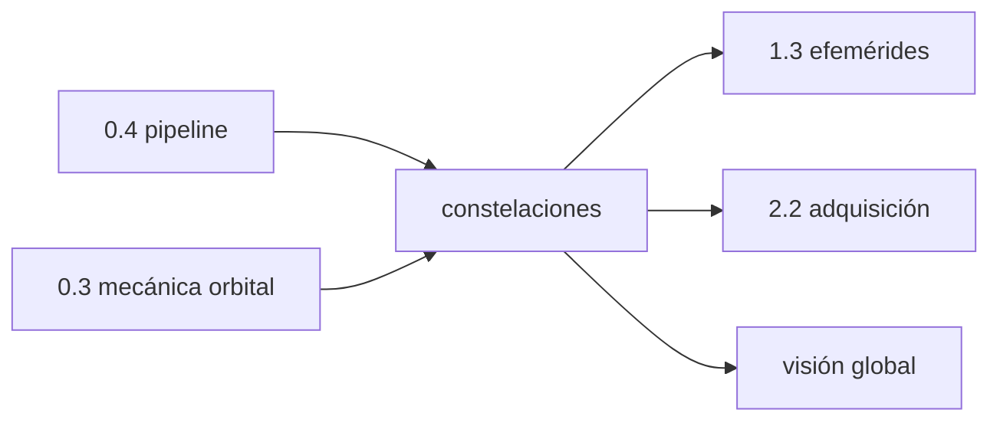

# Constelaciones — globales, regionales y aumentación

> Bloque del máster: B1 — Basics · Constelaciones globales / regionales / aumentación

Una sola idea organiza la clase: **hay cuatro respuestas distintas a la
misma pregunta de ingeniería** (¿cómo cubro el planeta con relojes
voladores?) — y las diferencias de diseño (altura, período, señal,
formato de efeméride) se **miden** en el BRDC que ya tenés en el disco.

**Tiempo estimado**: 1.5–2 h (teoría 40' · lab 30–40' · ejercicios y simulacro 30').

## 1. Objetivos

- [ ] Distinguir las 4 globales (GPS, GLONASS, Galileo, BeiDou), las regionales (QZSS, NavIC) y la aumentación (SBAS/GBAS/A-GNSS)
- [ ] Medir del BRDC real: cuántos satélites emite cada una y a qué altura/período vuela
- [ ] Explicar por qué GLONASS transmite vectores de estado y el resto keplerianos
- [ ] Reconocer la mezcla MEO/IGSO/GEO de BeiDou en los datos

## 2. Dónde estás en el mapa



Usa el censo de la 0.4 y la 3ª ley de la 0.3; alimenta la lectura de
efemérides (1.3) y la elección de señales (mod2).

## 3. Teoría

### 3.1 Las cuatro globales — mismo problema, cuatro diseños

| | GPS (EE.UU.) | GLONASS (Rusia) | Galileo (UE) | BeiDou (China) |
|---|---|---|---|---|
| Altura / período | ~20 190 km · 11 h 58 m | ~19 130 km · 11 h 16 m | ~23 230 km · 14 h 05 m | MEO ~21 530 km · 12 h 53 m **+ IGSO + GEO** |
| Planos × sats | 6 × ~5 | 3 × 8 | 3 × 10 | 3 × 8 (MEO) + regionales |
| Multiplexado | CDMA | **FDMA** (L1: canal por sat) + CDMA moderno | CDMA | CDMA |
| Efeméride | keplerianos + correcciones | **vectores de estado** (integrás) | keplerianos + correcciones | keplerianos + correcciones |
| Tiempo | GPST (sin leap seconds) | UTC(SU) (**con** leap seconds) | GST | BDT |
| Señal civil clave | L1 C/A, L5 | L1OF | **E1 CBOC, E5a/b** | B1C, B2a |

Los números de la columna de órbitas son los que **vas a medir** en el
lab — no los memorices: derivalos.

### 3.2 Por qué los períodos son deliberadamente distintos

Ninguna elige el día sidéreo exacto por accidente: GPS repite su ground
track cada día sidéreo (2 revoluciones), Galileo eligió 17 rev / 10 días
justamente para **no** resonar (clase 0.3, caso real), GLONASS repite
cada 8 días sidéreos (17 rev). La resonancia controla cuánto se acumulan
las perturbaciones y cómo se repite el multipath (clase 3.4).

### 3.3 GLONASS: el formato delata la filosofía

El nav GLONASS no trae `sqrtA`: trae **posición, velocidad y aceleración
lunisolar** cada media hora — el receptor **integra** numéricamente en
vez de evaluar keplerianos. Diseño soviético pragmático: efemérides
cortas y frescas en vez de un ajuste largo. Consecuencia práctica: tu
propagador de la 1.3 no sirve para GLONASS sin reescribirlo.

### 3.4 BeiDou: tres órbitas en una constelación

BeiDou mezcla MEO (globales), **IGSO** (inclinadas geosíncronas, ∞ sobre
Asia) y **GEO** (colgadas sobre el ecuador). Por eso el BRDC del día 166
trae **37** BeiDou pero el SP3 MGEX solo **30** (los MEO+IGSO que CODE
ajusta bien). La herencia del diseño regional-primero se ve en los datos.

### 3.5 Regionales y aumentación

- **QZSS** (Japón): órbitas HEO/GEO sobre Japón; complementa GPS en
  cañones urbanos. **NavIC** (India): GEO/IGSO regionales.
- **SBAS** (WAAS/EGNOS/MSAS/GAGAN): satélites GEO que retransmiten
  **correcciones e integridad** calculadas por redes terrestres — no son
  una constelación de navegación autónoma; son la capa de confianza
  (B2/5.3). En el BRDC del 166 hay **17** SBAS emitiendo.
- **GBAS**: la versión local (aeropuertos). **A-GNSS**: la red celular
  te pasa efemérides/tiempo para saltear el cold start (caso real 2.2).

## 4. Lab

```bash
python3 clases/mod0-prerrequisitos/constelaciones/lab/lab_constelaciones_TODO.py   # tu turno
python3 clases/mod0-prerrequisitos/constelaciones/lab/soluciones/lab_constelaciones_solucion.py
```

4 TODOs sobre el BRDC del día 166 (sin librerías): censo de SV únicos
por constelación, semieje por mediana de `sqrtA`, |r| de GLONASS desde
sus vectores de estado, y la tabla comparada con T = 2π√(a³/μ).

### Tabla de validación (tus números deben coincidir)

| Métrica | Valor de referencia |
|---|---|
| SV únicos: G / E / R / C / J / I / S | **32 / 30 / 27 / 37 / 5 / 3 / 17** |
| a mediana: GPS / Galileo / GLONASS / BeiDou | **26 561 / 29 600 / 25 502 / 27 906 km** |
| T: GPS / Galileo / GLONASS / BeiDou | **11.97 / 14.08 / 11.26 / 12.89 h** |
| Altura GPS / Galileo | 20 190 / 23 229 km |

## 5. Ejercicios a mano

**E1.** Con la 3ª ley (0.3): verificá que a=29 600 km da T≈14.08 h.
Después al revés: ¿qué a necesitarías para T = 12 h exactas?

**E2.** GPS emite ~14 efemérides/sat/día y Galileo ~370 (clase 0.4).
Con los censos de hoy (32 y 30 SV), ¿cuántos registros esperás de cada
una en el BRDC? Compará con 450 y 11 119.

**E3.** BeiDou GEO: ¿qué altura tiene una órbita de T = 23 h 56 m?
(La respuesta la conocés de la 0.3: 35 786 km.) ¿Por qué esos satélites
no le sirven a un usuario en Argentina?

## 6. Estimaciones Fermi

**F1.** ¿Cuántos satélites de navegación activos hay en total? (Sumá el
censo del lab: ~120–130 con regionales y SBAS.)

**F2.** Si cada GNSS global quiere ≥4 satélites visibles en todo el
planeta, ¿por qué todas terminan en 24–30 satélites? (Pista: geometría
de cobertura MEO, no capacidad de lanzamiento.)

## 7. Preguntas conceptuales

Respuestas en `soluciones.md` — primero por escrito.

**C1.** ¿Por qué el SP3 MGEX trae 30 BeiDou y el BRDC 37? ¿Qué te dice
eso sobre qué órbitas son "ajustables" con una red global?

**C2.** FDMA vs CDMA: ¿por qué GLONASS necesita un canal de frecuencia
por satélite y qué complica eso en el receptor (mod2)?

**C3.** Un receptor multi-constelación, ¿suma robustez gratis? ¿Qué
nueva incógnita aparece al mezclar GPS+Galileo? (Adelanto de 4.4: GGTO.)

## 8. Pregunta de entrevista

> "Compará GPS y Galileo como diseños de ingeniería: órbita, señal,
> tiempo y mensaje. ¿Qué mejoró Galileo llegando 25 años después?"

**Mini-caso**: te piden el receptor de un tractor autónomo para
Argentina. ¿Qué constelaciones priorizás y por qué? ¿Te sirve QZSS?
¿Y SBAS, habiendo WAAS pero no un SBAS operacional local?

## 9. Mini-simulacro (8 min, aprobás con 4/5)

1. Ordená por altura: GPS, GLONASS, Galileo, BeiDou MEO.
2. ¿Cuál transmite vectores de estado y qué implica para tu propagador?
3. ¿Qué es un IGSO y quiénes los usan?
4. ¿SBAS navega o corrige? ¿De dónde salen sus datos?
5. ¿Por qué Galileo eligió 14 h 05 m y no 12 h?

## 10. Caso real — abril 2014: GLONASS entera fuera de servicio

El 1–2 de abril de 2014, un upload defectuoso del segmento de control
ruso dejó **toda** la constelación GLONASS emitiendo efemérides
erróneas durante ~11 horas: receptores en todo el mundo descartaron o
degradaron la constelación completa. Lecciones: (a) el punto único de
falla de un GNSS no está en órbita sino en tierra (como Galileo 2019,
clase 1.3); (b) multi-constelación no es lujo — los receptores que
mezclaban GPS+GLONASS siguieron; los GLONASS-only quedaron ciegos;
(c) validar efemérides (plausibilidad física, 4.1) es defensa real.

## 11. Glosario ES/EN

| ES | EN | Nota |
|---|---|---|
| constelación global | global constellation / GNSS core | GPS, GLONASS, Galileo, BeiDou |
| regional | RNSS | QZSS, NavIC |
| aumentación | augmentation (SBAS/GBAS/A-GNSS) | corrige e integra, no navega sola |
| órbita MEO / IGSO / GEO | MEO / IGSO / GEO | media / inclinada geosíncrona / geoestacionaria |
| multiplexado por código / frecuencia | CDMA / FDMA | GLONASS legado = FDMA |
| vectores de estado | state vectors | efeméride GLONASS: r, v, a |
| repetición del ground track | ground track repeat | resonancia órbita-rotación |
| sesgo inter-sistema | inter-system bias / GGTO | al mezclar constelaciones (4.4) |

## 12. Cheat sheet

```text
Alturas (km):    GLONASS 19 130 < GPS 20 190 < BDS MEO 21 535 < GAL 23 230 < GEO 35 786
Períodos (h):    11.26 · 11.97 · 12.89 · 14.08   (medidos del BRDC, día 166)
Censo día 166:   G32 E30 R27 C37 J5 I3 S17  (SP3 MGEX: solo 116)
Formatos:        keplerianos+correcciones (G/E/C/J) · vectores de estado (R)
Tiempos:         GPST y GST sin leap seconds · UTC(SU) con · BDT sin
Regla BDS:       nav 37 = MEO+IGSO+GEO · SP3 30 = lo que la red global ajusta
```

## 13. Errores comunes

1. **"GPS" como sinónimo de GNSS** — GPS es una de cuatro.
2. Propagar GLONASS con el motor kepleriano de la 1.3 (formato distinto).
3. Contar BeiDou del nav y del SP3 y creer que "faltan" satélites.
4. Asumir que SBAS posiciona por sí solo (corrige, no navega).
5. Mezclar constelaciones sin la incógnita de sesgo inter-sistema.
6. Memorizar alturas sin poder derivarlas de sqrtA y la 3ª ley.

## 14. Referencias

- Navipedia: *GPS Space Segment*, *GLONASS Space Segment*, *Galileo Space Segment*, *BeiDou Space Segment* (arquitecturas y órbitas).
- Galileo OS SIS ICD §"Constellation" — los números oficiales que mediste.
- GLONASS ICD (CDMA y FDMA) — el formato de vectores de estado del TODO 3.
- RINEX 3.05 §A — cómo viaja cada constelación en el nav mixto.

## 15. Flashcards y bitácora

- `flashcards_anki.csv` — deck sugerido `GNSS::M0::CONST`.
- `bitacora.md` — tus números vs la tabla de validación.

## 16. Rúbrica de cierre

La clase se marca `[x]` en el README del repo **solo** si:

- [ ] Los 4 TODO del lab pasan sus auto-tests sin abrir la solución.
- [ ] Tus números coinciden con la tabla de validación (§4).
- [ ] E1–E3 en papel y cotejados con `soluciones.md`.
- [ ] Mini-simulacro ≥ 4/5.
- [ ] Podés explicar GLONASS (formato) y BeiDou (37 vs 30) sin mirar.
