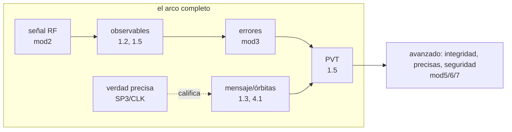

# Visión global — la tecnología de la navegación en un arco

> Bloque del máster: B1 — Basics · Visión global de la tecnología de la navegación

La clase que faltaba al principio: **el mapa antes del territorio**. Todo
GNSS cabe en un arco de cinco etapas — señal → observables → mensaje/
órbitas → correcciones → solución — y cada clase del path trabaja un
tramo. Acá se dibuja el arco entero y se comprueba, con los archivos de
tu disco, que ya lo tenés completo.

**Tiempo estimado**: 1.5–2 h (teoría 45' · lab 20' · ejercicios y simulacro 30').

## 1. Objetivos

- [ ] Dibujar de memoria el arco señal → observable → mensaje → corrección → PVT y ubicar cada clase del path en él
- [ ] Explicar los tres segmentos (espacial / control / usuario) y qué falla cuando falla cada uno
- [ ] Manejar los números gruesos: alturas, potencia recibida, frecuencias, 4 incógnitas
- [ ] Verificar con el lab que las 5 etapas del arco tienen datos reales en tu máquina

## 2. Dónde estás en el mapa



Esta clase es transversal: no depende de ninguna y las nombra a todas.

## 3. Teoría

### 3.1 Qué es PNT y por qué satélites

**PNT** = posición, navegación y tiempo. El truco GNSS: relojes atómicos
volando en órbitas conocidas que gritan la hora; medir *cuánto tardó el
grito* convierte tiempo en distancia ($c \approx 0{,}3$ m/ns — por eso
todo el curso obsesiona con nanosegundos). Con 4 mediciones se despejan
las **4 incógnitas** $(x, y, z, c\,\delta t)$: la clase 1.2 en una frase.

### 3.2 Los tres segmentos

| Segmento | Qué hace | Cuando falla… |
|---|---|---|
| **Espacial** | constelaciones que emiten señal + mensaje (clase constelaciones) | casi nunca falla solo: hay 30 por sistema |
| **Control / terreno** | mide, ajusta órbitas y relojes, sube efemérides frescas (4.1) | falla TODO a la vez: Galileo 2019, GLONASS 2014 |
| **Usuario** | tu receptor: antena → RF → correladores → PVT (mod2 + 1.5) | tu problema — y el tema de este path |

La moraleja que el path repite: **los incidentes históricos son casi
siempre del segmento terreno** — por eso el máster le dedica el B4.

### 3.3 El arco, etapa por etapa

1. **Señal**: ~27 W transmitidos a 20 000 km → llegan ~$10^{-16}$ W
   (−158 dBW), 20 dB debajo del piso de ruido: la señal está *enterrada*
   y solo la correlación la rescata (2.1–2.2).
2. **Observables**: pseudodistancia (código), fase, Doppler, C/N0 —
   cuatro formas de medir la misma llegada (1.5, 3.4).
3. **Mensaje**: efemérides + reloj + iono, re-emitido cada pocas horas
   (0.4, 1.3). Caduca: es la parte viva del sistema.
4. **Correcciones**: modelar (tropo), medir (iono), mitigar (multipath),
   promediar (ruido) — mod3 entero en una línea.
5. **Solución**: Gauss-Newton sobre la matriz de geometría (1.2 → 1.5);
   su calidad la gobierna el DOP (1.4); su confianza, la integridad (B2).

Y en paralelo, la **verdad precisa** (SP3/CLK de centros de análisis)
para calificar todo lo anterior — la vara del curso.

### 3.4 Frecuencias que hay que reconocer

L1/E1 = 1575.42 MHz · L5/E5a = 1176.45 MHz · L2 = 1227.60 · E6 = 1278.75.
Dos frecuencias ⇒ se mide la iono (3.2). Banda L: atraviesa nubes y
lluvia (por eso navega el mundo con ~$10^{-16}$ W y no con radar).

## 4. Lab (lite)

```bash
python3 clases/mod0-prerrequisitos/vision-global/lab/lab_vision_TODO.py    # tu turno
python3 clases/mod0-prerrequisitos/vision-global/lab/soluciones/lab_vision_solucion.py
```

4 TODOs: mapear cada etapa del arco a su huella en disco (globs),
inventariar, imprimir el arco con tus archivos y chequear que las **5
etapas están pobladas**. Termina en `ARCO COMPLETO`.

### Tabla de validación

| Chequeo | Valor esperado |
|---|---|
| Etapas con archivos reales | **5/5** |
| Artefactos totales | ≥ 15 (con 0.4 + labs corridos: ~22) |
| Volumen aproximado | ~150 MB |

## 5. Ejercicios a mano

**E1.** Dibujá el arco de memoria y ubicá las 18+ clases del path en sus
etapas. Compará con el mermaid de §2.

**E2.** Presupuesto de señal grueso: 27 W ≈ 14.3 dBW transmitidos,
ganancia de antena ~13 dB, pérdida de espacio libre a 20 200 km y
1575 MHz ≈ 182 dB. ¿Cuánto llega? (~−155 dBW: el orden es lo que importa.)

**E3.** Clasificá en segmentos: (a) subida de efemérides, (b) tu antena,
(c) máser de hidrógeno en órbita, (d) estación de monitoreo, (e) el
BRDC de BKG. (Ojo con (e): ¿quién lo produce y quién lo compila?)

## 6. Estimaciones Fermi

**F1.** ¿Cuántos receptores GNSS hay en el mundo? (Smartphones ~7×10⁹ +
vehículos + infraestructura → orden 10¹⁰.)

**F2.** Si la señal llega con 10⁻¹⁶ W, ¿cuántos años necesitaría tu
celular para juntar 1 joule de energía GPS? (~3×10⁸ años: nadie "carga
el teléfono" con GPS — se navega con correlación, no con potencia.)

## 7. Preguntas conceptuales

Respuestas en `soluciones.md` — primero por escrito.

**C1.** ¿Por qué el sistema entero depende de que el segmento de control
suba efemérides cada pocas horas? ¿Qué pasa si para (y cómo lo viste ya
en dos casos reales)?

**C2.** ¿Por qué hacen falta 4 satélites y no 3, si las incógnitas de
posición son 3?

**C3.** ¿Qué diferencia al arco broadcast (tiempo real) del arco preciso
(post-proceso), y por qué el curso usa los dos a la vez?

## 8. Pregunta de entrevista

> "Tenés 90 segundos: explicale a un gerente cómo funciona el GPS,
> sin fórmulas."

**Mini-caso**: un banco te pide 'GPS para timestamping de transacciones'
(no les importa la posición). ¿Qué partes del arco les importan y cuáles
no? ¿Qué riesgo nuevo aparece? (Adelanto de 6.x: spoofing de tiempo.)

## 9. Mini-simulacro (8 min, aprobás con 4/5)

1. Nombrá las 5 etapas del arco y una clase del path por etapa.
2. ¿Qué segmento falló en Galileo 2019 y GLONASS 2014?
3. ¿Por qué −158 dBW no impide navegar?
4. ¿Cuáles son las 4 incógnitas y qué las despeja?
5. L1 y L5: frecuencias y para qué sirve tener las dos.

## 10. Caso real — mayo 2000: apagar la degradación encendió una industria

Hasta el 1 de mayo de 2000, GPS degradaba a propósito la señal civil
(**Selective Availability**): ~100 m de error inducido por dithering del
reloj. Esa medianoche EE.UU. la apagó y la precisión civil saltó a ~10 m
**de un día para otro** — sin cambiar un solo receptor. Consecuencias:

- Explotó el mercado civil (navegadores, agricultura, telefonía) — la
  decisión fue política, no técnica: el arco ya lo permitía.
- Quedó la lección de que el operador puede alterar el servicio
  unilateralmente → argumento de Galileo (control civil europeo) y de
  la autenticación (mod6).
- La precisión ~10 m post-SA es exactamente la que tu PVT de 1.5 supera
  con correcciones (1.95 m): el path recorre la historia.

## 11. Glosario ES/EN

| ES | EN | Nota |
|---|---|---|
| PNT | positioning, navigation & timing | el producto real de GNSS |
| segmento espacial / control / usuario | space / control / user segment | la tríada de arquitectura |
| pseudodistancia | pseudorange | distancia + sesgos de reloj (1.2) |
| efeméride | ephemeris | órbita+reloj emitidos; caduca |
| disponibilidad selectiva | Selective Availability (SA) | degradación intencional, off desde 2000 |
| presupuesto de enlace | link budget | de 27 W a 10⁻¹⁶ W |
| piso de ruido | noise floor | la señal vive 20 dB abajo |
| servicio abierto / regulado | OS / PRS (SPS / PPS) | civil vs restringido |

## 12. Cheat sheet

```text
El arco:        señal → observables → mensaje/órbitas → correcciones → PVT
                                    (verdad precisa SP3/CLK califica todo)
Incógnitas:     x, y, z, c·δt  →  ≥4 satélites
Potencia:       ~27 W emitidos → ~1e-16 W recibidos (−158 dBW, 20 dB bajo el ruido)
Frecuencias:    L1/E1 1575.42 · L5/E5a 1176.45 · L2 1227.60 · E6 1278.75 MHz
Regla de oro:   c ≈ 0.3 m/ns  (1 ns de reloj = 30 cm de rango)
Segmentos:      espacial (emite) · control (ajusta y sube) · usuario (vos)
Historia:       SA off 2000 (~100→10 m) · GLONASS 2014 · Galileo 2019
```

## 13. Errores comunes

1. Creer que el receptor **transmite** algo (es pasivo: solo escucha).
2. Confundir precisión del sistema con precisión de TU solución (el
   arco de correcciones es lo que las separa).
3. Olvidar el reloj: "3 satélites para 3D" — son 4 incógnitas.
4. Pensar el GNSS como espacial: el talón de Aquiles operativo es
   terrestre (control) y local (tu entorno de multipath).
5. Tratar el mensaje como estático: caduca en horas y alguien lo
   renueva — o no (2019).

## 14. Referencias

- ESA, *GNSS Data Processing Vol. I* — cap. 1 (arquitectura y segmentos: la lectura madre de esta clase).
- Navipedia: *GNSS Architecture*, *GPS Services*, *Galileo Services*.
- Kaplan & Hegarty — cap. 1–2 (visión general y link budget).
- La historia de SA: declaración presidencial del 2000-05-01 (archivo público).

## 15. Flashcards y bitácora

- `flashcards_anki.csv` — deck sugerido `GNSS::M0::VG`.
- `bitacora.md` — tu inventario del arco vs la tabla de validación.

## 16. Rúbrica de cierre

La clase se marca `[x]` en el README del repo **solo** si:

- [ ] El lab termina en `ARCO COMPLETO` con las 5 etapas pobladas.
- [ ] E1 dibujado de memoria y cotejado.
- [ ] Mini-simulacro ≥ 4/5.
- [ ] La entrevista de 90 s sale sin fórmulas y sin trabarte.
- [ ] Podés contar SA-2000, GLONASS-2014 y Galileo-2019 como historias de segmentos.
