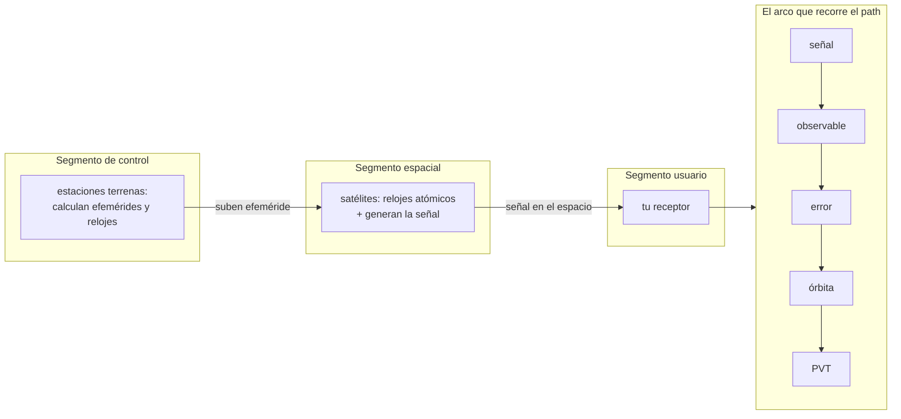

# Visión global de la tecnología de navegación

> Bloque del máster: B1 — Basics · Visión global de la tecnología de la navegación

**Objetivo en una frase**: tener el mapa mental completo —el arco
**señal → observable → error → órbita → PVT**— antes de bajar al detalle
de cada clase, para saber siempre *dónde estás parado* en el sistema.

**Tiempo estimado**: 1–1.5 h (teoría 30' · lab-lite 20' · ejercicios y cierre 30').

## 1. Objetivos

- [ ] Nombrar los tres segmentos de un GNSS (espacial, control, usuario) y qué hace cada uno.
- [ ] Recorrer el arco señal→observable→error→órbita→PVT y ubicar cada clase del path en él.
- [ ] Distinguir los cuatro observables (código, fase, Doppler, C/N0) y para qué sirve cada uno.
- [ ] Explicar por qué "posición" es en realidad **PVT** (posición, velocidad **y tiempo**).

## 2. Dónde estás en el mapa



Esta clase no tiene teoría nueva: es el **andamio** donde cuelgan todas
las demás. Cada flecha del arco es un módulo del repo.

## 3. Teoría

### 1. Los tres segmentos

Todo GNSS se organiza en tres partes:

- **Segmento espacial**: los satélites. Llevan **relojes atómicos** y
  transmiten una señal con código, portadora y mensaje de navegación.
  (El detalle de la señal: mod2; los relojes y órbitas: mod4.)
- **Segmento de control**: una red de estaciones en tierra que observa a
  los satélites, calcula sus **órbitas y relojes**, y **sube** la
  efeméride fresca que cada satélite retransmite. (Lo ves como huella
  observable en 4.1; el pipeline que baja esos productos, en 0.4.)
- **Segmento usuario**: tu receptor, que hace toda la cadena
  adquisición→tracking→observables→PVT. (mod2 lo recorre por dentro;
  mod1 resuelve el PVT.)

### 2. El arco del path

El corazón del curso es una sola cadena causal:

$$\text{señal} \rightarrow \text{observable} \rightarrow \text{error} \rightarrow \text{órbita} \rightarrow \text{PVT}$$

| Eslabón | Qué es | Dónde vive en el repo |
|---|---|---|
| **señal** | ondas de radio con código + portadora + datos | mod2 (2.1–2.4) |
| **observable** | número que el receptor mide: pseudodistancia, fase, Doppler, C/N0 | 1.5, 3.4, 2.2 |
| **error** | lo que separa la medición de la verdad: iono, tropo, multipath, reloj | mod3 (3.1–3.4) |
| **órbita** | dónde estaba el satélite cuando emitió | 1.3, 4.1 |
| **PVT** | la solución: posición, velocidad y tiempo | 1.5 (+ filtros mod7) |

### 3. Los cuatro observables

El receptor no mide "distancia": mide cuatro cosas, cada una con su uso.

| Observable | Qué mide | Precisión típica | Se trabaja en |
|---|---|---|---|
| **código** (pseudodistancia) | tiempo de vuelo × c | ~metros | 1.5 |
| **fase de portadora** | ciclos de la onda (ambiguos) | ~milímetros | 3.4, PPP (7.4) |
| **Doppler** | corrimiento de frecuencia → velocidad | cm/s | 2.2, EKF (7.2) |
| **C/N0 (SNR)** | potencia recibida / ruido | dB-Hz | 2.2–2.3, anti-spoofing (6.4) |

### 4. Por qué es PVT y no solo posición

El receptor tiene **cuatro** incógnitas, no tres: $x, y, z$ **y el sesgo
de su propio reloj** $c\,\delta t$. Por eso hacen falta **≥4 satélites**
(una ecuación por satélite). Y como el reloj se resuelve, el GNSS es
además la fuente de **tiempo** más difundida del planeta (redes, banca,
energía). De ahí la T de PVT.

## 4. Lab-lite: mapear el arco con tus propios archivos

No hay número que calcular acá: el ejercicio es **reconocer**, en los
datos que ya bajaste (clase 0.4), qué eslabón del arco alimenta cada
archivo.

```bash
python3 clases/mod0-prerrequisitos/vision-global/lab/lab_arco_TODO.py
```

El script lista tu `data/raw/` y te pide clasificar cada archivo por
eslabón (señal / observable / órbita / …); el auto-test confirma el
mapeo. La solución de referencia está en `lab/soluciones/`.

### Criterio de validación

El mapeo correcto (lo chequea el lab): `.dat` → **señal** (mod2) ·
`*_MO.rnx` (obs) → **observable** (1.5) · `*_MN.rnx` (nav) + `*ORB.SP3`
→ **órbita** (1.3) · `*CLK.CLK` → corrección de **reloj** (error/1.5).

## 5. Ejercicios a mano

**E1.** Ordená estos cinco términos en el arco causal y decí qué módulo
del path los cubre: *DOP, Klobuchar, ecuación de Kepler, código C/A,
Gauss-Newton*.

**E2.** Un receptor ve 6 satélites. ¿Cuántas incógnitas tiene y cuántas
ecuaciones? ¿Cuántos grados de redundancia quedan, y para qué sirven
(pista: mod5)?

**E3.** ¿Cuál de los tres segmentos falla en cada caso? (a) una tormenta
solar degrada la señal en el trayecto; (b) el satélite emite una
efeméride vieja; (c) tu teléfono tarda 30 s en dar posición en frío.

## 6. Estimaciones Fermi

**F1.** La señal viaja del satélite (~20 200 km) a c. ¿Cuánto tarda?
¿Cuánto error de rango implica 1 µs de error de reloj?

**F2.** Si el segmento de control sube una efeméride cada 2 h y hay 30
satélites Galileo, ¿cuántos "upload" diarios hace la red de control?

## 7. Preguntas conceptuales

Respuestas en `soluciones.md` — contestá antes de mirar.

**C1.** ¿Por qué se llama "pseudo"distancia y no distancia?

**C2.** ¿Qué tienen en común el segmento de control de un GNSS y el
pipeline `fetch_data.py` de la clase 0.4?

**C3.** Si tuvieras que explicarle a alguien GNSS en una sola frase
usando el arco, ¿cuál sería?

## 8. Pregunta de entrevista

> "Explicame en 90 segundos cómo un receptor pasa de una antena que
> escucha ruido a una posición en un mapa."

Guía: los tres segmentos → la señal llega → adquisición/tracking la
enganchan → salen observables → se corrigen los errores → con la órbita
del satélite se arma la geometría → Gauss-Newton resuelve PVT.

## 9. Mini-simulacro (8 min, aprobás con 4/5)

1. Nombrá los 3 segmentos y una responsabilidad de cada uno.
2. Ordená el arco señal→…→PVT completo.
3. ¿Qué observable es milimétrico pero ambiguo?
4. ¿Por qué ≥4 satélites y no 3?
5. ¿Qué significa la T de PVT y por qué le importa a la banca?

## 10. Caso real — por qué la T de PVT importa: el timing de las redes

Buena parte de la infraestructura moderna (redes de telefonía, mercados
financieros con *timestamps* legales, sincronización de la red
eléctrica) **no usa GNSS para posición sino para tiempo**: el receptor
está quieto y lo único que le importa es el $c\,\delta t$ que resuelve el
PVT. Por eso una degradación de GNSS —jamming, spoofing, una anomalía de
segmento como el apagón de Galileo de 2019 (clase 0.4)— es un problema de
*timing* a escala nacional, no solo de "mapas". Es la razón por la que la
resiliencia PNT (mod5, mod7) es política de Estado y no un detalle
técnico.

## 11. Glosario ES/EN

| ES | EN | Nota |
|---|---|---|
| segmento espacial | space segment | los satélites |
| segmento de control | control/ground segment | estaciones que calculan órbitas/relojes |
| segmento usuario | user segment | el receptor |
| pseudodistancia | pseudorange | rango + sesgos de reloj |
| observable | observable / measurement | lo que el receptor mide |
| efeméride | ephemeris | parámetros de órbita+reloj que emite el satélite |
| PVT | PVT (Position, Velocity, Time) | la solución completa |
| PNT | PNT (Positioning, Navigation, Timing) | el servicio a nivel sistema |
| sesgo de reloj | clock bias | la 4ª incógnita del receptor |

## 12. Cheat sheet

```text
Tres segmentos     espacial (satélites+relojes) · control (calcula/sube efeméride) · usuario (receptor)
El arco            señal → observable → error → órbita → PVT
                   mod2      1.5/3.4/2.2   mod3      1.3/4.1   1.5(+mod7)
4 observables      código (m) · fase (mm, ambigua) · Doppler (velocidad) · C/N0 (potencia/anti-spoof)
PVT                4 incógnitas: x,y,z,c·δt → ≥4 satélites → da también TIEMPO
```

## 13. Errores comunes

1. Creer que el receptor "mide distancia": mide **tiempo/fase**, la
   distancia es derivada (y sesgada → pseudo).
2. Pensar que 3 satélites alcanzan (olvidar la 4ª incógnita: el reloj).
3. Confundir el segmento de control (tierra, calcula) con el espacial
   (satélites, emiten).
4. Olvidar la **T**: para media infraestructura crítica el GNSS es un
   reloj, no un mapa.

## 14. Referencias

- ESA, *GNSS Data Processing Vol. I* — cap. 1 (arquitectura y segmentos).
- Navipedia — "GNSS Architecture", "GNSS Segments".
- El resto del arco: este mismo repo, módulos 1–4.

### Para ver (en español)

- [Señal GPS: portadora, código y mensaje — N. Garrido-Villén (UPV)](https://nagarvil.webs.upv.es/senal-gps/) — anatomía de la señal y el arco, videolección + apunte.
- [¿Qué es y cómo funciona GNSS? — GPS Total](https://gpstotal.org/es/gps/gnss) — panorama de segmentos y constelaciones, texto de referencia rápida.

## 15. Autoevaluación

- ⭐ Nombro los 3 segmentos y el arco completo de memoria.
- ⭐⭐ Ubico cualquier clase del path en su eslabón del arco y justifico por qué.
- ⭐⭐⭐ Explico el sistema entero en 90 s a alguien no técnico, con el ejemplo del timing.

## 16. Para tu bitácora

Copiá [`bitacora.md`](bitacora.md): tu versión del arco en una frase, y
qué eslabón te resulta hoy más borroso (para volver acá al terminar cada
módulo).
