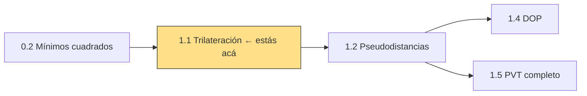
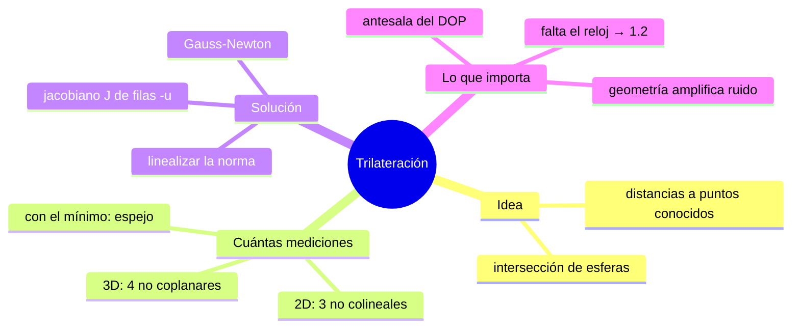
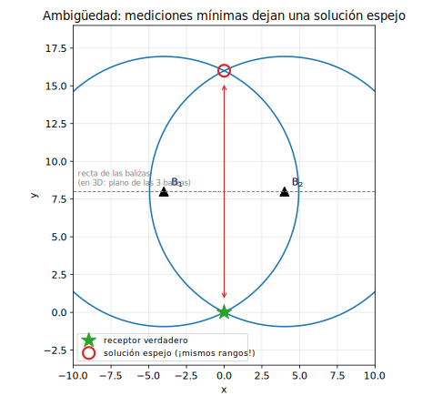
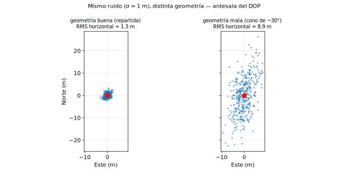
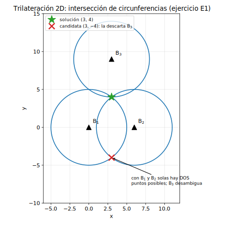

# Clase 1.1 — Trilateración: posición a partir de distancias

**Módulo 1 · Fundamentos de posicionamiento** · mapea a *Algorithms & Positioning* (JSNP)

| | |
|---|---|
| **Estado** | Consolidación — el lab base ya está hecho; esta clase agrega la ambigüedad espejo y el Monte Carlo de geometría |
| **Tiempo estimado** | 2.5–3.5 h (teoría 45' · lab 60–90' · ejercicios 40' · caso y cierre 25') |
| **Entregables** | lab con auto-tests en verde · ejercicios cotejados · bitácora completada |

---

## 1. Objetivos de aprendizaje

- [ ] Explicar la diferencia entre **trilateración** y triangulación (y por qué GNSS es lo primero).
- [ ] Resolver posición por intersección de circunferencias/esferas, a mano en 2D y con Gauss-Newton en 3D.
- [ ] Predecir cuántas mediciones hacen falta en 2D y 3D, y qué ambigüedad queda con el mínimo.
- [ ] Explicar por qué la **geometría** de las balizas amplifica el ruido (y anticipar el DOP).
- [ ] Justificar por qué a este problema le falta *una* cosa para ser GNSS: el reloj.

## 2. Ubicación en el path

**Prerrequisitos:** M0 mínimos cuadrados y jacobianos ✓



Esta es la clase fundacional: el solver de acá, más una columna (el reloj), es el de la 1.2; su jacobiano, mirado desde $(J^\top J)^{-1}$, es la 1.4.

## 3. Mapa conceptual



## 4. Teoría

### 4.1 Lados, no ángulos

**Tri-lateración**: posición desde *distancias* (lados) a puntos conocidos. **Tri-angulación**: desde *ángulos*. GNSS no mide ningún ángulo — mide tiempos que se convierten en distancias; la posición del satélite viene en el mensaje, no de apuntarle. Decir que "el GPS triangula" es el error conceptual más repetido del rubro.

Cada medición $r_i = \lVert \mathbf{b}_i - \mathbf{x} \rVert$ deja al receptor sobre una **superficie de posición**: circunferencia en 2D, esfera en 3D. La posición es la intersección.

### 4.2 ¿Cuántas mediciones?

| Dimensión | Con el mínimo | Sin ambigüedad |
|---|---|---|
| 2D | 2 circunferencias → **2 puntos** (espejo respecto de la recta de balizas) | 3 balizas no colineales |
| 3D | 3 esferas → **2 puntos** (espejo respecto del plano de balizas) | 4 balizas no coplanares |



En GNSS la solución espejo cae lejísimo del planeta (en el lab: a **32 833 km** de la verdadera) y se descarta sola — pero conviene saber que existe, porque en sistemas indoor/UWB con anclas casi coplanares la ambigüedad vertical sí muerde.

> **Para completar** (respuestas en [`soluciones.md`](soluciones.md)):
>
> - B1. En 2D, dos circunferencias se cortan en `______` puntos; la tercera baliza debe ser no `______` con las otras dos.
> - B2. En 3D, la solución espejo es la reflexión de la verdadera respecto del `______`.
> - B3. Para que esto sea GNSS falta agregar `______` como incógnita, porque el receptor no mide distancias sino `______`.

### 4.3 Linealización y Gauss-Newton (sin reloj)

Igual que en la 1.2 pero con tres incógnitas: linealizando $r_i(\mathbf{x})$ alrededor de $\mathbf{x}_0$,

$$\delta r_i \approx -\mathbf{u}_i^\top \Delta\mathbf{x}, \qquad \mathbf{u}_i = \frac{\mathbf{b}_i - \mathbf{x}}{r_i}, \qquad \Delta = (J^\top J)^{-1} J^\top \delta r$$

con $J$ de filas $-\mathbf{u}_i^\top$ (n×3). Se itera actualizando rangos y unitarios.

### 4.4 La geometría amplifica el ruido

Con el mismo instrumento y el mismo ruido, la dispersión de la solución depende de **dónde están las balizas**. El factor es $\sqrt{\mathrm{tr}\big((J^\top J)^{-1}\big)}$ — el error RMS es ≈ factor × σ. En el lab: geometría repartida → factor 1.61; las mismas 4 balizas apretadas en un cono de ~30° → factor 10.50. Ese número, normalizado y con nombre propio, es el **DOP** (clase 1.4).



## 5. Laboratorio

**Archivos**

```
lab/lab_trilateracion_TODO.py / .ipynb    ← esqueleto con auto-tests
lab/soluciones/lab_trilateracion_solucion.py
data/escenario_trilat.json                ← 2×4 balizas sobre Buenos Aires
data/generar_escenario_trilat.py
```

**Escenario:** receptor en Buenos Aires; 4 balizas con geometría "buena" (repartida, elevaciones 20°–60°) y las mismas 4 en versión "mala" (cono de ~30°). Rangos **exactos** (sin reloj) y con ruido σ = 1 m.

**Validación cuantitativa**

| Check | Criterio | Resultado de referencia |
|---|---|---|
| A — rangos exactos, desde el centro de la Tierra | error < 0.1 mm, ≤ 8 it | **5 iteraciones**, error ~1·10⁻⁹ m |
| B — ruido σ = 1 m, geometría buena | error < 5 m | **1.31 m** |

**Experimentos guiados**

1. **Solución espejo.** Con 3 balizas, encontrá las DOS soluciones (la verdadera y el reflejo respecto del plano de balizas). Referencia: ambas con residuo ~10⁻⁹ m, separadas **32 833 km**. Preguntas para la bitácora: ¿por qué en GNSS esto no molesta? ¿en qué sistema sí molestaría?
2. **Monte Carlo de geometría.** 500 corridas con σ = 1 m por geometría. Referencia: RMS 3D **1.57 m** (buena) vs **10.69 m** (mala) — amplificación **×6.8** — y el factor $\sqrt{\mathrm{tr}((J^\top J)^{-1})}$ (1.61 vs 10.50) lo predice casi exacto.

## 6. Ejercicios sin código

Soluciones paso a paso en [`soluciones.md`](soluciones.md).

### 6.1 Numéricos a mano

**E1 — Intersección en 2D.** Balizas $B_1(0,0)$, $B_2(6,0)$, $B_3(3,9)$; rangos medidos $(5, 5, 5)$.
a) Con $B_1$ y $B_2$ solamente, encontrá los dos puntos candidatos (restá las ecuaciones de las circunferencias).
b) Usá $B_3$ para quedarte con uno.
c) ¿Cuál es la condición sobre las tres balizas para que esto siempre funcione?



**E2 — Propagación de un error.** Dos balizas lejanas, una exactamente al Norte y otra al Este. El rango a la del Norte viene con +1 m de error; el otro es exacto. ¿Hacia dónde y cuánto se corre la solución? ¿Qué te dice esto sobre qué representan las filas de $J$?

**E3 — Tiempo ↔ distancia.** Si el rango se mide por tiempo de vuelo de una señal de radio: ¿qué error de reloj produce 1 m de error de rango? ¿Y para 1 cm? (La respuesta explica por qué GNSS es, en el fondo, un problema de relojes.)

### 6.2 Estimación tipo Fermi

**F1.** Para medir 1 m de distancia por tiempo de vuelo: ¿qué precisión de cronómetro necesitás con **sonido** (343 m/s) y con **luz**? ¿Cuántos órdenes de magnitud separan ambas?
**F2.** El trueno llega 6 s después del relámpago: ¿a qué distancia cayó el rayo? (Trilateración cotidiana con una sola "baliza".)
**F3.** Ranging a dos torres de celular con 100 ns de error de sincronización: ¿de qué orden es el error de posición?

### 6.3 Conceptuales (autoevaluación)

<details><summary><b>C1.</b> ¿El GPS triangula?</summary>

No: **trilatera**. No se mide ningún ángulo; se miden tiempos → distancias, y la posición de cada satélite viene en su mensaje de navegación. (En la 1.2 se ve que ni siquiera son distancias: son *pseudo*distancias.)
</details>

<details><summary><b>C2.</b> ¿Por qué la solución espejo casi nunca molesta en GNSS?</summary>

Porque cae a decenas de miles de km de la Tierra (reflexión respecto del plano de satélites, que está a ~20 000 km de altura), y además casi siempre hay más de 4 satélites: la redundancia rompe la simetría.
</details>

<details><summary><b>C3.</b> ¿Agregar más balizas arregla una geometría mala?</summary>

Solo a medias: más mediciones reducen el ruido ~1/√n, pero si todas vienen del mismo cono, la amplificación geométrica queda intacta. Abrir la geometría vale más que sumar balizas — es el argumento de por qué GPS+Galileo mejora tanto en cañón urbano (clase 1.4).
</details>

<details><summary><b>C4.</b> ¿Qué pasa si las balizas son colineales (2D) o quedan coplanares con el receptor (3D)?</summary>

$J^\top J$ se vuelve singular o casi: hay una dirección del espacio sobre la que las mediciones no dicen nada. La solución se dispara a lo largo de esa dirección — degeneración pura, el caso extremo del DOP.
</details>

<details><summary><b>C5.</b> ¿Hace falta iterar, o hay solución cerrada?</summary>

Existen soluciones cerradas (p. ej. el método de Bancroft, que resuelve incluso con reloj), pero Gauss-Newton es lo estándar: generaliza a n mediciones, pondera, y entrega de regalo $(J^\top J)^{-1}$ — la matriz de covarianza que alimenta DOP e integridad.
</details>

### 6.4 Preguntas tipo entrevista

1. *"En 90 segundos: ¿por qué está mal decir que el GPS triangula, y qué hace en realidad?"*
2. *"Diseñá el posicionamiento UWB de un depósito: ¿cuántas anclas, dónde las ponés, y por qué la altura a la que las montás importa tanto?"*
3. *"Un cliente instaló 8 anclas y la precisión sigue siendo mala. ¿Qué revisás primero y en qué orden?"*

### 6.5 Mini-simulacro (8 min, sin apuntes)

1. Trilateración vs. triangulación: definí ambas y decí cuál usa GNSS. **[1 pt]**
2. ¿Mínimo de esferas para un punto único en 3D, sin información extra? **[1 pt]**
3. V/F + justificación: *"duplicar las balizas dentro del mismo cono compensa la mala geometría"*. **[1 pt]**
4. Un rango tiene +2 m de error y su baliza está al Oeste: ¿hacia dónde se corre la solución (aprox.)? **[1 pt]**
5. ¿Qué única incógnita hay que agregar para pasar de este problema a GNSS, y por qué? **[1 pt]**

Aprobado: **≥ 4/5**. Respuestas en `soluciones.md`.

## 7. Figuras

`python img/make_figures.py` regenera las tres (la fig. 3 usa `data/`).

## 8. Caso real — eLoran y el jamming norcoreano

Tras repetidas campañas de **jamming GPS desde Corea del Norte** (2010–2016, con cientos de barcos y vuelos afectados), Corea del Sur impulsó **eLoran**: trilateración por tiempo con transmisores *terrestres* de alta potencia en ~100 kHz. La física del caso: la señal GNSS llega del espacio debilísima (~10⁻¹⁶ W); una señal terrestre de baja frecuencia y alta potencia llega millones de veces más fuerte y es muchísimo más cara de interferir. El precio: precisión de decenas de metros y cobertura regional.

Preguntas (respuestas en `soluciones.md` §Caso): ¿por qué eLoran es tan resistente al jamming? ¿qué sacrifica frente a GNSS? ¿cómo encaja en una arquitectura PNT resiliente multicapa (GNSS + eLoran + relojes holdover + INS)? Traducilo a tu mundo: ¿qué sería "defensa en profundidad" para el timing de una infraestructura crítica?

## 9. Glosario ES/EN

| Español | English | Nota |
|---|---|---|
| trilateración | trilateration | por distancias (lados) |
| triangulación | triangulation | por ángulos — GNSS **no** |
| multilateración | multilateration (MLAT) | ojo: suele referir a TDOA (diferencias de tiempo) |
| baliza / ancla | beacon / anchor | |
| superficie de posición | surface of position | esfera/circunferencia |
| ambigüedad / solución espejo | ambiguity / mirror solution | |
| jacobiano | Jacobian | acá: filas $-\mathbf{u}^\top$ |
| colineal / coplanar | collinear / coplanar | las geometrías prohibidas |
| error RMS | RMS error | $\sqrt{\text{media de } e^2}$ |

## 10. Cheat sheet

$$r_i = \lVert \mathbf{b}_i - \mathbf{x} \rVert, \qquad J_{i\cdot} = -\mathbf{u}_i^\top, \qquad \Delta = (J^\top J)^{-1} J^\top \delta r$$

- 2D: 3 balizas no colineales · 3D: 4 no coplanares (con 3, queda el espejo).
- Factor geométrico $\sqrt{\mathrm{tr}((J^\top J)^{-1})}$ → error RMS ≈ factor × σ.
- Regla tiempo↔distancia (luz): 3.3 ns ≈ 1 m · 33 ps ≈ 1 cm.
- Este problema + una columna de unos en $J$ = clase 1.2.

## 11. Errores comunes

- Decir "triangulación". (Sí, otra vez: es el error #1 y te lo van a preguntar.)
- Olvidar la ambigüedad del caso mínimo y sorprenderse cuando el solver converge "al otro lado".
- Creer que sumar balizas compensa una geometría cerrada.
- Balizas casi coplanares con el receptor (anclas UWB todas al techo, a la misma altura): la vertical queda ciega.
- Confundir este problema con GNSS real: acá los rangos son exactos y simultáneos; allá hay reloj, propagación y satélites que se mueven.

## 12. Referencias quirúrgicas

- Sanz Subirana et al., *GNSS Data Processing Vol. I* (ESA TM-23/1): **cap. 6** (*Solving Navigation Equations*) — la versión con reloj de este mismo álgebra.
- Kaplan & Hegarty, capítulo introductorio de posicionamiento por satélite (el argumento de las superficies de posición).
- Curiosidad con nombre propio: **Bancroft (1985)** — solución algebraica cerrada del problema GPS.

## 13. Flashcards

[`flashcards_anki.csv`](flashcards_anki.csv) — 12 tarjetas. Mazo sugerido `GNSS::M1::1.1`.

## 14. Bitácora

[`bitacora.md`](bitacora.md) — completar al cerrar.

## 15. Rúbrica de cierre

- [ ] Blancos B1–B3 completados y cotejados.
- [ ] Auto-tests del lab en verde sin abrir la solución; validaciones A y B.
- [ ] Experimentos 1 y 2 corridos y anotados (espejo a ~32 800 km; amplificación ~×7).
- [ ] E1–E3 y F1–F3 en papel, cotejados.
- [ ] Mini-simulacro ≥ 4/5 en ≤ 8 min.
- [ ] Flashcards importadas y primera pasada.
- [ ] Pregunta de entrevista 1 respondida en voz alta en < 90 s.

## 16. Próxima clase

**1.2 — Pseudodistancias y sesgo de reloj**: el mismo solver, una incógnita más, y el salto conceptual de "distancia" a "medición de tiempo con un reloj mentiroso".
