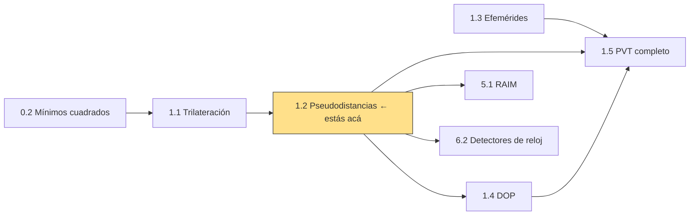
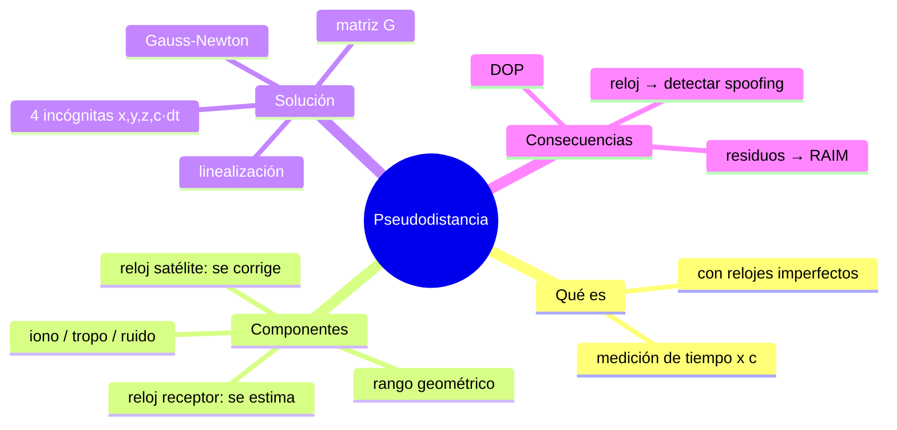
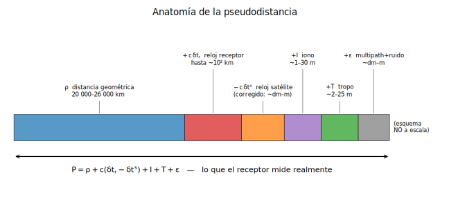
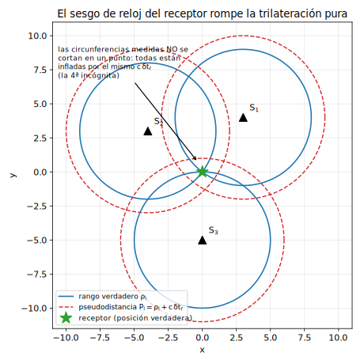
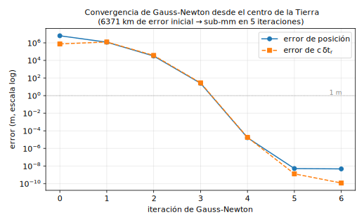

# Clase 1.2 — Pseudodistancias y sesgo de reloj del receptor

**Módulo 1 · Fundamentos de posicionamiento** · mapea a *Algorithms & Positioning* (JSNP)

| | |
|---|---|
| **Estado** | Consolidación — el lab base ya está hecho; esta clase agrega experimentos 1–4 y evaluación |
| **Tiempo estimado** | 3.5–4.5 h (teoría 60' · lab 90–120' · ejercicios 45' · caso y glosario 20' · simulacro y cierre 15') |
| **Entregables** | lab con auto-tests en verde · ejercicios cotejados · bitácora completada |

---

## 1. Objetivos de aprendizaje

Al cerrar esta clase, puedo (marcar solo si es verdad):

- [ ] Explicar en menos de 2 minutos, sin notas, por qué una pseudodistancia **no** es una distancia.
- [ ] Escribir de memoria el modelo de observación y nombrar cada término.
- [ ] Justificar geométricamente por qué hacen falta **≥ 4 satélites**.
- [ ] Implementar Gauss-Newton para PVT y explicar cada línea.
- [ ] Convertir mentalmente tiempo ↔ distancia (1 ns ≈ 30 cm, 1 µs ≈ 300 m, 1 ms ≈ 300 km).
- [ ] Hacer **a mano** una iteración de Gauss-Newton en un caso 2D.
- [ ] Predecir qué pasa si se ignora el sesgo de reloj, si faltan satélites, o si un satélite miente.

## 2. Ubicación en el path

**Prerrequisitos:** clase 1.1 (trilateración) ✓ · M0 mínimos cuadrados y jacobianos ✓



Esta clase es un nudo del path: el solver que sale de acá se **reusa** en 1.5 (datos reales), 5.1 (integridad) y 6.2 (detección de spoofing por reloj).

## 3. Mapa conceptual



## 4. Teoría

### 4.1 El modelo de observación

El receptor **no mide distancias**: mide el tiempo de llegada de la señal *con su propio reloj*, que está desincronizado. Multiplicado por $c$:

$$P = \rho + c\,(\delta t_r - \delta t^s) + I + T + \varepsilon$$

| Término | Qué es | Orden de magnitud | ¿Quién lo maneja? |
|---|---|---|---|
| $\rho = \lVert \mathbf{r}^s - \mathbf{r}_r \rVert$ | distancia geométrica | 20 000–26 000 km | la incógnita que queremos |
| $c\,\delta t_r$ | sesgo del reloj del **receptor** | hasta ~10² km (cuarzo) | **se estima** cada época (4ª incógnita) |
| $c\,\delta t^s$ | sesgo del reloj del **satélite** | km si estuviera libre | **se corrige** con el mensaje (af0/af1/af2) → residual ~dm–m |
| $I$, $T$ | ionosfera, troposfera | ~1–30 m, ~2–25 m | modelos / doble frecuencia (Módulo 3) |
| $\varepsilon$ | multipath + ruido | ~dm–m | diseño de receptor y antena |



> **Para completar** (respuestas en [`soluciones.md`](soluciones.md), §Blancos):
>
> - B1. Un error de reloj del receptor de **1 ms** equivale a `______` km de pseudodistancia.
> - B2. En esta clase el sesgo del satélite $\delta t^s$ vale cero porque `______`; en la clase 1.5 habrá que `______`.
> - B3. El receptor de un teléfono no necesita reloj atómico porque `______`.

### 4.2 Por qué 4 satélites

Incógnitas: $x, y, z$ **y** $c\,\delta t_r$ → cuatro. Cada satélite aporta una ecuación. Geométricamente: todas las "esferas" medidas están infladas (o desinfladas) por el **mismo** $c\,\delta t_r$, así que tres esferas ya no se cortan en un punto — hace falta una cuarta para separar posición de tiempo.



*(La figura usa la misma geometría del ejercicio E1: en 2D son 3 incógnitas → 3 "satélites".)*

### 4.3 Linealización y Gauss-Newton

El modelo es no lineal en la posición (por la norma) pero **exactamente lineal** en $c\,\delta t_r$. Linealizando alrededor de $\mathbf{x}_0$:

$$\delta P_i = P_i - \big(\rho_i(\mathbf{x}_0) + c\,\delta t_{r,0}\big) \approx \begin{bmatrix} -\mathbf{u}_i^\top & 1 \end{bmatrix} \begin{bmatrix} \Delta \mathbf{r} \\ \Delta(c\,\delta t_r) \end{bmatrix}, \qquad \mathbf{u}_i = \frac{\mathbf{r}^{s_i} - \mathbf{r}_r}{\rho_i}$$

Apilando las filas queda la **matriz de diseño** $G$ (n×4) y el paso de mínimos cuadrados:

$$\Delta = (G^\top G)^{-1} G^\top\, \delta P \quad \text{(en la práctica: lstsq)}, \qquad \mathbf{x} \leftarrow \mathbf{x} + \Delta$$

Se itera actualizando $\rho_i$ y $\mathbf{u}_i$ hasta que $\lVert\Delta\rVert$ sea pequeño. La misma $G$ define el **DOP** (clase 1.4) y los **residuos postfit** alimentan RAIM (clase 5.1).

> **Convención de la clase** (elegí una y no la sueltes): $\mathbf{u}$ apunta **receptor → satélite**, la fila de $G$ es $[-\mathbf{u}^\top\; 1]$, y la 4ª incógnita es $c\,\delta t_r$ **en metros**.
>
> **Para completar:**
>
> - B4. La 4ª columna de $G$ vale `______` para todos los satélites porque $\partial P/\partial(c\,\delta t_r) =$ `______`.
> - B5. Si todos los satélites estuvieran casi en la misma dirección del cielo, $G^\top G$ sería `______` y la solución `______`.

## 5. Laboratorio

**Archivos**

```
lab/lab_pseudodistancias_TODO.py       ← esqueleto (script, formato percent)
lab/lab_pseudodistancias_TODO.ipynb    ← el mismo esqueleto como notebook
lab/soluciones/lab_pseudodistancias_solucion.py
data/escenario_5sats.json              ← 5 satélites sintéticos sobre Buenos Aires
data/generar_escenario.py              ← cómo se fabricó (¡leerlo también enseña!)
```

**Escenario:** receptor en Buenos Aires con sesgo de reloj **+2.5 ms** (arranque en frío, $c\,\delta t_r$ = 749.5 km), 5 satélites con geometría MEO realista (elevaciones 15°–65°, GDOP = 2.69 / PDOP = 2.36 / TDOP = 1.30). Dos sets de pseudodistancias: exactas y con ruido σ = 1 m.

**Flujo:** completar los `TODO` 1→4 (cada uno con auto-test), pasar las dos validaciones y correr los 4 experimentos. La solución no se abre hasta que los auto-tests pasen o lleves más de 30' trabado en uno.

**Validación cuantitativa (criterio de la clase)**

| Check | Criterio | Resultado de referencia |
|---|---|---|
| A — sin ruido, desde el centro de la Tierra | error pos. y c·dt < 0.1 mm, ≤ 8 iteraciones | converge en **5** iteraciones, error ~5·10⁻⁹ m |
| B — ruido σ = 1 m | error de posición < 10 m | ~3.9 m (consistente con PDOP·σ ≈ 2.4 m) |

**Convergencia esperada** (validación A) — notá el salto cuadrático cerca de la solución:



| it | 0 | 1 | 2 | 3 | 4 | 5 |
|---|---|---|---|---|---|---|
| error pos. (m) | 6.4·10⁶ | 1.2·10⁶ | 3.2·10⁴ | 25.3 | 1.6·10⁻⁵ | 4.6·10⁻⁹ |

**Experimentos guiados** (anotar resultados en la bitácora):

1. **Ignorar el reloj** (resolver solo x, y, z con las pseudodistancias sesgadas): error de posición de referencia ≈ **1089 km** — ni siquiera igual a los 749.5 km del sesgo; ¿por qué? (la respuesta involucra la geometría).
2. **Solo 3 satélites** con 4 incógnitas: sistema subdeterminado; `lstsq` devuelve *una* solución (mínima norma) a miles de km. Moraleja: que el solver devuelva un número no significa que sea una posición.
3. **Gráfico de convergencia** propio y comparación con `fig2`.
4. **Fallo de 13.7 µs en un satélite** (el número no es casual — ver §8): la posición se corre ≈ **3.5 km** y los residuos postfit quedan en ~10² m *repartidos entre todos* los satélites, no concentrados en el culpable. Este resultado incómodo es la puerta de entrada a RAIM (clase 5.1).

## 6. Ejercicios sin código

Soluciones **paso a paso** en [`soluciones.md`](soluciones.md). Hacerlos en papel.

### 6.1 Numéricos a mano

**E1 — Una iteración de Gauss-Newton en 2D.** "Satélites" $S_1(3,4)$, $S_2(-4,3)$, $S_3(0,-5)$; $c = 1$ (unidades arbitrarias). Pseudodistancias medidas: $P = (6, 6, 6)$. Punto inicial $\mathbf{x}_0 = (0,0)$, $b_0 = 0$ (acá $b = c\,\delta t_r$).

a) Calculá $\rho_i(\mathbf{x}_0)$ y los residuos $\delta P_i$.
b) Armá $G$ (filas $[-\mathbf{u}_i^\top\; 1]$).
c) Resolvé el sistema 3×3 $G\,\Delta = \delta P$ a mano y actualizá.
d) Verificá que la solución queda **exacta en una sola iteración** — ¿por qué? (pista: ¿en qué incógnita es lineal el modelo, y dónde estaba parado $\mathbf{x}_0$?)

**E2 — Conversiones de reloj.**
a) El receptor estima $c\,\delta t_r = +89.94$ km. ¿Cuánto vale $\delta t_r$ en µs?
b) Un TCXO barato deriva 1 ppm. ¿A cuántos m/s de pseudodistancia equivale? ¿Y si no se re-estimara el sesgo durante 10 minutos?
c) Completá la regla mnemotécnica: 1 ns ≈ ___, 1 µs ≈ ___, 1 ms ≈ ___.

**E3 — El error de 13.7 µs.**
a) ¿A cuántos metros de pseudodistancia equivale un error de reloj de 13.7 µs?
b) Si ese error afectara **a un solo** satélite, ¿sesga la posición? ¿Y si afectara **a todos por igual**? Justificá con el modelo de observación (pista: mirá qué incógnita lo absorbe).

### 6.2 Estimación tipo Fermi (sin calculadora)

**F1.** ¿Cuánto tarda la señal de un satélite MEO en llegar al receptor? (cenit vs. horizonte)
**F2.** Un reloj con estabilidad 10⁻¹² que no se corrige durante un día, ¿cuántos metros de error de rango acumula?
**F3.** ¿Cuál es el Doppler máximo de la portadora L1/E1 para un receptor estático? ¿Qué tiene que ver con la grilla de ±5 kHz del Lab 2.2?

### 6.3 Conceptuales (autoevaluación)

<details><summary><b>C1.</b> ¿Por qué la pseudodistancia no es una distancia?</summary>

Porque es una **medición de tiempo** hecha con dos relojes imperfectos, escalada por $c$: mezcla la distancia geométrica con los sesgos de ambos relojes (más propagación y ruido). De ahí el prefijo *pseudo*.
</details>

<details><summary><b>C2.</b> ¿Se puede posicionar con 3 satélites y un altímetro?</summary>

Sí: la altura conocida aporta la ecuación que falta (una superficie más que intersecar). Es la forma más simple de **fusión de sensores** — el tema reaparece en "Temas de frontera".
</details>

<details><summary><b>C3.</b> ¿El sesgo del reloj del satélite también se estima?</summary>

No en el receptor: se **corrige** con los coeficientes af0/af1/af2 del mensaje de navegación (más el término relativista, clase 1.5). El del receptor sí se estima cada época. Asimetría clave: los satélites llevan relojes atómicos caracterizados; el receptor, un cuarzo cualquiera.
</details>

<details><summary><b>C4.</b> ¿Qué pasa con $G^\top G$ si los satélites están casi coplanares o agrupados?</summary>

Queda mal condicionada (casi singular): los errores de medición se amplifican en la solución. Eso es exactamente lo que cuantifica el **DOP** (clase 1.4).
</details>

<details><summary><b>C5.</b> ¿Por qué Gauss-Newton converge incluso arrancando del centro de la Tierra?</summary>

El término de reloj es exactamente lineal (converge "gratis"), y la parte geométrica es muy suave a esa escala: los unitarios $\mathbf{u}_i$ cambian poco entre iteraciones lejanas, así que cada paso apunta bien. Cerca de la solución la convergencia se vuelve cuadrática (se ve en la fig. 2: de 25 m a 10⁻⁵ m en un paso).
</details>

### 6.4 Preguntas tipo entrevista (responder en voz alta, cronometrado)

1. *"Explicale a un product manager por qué los satélites GPS llevan relojes atómicos pero tu teléfono no los necesita."* (≤ 2 min)
2. *"Un receptor entrega posiciones que saltan ~300 m entre épocas, siempre en direcciones distintas. ¿Qué hipótesis mirás primero y con qué observable la confirmás?"*
3. *"¿Cómo usarías la serie temporal del sesgo de reloj estimado para detectar un spoofing en curso?"* — conectá con tu perfil: es un detector clásico (clase 6.2).

### 6.5 Mini-simulacro (10 min, sin apuntes, autocorregido)

1. Escribí el modelo de observación completo y nombrá cada término. **[2 pts]**
2. Un error de reloj de 47 µs, ¿a cuántos km equivale? **[1 pt]**
3. V/F + justificación: *"un error de reloj común a todos los satélites sesga la posición estimada"*. **[1 pt]**
4. ¿Por qué la 4ª columna de $G$ es de unos? **[1 pt]**

Aprobado: **≥ 4/5**. Respuestas en `soluciones.md` §Simulacro. El simulacro completo del módulo (30–40 min) se rinde al cerrar la clase 1.5 (`../simulacro_m1.md`, pendiente de crear).

## 7. Figuras

Las tres figuras de la clase se generan con `python img/make_figures.py` (figuras como código: reproducibles y versionadas). Si tocás el escenario, regenerá la fig. 2.

## 8. Caso real — GPS, 26 de enero de 2016

Al dar de baja el satélite SVN-23, un problema en el software del segmento de control hizo que parte de la constelación transmitiera **parámetros de corrección GPS→UTC con un error de ~13.7 µs** durante horas. Consecuencias: receptores de *timing* en telecomunicaciones, broadcast y redes eléctricas se corrieron ~13.7 µs (≈ 4.1 km en unidades de rango) y saltaron alarmas en infraestructura crítica de varios países. El **posicionamiento casi no se afectó**.

Preguntas (respuestas razonadas en `soluciones.md` §Caso):

1. ¿Por qué el posicionamiento sobrevivió pero el timing no? (pista: ¿el error era común o por satélite? ¿qué incógnita absorbe los errores comunes? ¿y qué pasa con quien necesita UTC, no "tiempo GPS"?)
2. ¿RAIM lo habría detectado? ¿Qué monitoreo sí? (pensá como ingeniero de detección: fuentes independientes, NTP/PTP, multiconstelación)
3. Traducción a tu mundo: ¿qué luce este incidente en un SIEM de infraestructura crítica dependiente de GNSS timing?

## 9. Glosario ES/EN

| Español | English | Nota |
|---|---|---|
| pseudodistancia | pseudorange | el término del JSNP |
| sesgo/offset de reloj | clock bias / clock offset | |
| deriva de reloj | clock drift | derivada del sesgo |
| línea de vista | line of sight (LOS) | el unitario $\mathbf{u}$ |
| matriz de diseño / de geometría | design / geometry matrix | la $G$ |
| mínimos cuadrados | least squares (LSQ) | |
| residuo prefit / postfit | prefit / postfit residual | antes/después de ajustar |
| época | epoch | un instante de medición |
| arranque en frío | cold start | sesgo de reloj grande |
| dilución de la precisión | dilution of precision (DOP) | clase 1.4 |
| solución de navegación | navigation solution / PVT | position, velocity, time |

## 10. Cheat sheet

$$P = \rho + c(\delta t_r - \delta t^s) + I + T + \varepsilon, \qquad \rho = \lVert \mathbf{r}^s - \mathbf{r}_r \rVert$$

- Fila de $G$: $[-\mathbf{u}^\top\;\; 1]$, $\mathbf{u}$ unitario receptor→satélite. Paso: $\Delta = (G^\top G)^{-1}G^\top \delta P$.
- Incógnitas: $(x, y, z, c\,\delta t_r)$ — el reloj **en metros**. Parar cuando $\lVert\Delta\rVert < 10^{-4}$ m.
- Regla de oro: **1 ns ≈ 30 cm · 1 µs ≈ 300 m · 1 ms ≈ 300 km** ($c$ = 299 792 458 m/s).
- Errores **comunes a todos los satélites** → los absorbe $c\,\delta t_r$ (no sesgan posición, sí el tiempo). Errores **por satélite** → sesgan posición y ensucian residuos.
- Redundancia: 4 sats = solución; ≥ 5 = residuos con contenido → detección de fallos (RAIM).

## 11. Errores comunes

- Definir $\mathbf{u}$ para un lado y armar $G$ para el otro: el solver "converge" a cualquier lado. Fijá la convención y escribila en el código.
- Mezclar unidades: si la 4ª columna es de unos, la incógnita es $c\,\delta t_r$ **en metros**, no $\delta t_r$ en segundos.
- No actualizar $\rho$ y $\mathbf{u}$ en cada iteración (jacobiano congelado): converge peor o se clava.
- Creer que el receptor mide distancias. Mide **tiempos con su reloj**.
- Confundir residuo prefit (entra al ajuste) con postfit (lo que queda después; el que mira RAIM).
- En 1.5: olvidar la corrección del reloj del satélite o la rotación terrestre y perseguir "bugs" de cientos de metros que son física.

## 12. Referencias quirúrgicas

- Sanz Subirana, Juan Zornoza & Hernández-Pajares, *GNSS Data Processing Vol. I* (ESA TM-23/1): **cap. 5** (*Measurement Modelling*) para §4.1, **cap. 6** (*Solving Navigation Equations*) para §4.3. El **Vol. II** trae la sesión de laboratorio equivalente con código de referencia.
- Navipedia (ESA): artículos de observables GNSS y del modelo lineal de observación — lectura corta para fijar notación.
- IS-GPS-200, **§20.3.3.3.3.1** (*User Algorithm for SV Clock Correction*) y la sección homóloga del Galileo OS SIS ICD: se usan recién en la clase 1.5, pero conviene saber dónde viven.

## 13. Flashcards

[`flashcards_anki.csv`](flashcards_anki.csv) — 14 tarjetas. Importar en Anki: *File → Import*, tipo Básico, campos separados por coma, campo 1 = frente, campo 2 = dorso, mazo sugerido `GNSS::M1::1.2`. Primera pasada el mismo día del cierre; después, lo que diga el algoritmo.

## 14. Bitácora

Copiá [`bitacora.md`](bitacora.md) o completala en el lugar: fecha, tiempo real invertido, resultados de los 4 experimentos, dudas abiertas (con dueño: "resolver en clase X" o "preguntar en el JSNP").

## 15. Rúbrica de cierre

La clase se marca `[x]` en el path **solo** si:

- [ ] Blancos B1–B5 completados y cotejados.
- [ ] Los 4 `TODO` del lab pasan sus auto-tests **sin haber abierto la solución**.
- [ ] Validación A (< 0.1 mm, ≤ 8 iteraciones) y B (< 10 m) en verde.
- [ ] Experimentos 1–4 corridos y anotados en la bitácora.
- [ ] E1–E3 y F1–F3 resueltos en papel y cotejados con `soluciones.md`.
- [ ] Mini-simulacro ≥ 4/5 en ≤ 10 minutos.
- [ ] Flashcards importadas a Anki y primera pasada hecha.
- [ ] Pregunta de entrevista 1 respondida en voz alta en < 2 min (grabate y escuchate).

## 16. Próxima clase

**1.4 — DOP y geometría**: la matriz $G$ que acabás de construir, mirada desde $(G^\top G)^{-1}$. (La 1.3 ya está hecha; si querés consolidarla con este formato, va después.)
