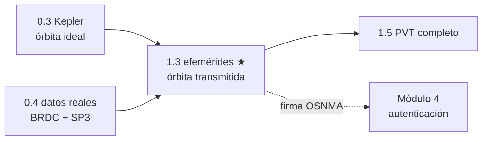

# Clase 1.3 — Efemérides: del mensaje de navegación a la posición del satélite

**Módulo 1 · Posicionamiento · ~3 h**

## Objetivos

- [ ] Leer una efeméride Galileo real de un RINEX de navegación y entender cada campo
- [ ] Distinguir I/NAV de F/NAV con el bitmask `DataSrc` y explicar por qué OSNMA firma I/NAV
- [ ] Implementar el algoritmo del ICD (Kepler → ECEF) con las correcciones armónicas
- [ ] Validar el broadcast contra un SP3 preciso y cuantificar el error (metro-nivel)
- [ ] Medir cómo se degrada una efeméride al envejecer fuera de su intervalo de ajuste

## ¿Dónde estamos?



En 0.3 resolviste Kepler para una órbita ideal. En 0.4 bajaste el mensaje de
navegación real. Hoy se juntan: el satélite te **transmite** 16 parámetros y
vos reconstruís dónde está, con error de ~1 metro. Ese mismo mensaje es lo que
OSNMA firma criptográficamente — no se puede autenticar lo que no se sabe leer.

## Teoría (completá los blancos con el lab)

### 1. Qué transmite el satélite

Una efeméride broadcast no es una posición: es una **órbita kepleriana de
referencia + perturbaciones**, ajustada por el segmento terreno para un
intervalo corto alrededor de un instante `Toe` (Time of Ephemeris, en
segundos de semana). Los 16 parámetros del ICD:

| Grupo | Campos | Qué describen |
|---|---|---|
| Tamaño/forma | `sqrtA`, `e` | semieje (√A ≈ 5440.6 → a ≈ ______ km), excentricidad |
| Anomalías | `M0`, `ΔN` | posición inicial y corrección al movimiento medio |
| Orientación | `Ω0`, `Ω̇`, `i0`, `IDOT`, `ω` | plano orbital y su deriva |
| Armónicas | `Cuc/Cus`, `Crc/Crs`, `Cic/Cis` | perturbaciones periódicas (J2, marea) |
| Referencia | `Toe`, semana, `IODnav` | ancla temporal y versión del ajuste |

### 2. I/NAV vs F/NAV: el bitmask `DataSrc`

Galileo emite el mismo contenido orbital por dos mensajes: **F/NAV** (E5a,
para el servicio abierto de frecuencia simple) e **I/NAV** (E1-B y E5b, el que
lleva **OSNMA**). En RINEX 3.04 el campo `DataSrc` es un bitmask:
bit0 = I/NAV E1-B, bit1 = F/NAV E5a, bit2 = I/NAV E5b, bits 8/9 = de qué
mensaje salen el reloj y `Toc`. En nuestro BRDC del 2026-06-15 conviven
cuatro valores: 258 (=256+2, F/NAV), 513, 516 y **517 (=512+4+1, I/NAV
combinado E1-B+E5b)** — el que filtramos, porque es el que firma OSNMA.
Trampa de georinex: un mismo `sv` aparece como `E02`, `E02_1`, ... cuando
hay mensajes duplicados en la misma época; hay que colapsar el sufijo.

### 3. La cadena del ICD (idéntica en GPS IS-200 y Galileo OS SIS ICD)

```
tk = t − Toe (wrap ±302400 s)
n  = √(μ/A³) + ΔN          →  M = M0 + n·tk
Kepler (Newton):  M = E − e·sinE   →  E   (converge en ____ iteraciones)
ν  = 2·atan2(√(1+e)·sin(E/2), √(1−e)·cos(E/2))
Φ  = ν + ω;  δu, δr, δi con las armónicas sin2Φ/cos2Φ
u = Φ+δu;  r = A(1−e·cosE)+δr;  i = i0 + IDOT·tk + δi
Ω  = Ω0 + (Ω̇ − ω⊕)·tk − ω⊕·Toe      ← acá entra la rotación terrestre
ECEF: rotar (r·cosu, r·sinu) por i y Ω
```

### 4. Validez, tiempo y qué error esperar

- El ajuste es **local**: dentro de ±1 h del `Toe` el broadcast Galileo da
  RMS ≈ ______ m; a ±2 h ya aparecen picos >10 m; a 12 h son cientos de m.
- `IODnav` versiona cada ajuste: receptor y OSNMA deben usar el mismo.
- Tiempos: GAL y GPS comparten época semanal (semana 2423 en ambos, GST−GPS
  < 50 ns) → se puede comparar contra un SP3 (que va en tiempo GPS) directo.
- El SP3 da el **centro de masa**; el broadcast apunta al **centro de fase**
  de la antena: ~1–2 m de offset sistemático que queda dentro de nuestro
  presupuesto de error (y explica parte del piso que vas a medir).

## Lab guiado

1. Asegurate de tener los datos de la 0.4 (`tools/fetch_data.py --date 2026-06-15`).
2. Abrí `lab/lab_efemerides_TODO.ipynb` (o el `.py`) y completá los TODO.
3. Corré la solución de referencia si te trabás: `lab/soluciones/`.
4. Regenerá las figuras: `python3 img/make_figures.py`.

**Tabla de validación** (BRDC vs SP3 CODE MGEX, 2026-06-15, semana 2423):

| Chequeo | Valor esperado |
|---|---|
| SVs con I/NAV (DataSrc 517) | 30 (= SVs Galileo del SP3) |
| E19, Toe 129600 (IODnav 89), ±1 h | RMS **0.91 m**, max 1.86 m (25 épocas) |
| E19, ±2 h | RMS 2.35 m, max 13.67 m |
| Envejecimiento \|dt\| = 1/2/6/12 h | 1.9 / 13.7 / 405.9 / 569.2 m |
| Constelación completa, ±1 h | mediana **1.16 m** (mejor E25 0.66, peor E18 2.31) |

## Ejercicios a mano

**E1.** Con `sqrtA = 5440.6 √m`, calculá a, el período (T = 2π√(a³/μ)) y
verificá que Galileo da ~14 h 04 m (clase 0.3).

**E2.** Para `e = 3.4e-4` y `M = 0.5 rad`, hacé UNA iteración de Newton a
mano partiendo de `E₀ = M`. ¿De qué orden es la corrección? ¿Por qué con
e tan chica Kepler converge en 3 iteraciones?

**E3.** El término `−ω⊕·Toe` en Ω suele desconcertar. Demostrá que sale de
pasar de la ascensión recta inercial a longitud ECEF: Ω_ECEF(t) =
Ω0 + Ω̇·tk − ω⊕·(tk + Toe). ¿Qué error cometés a t = Toe + 100 s si lo
omitís? (ω⊕·Toe·r con r ≈ 29 600 km… kilómetros: el bug clásico).

## Estimaciones Fermi

**F1.** Si la velocidad orbital es ~3.7 km/s, ¿cuánto error de posición
produce un error de reloj de efeméride de 1 ms? ¿Y de 1 µs?

**F2.** El along-track domina el envejecimiento. Con nuestros 569 m a 12 h,
estimá el error medio de movimiento equivalente (Δn ≈ err/(r·tk)).

**F3.** ¿Cuántas efemérides I/NAV por satélite por día esperás si el
segmento terreno renueva cada ~3 h? Compará con los ~94 registros/SV
(2821/30) del BRDC. ¿Qué te dice el exceso sobre re-emisiones?

## Preguntas conceptuales

**C1.** ¿Por qué el broadcast transmite parámetros keplerianos + armónicas
en vez de posiciones XYZ muestreadas?
**C2.** ¿Qué pasa físicamente para que el error crezca a cientos de metros
fuera del intervalo de ajuste, si la órbita "no cambió"?
**C3.** ¿Por qué OSNMA firma I/NAV y no F/NAV? ¿Qué implica para un
receptor E5a-only?
**C4.** Dos registros del mismo SV con igual Toe pero IODnav distinto:
¿cuál usás y por qué importa para la autenticación?
**C5.** ¿Por qué comparar contra SP3 es una validación "casi" perfecta?
Nombrá dos efectos que el SP3 y el broadcast no comparten (CoM/APC, sistema
de tiempo del reloj).

## Pregunta de entrevista

*"Su receptor muestra un salto de 300 m en la posición de un satélite justo
al cambiar de efeméride. ¿Diagnóstico?"* — Guía: IODnav viejo/nuevo,
discontinuidad natural entre ajustes (decímetros, no cientos de metros),
mezcla F/NAV–I/NAV, error en el wrap de tk o en −ω⊕·Toe.

## Mini-simulacro (estilo examen, 15 min)

1. Escribí la cadena completa tk → ECEF sin mirar (vale pseudocódigo).
2. `DataSrc = 516`: ¿qué mensaje es? ¿Lo usarías para OSNMA?
3. Con la fig. 1: ¿cuánto vale el error a |dt| = 6 h y qué componente
   (radial/along/cross) domina? Justificá.
4. V/F: "GST y GPST difieren en 18 s por los leap seconds". Justificá.

## Figuras

| | |
|---|---|
| `img/fig1_envejecimiento.svg` | Error E19 vs t−Toe, ±12 h (log) — una efeméride no es para siempre |
| `img/fig2_intervalo_ajuste.svg` | Zoom ±2 h: metro-nivel dentro del ajuste |
| `img/fig3_constelacion.svg` | RMS de los 30 Galileo activos, mediana 1.16 m |

## Caso real — Galileo, julio de 2019: cuando la efeméride envejece de verdad

Entre el 11 y el 17 de julio de 2019 Galileo estuvo **6 días degradado**: un
fallo en el segmento terreno (asociado a la Precise Timing Facility) impidió
generar y subir efemérides nuevas. Los satélites seguían transmitiendo — pero
mensajes cada vez más viejos, marcados no utilizables. Es exactamente la
curva de tu fig. 1 extrapolada: sin renovación, el error orbital pasa de
metros a cientos de metros y el servicio deja de ser utilizable aunque la
señal esté en el aire. Lecciones: (1) **disponibilidad ≠ integridad** — la
señal presente no implica datos válidos; (2) el segmento terreno es un punto
único de fallo tan crítico como el espacio; (3) para un receptor, chequear
edad de efeméride, flags de salud e IODnav no es opcional. La conexión con
seguridad es directa: un spoofer puede re-emitir efemérides viejas
("meaconing"), y la defensa empieza por medir lo que mediste hoy.

## Glosario

**Efeméride** órbita de referencia ajustada, transmitida por el satélite ·
**Toe** instante de referencia del ajuste (s de semana) · **IODnav** versión
del ajuste Galileo · **I/NAV / F/NAV** mensajes en E1-B+E5b / E5a ·
**DataSrc** bitmask RINEX del origen del mensaje · **SP3** producto preciso
post-proceso (aquí CODE MGEX final, ~2.5 cm) · **CoM/APC** centro de masa /
centro de fase de antena · **along-track** dirección del movimiento, donde
domina el envejecimiento.

## Cheat sheet

```
μ = 3.986004418e14 m³/s² · ω⊕ = 7.2921151467e-5 rad/s
I/NAV combinado: DataSrc = 517 (512+4+1) · semana GAL = semana GPS
tk = t − Toe, wrap ±302400 · Ω = Ω0 + (Ω̇−ω⊕)tk − ω⊕·Toe
Galileo broadcast vs SP3: ~1 m (±1 h) · 14 m (±2 h) · cientos (>6 h)
```

## Errores comunes

1. Usar `sqrtA` como si fuera `A` (¡está al cuadrado!).
2. Olvidar `−ω⊕·Toe` en Ω → error de km.
3. Mezclar registros F/NAV (258) con I/NAV (517) del mismo SV.
4. No colapsar los sufijos `_N` de georinex → "faltan" satélites.
5. Slicing del SP3 a ojo: las columnas son fijas (posiciones 4–46), en km.
6. Validar lejos del Toe y concluir que "el algoritmo está mal".

## Referencias

- Galileo OS SIS ICD v2.1 — §5.1.1 (efemérides), Tabla 60 (algoritmo)
- RINEX 3.04 — Tabla A8 (Galileo `DataSrc`)
- GPS IS-200 — §20.3.3.4.3 (mismo algoritmo, notación original)
- Informe del incidente Galileo julio 2019 (GSA/EUSPA, notas NAGU)
- Montenbruck & Gill, *Satellite Orbits*, cap. 3

## Para tu bitácora

Completá `bitacora.md` con tus números (RMS E19, mediana constelación,
degradación a 6/12 h) y compará con la tabla. **Rúbrica**: ⭐ TODO corre y
pasa el auto-test · ⭐⭐ + explicás cada término de Ω y el bitmask ·
⭐⭐⭐ + reproducís la fig. 1 con OTRO satélite y razonás la diferencia.

**Próxima clase → 1.5**: cerrás el círculo — con estas posiciones de
satélite + pseudorangos de una estación real (RAMSAC), tu primer fix PVT.
