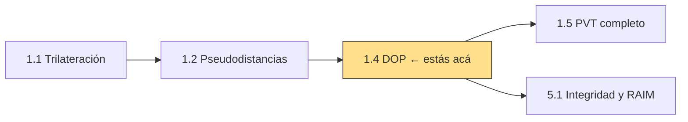
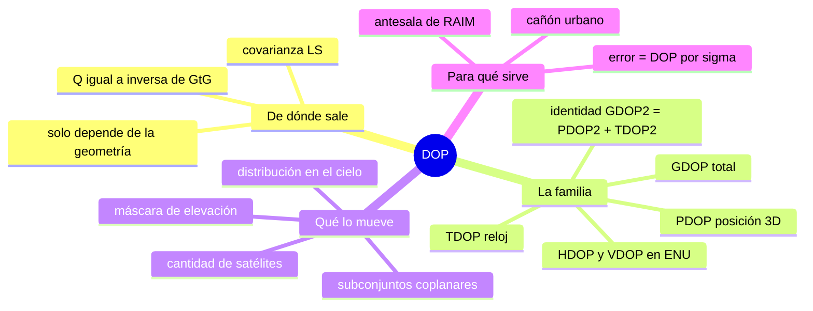
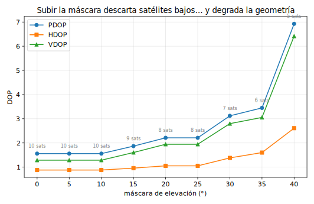
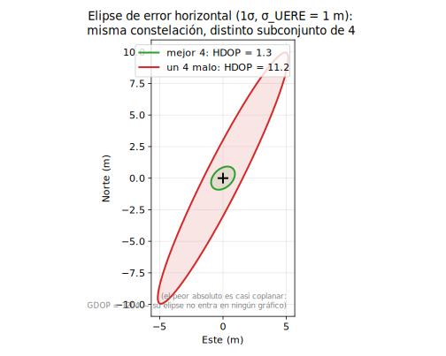
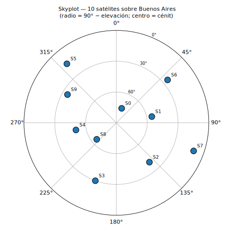

# Clase 1.4 — DOP: la geometría convertida en número

**Módulo 1 · Fundamentos de posicionamiento** · mapea a *Algorithms & Positioning* (JSNP)

| | |
|---|---|
| **Estado** | Nueva — formaliza lo que la clase 1.1 mostró empíricamente |
| **Tiempo estimado** | 3–4 h (teoría 60' · lab 75–90' · ejercicios 45' · caso y cierre 30') |
| **Entregables** | lab con auto-tests en verde · inversa 3×3 a mano cotejada · bitácora completada |

---

## 1. Objetivos de aprendizaje

- [ ] Derivar el DOP desde la covarianza de mínimos cuadrados: $Q = (G^\top G)^{-1}$.
- [ ] Calcular y **distinguir** GDOP, PDOP, HDOP, VDOP y TDOP (y demostrar GDOP² = PDOP² + TDOP²).
- [ ] Explicar por qué la componente vertical es siempre la peor.
- [ ] Predecir el efecto de la máscara de elevación y de la cantidad/distribución de satélites.
- [ ] Verificar por Monte Carlo que **error ≈ DOP × σ** (el DOP no es una abstracción).

## 2. Ubicación en el path

**Prerrequisitos:** 1.1 (factor geométrico) ✓ · 1.2 (matriz G) ✓



La matriz $(G^\top G)^{-1}$ que acá se llama "DOP" es la misma que en el módulo 5 alimenta los niveles de protección de RAIM: la integridad **es** geometría más estadística.

## 3. Mapa conceptual



## 4. Teoría

### 4.1 De la covarianza al DOP

Si las pseudodistancias tienen ruido independiente de desvío $\sigma$ (el *UERE*), la solución de mínimos cuadrados de la clase 1.2 hereda covarianza

$$\mathrm{cov}(\hat{\mathbf{x}}) = \sigma^2 \, (G^\top G)^{-1} = \sigma^2 Q$$

$Q$ **no depende del ruido**: solo de dónde están los satélites. Los DOP son raíces de trazas parciales de $Q$:

$$\text{GDOP} = \sqrt{\mathrm{tr}(Q)}, \quad \text{PDOP} = \sqrt{Q_{11}+Q_{22}+Q_{33}}, \quad \text{TDOP} = \sqrt{Q_{44}}$$

y de la definición sale directo que $\text{GDOP}^2 = \text{PDOP}^2 + \text{TDOP}^2$ (ejercicio E2).

### 4.2 HDOP y VDOP: hay que rotar

$Q$ vive en ECEF; "horizontal" y "vertical" son conceptos locales. Se rota el bloque de posición a ENU con $R$ (filas: este, norte, arriba):

$$Q_{\text{ENU}} = R\, Q_{[1:3,1:3]}\, R^\top, \qquad \text{HDOP} = \sqrt{Q_{ee}+Q_{nn}}, \quad \text{VDOP} = \sqrt{Q_{uu}}$$

**VDOP > HDOP siempre**: los satélites solo están *arriba* del horizonte. En horizontal las líneas de vista rodean al receptor; en vertical todas empujan desde el mismo semiespacio y nada "sostiene desde abajo". En el escenario del lab: HDOP 0.879, VDOP 1.286 (cociente 1.46).

### 4.3 La máscara de elevación: un trade-off

Los satélites bajos traen más multicamino y más retardo atmosférico (se ve en el módulo de propagación)… pero también son los que **abren** la geometría. Subir la máscara limpia mediciones sucias a costa de degradar el DOP. En el lab, pasar la máscara de 10° a 45° sube el PDOP de 1.56 a 7.83.



> **Para completar** (respuestas en [`soluciones.md`](soluciones.md)):
>
> - B1. El DOP depende de la `______` de los satélites y **no** del `______` de medición.
> - B2. El error esperado se estima como `______` × `______`.
> - B3. El peor caso geométrico es cuando las líneas de vista son casi `______`: $G^\top G$ se vuelve casi `______`.

### 4.4 El tetraedro y los subconjuntos

Con 4 satélites, la mejor geometría es un satélite alto + tres bajos bien repartidos en azimut (un tetraedro con el receptor adentro). En el lab, el mejor subconjunto de 4 (de los $\binom{10}{4}=210$) da GDOP 2.30 y es exactamente eso: el/75° + tres de 30°/15°/10° separados. El peor da GDOP **1204** — cuatro líneas de vista casi coplanares. La redundancia protege: con los 10 satélites, GDOP 1.77.



## 5. Laboratorio

**Archivos**

```
lab/lab_dop_TODO.py / .ipynb        ← esqueleto con auto-tests
lab/soluciones/lab_dop_solucion.py
data/escenario_10sats.json          ← 10 satélites sobre Buenos Aires
data/generar_escenario_10sats.py
```

**Escenario:** receptor en Buenos Aires, 10 satélites repartidos (elevaciones 10°–75°), mismo sesgo de reloj de la clase 1.2 (+2.5 ms). El skyplot:



**Validación cuantitativa**

| Check | Criterio | Resultado de referencia |
|---|---|---|
| DOPs del escenario (10 sats) | identidad GDOP²=PDOP²+TDOP² exacta | GDOP **1.770** · PDOP **1.558** · TDOP **0.839** |
| ENU | VDOP > HDOP | HDOP **0.879** · VDOP **1.286** |
| Monte Carlo (300 corridas, σ=1 m) | cociente RMS/(PDOP·σ) entre 0.6 y 1.6 | **1.00** — clavado |

**Experimentos guiados**

1. **Barrido de máscara** (0°→45°): armá la tabla PDOP/HDOP/VDOP. Referencia: 1.56/0.88/1.29 con 10 sats → 7.83/3.78/6.86 con máscara 45° (quedan 4). ¿Cuál se degrada más rápido?
2. **Mejor y peor subconjunto de 4** entre los 210 posibles. Referencia: mejor GDOP 2.30 (tetraedro: sats en el 75°, 30°, 15°, 10° repartidos); peor ≈ 1204 (casi coplanares). Dibujalos en el skyplot.
3. **Monte Carlo**: verificá que el error RMS 3D real ≈ PDOP × σ. Referencia: 1.56 m vs 1.56 m. Anotá tu cociente en la bitácora.

## 6. Ejercicios sin código

Soluciones paso a paso en [`soluciones.md`](soluciones.md).

### 6.1 Numéricos a mano

**E1 — La inversa 3×3 de la clase 1.2.** Tomá la $G$ del ejercicio a mano de la 1.2 (2D + reloj):

$$G = \begin{pmatrix} -0.6 & -0.8 & 1 \\ 0.8 & -0.6 & 1 \\ 0 & 1 & 1 \end{pmatrix}$$

a) Calculá $G^\top G$ (resultado limpio: diagonal 1, 2, 3).
b) Su determinante — atajo: para $G$ cuadrada, $\det(G^\top G) = \det(G)^2$, y $\det(G)$ ya lo conocés de la 1.2.
c) La diagonal de $(G^\top G)^{-1}$ por cofactores, y con eso "GDOP", "PDOP" (2D) y TDOP.

**E2 — La identidad.** Demostrá en dos líneas que $\text{GDOP}^2 = \text{PDOP}^2 + \text{TDOP}^2$. ¿Vale también HDOP² + VDOP² = PDOP²?

**E3 — Del DOP al presupuesto de error.** Con σ_UERE = 5 m y HDOP = 1.2: ¿error horizontal 1σ? ¿Y el valor "95%" con la regla práctica de duplicar?

### 6.2 Estimación tipo Fermi

**F1.** ¿Cuántos satélites GPS ves típicamente a cielo abierto (de ~31 operativos)? ¿Y sumando Galileo + GLONASS + BeiDou?
**F2.** ¿Por qué el error vertical de un GNSS es típicamente 1.5–2× el horizontal? Argumentalo sin fórmulas.
**F3.** Cuatro satélites, todos a menos de 5° del cénit: ¿qué le pasa al DOP y por qué? (Pensá en las columnas de $G$.)

### 6.3 Conceptuales (autoevaluación)

<details><summary><b>C1.</b> ¿Qué unidades tiene el DOP y qué multiplica?</summary>

Es **adimensional**: un amplificador puro de geometría. Multiplica al σ del error de medición (UERE) para dar el error de posición esperado: error ≈ DOP × σ.
</details>

<details><summary><b>C2.</b> ¿Puede el DOP ser menor que 1?</summary>

Sí. Con redundancia (muchos satélites bien repartidos) el promediado de mediciones puede dejar el error de posición por debajo del ruido de un rango individual. En el lab: HDOP = 0.88 con 10 satélites.
</details>

<details><summary><b>C3.</b> ¿Por qué GPS+Galileo mejora tanto en la ciudad?</summary>

En un cañón urbano solo ves una franja de cielo. Con una sola constelación quizás quedan 4–5 satélites casi alineados con la calle (geometría pésima cross-street). Duplicar constelaciones puebla esa franja: más líneas de vista, mejor condicionada $G^\top G$. No es (solo) redundancia: es geometría.
</details>

<details><summary><b>C4.</b> ¿Subir la máscara de elevación mejora la precisión?</summary>

Depende: descarta mediciones con más multicamino y retardo atmosférico (baja el σ efectivo), pero degrada el DOP. La respuesta correcta de ingeniería: es un trade-off que se decide mirando el producto DOP × σ, no cada factor por separado.
</details>

<details><summary><b>C5.</b> ¿Qué tiene que ver el DOP con la integridad (módulo 5)?</summary>

Los niveles de protección de RAIM se construyen sobre la misma $(G^\top G)^{-1}$: la capacidad de detectar y acotar una falla depende de la geometría. Un DOP malo no solo agranda el error: te deja ciego para detectar mediciones falladas — incluidas las inyectadas por un spoofer.
</details>

### 6.4 Preguntas tipo entrevista

1. *"Un cliente dice: 'mi receptor tiene precisión de 2 metros'. ¿Qué tres preguntas le hacés antes de creerle?"*
2. *"¿Por qué agregar Galileo a un receptor GPS mejora más en Buenos Aires centro que en el campo?"*
3. *"Defendé subir la máscara de elevación de 5° a 15°… y ahora defendé lo contrario."*

### 6.5 Mini-simulacro (8 min, sin apuntes)

1. Definí GDOP, PDOP y TDOP y escribí la identidad que los une. **[1 pt]**
2. ¿Por qué VDOP > HDOP siempre? **[1 pt]**
3. σ_UERE = 4 m y PDOP = 2: ¿error 3D RMS esperado? **[1 pt]**
4. V/F + justificación: *"subir la máscara de elevación siempre mejora la exactitud"*. **[1 pt]**
5. ¿Qué demostró el Monte Carlo del lab sobre el DOP? **[1 pt]**

Aprobado: **≥ 4/5**. Respuestas en `soluciones.md`.

## 7. Figuras

`python img/make_figures.py` regenera las tres (todas usan `data/`).

## 8. Caso real — el cañón urbano

En el centro de una ciudad, los edificios tapan el cielo salvo una franja a lo largo de la calle. Consecuencias medibles: los satélites visibles quedan casi **coplanares** (alineados con la calle), el HDOP *cross-street* se dispara y el receptor "salta" de vereda — el clásico del GPS del auto que te ubica en la calle paralela. El VDOP se destruye aún más rápido. Por eso los teléfonos modernos son multi-GNSS (GPS+Galileo+GLONASS+BeiDou): en esa franja estrecha de cielo, cuadruplicar candidatos es la única forma de recuperar geometría.

Preguntas (respuestas en `soluciones.md` §Caso): ¿en qué dirección es peor el error y por qué? ¿qué ayuda más: más satélites de la misma constelación o multi-constelación? ¿qué señal de alerta operativa da un DOP que se dispara de golpe? (adelanto del módulo 6: un salto anómalo de geometría/residuos es también un indicador de spoofing).

## 9. Glosario ES/EN

| Español | English | Nota |
|---|---|---|
| dilución de la precisión | dilution of precision (DOP) | amplificador geométrico |
| GDOP / PDOP / TDOP | idem | total / posición 3D / tiempo |
| HDOP / VDOP | idem | requieren rotar a ENU |
| máscara de elevación | elevation mask / cutoff angle | típ. 5°–15° |
| gráfico de cielo | skyplot | polar: az, 90°−el |
| elipse de error | error ellipse | autovalores del bloque E-N de Q |
| UERE | user equivalent range error | el σ que multiplica al DOP |
| matriz de cofactores | cofactor matrix Q | $(G^\top G)^{-1}$ |

## 10. Cheat sheet

$$Q = (G^\top G)^{-1}, \quad \text{GDOP} = \sqrt{\mathrm{tr}\,Q}, \quad \text{PDOP} = \sqrt{\textstyle\sum_{i=1}^{3} Q_{ii}}, \quad \text{TDOP} = \sqrt{Q_{44}}$$

- $\text{GDOP}^2 = \text{PDOP}^2 + \text{TDOP}^2$ · $\text{PDOP}^2 = \text{HDOP}^2 + \text{VDOP}^2$ (en ENU).
- error esperado ≈ DOP × σ_UERE (RMS, 1σ) · regla práctica 95% ≈ 2×.
- HDOP/VDOP: rotar $Q_{[1:3,1:3]}$ a ENU antes de leer la diagonal.
- $G$ cuadrada: $\det(G^\top G) = \det(G)^2$ — atajo para la inversa a mano.
- Reglas rápidas: cielo abierto multi-GNSS HDOP ~0.6–1; 4 sats coplanares → DOP → ∞.

## 11. Errores comunes

- Reportar "precisión" sin decir DOP ni 1σ/95%: el mismo receptor da 2 m o 15 m según la geometría.
- Calcular HDOP/VDOP directamente sobre la diagonal ECEF sin rotar a ENU.
- Creer que el DOP depende del ruido o del receptor: es geometría pura.
- Suponer que más satélites baja el DOP linealmente (rendimientos decrecientes: de 4 a 10 sats acá, GDOP 2.30 → 1.77).
- Subir la máscara "para limpiar multicamino" sin mirar cuánto se degrada la geometría.

## 12. Referencias quirúrgicas

- Sanz Subirana et al., *GNSS Data Processing Vol. I* (ESA TM-23/1): cap. 6, sección de DOP y precisión.
- R. Langley, *"Dilution of Precision"*, GPS World (mayo 1999) — el tutorial clásico, corto y quirúrgico.
- Kaplan & Hegarty, capítulo de *performance* de GPS (presupuesto de error UERE × DOP).

## 13. Flashcards

[`flashcards_anki.csv`](flashcards_anki.csv) — 12 tarjetas. Mazo sugerido `GNSS::M1::1.4`.

## 14. Bitácora

[`bitacora.md`](bitacora.md) — completar al cerrar.

## 15. Rúbrica de cierre

- [ ] Blancos B1–B3 completados y cotejados.
- [ ] Auto-tests del lab en verde (identidad GDOP y valores de referencia).
- [ ] Experimentos 1–3 corridos; cociente Monte Carlo anotado en la bitácora.
- [ ] E1 (inversa 3×3) hecho **a mano** y cotejado contra la verificación numérica del lab.
- [ ] E2–E3 y F1–F3 en papel.
- [ ] Mini-simulacro ≥ 4/5 en ≤ 8 min.
- [ ] Flashcards importadas y primera pasada.
- [ ] Pregunta de entrevista 1 respondida en voz alta.

## 16. Próxima clase

**1.5 — PVT completo con datos reales**: RINEX de una estación real (RAMSAC/IGS), efemérides broadcast, correcciones de reloj y atmósfera — y tu solución comparada contra las coordenadas oficiales de la estación. Todo lo de 1.1–1.4, junto y con datos de verdad.
