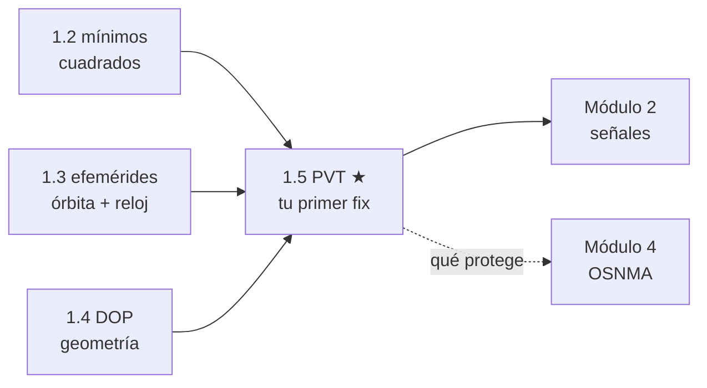

# Clase 1.5 — Tu primer fix: PVT con Galileo y datos reales

**Módulo 1 · Posicionamiento · ~4 h · cierre del módulo**

## Objetivos

- [ ] Leer pseudorangos reales (RINEX de observación) de una estación IGS
- [ ] Construir la combinación iono-free E1/E5a y justificar por qué elimina la ionósfera
- [ ] Aplicar las cuatro correcciones: reloj del satélite (+relatividad), tiempo de transmisión, Sagnac y troposfera
- [ ] Resolver posición + reloj del receptor con Gauss-Newton desde el centro de la Tierra
- [ ] Validar contra una coordenada oficial IGS y cerrar en ~2 m 3D

## ¿Dónde estamos?



Todo el módulo converge acá: las efemérides de la 1.3 te dan dónde está
cada satélite, el Gauss-Newton de la 1.2 resuelve el sistema, y el DOP de
la 1.4 explica la calidad. El resultado — tu posición a partir de señales
de satélites a 23 000 km — es exactamente lo que un spoofer quiere
falsificar y lo que OSNMA protege.

## Los datos

Estación **LPGS00ARG** (La Plata, DOMES 41510M001, FCAGLP/GFZ), receptor
JAVAD TRE_3, 2026-06-15. La observación es pública en BKG — sin RAMSAC ni
formularios:

```bash
cd data/raw/2026/166
curl -sO https://igs.bkg.bund.de/root_ftp/IGS/obs/2026/166/LPGS00ARG_R_20261660000_01D_30S_MO.crx.gz
python3 -c "import hatanaka; hatanaka.decompress_on_disk('LPGS00ARG_R_20261660000_01D_30S_MO.crx.gz')"
```

La coordenada del header (`APPROX POSITION XYZ`) es nuestra vara:
`(2780102.9896, −4437418.9149, −3629404.5253)`.

## Teoría (completá los blancos con el lab)

### 1. El pseudorango y su presupuesto de error

`P = ρ + c·δt_rx − c·δt_sat + I + T + ε`. Cada término es una clase:
ρ necesita la órbita (1.3); δt_sat viene del polinomio broadcast; δt_rx es
la cuarta incógnita; I y T son atmósfera; ε es ruido + multipath.

### 2. Iono-free: la ionósfera se autodelata

La ionósfera es **dispersiva**: retrasa ∝ 1/f². Con dos frecuencias,
`P_IF = (γ·P₁ − P₅)/(γ − 1)` con γ = (f₁/f₅)² = ______ la elimina
exactamente (a primer orden). El precio: el ruido se amplifica ~3×.
En LPGS medimos P₁ − P₅ de 1.7 a 3.9 m: esa es la iono del mediodía.

### 3. Por qué F/NAV acá (y I/NAV en la 1.3)

El reloj broadcast se refiere a una combinación concreta: el de **F/NAV
(DataSrc 258)** está definido para el usuario E1/E5a — nuestro caso — así
que no hace falta BGD. El de I/NAV (517) se refiere a E1/E5b. Un receptor
monofrecuencia sí necesita el BGD. Ahora se entiende por qué Galileo
transmite dos mensajes… y por qué OSNMA (que viaja en I/NAV) obliga a
manejar ambos con cuidado.

### 4. Las cuatro correcciones y su tamaño (medido en este lab)

| Corrección | Si la olvidás (época 12:00) | Por qué |
|---|---|---|
| Reloj sat (af0/af1/af2) | error 3D ≈ ______ km | af0 ~ms → c·δt ~10⁵ m |
| Sagnac | 32.5 m | la Tierra rota ω⊕·τ durante el vuelo (τ≈86 ms) |
| Troposfera | 8.58 m (sesgo **vertical**) | ~2.3 m cenitales, mapeo 1/sin(el) |
| Relatividad (excentricidad) | +0.04 m | −2√(μA)e·sinE/c²; e≈3e-4 → ~25 cm máx |

La sorpresa Galileo: la relatividad de excentricidad es casi invisible
**porque las órbitas son casi perfectamente circulares** (en GPS, con
e hasta 0.02, llega a ±14 m). Ojo: E14/E18 (e≈0.16) son la excepción.

### 5. El solver

Gauss-Newton con 4 incógnitas (x, y, z, c·δt_rx), jacobiano = líneas de
vista + columna de unos (1.2). Converge desde el **centro de la Tierra**
en ____ iteraciones. Dos pasadas: la primera sin tropo (no sabés tu
elevación si no sabés dónde estás), la segunda con tropo + cutoff 10°.

## Lab guiado

1. Datos: 0.4 + la observación de LPGS (arriba).
2. `lab/lab_pvt_TODO.ipynb` — completá los TODO (GAMMA, FNAV, relatividad,
   Sagnac, tropo, jacobiano, P_IF).
3. Solución de referencia en `lab/soluciones/`.
4. Figuras: `python3 img/make_figures.py`.

**Tabla de validación** (LPGS, 2026-06-15, 8 SVs E07/19/21/26/27/29/30/33):

| Chequeo | Valor esperado |
|---|---|
| Pasada 1 (sin tropo), época 12:00 | U = **+8.49 m** (el sesgo troposférico) |
| Pasada 2, época 12:00 | E=−0.21 N=+0.81 U=−1.76 → **3D 1.95 m** |
| Reloj receptor | −214.320 µs (−64 251.5 m) |
| Residuos RMS | 1.02 m (≈ el error orbital broadcast de la 1.3) |
| Serie 12:00–13:00 (121 épocas) | RMS E/N/U = 0.72/0.75/1.45 m · 3D **1.78 m** |
| Cascada | 926 km / 32.5 / 8.58 / 1.99 / **1.95 m** |

## Ejercicios a mano

**E1.** El fix estima c·δt_rx = −64 251.5 m. Convertilo a µs y explicá por
qué este error enorme **no contamina** la posición.

**E2.** Sagnac de bolsillo: τ ≈ 86 ms y la velocidad tangencial en La
Plata es ω⊕·R⊕·cos(34.9°) ≈ 380 m/s. Estimá v·τ y comparalo con los
32.5 m medidos.

**E3.** Relatividad máxima 2√(μA)·e/c²·c: calculala para Galileo
(e=3.4e-4) y GPS (e=0.02). ¿Cuál receptor puede "olvidarla" a nivel 10 m?

## Estimaciones Fermi

**F1.** ¿Cuántos km de error por cada ms de reloj de satélite ignorado?
Verificá contra los 926 km medidos (af0 de E19 ≈ 3.03 ms).

**F2.** Tropo cenital 2.3 m y E26 a 14° de elevación: estimá su retardo
con el mapeo 1/sin y explicá el sesgo U=+8.5 m de la pasada 1.

**F3.** A 30 s por época y ~8 Galileo visibles, ¿cuántos pseudorangos
procesa LPGS por día solo de Galileo E1+E5a?

## Preguntas conceptuales

**C1.** ¿Por qué la iono se elimina con dos frecuencias y la tropo no?
**C2.** ¿Por qué el reloj del receptor se estima en vez de modelarse?
**C3.** ¿Qué contiene el residuo RMS de 1.02 m? Armá el presupuesto.
**C4.** ¿Por qué la pasada 1 clava la horizontal pero no la vertical?
**C5.** Con 8 satélites y 4 incógnitas sobran 4 ecuaciones: ¿para qué
sirven esos grados de libertad (pista: integridad, módulo 6)?

## Pregunta de entrevista

*"Su fix tiene 1 m horizontal pero +8 m de sesgo vertical constante.
¿Diagnóstico y arreglo?"* — Guía: tropo no modelada (afecta ~igual a
todos los satélites → se proyecta en U y en el reloj), modelo cenital +
mapeo, o estimar el retardo cenital como 5ª incógnita.

## Mini-simulacro (15 min)

1. Escribí la cadena completa: P₁,P₅ → P_IF → t_tx → órbita → Sagnac →
   reloj sat → tropo → GN. Orden de magnitud de cada corrección.
2. V/F: "Sagnac depende de la dirección del satélite respecto de la
   rotación terrestre". Justificá con la rotación ω⊕·τ.
3. P₁=25 000 000.0 y P₅=25 000 003.0: calculá P_IF y la iono en E1.
4. ¿Por qué usamos F/NAV y no I/NAV en este lab, si OSNMA firma I/NAV?

## Figuras

| | |
|---|---|
| `img/fig1_serie_enu.svg` | Error E/N/U durante 1 h, época por época |
| `img/fig2_dispersion.svg` | Nube horizontal vs coordenada oficial (círculos 1 y 2 m) |
| `img/fig3_cascada.svg` | Qué pasa si "olvidás" cada corrección (log: de 926 km a 1.95 m) |

## Caso real — 1-2 de mayo de 2000: la noche en que el GPS civil mejoró 10×

Hasta esa noche, el DoD degradaba deliberadamente el reloj broadcast para
usuarios civiles (**Selective Availability**): ~100 m de error típico. A
las 04:05 UTC del 2 de mayo la apagaron y el error civil cayó a ~10 m
instantáneamente — el "salto" más famoso de la historia GNSS, visible en
cualquier serie temporal de la época. Es tu fig. 3 hecha política: quien
controla el reloj y la efeméride controla tu posición. Galileo nació, en
parte, como respuesta europea a esa dependencia; y la versión moderna del
problema no es degradación anunciada sino **spoofing** — contra eso,
OSNMA (módulo 4) y RAIM/integridad (módulo 6).

## Glosario

**PVT** posición-velocidad-tiempo · **pseudorango** distancia medida,
contaminada por relojes y atmósfera · **iono-free** combinación de dos
frecuencias que cancela la ionósfera · **Sagnac** corrección por rotación
terrestre durante el vuelo de la señal · **ENU** este-norte-arriba local ·
**cutoff** elevación mínima aceptada · **F/NAV** mensaje Galileo E5a
(reloj para el usuario E1/E5a) · **SA** Selective Availability.

## Cheat sheet

```
γ = (1575.42/1176.45)² = 1.7933 · P_IF = (γP₁ − P₅)/(γ−1)
t_tx = t_rx − P/c (iterar) · Sagnac: rotar ECEF ω⊕·τ (≈32 m)
reloj sat: af0 + af1·dt + af2·dt² − 2√(μA)e·sinE/c²
tropo mínima: 2.3·e^(−h/7160)/sin(el) · GN: J = [−LOS | 1]
LPGS 2026-06-15: 3D 1.95 m (época) · 1.78 m RMS (1 h)
```

## Errores comunes

1. Evaluar la órbita en t_rx en vez de t_tx (~80 ms → ~300 m along-track).
2. Olvidar Sagnac (32 m) o aplicarlo con el signo cambiado.
3. Usar el reloj I/NAV con la combinación E1/E5a (BGD mal contabilizado).
4. Restar la tropo con la elevación desde el centro de la Tierra (pasada 1
   no lleva tropo: primero hay que saber más o menos dónde estás).
5. Mezclar unidades: af0 en s, P en m — c es tu amigo.
6. Cutoff demasiado bajo: E26 a 14° ya aporta 9+ m de tropo.

## Referencias

- Galileo OS SIS ICD v2.1 — §5.1.9 (reloj, BGD), F/NAV vs I/NAV
- GPS IS-200 — §20.3.3.3.3 (relatividad, mismo tratamiento)
- Misra & Enge, *GPS: Signals, Measurements, and Performance*, cap. 6
- Kaplan & Hegarty, *Understanding GPS/GNSS*, cap. 10 (PVT)
- Anuncio del fin de SA (Casa Blanca, 1/5/2000) y series IGS del salto

## Para tu bitácora

Completá `bitacora.md` con tus números y compará con la tabla.
**Rúbrica**: ⭐ el TODO corre y el auto-test pasa · ⭐⭐ + explicás la
cascada completa y el sesgo vertical · ⭐⭐⭐ + repetís el fix con OTRA
estación argentina (CORD/UNSA/MGUE están en el mismo servidor) y comparás.

**Módulo 1 completo.** Próximo paso → **Módulo 2 (señales)**: bajamos del
mensaje a la portadora — correlación, C/N0, y los datasets IQ donde vive
el spoofing.
