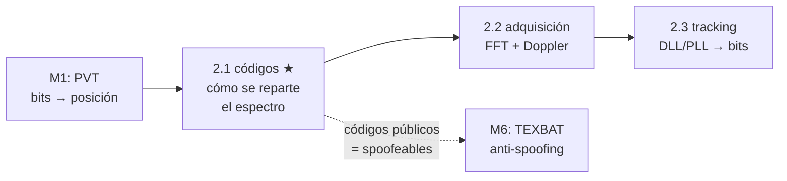

# Clase 2.1 — Códigos C/A: la matemática que reparte el espectro

**Módulo 2 · Señales y SDR · ~3 h**

## Objetivos

- [ ] Implementar los LFSR G1/G2 y generar los 32 códigos C/A de GPS
- [ ] Validar contra la tabla oficial del IS-GPS-200 (primeros 10 chips en octal)
- [ ] Verificar las propiedades Gold: pico 1023 y piso de tres valores {−65, −1, 63}
- [ ] Calcular ganancia de procesamiento y aislación entre satélites
- [ ] Entender por qué Galileo E1 eligió otro camino (códigos de memoria + CBOC)

## ¿Dónde estamos?



En el Módulo 1 usaste pseudorangos que el receptor te regaló hechos.
Este módulo abre esa caja: cómo se mide un pseudorango. El primer
ingrediente es el código — la "huella digital" de cada satélite — y su
propiedad central: correlaciona fuerte consigo mismo y débil con todo lo
demás. Sin eso no hay CDMA, no hay GPS, y tampoco hay spoofing barato.

## Los datos

**No hay.** Esta clase se genera a sí misma: los códigos salen de dos
polinomios y una tabla. La validación no necesita satélites — necesita
el IS-GPS-200. Que puedas fabricar la señal completa desde un documento
público es *el* dato de la clase (y el pie del caso real de abajo).

## Teoría (completá los blancos con el lab)

### 1. CDMA: todos gritan a la vez y igual se entienden

Los 32 satélites GPS transmiten **en la misma frecuencia** (L1,
1575.42 MHz). Se separan por código: cada uno modula con una secuencia
pseudoaleatoria propia, y el receptor correlaciona con la réplica del
satélite que busca. Los demás quedan ~24 dB abajo. La alternativa (FDMA,
una frecuencia por satélite) la usó GLONASS y complica el receptor.

### 2. LFSR: 10 flip-flops, período 1023

Un registro de desplazamiento realimentado con XOR recorre todos sus
estados no nulos si el polinomio es primitivo: 2¹⁰ − 1 = ______ estados.
G1 (`1+x³+x¹⁰`) y G2 (`1+x²+x³+x⁶+x⁸+x⁹+x¹⁰`) son dos de esas
m-secuencias. El estado todos-ceros queda excluido (se quedaría clavado).

### 3. Familia Gold: interferencia con garantía escrita

El producto de dos m-secuencias desfasadas da los códigos **Gold**: la
correlación cruzada entre cualquier par toma exactamente **tres
valores**: {−t, −1, t−2} con t = 2⁽ⁿ⁺²⁾ᐟ² + 1 = ______ para n = 10. Ese
es el contrato: ningún desfase de ningún otro PRN te va a interferir con
más de 65/1023. El "phase selector" (dos taps de G2 XOReados) elige qué
desfase de G2 usa cada PRN — por eso una tabla de 32 pares define toda
la constelación.

### 4. Del código a la señal: BPSK, y el desvío de Galileo

A 1.023 Mcps cada chip dura ~977.5 ns → ______ m de "regla". El espectro
BPSK es un sinc² con nulos a ±1.023 MHz. Galileo E1 usa los mismos
1.023 Mcps pero: códigos **de memoria** (4092 chips, 4 ms, optimizados
por búsqueda — no hay LFSR que los genere), un **canal piloto** E1-C sin
datos para poder integrar largo, y modulación **CBOC(6,1,1/11)** que
parte la energía en dos lóbulos (fig. 3) para convivir con GPS en la
misma banda y afinar el tracking.

### 5. Seguridad: la huella es pública

Todo lo que hiciste en este lab está en un PDF público — a propósito:
el servicio abierto se diseñó para que cualquiera lo reciba. El precio:
cualquiera lo puede **transmitir**. Un spoofer genera estos mismos chips
con fase y potencia elegidas. La respuesta criptográfica no es esconder
el código sino autenticar los datos (OSNMA, módulo 4) o cifrar parte del
código (ACAS sobre E6-C, PRS). Guardá esta idea: reaparece en el módulo 6.

## Lab guiado

1. `lab/lab_codigos_TODO.ipynb` — completá los TODO (salida y
   realimentaciones del LFSR, chips ±1, correlación circular por FFT).
2. Solución de referencia en `lab/soluciones/` (verifica además las 496
   parejas y exporta `data/resultados_2_1.json`).
3. Figuras: `python3 img/make_figures.py`.

**Tabla de validación:**

| Chequeo | Valor esperado |
|---|---|
| PRN1–5, primeros 10 chips (octal) | 1440 · 1620 · 1710 · 1744 · 1133 |
| Balance de cada código | 512 unos / 511 ceros |
| Autocorrelación en fase | **1023** |
| Autocorrelación fuera de fase y cruzadas | solo {−65, −1, 63} |
| Peor cruzada (496 parejas) | 65 → **−23.9 dB** |
| Ganancia de procesamiento | 10·log₁₀(1023) = **30.1 dB** |

## Ejercicios a mano

**E1.** ¿Por qué un LFSR de 10 etapas con polinomio primitivo tiene
período exactamente 1023 y no 1024? ¿Qué pasaría si arrancara en
todos-ceros?

**E2.** Con pico 1023 y peor cruzada 65: calculá la aislación en dB. Un
transmisor "vecino" ¿cuántas veces más potente tiene que llegar para que
su cruzada empate tu pico? (Este es el problema **near-far**.)

**E3.** A 1.023 Mcps, ¿cuántos metros mide un chip? ¿Y por qué el
receptor logra medir el pseudorango con ~1 m si su regla es de ~300 m?
(Pista: el pico de correlación tiene forma de triángulo — clase 2.3.)

## Estimaciones Fermi

**F1.** El mensaje de navegación va a 50 bps sobre chips de 1.023 Mcps:
¿cuántos chips (y cuántas repeticiones completas del código) hay dentro
de un bit?

**F2.** La señal C/A llega a ~−130 dBm y el piso térmico en 2 MHz es
~−111 dBm: la señal está ~19 dB *bajo* el ruido. ¿Alcanza la ganancia de
procesamiento para sacarla a flote? ¿Con cuánto margen?

**F3.** Generar los 32 códigos son ~33 000 pasos de LFSR. Los códigos de
memoria de Galileo (50 × 4092 chips) no se generan: se *eligieron* por
búsqueda computacional. ¿Qué ganás eligiendo en vez de generando, y qué
perdés?

## Preguntas conceptuales

**C1.** ¿Por qué la correlación cruzada de códigos Gold toma *solo tres*
valores y no un continuo tipo ruido?
**C2.** ¿Qué rol cumple el estado inicial todos-unos? ¿Importa?
**C3.** ¿Por qué la correlación del lab es *circular* y qué tiene que
ver la FFT?
**C4.** ¿Para qué quiere Galileo un canal piloto sin datos (E1-C)?
**C5.** Si los códigos son públicos, ¿qué protege exactamente OSNMA y
qué seguiría desprotegido aun con OSNMA perfecto?

## Pregunta de entrevista

*"¿Cómo pueden 32 satélites transmitir en la misma frecuencia sin
pisarse?"* — Guía: CDMA, familia Gold con cruzada acotada (−24 dB),
ganancia de procesamiento 30 dB al correlacionar 1023 chips, y el límite
real del esquema: near-far (por eso un jammer barato funciona).

## Mini-simulacro (15 min)

1. Dibujá el LFSR G1 (10 etapas, taps 3 y 10) y calculá a mano los
   primeros 3 chips de salida desde todos-unos.
2. V/F: "existe un desfase donde dos C/A distintos correlacionan a 0".
3. El pico vale 1023 y la peor cruzada 65: ¿aislación en dB?
4. ¿Por qué el piloto E1-C mejora la sensibilidad del receptor?

## Figuras

| | |
|---|---|
| `img/fig1_autocorrelacion.svg` | El pico de 1023 y el piso de tres valores |
| `img/fig2_cruzada.svg` | Otro PRN parece ruido: histograma {−65,−1,63} |
| `img/fig3_espectro.svg` | BPSK(1) vs BOC(1,1): dónde vive la energía |

## Caso real — junio 2013: un yate de 65 m obedece a una valija

El equipo de Todd Humphreys (UT Austin) subió a bordo del *White Rose of
Drachs* en el Mediterráneo un spoofer de ~US$ 2000 construido en el
laboratorio. Transmitiendo réplicas C/A — estos mismos chips que acabás
de generar, con fase y potencia controladas — capturaron los lazos de
tracking del receptor de a bordo sin ninguna alarma, y el piloto
automático fue corrigiendo hacia un rumbo paralelo falso. El barco giró
físicamente; el puente veía todo "normal". Fue la demo pública que sacó
al spoofing del terreno teórico. La cadena completa del ataque — y sus
contramedidas — es el módulo 6 (TEXBAT es del mismo laboratorio).

## Glosario

**PRN** pseudorandom noise, el código y por extensión el satélite ·
**LFSR** registro de desplazamiento con realimentación lineal ·
**m-secuencia** secuencia de período máximo 2ⁿ−1 · **Gold** familia con
cruzada tres-valuada · **chip** un "bit" del código (sin información) ·
**CDMA** acceso múltiple por división de código · **BOC** modulación con
subportadora binaria · **CBOC** BOC compuesta de E1 (6,1,1/11) ·
**piloto** canal sin datos para integración larga · **near-far** un
transmisor cercano tapa a los lejanos.

## Cheat sheet

```
G1 = 1+x³+x¹⁰ · G2 = 1+x²+x³+x⁶+x⁸+x⁹+x¹⁰ · semilla: todos-unos
salida = G1[10] ⊕ G2[s1] ⊕ G2[s2]  (tabla de 32 pares)
período 2¹⁰−1 = 1023 · PRN1 empieza 1440₈
Gold: {−65, −1, 63} · t = 2⁽¹⁰⁺²⁾ᐟ² + 1 = 65
Gp = 10·log₁₀(1023) = 30.1 dB · aislación = 20·log₁₀(65/1023) = −23.9 dB
chip = c/1.023 MHz = 293.1 m · código = 1 ms = 299.8 km
```

## Errores comunes

1. Indexar los taps desde 0: la "etapa 3" del estándar es `g[2]`.
2. Semilla incorrecta: los dos registros arrancan en **todos-unos**.
3. XOR sobre chips ±1: el XOR es de **bits**; en ±1 el equivalente es el
   producto.
4. Correlación *lineal* (np.correlate) donde va la **circular**: el
   código es periódico.
5. Olvidar `round()` antes de comparar: la IFFT devuelve floats.
6. Buscar "correlación 0" entre PRNs: no existe — el set es {−65,−1,63}.

## Referencias

- IS-GPS-200 (rev. actual) — §3.3.2.3 y tabla 3-Ia (C/A, selectores, octales)
- Galileo OS SIS ICD v2.1 — §3.1 (E1 CBOC) y anexo C (códigos de memoria)
- Gold, R. (1967), *Optimal binary sequences for spread spectrum multiplexing*
- Misra & Enge, cap. 2 · Kaplan & Hegarty, cap. 4 (señales)
- Bhatti & Humphreys (2017), *Hostile control of ships via false GPS signals*

## Para tu bitácora

Completá `bitacora.md` con tus números y compará con la tabla.
**Rúbrica**: ⭐ el TODO corre y el auto-test pasa · ⭐⭐ + explicás
near-far y el porqué de los tres valores · ⭐⭐⭐ + medí la correlación
**parcial** (primeros 100 chips): ¿sigue el piso en tres valores? ¿qué le
pasa al margen? — ese deterioro es el puente a la adquisición (2.2).

Próximo paso → **Clase 2.2 (adquisición)**: buscar estos códigos dentro
de IQ real con FFT × grilla Doppler.
