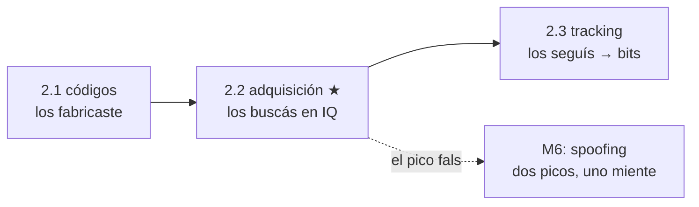

# Clase 2.2 — Adquisición: hallar un satélite en el ruido

**Módulo 2 · Señales y SDR · ~4 h**

## Objetivos

- [ ] Entender la adquisición como una búsqueda 2D: desfase de código × Doppler
- [ ] Implementar PCPS (Parallel Code Phase Search) con una sola FFT por Doppler
- [ ] Adquirir GPS y Galileo sobre **capturas IQ reales** y validar contra gnss-sdr
- [ ] Interpretar la función de ambigüedad (CAF) y la métrica de detección
- [ ] Hacer un sky-search a ciegas: descubrir qué satélites hay en una captura

## ¿Dónde estamos?



La 2.1 te dio la réplica; acá la usás como "plantilla" para encontrar la
señal enterrada ~19 dB bajo el ruido. La adquisición responde dos
preguntas de golpe: **en qué fase de código** está el satélite (→
pseudorango grueso) y **a qué Doppler** (→ velocidad relativa, y el
tuneo fino que necesita el tracking de la 2.3). En seguridad, la
adquisición es donde un spoofer *planta* su pico: entender la CAF es
entender qué mira un detector anti-spoofing.

## Los datos

Tres capturas oficiales de gnss-sdr (chicas, bajables por HTTP):

```bash
python3 tools/fetch_iq.py   # baja las 3 a data/raw/iq/
```

| Archivo | Qué tiene | Verdad (de los tests de gnss-sdr) |
|---|---|---|
| `GPS_L1_CA_ID_1_Fs_4Msps_2ms.dat` | GPS L1 C/A, 2 ms | PRN1: delay 524, +1680 Hz |
| `Galileo_E1_ID_1_Fs_4Msps_8ms.dat` | Galileo E1, 8 ms | SV1: delay 2920, −632 Hz |
| `GSoC_CTTC_capture_2012_07_26_4Msps_4ms.dat` | cielo real (CTTC) | varios SVs — sky-search |

Formato: `gr_complex` = float32 I/Q intercalado, banda base, fs = 4 Msps.

## Teoría (completá los blancos con el lab)

### 1. La incógnita doble

Adquirir = encontrar el par (τ, f_D) que alinea la réplica con la señal.
τ es el **desfase de código** (0…1022 chips, resolución del pseudorango
inicial); f_D es el **Doppler** (hasta ±5 kHz para un receptor quieto,
más si te movés). Sin conocer τ no hay correlación; sin conocer f_D la
portadora residual te hace perder el pico en < 1 ms. Es una búsqueda en
un plano de ~1023 × ______ celdas.

### 2. PCPS: una FFT hace las 1023 fases de una

Para un f_D fijo, correlacionar en *todos* los desfases es una
correlación **circular** — y eso es un producto en frecuencia:
`corr = IFFT( FFT(x) · conj(FFT(réplica)) )`. Una FFT reemplaza 1023
productos punto. Barrés la grilla de Doppler por fuera y armás el plano
CAF. Costo: (n° de Doppler) FFTs en vez de 1023 × (n° Doppler)
correlaciones. Es *el* mismo truco de la 2.1, ahora como algoritmo.

### 3. La función de ambigüedad (CAF)

El plano |correlación|²(τ, f_D) tiene un pico agudo en el par correcto y
piso de ruido en el resto (fig. 1). En τ el pico es un **triángulo** de
base ±1 chip (fig. 2): por eso la adquisición ubica el código a ~½ chip
(~150 m) y hace falta el tracking (2.3) para bajar a metros. En f_D el
ancho es ~1/T_coh: integrar más tiempo afina el Doppler pero cuesta
cómputo y exige que no haya bits que den vuelta el signo.

### 4. Métrica de detección y C/N0

¿Hay satélite o es ruido? Se compara el pico contra el piso: pico/media,
o pico1/pico2. Si supera un umbral, adquirido. La altura del pico mapea
al **C/N0** (dB-Hz): ~35–50 en cielo abierto. Ese número es un observable
de seguridad — un spoofer suele llegar *más fuerte* que lo real (C/N0
sospechosamente alto) o genera un **segundo pico** que compite con el
auténtico (módulo 6).

### 5. Galileo: el pico que se desdobla

E1 usa CBOC: la subportadora BOC(1,1) parte el espectro (fig. 3 de la
2.1) y por lo tanto la autocorrelación tiene **lóbulos laterales** a
±½ chip además del central. La adquisición se vuelve "ambigua": hay que
elegir el lóbulo central y no engancharse a uno lateral. A 4 Msps sólo
representamos BOC(1,1) (la parte BOC(6,1) del CBOC se pierde: ~0.4 dB).
El código primario E1-B es **de memoria** (4092 chips) — lo leés de una
tabla, no de un LFSR (por eso `data/e1b_prn1.hex`).

## Lab guiado

1. `lab/lab_adquisicion_TODO.ipynb` — completá el remuestreo de la
   réplica y el núcleo PCPS (quitar Doppler → FFT → producto → IFFT).
2. Solución de referencia en `lab/soluciones/` (agrega Galileo E1-B con
   BOC y el sky-search de 32 PRN sobre la captura CTTC).
3. Figuras: `python3 img/make_figures.py`.

**Tabla de validación:**

| Chequeo | Valor esperado |
|---|---|
| GPS PRN1 — desfase de código | **524 muestras** |
| GPS PRN1 — Doppler | **+1680 Hz** (±½ grilla) |
| Galileo SV1 — desfase | **2920 muestras** |
| Galileo SV1 — Doppler | **−632 Hz** |
| Sky-search CTTC | los SVs presentes sobresalen ~10–50× del piso |
| Ancho del pico en código | base ±1 chip (triángulo) |

## Ejercicios a mano

**E1.** Grilla Doppler de ±5 kHz cada 500 Hz: ¿cuántas celdas Doppler?
Multiplicá por 1023 fases: ¿tamaño del espacio de búsqueda por satélite?

**E2.** Con paso Doppler de 500 Hz, ¿cuánta pérdida de pico hay en el peor
caso (satélite justo entre dos celdas)? (Pista: sinc del residuo × T_coh.)

**E3.** El pico de PRN1 está en 524 muestras a 4 Msps: pasalo a chips y a
metros de pseudorango. ¿Por qué es "grueso" y qué lo afina?

## Estimaciones Fermi

**F1.** Sky-search de 32 PRN × 41 celdas Doppler, FFTs de 4000 puntos:
¿órdenes de magnitud de operaciones? ¿Por qué A-GPS (mandar la lista de
satélites visibles y el Doppler aproximado por la red) acelera el TTFF?

**F2.** Un receptor quieto ve Doppler de hasta ~±5 kHz. ¿De dónde sale si
el usuario no se mueve? (Pista: los satélites sí, a ~3.9 km/s de velocidad
radial máxima.)

**F3.** Si integrás 1 ms coherente y la señal está a −19 dB SNR, ¿cuánto
tenés que integrar (coherente + no coherente) para un pico confiable a
umbral 2.5? Relacionalo con la Gp de 30 dB de la 2.1.

## Preguntas conceptuales

**C1.** ¿Por qué la correlación de la adquisición es *circular* y qué
pasaría si la captura fuera más corta que un período de código?
**C2.** ¿Qué diferencia hay entre integración coherente y no coherente, y
por qué no se puede integrar coherente indefinidamente?
**C3.** ¿Por qué Galileo E1 tiene lóbulos laterales en la autocorrelación
y GPS C/A no? ¿Qué riesgo introduce eso en la adquisición?
**C4.** ¿Cómo se traduce la altura del pico a C/N0 y por qué es un
observable útil contra spoofing?
**C5.** Un atacante planta un segundo pico más fuerte 300 m "más cerca".
¿Qué ve tu CAF y qué haría un detector que mira el plano completo?

## Pregunta de entrevista

*"Tenés una captura IQ y no sabés qué satélites hay. ¿Cómo los
encontrás?"* — Guía: PCPS por cada PRN, grilla Doppler ±5 kHz, FFT por la
fase de código, umbral sobre pico/piso; los presentes sobresalen. Es el
cold-start, y el costo (delay×Doppler×PRN) es la razón de ser de A-GPS.

## Mini-simulacro (15 min)

1. Escribí el pseudocódigo PCPS para un PRN: entradas, la FFT, el barrido
   Doppler, la decisión.
2. V/F: "con más tiempo de integración el pico Doppler se hace más
   angosto". Justificá.
3. Delay 524 @ 4 Msps → chips → metros.
4. ¿Por qué E1-B se guarda en tabla y C/A se genera con un LFSR?

## Figuras

| | |
|---|---|
| `img/fig1_caf_gps.svg` | Función de ambigüedad GPS: pico único en (524, +1680) |
| `img/fig2_corte_gps.svg` | Corte en el Doppler del pico: el triángulo de ±1 chip |
| `img/fig3_skysearch.svg` | Sky-search CTTC: métrica por PRN, los visibles en verde |

## Caso real — el arranque en frío y por qué tu teléfono "hace trampa"

Un receptor GPS sin ninguna ayuda (cold start) no sabe la hora precisa,
su posición ni qué satélites hay arriba: tiene que barrer las ~40 000
celdas (delay × Doppler) de *cada* PRN hasta encontrar los ~8 visibles,
descargar efemérides a 50 bps y recién ahí calcular. Eso son **decenas de
segundos a minutos** — el famoso "buscando señal". Por eso existe A-GPS:
la red celular le pasa la lista de satélites visibles y el Doppler
aproximado, y el receptor sólo confirma unas pocas celdas → fix en
segundos. El mismo atajo es un vector: si alguien inyecta una *asistencia*
falsa, dirige tu búsqueda. Y la adquisición es exactamente donde un
spoofer coloca su pico para que tu receptor lo tome por bueno — la
historia completa (y TEXBAT) es el módulo 6.

## Glosario

**adquisición** hallar (τ, f_D) inicial de un satélite · **PCPS** búsqueda
paralela en fase de código vía FFT · **CAF** cross-ambiguity function, el
plano correlación(τ, f_D) · **desfase de código** posición del código
(→ pseudorango) · **Doppler** corrimiento de frecuencia por velocidad
radial · **coherente/no coherente** integrar amplitud compleja / módulos ·
**C/N0** densidad de potencia portadora-a-ruido (dB-Hz) · **cold start**
arranque sin asistencia · **A-GPS** asistencia por red · **TTFF** time to
first fix.

## Cheat sheet

```
PCPS(f_D): corr = IFFT( FFT(x·e^{-j2πf_D t}) · conj(FFT(réplica)) )
plano CAF = apilar |corr|² sobre la grilla de f_D
GPS  @4Msps: 1 ms = 4000 muestras · 1 chip = 4000/1023 ≈ 3.91 muestras
verdad GPS PRN1: (524, +1680 Hz) · GAL SV1: (2920, −632 Hz)
métrica = pico/media · adquirido si > umbral (~2.5) · C/N0 ~35–50 dB-Hz
delay→metros: (524/4e6)·c = 39.3 km mod 300 km (ambigüedad de 1 ms)
```

## Errores comunes

1. Correlación lineal en vez de circular: el código es periódico.
2. Réplica sin remuestrear a 4 Msps (usar 1023 en vez de 4000 muestras).
3. Grilla Doppler muy gruesa: pico entre celdas → se pierde.
4. Olvidar `conj()` en la réplica → el pico aparece en el desfase espejo.
5. En Galileo, engancharse a un lóbulo lateral del BOC (±½ chip) como si
   fuera el central.
6. Leer el .dat como float32 real en vez de complex64 (I/Q intercalado).

## Referencias

- Borre et al., *A Software-Defined GPS and Galileo Receiver* (2007) — cap. 6
- gnss-sdr — tests de adquisición (delays/Doppler de referencia) y datasets
- Tsui, *Fundamentals of GPS Receivers: A Software Approach* — adquisición FFT
- Galileo OS SIS ICD v2.1 — E1 CBOC, códigos primarios de memoria
- Misra & Enge, cap. 11 (adquisición y seguimiento)

## Para tu bitácora

Completá `bitacora.md` con tus (τ, f_D) y compará con la tabla.
**Rúbrica**: ⭐ adquirís GPS PRN1 en (524, +1680) · ⭐⭐ + adquirís
Galileo E1-B y explicás los lóbulos del BOC · ⭐⭐⭐ + sky-search completo
de la captura CTTC: listá los SVs presentes y estimá su C/N0 relativo.

Próximo paso → **Clase 2.3 (tracking)**: enganchar el pico y seguirlo con
DLL + PLL para demodular los bits del mensaje de navegación.
