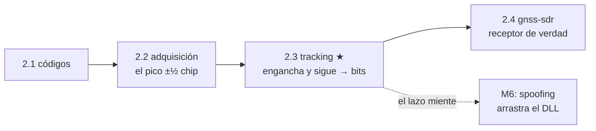

# Clase 2.3 — Tracking: seguir el satélite y leer sus bits

**Módulo 2 · Señales y SDR · ~4 h**

## Objetivos

- [ ] Entender el tracking como dos lazos realimentados: código (DLL) y
      portadora (PLL/Costas)
- [ ] Implementar los correladores Early / Prompt / Late y sus discriminadores
- [ ] Cerrar los lazos con filtros de 1º/2º orden y ver el NCO converger
- [ ] Demodular los bits del mensaje de navegación integrando 20 ms
- [ ] Encontrar el preámbulo LNAV `10001011` y resolver la ambigüedad de fase

## ¿Dónde estamos?



La adquisición (2.2) fue una foto: el pico con ½ chip de error, válido un
instante. El tracking es la película — mantiene el satélite enganchado ms
a ms mientras el Doppler cambia, afina el código a ~1% de chip (de ~150 m
a metros) y, con el prompt ya limpio, **lee el mensaje de navegación**:
efemérides, reloj, salud del satélite. En seguridad, el tracking es donde
un spoofer hace su trabajo fino: si logra que su réplica sea la que
"engancha" el DLL, arrastra tu estimación de código —y con ella tu
posición— sin que se dispare ninguna alarma de adquisición.

## La señal

No hay captura pública con un subframe completo (son 6 s = 300 bits; los
datasets de la 2.2 tienen 2–8 ms). Así que la clase es autocontenida:
generamos GPS L1 C/A con navegación conocida, Doppler y ruido a un C/N0
dado, y con ½ chip de error de código inicial (justo lo que deja la
adquisición). Es el enfoque estándar de Borre/Tsui: control total de la
verdad para validar tu receptor.

```bash
python3 clases/mod2-senales/clase2.3-tracking/lab/soluciones/lab_tracking_solucion.py
```

| Parámetro | Valor |
|---|---|
| PRN | 1 |
| Doppler | 1200 Hz |
| C/N0 | 48 dB-Hz |
| bits | 80 (preámbulo + relleno) |
| error de código inicial | 0.5 chips |

## Teoría (completá los blancos con el lab)

### 1. Dos lazos, dos incógnitas que se mueven

Después de adquirir, dos cosas derivan con el tiempo: la **fase de código**
(el satélite se acerca/aleja → el código llega antes/después) y la **fase
de portadora** (el Doppler cambia con la geometría). Un receptor corre dos
lazos por satélite: el **DLL** (Delay Lock Loop) sigue el código, el
**PLL** sigue la portadora. Ambos son de realimentación: miden un error,
lo filtran, corrigen un NCO, repiten.

### 2. Early / Prompt / Late: cómo medir el error de código

En cada ms se generan **tres** réplicas del código: Early (adelantada ½
chip), Prompt (centrada) y Late (atrasada ½ chip). Se correla cada una con
la señal. Si el Prompt está alineado, la correlación es máxima y
|E| ≈ |L|. Si el código se corrió, el triángulo de autocorrelación (2.2)
hace que una suba y la otra baje. El discriminador **early-late
normalizado** `½·(|E|−|L|)/(|E|+|L|)` convierte eso en el error en chips,
independiente de la amplitud. El Prompt, además, es la salida útil: lleva
los bits.

### 3. PLL Costas: seguir la portadora a pesar de los bits

La portadora se sigue con un PLL, pero hay un problema: el bit de datos
invierte la fase 180° cada 20 ms. Un PLL común se rompería. El **Costas**
usa el discriminador `atan(Q/I)` (o `Q·I`), que es **insensible al signo**:
0° y 180° dan el mismo error. Por eso engancha aunque los bits estén dando
vuelta la fase. El costo: una **ambigüedad de 180°** — no sabés si tus
bits son los verdaderos o los invertidos (se resuelve con el preámbulo).

### 4. Filtro de lazo y NCO

El error crudo es ruidoso; un **filtro de lazo** lo suaviza y fija el ancho
de banda (BW). Más BW → sigue dinámica más rápida pero deja pasar más
ruido; menos BW → más limpio pero más lento. El PLL suele ser de **2º
orden** (sigue rampas de Doppler sin error permanente); el DLL de **1º
orden** alcanza (asistido por la portadora, ya que el Doppler de código es
el de portadora ÷ 1540). La salida del filtro ajusta el **NCO**: la
frecuencia del de portadora, la **fase** del de código. Realimentar sobre
la fase de código (no sobre su frecuencia) mantiene el prompt alineado y su
amplitud estable — si tocás la frecuencia sin necesidad, el código deriva.

### 5. De prompts a bits: el observable final

Con el PLL enganchado, toda la energía del Prompt cae en **I** (Q≈0). Cada
bit dura 20 códigos (20 ms), así que **integrás 20 prompts I** y el signo
de la suma es el bit. Eso baja la tasa de 1000 correlaciones/s a 50 bits/s:
el mensaje de navegación. El primer paso para leerlo es sincronizar: buscar
el **preámbulo** `10001011` que abre cada subframe (palabra TLM).

### 6. C/N0 como observable de calidad y de seguridad

La relación |I|/|Q| tras el enganche (o la varianza del prompt) estima el
**C/N0** en vivo. Sirve para calidad (¿vale la pena usar este SV en el
PVT?) y para seguridad: un salto de C/N0, o dos correlaciones que compiten
por el mismo código, delatan interferencia. El **lift-off del DLL** —el
momento en que un pico spoofer más fuerte "se lleva" el lazo— es una firma
clásica de spoofing por arrastre (módulo 6).

## Lab guiado

1. `lab/lab_tracking_TODO.ipynb` — completá los correladores E/P/L, los
   dos discriminadores (Costas y early-late) y verificá el lazo cerrado.
2. Solución de referencia en `lab/soluciones/`.
3. Figuras: `python3 img/make_figures.py`.

**Tabla de validación:**

| Chequeo | Valor esperado |
|---|---|
| PLL: |Q|/|I| tras enganche | < 0.2 (energía en I) |
| PLL: freq del NCO | converge al Doppler real (1200 Hz) |
| DLL: error early-late | parte de ~0.5 chip → converge a 0 |
| Amplitud del prompt | estable (no derivar hacia abajo) |
| Preámbulo LNAV | detectado en bit 0, correlación ±8 |
| BER tras enganche | 0 % a C/N0 = 48 |

## Ejercicios a mano

**E1.** El Doppler de portadora es +1200 Hz. ¿Cuánto es el Doppler de
**código** (pista: dividí por la relación portadora/chip, 1575.42 MHz /
1.023 MHz ≈ 1540)? ¿Por qué el DLL puede ser lento?

**E2.** Un bit dura 20 ms = 20 códigos. Si integrás coherente los 20 ms,
¿cuánta ganancia de proceso extra ganás sobre 1 ms (en dB)? ¿Qué te lo
impide integrar 40 ms?

**E3.** El preámbulo son 8 bits. Con bits aleatorios, ¿cuál es la
probabilidad de un falso positivo (8 bits que casualmente den |corr|=8)
en una posición? ¿Por qué en la práctica se exige paridad + dos preámbulos
separados 6 s?

## Estimaciones Fermi

**F1.** Un receptor sigue 12 satélites, cada uno con 3 correladores × 4000
muestras/ms × 1000 ms/s. ¿Órdenes de magnitud de multiplicaciones por
segundo? ¿Por qué el tracking se hace en FPGA/ASIC en receptores de masa?

**F2.** El DLL afina el código de ½ chip (~150 m) a ~1% de chip. ¿A cuántos
metros de precisión de pseudorango equivale? Compará con el error que te
quedó en el PVT de la 1.5.

**F3.** Un avión a 900 km/h en aproximación: ¿cuánto Doppler de portadora
ve como máximo (velocidad radial × f/c)? ¿Alcanza un PLL de 18 Hz de BW
para seguirlo, o necesita ayuda de la inercial?

## Preguntas conceptuales

**C1.** ¿Por qué se usa un discriminador Costas y no un PLL común? ¿Qué
ambigüedad introduce y cómo se resuelve?
**C2.** ¿Por qué el discriminador early-late se **normaliza** por (E+L)?
¿Qué pasaría si no, cuando cambia el C/N0?
**C3.** ¿Por qué realimentar sobre la fase del código y no sobre su
frecuencia? ¿Qué síntoma tiene hacerlo mal?
**C4.** ¿Cómo llega a I toda la energía cuando el PLL engancha, y por qué
eso permite leer los bits?
**C5.** Un spoofer alinea su réplica con la real y sube lentamente su
potencia hasta "robarse" el DLL, después arrastra el código. ¿Qué ve tu
lazo mientras pasa, y qué observable lo delataría?

## Pregunta de entrevista

*"Ya adquiriste un satélite. ¿Cómo lo seguís y cómo sabés dónde empieza el
mensaje?"* — Guía: dos lazos (DLL early-prompt-late para código, Costas
PLL para portadora), filtro de lazo → NCO; el Prompt integrado 20 ms da
los bits; el preámbulo `10001011` sincroniza el subframe, y su correlación
(+8/−8) resuelve la ambigüedad de fase del Costas.

## Mini-simulacro (15 min)

1. Dibujá el lazo de tracking completo: de la señal a los bits, con los dos
   discriminadores y los dos NCO.
2. V/F: "el Costas no distingue un bit 0 de un bit 1". Matizá.
3. Doppler de portadora 1200 Hz → Doppler de código (÷1540) en Hz.
4. ¿Por qué integrás exactamente 20 ms por bit y no 15 o 25?

## Figuras

| | |
|---|---|
| `img/fig1_prompt_bits.svg` | Prompt I(t): energía en I, bloques de 20 ms = bits |
| `img/fig2_lazos.svg` | Convergencia: PLL al Doppler real, DLL de 0.5 chip a 0 |
| `img/fig3_constelacion.svg` | Constelación I/Q: de nube difusa a BPSK sobre el eje I |

## Caso real — cuando el GPS "desaparece" en pleno vuelo

Desde 2022 la aviación comercial convive con un aumento fuerte de
**interferencia a GNSS** — jamming (ruido que tapa la señal) y spoofing
(señales falsas que empujan una posición equivocada) — concentrada sobre
zonas de conflicto: el este del Mediterráneo, el mar Negro, el Báltico,
Oriente Medio. Aviones de línea reportan que sus receptores pierden el
tracking o, peor, que muestran posiciones desplazadas decenas de
kilómetros; algunos sistemas de a bordo llegaron a marcar una hora o una
ubicación imposibles. Los pilotos lo manejan cambiando a navegación
inercial y ayudas terrestres (VOR/DME), pero es un recordatorio incómodo:
la capa más frágil de todo el sistema es esta, la del lazo de tracking,
donde una señal apenas más fuerte que la real puede llevarse el enganche.

Por qué encaja acá: el spoofing por arrastre ataca exactamente el DLL/PLL
que construiste. El atacante primero *iguala* la señal auténtica (mismo
código, mismo Doppler, C/N0 apenas mayor) para que tu lazo enganche la suya
en vez de la real —sin salto visible— y recién entonces empieza a mover
lentamente su código, arrastrando tu pseudorango y tu posición. Detectarlo
es, en el fondo, mirar los observables de este lab: saltos de C/N0,
distorsión del pico de correlación (¿|E| y |L| dejan de ser simétricos?),
dos correlaciones que compiten. La resiliencia GNSS para aviación —RAIM,
monitoreo de la señal, fusión con inercial, y a futuro **OSNMA** que
autentica el mensaje que acá demodulaste— es hoy un área de trabajo
intensa en el sector aeroespacial. El detalle completo, con TEXBAT, va en
el módulo 6.

## Glosario

**tracking** seguir un satélite ya adquirido en el tiempo · **DLL** delay
lock loop, sigue el código · **PLL** phase lock loop, sigue la portadora ·
**Costas** PLL insensible al signo del bit · **E/P/L** correladores early /
prompt / late · **discriminador** función que convierte correladores en
error · **NCO** oscilador controlado numéricamente · **filtro de lazo**
suaviza el error y fija el BW · **preámbulo** patrón `10001011` que abre el
subframe LNAV · **BER** bit error rate · **C/N0** densidad portadora-a-ruido.

## Cheat sheet

```
E/P/L: correlar con réplica adelantada/centrada/atrasada ½ chip
DLL disc (early-late norm): ½·(|E|−|L|)/(|E|+|L|)  -> error en chips
PLL disc (Costas):          atan(Q/I)/2π           -> error en ciclos
lazo: err -> filtro (BW) -> NCO (freq portadora / fase código)
bit = signo( Σ 20 prompts I )   ·   50 bps   ·   preámbulo LNAV 10001011
Doppler de código = Doppler de portadora / 1540
enganche: |Q|/|I| -> 0 · toda la energía en I · Costas: ambigüedad 180°
```

## Errores comunes

1. Usar un PLL común en vez de Costas: los bits lo desenganchan.
2. Discriminador early-late sin normalizar: el lazo cambia de ganancia con
   el C/N0.
3. Realimentar el DLL sobre la frecuencia del código (no la fase): el
   prompt deriva y pierde amplitud aunque el BER siga bien un rato.
4. Integrar los bits con longitud distinta de 20 ms: se mezclan dos bits.
5. Olvidar la ambigüedad de 180° del Costas: los bits salen invertidos y no
   se detecta el preámbulo (aparece como −8 en vez de +8).
6. Arrancar el NCO de portadora lejos del Doppler de la adquisición: el PLL
   no engancha (fuera del rango de captura).

## Referencias

- Borre et al., *A Software-Defined GPS and Galileo Receiver* (2007) — cap. 7
- Kaplan & Hegarty, *Understanding GPS/GNSS*, cap. 5 (tracking loops)
- Tsui, *Fundamentals of GPS Receivers* — DLL/PLL y discriminadores
- IS-GPS-200 — estructura del mensaje LNAV, preámbulo TLM
- EUROCONTROL / EASA — reportes de interferencia GNSS en aviación (2022–)

## Para tu bitácora

Completá `bitacora.md` con tus valores de enganche y BER, y compará con la
tabla. **Rúbrica**: ⭐ enganchás el PLL y el DLL, el prompt cae en I ·
⭐⭐ + demodulás los bits y encontrás el preámbulo (resolviendo la
ambigüedad ±8) · ⭐⭐⭐ + bajás el C/N0 (probá 44, 42, 40 dB) y reportás a
qué punto se rompe el tracking; o meté una rampa de Doppler y mostrá que el
PLL de 2º orden la sigue sin error permanente.

Próximo paso → **Clase 2.4 (receptor de referencia)**: correr gnss-sdr
sobre las mismas capturas y comparar su adquisición/tracking contra la
cadena 2.1→2.3 que construiste a mano. Cierra el módulo 2.
