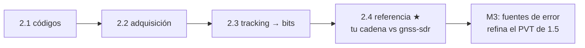

# Clase 2.4 — Receptor de referencia: validá tu cadena contra gnss-sdr

**Módulo 2 · Señales y SDR · ~3 h · cierra el módulo 2**

## Objetivos

- [ ] Entender qué es gnss-sdr y por qué es el receptor de referencia de la comunidad
- [ ] Correr tu adquisición (2.2) sobre las capturas reales y compararla con la verdad de gnss-sdr
- [ ] Instalar y correr gnss-sdr de verdad sobre la misma captura
- [ ] Interpretar por qué el Doppler coincide y el desfase de código puede diferir por el punto de arranque
- [ ] Cerrar el módulo: tu cadena artesanal 2.1→2.3 vs un receptor profesional

## ¿Dónde estamos?



Construiste cada pieza a mano para *entenderla*. Ahora la validás contra
gnss-sdr, el receptor software open-source que usa la comunidad GNSS
(investigación, agencias, industria). Si tu adquisición encuentra los
mismos satélites con el mismo Doppler que gnss-sdr, sabés que tu cadena
está bien — y entendés el receptor profesional desde adentro, porque
reconstruiste su núcleo. Es el cierre natural del módulo de señal.

## Los datos

Las mismas tres capturas de la 2.2 (ya bajadas):

```bash
python3 tools/fetch_iq.py   # si todavía no las tenés
```

Y opcionalmente el propio gnss-sdr:

```bash
sudo apt install gnss-sdr   # Ubuntu/Debian: ~450 paquetes (GNU Radio)
```

## Teoría

### 1. Qué es gnss-sdr

**gnss-sdr** es un receptor GNSS por software (SDR): toma muestras IQ
crudas (de un archivo o de una radio como un RTL-SDR) y hace toda la
cadena que vos hiciste —adquisición, tracking, demodulación,
observables, PVT— para GPS, Galileo, GLONASS y BeiDou. Está escrito en
C++ sobre GNU Radio, es open-source, y sus resultados se usan como
referencia porque están validados contra hardware y contra otras
implementaciones. Correr tu cadena "contra gnss-sdr" es la forma estándar
de verificar que un receptor casero funciona.

### 2. Por qué el Doppler coincide y el desfase de código no siempre

Cuando corrés tu adquisición y la de gnss-sdr sobre la **misma** captura,
el **Doppler** tiene que coincidir (dentro de una celda de grilla, 250
Hz): es una propiedad física de la señal, no del receptor. El **desfase
de código**, en cambio, es relativo al **punto de arranque**: si gnss-sdr
empieza a procesar en otra muestra (su `sample_stamp`), su fase de código
está corrida respecto a la tuya — pero **módulo 1023 chips es el mismo
satélite**. Por eso comparamos el Doppler y el PRN detectado, y entendemos
la diferencia de fase como un offset de arranque, no un error.

### 3. El archivo de configuración de gnss-sdr

gnss-sdr se controla con un `.conf` (formato INI) que declara cada bloque
de la cadena: `SignalSource` (el archivo IQ y su formato), `Acquisition`
(PCPS, umbral, grilla Doppler), `Tracking` (DLL/PLL y sus BW),
`TelemetryDecoder`, `Observables`, `PVT`. Es literalmente la cadena que
construiste, expuesta como parámetros. En `conf/gps_l1_acq.conf` tenés uno
listo para GPS L1 sobre la captura de la 2.2.

### 4. La captura corta y el truco de repetir

Las capturas públicas son de 2-8 ms — alcanzan para adquirir, pero
gnss-sdr necesita más muestras para completar su flujo (arrancar tracking,
intentar demodular). El truco: **repetir la captura** decenas de veces en
un archivo temporal (`np.tile`). No es "más señal real" —es la misma
seccionada en loop— pero le da a gnss-sdr material para correr su máquina
de estados y mostrar que engancha el satélite.

## Lab guiado

1. `lab/lab_referencia_TODO.ipynb` — completá tu adquisición (viene de la
   2.2) y la comparación contra la verdad de gnss-sdr.
2. Solución de referencia en `lab/soluciones/`: compara GPS y Galileo, y
   si gnss-sdr está instalado, lo corre de verdad y parsea su salida.
3. Figuras: `python3 img/make_figures.py`.
4. Config de gnss-sdr: `conf/gps_l1_acq.conf`.

**Tabla de validación:**

| Chequeo | Valor esperado |
|---|---|
| GPS PRN1 — tu Doppler vs gnss-sdr | coinciden (±250 Hz) |
| Galileo SV1 — tu Doppler vs gnss-sdr | coinciden (±125 Hz) |
| gnss-sdr real — PRN detectado | 1 (mismo que tu cadena) |
| gnss-sdr real — Doppler | mismo que tu adquisición |
| gnss-sdr real — tracking | engancha PRN1 |

## Ejercicios a mano

**E1.** Tu cadena da Doppler +1750 Hz para GPS PRN1; gnss-sdr publica
+1680. ¿Por qué la diferencia de 70 Hz es esperable y no un error? (Pista:
tamaño de la celda de grilla.)

**E2.** gnss-sdr detecta code phase 2020 y vos delay 523 sobre la misma
captura. Sabiendo que el código son 1023 chips (~4000 muestras a 4 Msps),
¿son consistentes? ¿Qué explica la diferencia?

**E3.** Un `.conf` de gnss-sdr tiene `Acquisition.doppler_step=250`. Si lo
bajaras a 50 Hz, ¿qué ganás y qué perdés? Relacionalo con tu grilla de la
2.2.

## Estimaciones Fermi

**F1.** gnss-sdr instalado arrastra ~450 paquetes (GNU Radio, Boost,
VOLK...). ¿Por qué un receptor SDR "de verdad" necesita tanto, si tu
cadena entra en un archivo de Python? ¿Qué te da GNU Radio que vos hiciste
a mano?

**F2.** Con un RTL-SDR (~US$30) y una antena GPS activa, gnss-sdr puede
dar un fix real. ¿Qué capturaste vos de "gratis" en este módulo que
normalmente requeriría ese hardware? ¿Qué te falta para un fix en vivo?

## Preguntas conceptuales

**C1.** ¿Por qué el Doppler es una propiedad de la señal y el desfase de
código depende del receptor? ¿Cuál usarías para verificar dos receptores?
**C2.** ¿Qué significa que gnss-sdr sea "de referencia"? ¿Por qué no es
circular validar tu cadena contra otro software?
**C3.** ¿Por qué hay que repetir la captura para que gnss-sdr corra su
flujo completo, y qué NO podés concluir de esa señal repetida (por ejemplo
sobre el mensaje de navegación)?
**C4.** Tu cadena y gnss-sdr encuentran el mismo satélite. ¿Qué te dice
eso sobre las piezas que construiste en 2.1-2.3?

## Pregunta de entrevista

*"Escribiste un receptor GNSS. ¿Cómo lo validás?"* — Guía: contra un
receptor de referencia (gnss-sdr) sobre la misma captura, comparando PRN y
Doppler (propiedades de la señal); contra las verdades publicadas de sus
unit tests; y en última instancia contra hardware (RTL-SDR + antena) para
un fix real. El desfase de código se compara módulo el período, por el
punto de arranque.

## Mini-simulacro (10 min)

1. Nombrá los bloques de la cadena de un receptor GNSS en orden, de las
   muestras IQ al PVT.
2. V/F: "si dos receptores dan distinto desfase de código sobre la misma
   captura, uno está mal". Matizá.
3. ¿Qué compararías para verificar tu adquisición contra gnss-sdr: delay,
   Doppler, o ambos? ¿Por qué?

## Figuras

| | |
|---|---|
| `img/fig1_comparacion.svg` | Tu cadena vs gnss-sdr: desfase y Doppler, lado a lado |
| `img/fig2_delta.svg` | La diferencia (Δ delay, Δ Doppler) + resultado de gnss-sdr real |

## Caso real — el receptor que cualquiera puede auditar

gnss-sdr nació en el CTTC (Centro Tecnológico de Telecomunicaciones de
Cataluña) y hoy es un proyecto usado en investigación de receptores,
desarrollo de anti-spoofing, y hasta en estaciones de monitoreo. Que sea
**open-source** es un punto de seguridad en sí mismo: cualquiera puede
auditar cómo adquiere, cómo trackea, cómo decide qué señal es válida —a
diferencia de un chip GPS propietario donde la lógica es una caja negra.
Para la resiliencia GNSS eso importa: los detectores de spoofing más
transparentes (que miran la simetría del pico, el C/N0, la consistencia
entre satélites — los observables de la 2.3) se prototipan y publican
sobre gnss-sdr. Y para **OSNMA** —la autenticación criptográfica de
Galileo que es tu especialidad— gnss-sdr tiene una implementación de
referencia: el mismo mensaje de navegación que demodulaste en la 2.3,
ahora con su firma verificada. Cuando llegues al módulo 4, vas a construir
esa pieza; tener el receptor completo entendido desde la señal es lo que
lo hace posible.

## Glosario

**gnss-sdr** receptor GNSS open-source por software (C++/GNU Radio) ·
**SDR** software-defined radio · **.conf** archivo de configuración INI de
gnss-sdr · **sample_stamp** muestra donde gnss-sdr ancla la adquisición ·
**test statistic** métrica de detección del pico en gnss-sdr · **GNU
Radio** framework de bloques de DSP sobre el que corre gnss-sdr · **RTL-SDR**
receptor SDR de bajo costo (~US$30) · **VOLK** librería de kernels
vectorizados que usa gnss-sdr.

## Cheat sheet

```
gnss-sdr --config_file=archivo.conf        # correr sobre un .conf
.conf: SignalSource -> Acquisition -> Tracking -> Telemetry -> Obs -> PVT
comparar receptores: PRN y Doppler (de la señal), NO el desfase absoluto
desfase de código: relativo al sample_stamp -> comparar módulo 1023 chips
captura de 2 ms: repetir ~100x (np.tile) para que gnss-sdr corra su flujo
tu cadena (523, +1750) ~ gnss-sdr (524/+1680 publicado, +1750 real) OK
```

## Errores comunes

1. Comparar el desfase de código **absoluto** entre receptores: depende del
   punto de arranque. Compará el Doppler y el PRN.
2. Correr gnss-sdr sobre la captura de 2 ms sin repetir: termina antes de
   completar el flujo (no llega a trackear).
3. Formato del `.conf` mal: `item_type=gr_complex`, `sampling_frequency`
   igual a la de la captura (4 Msps).
4. Esperar un fix de PVT de una captura de 2 ms: no hay efemérides (harían
   falta ~30 s de datos reales, no repetidos).
5. Olvidar que la señal repetida no tiene mensaje de navegación coherente:
   sirve para adquisición/tracking, no para demodular el subframe.

## Referencias

- gnss-sdr — sitio oficial y documentación (gnss-sdr.org)
- Fernández-Prades, Arribas, et al. — papers de gnss-sdr (CTTC)
- Borre et al., *A Software-Defined GPS and Galileo Receiver* (2007)
- gnss-sdr — archivos `.conf` de ejemplo en su repositorio
- documentación de GNU Radio (bloques de SignalSource y File_Signal_Source)

## Para tu bitácora

Completá `bitacora.md` con tus Doppler vs gnss-sdr. **Rúbrica**: ⭐ tu
adquisición coincide con la verdad publicada de gnss-sdr (Doppler y PRN) ·
⭐⭐ + instalás gnss-sdr y lo corrés sobre la captura, verificando que
detecta el mismo PRN y Doppler · ⭐⭐⭐ + conseguís un RTL-SDR + antena GPS
activa y hacés un fix real con gnss-sdr en PCHOME (o corrés gnss-sdr sobre
la captura CTTC completa y comparás su sky-search con el tuyo de la 2.2).

**Módulo 2 completo.** Fabricaste los códigos, los encontraste en el aire,
los seguiste hasta los bits, y validaste todo contra el receptor de
referencia. Próximo → **Módulo 3 (fuentes de error)**: volvés al PVT de la
1.5 y lo refinás modelando ionosfera, troposfera y pesos por elevación.
