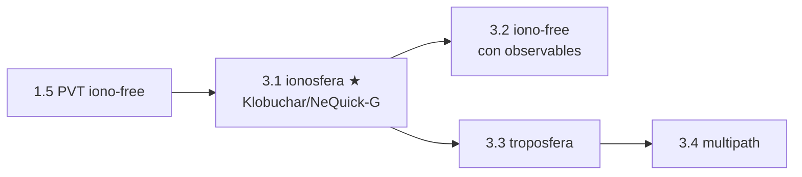

# Clase 3.1 — Ionosfera: los modelos broadcast (Klobuchar y NeQuick-G)

**Módulo 3 · Fuentes de error · ~3.5 h**

## Objetivos

- [ ] Entender por qué la ionosfera retrasa el código GNSS y por qué es dispersiva (∝ 1/f²)
- [ ] Parsear los coeficientes iono reales del header de un RINEX de navegación
- [ ] Implementar Klobuchar completo según IS-GPS-200 (los 10 pasos)
- [ ] Validar la física del modelo: pico a las 14:00 locales, piso nocturno de 5 ns, oblicuidad ~3× a 5°
- [ ] Estimar el retardo que la iono-free de la 1.5 eliminó, satélite por satélite
- [ ] Conocer NeQuick-G (Galileo): qué son los ai0-2 y por qué corrige más

## ¿Dónde estamos?



En la 1.5 la ionosfera "desapareció" con la combinación iono-free — un
lujo de doble frecuencia. Pero el receptor de tu teléfono, un tractor
guiado, o un dron barato usan **una** frecuencia: su única defensa es el
modelo que el propio satélite transmite. Esta clase abre el módulo de
errores implementando ese modelo con los coeficientes reales del mismo día
de tu PVT, y midiendo cuánto error estaba en juego.

## Los datos

Nada nuevo que bajar: el BRDC del día 166/2026 (ya en el repo desde la
1.5) trae en su header los coeficientes de los dos modelos:

```
GPSA   1.1176E-08  2.2352E-08 -5.9605E-08 -1.1921E-07   (Klobuchar alpha)
GPSB   1.0240E+05  1.4746E+05 -6.5536E+04 -5.2429E+05   (Klobuchar beta)
GAL    1.2650E+02  4.6484E-01  1.5686E-02               (NeQuick-G ai0-2)
```

```bash
python3 clases/mod3-errores/clase3.1-ionosfera/lab/soluciones/lab_klobuchar_solucion.py
```

## Teoría

### 1. Por qué la ionosfera retrasa (y cuánto)

Entre ~60 y ~1000 km de altura, la radiación solar ioniza la atmósfera:
electrones libres. Para una onda de radio, ese plasma tiene índice de
refracción distinto de 1, y el efecto sobre el **código** es un retardo

$$ \Delta t \approx \frac{40.3 \cdot \mathrm{TEC}}{c \cdot f^2} $$

donde TEC es el contenido total de electrones a lo largo del rayo (en
electrones/m²; 1 TECU = 10¹⁶ el/m² ≈ **0.162 m en L1**). Dos cosas clave:
el efecto **depende de f** (la ionosfera es *dispersiva* en banda L — por
eso dos frecuencias permiten eliminarla, clase 3.2), y el TEC **varía**:
con la hora local (máximo a primera hora de la tarde), la estación, el
ciclo solar de 11 años, la latitud (peor en el cinturón ecuatorial) y las
tormentas geomagnéticas. Típico en L1: 1–10 m vertical; hasta decenas en
tormenta. Nota de signo: el código se **retrasa** y la fase se **adelanta**
en la misma magnitud (clave en 3.4).

### 2. Klobuchar: 8 números para todo el planeta

GPS transmite 8 coeficientes (α₀..α₃, β₀..β₃) que parametrizan un modelo
de una elegancia brutal: el retardo vertical es un **coseno diurno** cuya
amplitud (AMP) y período (PER) son polinomios cúbicos en la latitud
geomagnética del **punto de perforación ionosférico** (IPP: donde tu rayo
cruza un cascarón a 350 km). El pico está clavado a las **14:00 hora
local** del IPP (la ionización tarda en acumularse tras el mediodía) y de
noche queda un piso constante de **5 ns** (~1.5 m). Un factor de
**oblicuidad** F = 1 + 16·(0.53 − E)³ (E en semicírculos) convierte
vertical en oblicuo: a 5° de elevación el rayo atraviesa ~3× más
ionosfera. Klobuchar corrige ~**50% RMS** — la mitad del error, con 8
números para todo el planeta. Los 10 pasos del algoritmo están en
IS-GPS-200 §20.3.3.5.2.5 y son exactamente lo que implementás en el lab.

### 3. NeQuick-G: el modelo de Galileo

Galileo transmite solo 3 coeficientes (ai0, ai1, ai2) pero mucho más
sofisticados: definen un **nivel de ionización efectivo**
Az = ai0 + ai1·μ + ai2·μ², donde μ es el **MODIP** (latitud dip
modificada, una coordenada magnética que sale de una grilla publicada por
ESA). Con ese Az, NeQuick-G evalúa un **modelo 3D de densidad electrónica**
(perfiles de Epstein anclados en las capas E, F1, F2) y lo **integra
numéricamente a lo largo del rayo**. Resultado: ~**70% de corrección** —
mejor que Klobuchar, especialmente a baja elevación y en el cinturón
ecuatorial, a costa de mucho más cómputo. ESA publica la implementación de
referencia en C y la especificación completa; portarla es un proyecto en
sí (⭐⭐⭐).

### 4. La jerarquía de defensas contra la ionosfera

| Defensa | Corrige | Requiere |
|---|---|---|
| nada | 0% | — |
| Klobuchar (GPS) | ~50% RMS | 1 frecuencia + 8 coef broadcast |
| NeQuick-G (Galileo) | ~70% | 1 frecuencia + 3 coef + grilla MODIP |
| SBAS (WAAS/EGNOS) | ~80–90% | 1 frecuencia + grilla regional en vivo |
| **iono-free (1.5)** | ~99.9% (1er orden) | **2 frecuencias** |

La moraleja del módulo: cada fuente de error tiene una jerarquía así, y
elegir dónde pararte es ingeniería de sistema (costo, potencia, precisión).

## Lab guiado

1. `lab/lab_klobuchar_TODO.ipynb` — completá el parser del header y los
   10 pasos de Klobuchar.
2. Solución en `lab/soluciones/` — además calcula el Az de NeQuick-G.
3. Figuras: `python3 img/make_figures.py`.

**Tabla de validación:**

| Chequeo | Valor esperado |
|---|---|
| piso nocturno (cenit) | 1.50 m (= 5 ns × c) |
| hora local del pico | ~14:00 (13.9 con estos coef) |
| pico cenital (día 166, LPGS) | 3.75 m |
| F(90°) / F(30°) / F(15°) / F(5°) | 1.00 / 1.77 / 2.43 / 3.03 |
| E29 (61.5°) a las 12 UTC | ~1.66 m |
| E26 (13.8°) a las 12 UTC | ~4.53 m |
| Az NeQuick-G (MODIP ≈ −25°) | ~125 sfu |

## Ejercicios a mano

**E1.** Un TEC vertical de 30 TECU (día tranquilo): ¿cuántos metros de
retardo en L1 (1575.42 MHz)? ¿Y en L5 (1176.45 MHz)? ¿Qué cociente
esperás entre ambos y por qué?

**E2.** El piso nocturno de Klobuchar son 5 ns. ¿Cuántos metros son? Si un
receptor NO aplicara ni siquiera eso, ¿de qué orden es el error de
posición que introduce (recordá el DOP de la 1.4)?

**E3.** Derivá el valor de F a 0° de elevación con la fórmula de
oblicuidad. ¿Por qué los receptores usan una máscara de elevación (5–10°)
en vez de confiar en F para satélites rasantes?

## Estimaciones Fermi

**F1.** En el máximo del ciclo solar el TEC puede triplicar el del mínimo.
Si hoy tu error iono residual (tras Klobuchar) es ~1 m, ¿qué esperás en el
máximo? ¿Y durante una tormenta G5 (TEC ×5–10 y gradientes rápidos)?

**F2.** El cinturón ecuatorial (±20° de latitud magnética) tiene el TEC
más alto y burbujas de plasma al atardecer. Estimá cuánto peor es el caso
argentino (La Plata, magnética ~−25°) que el europeo (~+45°) — ¿a quién le
sirve más NeQuick-G?

**F3.** Klobuchar son 8 números actualizados ~cada día para TODO el
planeta. La grilla iono de un SBAS son cientos de puntos cada ~5 min para
una región. Estimá el cociente de "ancho de banda de corrección" entre
ambos y conectalo con la tabla de defensas.

## Preguntas conceptuales

**C1.** ¿Por qué la ionosfera es dispersiva en banda L y la troposfera no?
¿Qué habilita esa diferencia (y qué imposibilita para la tropo)?
**C2.** ¿Por qué el pico de Klobuchar está a las 14:00 locales y no al
mediodía, si el Sol está más alto a las 12?
**C3.** ¿Qué es el IPP y por qué el modelo evalúa la hora local y la
latitud AHÍ y no en tu receptor?
**C4.** El código se retrasa y la fase se adelanta (mismo módulo, signo
opuesto). ¿Qué combinación de observables lo aprovecha? (adelanto de 3.4)
**C5.** Un spoofer transmite señal sin retardo ionosférico real. Si tu
receptor monitorea el residual iono (medido vs Klobuchar), ¿qué anomalía
vería? ¿Es un detector robusto?

## Pregunta de entrevista

*"¿Cómo maneja la ionosfera un receptor de una frecuencia vs uno de dos?"*
— Guía: mono usa el modelo broadcast (Klobuchar ~50%, NeQuick-G ~70%, o
grilla SBAS ~85%); doble forma iono-free y elimina el término 1/f² por
construcción (a costa de ×3 el ruido, clase 3.2). El residual iono domina
el presupuesto de error monofrecuencia; por eso L5/E5a en teléfonos es un
salto de calidad.

## Mini-simulacro (12 min)

1. Escribí la fórmula del retardo iono en función de TEC y f. ¿Signo en
   código vs fase?
2. ¿Dónde está el máximo diurno de Klobuchar y cuál es el piso nocturno?
3. F(5°) ≈ ? ¿Qué significa físicamente?
4. Klobuchar vs NeQuick-G: coeficientes, mecanismo, % de corrección.
5. V/F: "con iono-free la ionosfera deja de importar del todo". Matizá
   (ruido ×3, 2º orden, disponibilidad de 2 frecuencias).

## Figuras

| | |
|---|---|
| `img/fig1_curva_diurna.svg` | El coseno de Klobuchar en hora local, 3 elevaciones |
| `img/fig2_oblicuidad_sats.svg` | F vs elevación + los 8 Galileo de la 1.5 con su retardo |
| `img/fig3_mapa_hora_elev.svg` | Mapa hora local × elevación: lo peor, bajo y a las 14 |

## Caso real — mayo 2024: la tormenta que torció las sembradoras

El 10-11 de mayo de 2024 llegó a la Tierra la tormenta geomagnética más
intensa en ~20 años (nivel G5, la "tormenta Gannon"): una serie de
eyecciones de masa coronal que dispararon el TEC, crearon gradientes
ionosféricos violentos y centelleo. Las auroras se vieron en latitudes
insólitas — y los sistemas GNSS de precisión lo sufrieron en silencio: en
pleno arranque de la siembra en EE.UU. y Canadá, los tractores autoguiados
por RTK/PPP empezaron a desviarse de sus líneas; fabricantes de equipos
agrícolas recomendaron suspender la siembra de precisión durante el pico.
Vuelos polares se replanificaron y hubo degradación en aviación y
levantamientos topográficos.

Por qué encaja acá: los modelos broadcast asumen una ionosfera *suave y
predecible* — un coseno diurno (Klobuchar) o una climatología (NeQuick-G).
Una tormenta rompe esas hipótesis: el TEC se multiplica, aparecen
gradientes espaciales que ninguna curva global captura, y el centelleo
puede directamente tirar el tracking (módulo 2). Para tu perfil de
resiliencia GNSS, la lección es doble: (1) la ionosfera es la mayor fuente
de error *natural* y su cola extrema no la cubre ningún modelo de 8
números; (2) un monitoreo del residual iono (medido vs modelo) es
también un observable de **integridad** — distinguir tormenta de spoofing
es parte del problema (módulo 6).

## Glosario

**TEC** contenido total de electrones (1 TECU = 10¹⁶ el/m² ≈ 0.162 m en
L1) · **dispersivo** el retardo depende de la frecuencia · **IPP** punto
de perforación ionosférico (rayo ∩ cascarón a 350 km) · **Klobuchar**
modelo broadcast GPS (8 coef, ~50%) · **NeQuick-G** modelo broadcast
Galileo (3 coef + MODIP, ~70%) · **MODIP** latitud dip modificada ·
**Az** nivel de ionización efectivo de NeQuick-G · **oblicuidad** factor
F que mapea retardo vertical a oblicuo · **centelleo** fluctuación rápida
de amplitud/fase por irregularidades del plasma · **sfu** solar flux units.

## Cheat sheet

```
retardo codigo = +40.3*TEC/(c*f^2)   |   fase: mismo modulo, signo opuesto
1 TECU = 0.162 m en L1               |   tipico 1-10 m vertical; tormenta >>
Klobuchar: 8 coef -> coseno diurno, pico 14:00 local, piso 5 ns (1.5 m)
  AMP, PER = polinomios cubicos en lat geomagnetica del IPP
  F = 1 + 16*(0.53 - E)^3  (E en semicirculos): F(5 grados) ~ 3
NeQuick-G: Az = ai0 + ai1*MODIP + ai2*MODIP^2 -> perfil 3D integrado (~70%)
jerarquia: nada < Klobuchar 50% < NeQuick 70% < SBAS 85% < iono-free ~100%
```

## Errores comunes

1. Mezclar unidades: Klobuchar trabaja en **semicírculos** (grados/180),
   no radianes ni grados.
2. Olvidar los clamps: φᵢ a ±0.416, AMP ≥ 0, PER ≥ 72000.
3. Evaluar la hora local en el receptor en vez de en el **IPP**.
4. Aplicar el retardo con el signo equivocado a la fase de portadora.
5. Usar Klobuchar para L5/E5a sin reescalar por (f₁/f₅)²: los coeficientes
   están definidos para L1.
6. Creer que el modelo sirve en tormenta: corrige la *climatología*, no el
   *clima espacial* del día.

## Referencias

- IS-GPS-200 §20.3.3.5.2.5 — el algoritmo Klobuchar paso a paso
- Klobuchar (1987), *Ionospheric time-delay algorithm for single-frequency
  GPS users*, IEEE TAES
- ESA — *NeQuick-G Ionospheric Model Reference Implementation* (spec + código C)
- ESA *GNSS Data Processing Vol. I* — capítulo de errores atmosféricos
- Navipedia — Klobuchar / NeQuick-G / Ionospheric Delay
- NOAA SWPC — reportes de la tormenta de mayo 2024

## Para tu bitácora

Completá `bitacora.md` con tus valores contra la tabla. **Rúbrica**: ⭐
implementás Klobuchar y validás pico/piso/oblicuidad · ⭐⭐ + aplicás el
modelo a los 8 satélites de tu PVT de la 1.5 y explicás la relación
elevación↔retardo · ⭐⭐⭐ + corrés la implementación de referencia de
NeQuick-G de ESA (o un port) para la misma época y comparás contra
Klobuchar; o graficás el retardo Klobuchar para el cinturón ecuatorial
(lat magnética 0°) vs La Plata y explicás la diferencia.

Próximo paso → **Clase 3.2 (iono-free con observables)**: la combinación
de doble frecuencia sobre los observables reales de LPGS — eliminar la
ionosfera de verdad y pagar el precio (ruido ×3).
