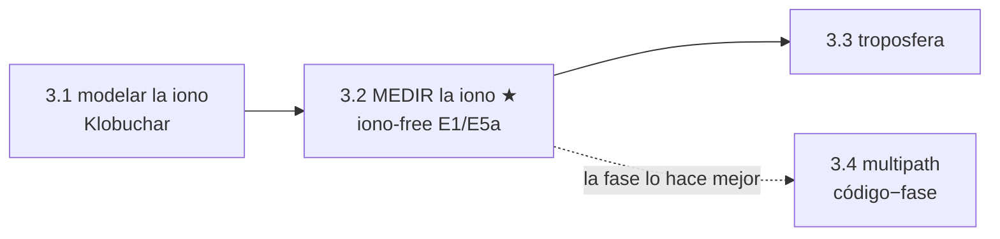

# Clase 3.2 — Iono-free: medir la ionosfera y pagar el precio

**Módulo 3 · Fuentes de error · ~3.5 h**

## Objetivos

- [ ] Derivar la combinación iono-free y sus coeficientes (2.26 / −1.26 para E1/E5a)
- [ ] Medir la ionosfera satélite por satélite con la divergencia P₅−P₁ (+ BGD)
- [ ] Confrontar la iono MEDIDA contra el Klobuchar de la 3.1 — ¿cuánto no ve el modelo?
- [ ] Correr el PVT en tres sabores (E1 crudo / E1+Klobuchar / iono-free) y validar la vertical
- [ ] Cuantificar el precio: amplificación de ruido ×2.59 (teórica y empírica)
- [ ] Internalizar el trade-off **sesgo vs ruido** — y cuándo gana cada estrategia

## ¿Dónde estamos?



La 3.1 terminó con una jerarquía: Klobuchar corrige ~50%, iono-free
~100%. Suena a que doble frecuencia gana siempre. Esta clase mide todo
con los observables reales de LPGS y descubre que la historia es más
fina: **iono-free elimina un sesgo pero amplifica el ruido**, y en una
mañana tranquila de invierno el humilde Klobuchar puede dar el fix más
preciso. Entender *cuándo* conviene cada uno es exactamente el tipo de
criterio que separa a quien usa recetas de quien diseña receptores.

## Los datos

Los mismos de la 1.5 (nada nuevo que bajar): observables E1/E5a de LPGS
y el BRDC del día 166/2026, que además del reloj trae el **BGD** de cada
satélite (el sesgo interfrecuencia del hardware de a bordo).

```bash
python3 clases/mod3-errores/clase3.2-ionofree/lab/soluciones/lab_ionofree_solucion.py
```

## Teoría

### 1. La combinación iono-free

Dos pseudorangos del mismo satélite ven idéntica geometría, relojes y
troposfera; solo cambia la ionosfera, que escala como 1/f²:

$$ P_1 = \rho^* + I_1, \qquad P_5 = \rho^* + \gamma I_1,
\qquad \gamma = (f_1/f_5)^2 \approx 1.793 $$

Buscamos la combinación lineal que anula I. Resolviendo:

$$ P_{IF} = \frac{\gamma P_1 - P_5}{\gamma - 1} \approx 2.26\,P_1 - 1.26\,P_5 $$

Los coeficientes suman 1 (preserva la geometría) y su combinación anula
el término 1/f² **exactamente, época por época, sin modelo** — funciona
igual en calma que en tormenta G5. Queda el efecto de 2º orden (~cm) y
un detalle de relojes: el reloj F/NAV de Galileo está referido **a esta
combinación**, por eso la 1.5 no necesitó tocar nada.

### 2. La divergencia: darle vuelta a la ecuación y MEDIR

Restando en vez de combinando:

$$ P_5 - P_1 = (\gamma - 1) I_1 + c(\gamma-1)\,\mathrm{BGD} + \mathrm{DCB}_{rx} $$

la geometría, relojes y tropo se cancelan y queda la ionosfera **pura**
(más dos sesgos de hardware: el del satélite — el BGD que transmite el
F/NAV — y el del receptor, un offset común a todos los satélites). Es un
ionosondador gratis: cada par de frecuencias mide el TEC oblicuo de su
rayo. Así se construyen los mapas globales de TEC del IGS, las grillas
SBAS, y así un receptor puede *auditar* su propio modelo Klobuchar.

### 3. El precio: el ruido se multiplica

Los coeficientes 2.26 y −1.26 amplifican el ruido no correlacionado:

$$ \sigma_{IF} = \sqrt{2.26^2 + 1.26^2}\;\sigma_P \approx 2.59\,\sigma_P $$

Con σ_P ≈ 0.3 m de ruido de código, el observable iono-free trae
~0.8 m. Es el peaje fijo de la autopista: lo pagás siempre, haya o no
tráfico (ionosfera). De ahí la regla práctica: **iono-free de código
puro solo conviene cuando el sesgo iono supera el ruido amplificado** —
y la solución profesional es suavizar el código con la fase (filtro de
Hatch) o directamente PPP con fase, donde el ruido es mm y el ×2.59 no
duele.

### 4. Sesgo vs ruido: la lección

| | sesgo iono residual | ruido |
|---|---|---|
| E1 crudo | TODO el retardo (1–10 m) | σ_P |
| E1 + Klobuchar | ~50% del retardo | σ_P |
| iono-free | ~0 | **2.59 σ_P** |

El error total es √(sesgo² + ruido²): con iono mansa (invierno, 8 AM,
mínimo solar) el modelo puede ganar; con iono brava (14 h local, máximo
solar, cinturón ecuatorial, tormenta) el sesgo explota y la doble
frecuencia arrasa. No hay respuesta única — hay presupuesto de error.

## Lab guiado

1. `lab/lab_ionofree_TODO.ipynb` — completá la divergencia, la
   combinación IF y la corrección BGD del sabor E1-only.
2. Solución en `lab/soluciones/` — la corrida completa 12:00–13:00.
3. Figuras: `python3 img/make_figures.py`.

**Tabla de validación** (12:00–13:00 UTC, 60 fixes):

| Chequeo | Valor esperado |
|---|---|
| E26 (13.8°): medida / Klobuchar | 8.19 / 3.93 m |
| E29 (61.5°): medida / Klobuchar | 2.49 / 1.66 m |
| offset común (DCB rx) | ≈ +0.7 m |
| residual medida−modelo (sin offset) | RMS ≈ 1.3 m |
| RMS vertical: crudo → Klobuchar → IF | 3.25 → 0.78 → 1.42 m |
| RMS residuos: E1 / IF | 0.34 / 0.58 m (×1.71) |
| amplificación teórica del ruido | ×2.59 |

## Ejercicios a mano

**E1.** Derivá los coeficientes de la combinación iono-free para L1/L2
GPS (f₂ = 1227.60 MHz). ¿Cuánto vale la amplificación de ruido? ¿Por qué
es peor que en E1/E5a?

**E2.** Con σ_P = 0.3 m: ¿a partir de qué sesgo iono residual conviene
iono-free sobre E1+Klobuchar? (Igualá los errores totales √(b²+σ²).)

**E3.** El BGD de E29 es −4.42 ns. ¿Cuántos metros de error meterías en
el fix E1-only si lo ignoraras? ¿Y en el fix iono-free? ¿Por qué la
diferencia?

## Estimaciones Fermi

**F1.** El filtro de Hatch promedia el código guiado por la fase durante
~100 s. Si el ruido de código baja como 1/√N con N épocas a 1 Hz, ¿a
cuánto queda el σ del iono-free suavizado? ¿Sigue doliendo el ×2.59?

**F2.** En el pico de una tormenta G5 el sesgo iono residual de Klobuchar
puede superar 10 m. Estimá el error vertical de cada sabor esa tarde y
decidí qué receptor querés en un dron de inspección eléctrica.

**F3.** Tu serie I₁(t) tiene ruido ~1 m a 30 s. ¿Cuántas épocas
necesitás promediar para detectar un gradiente ionosférico de 0.2 m con
confianza 3σ? ¿Llegás antes de que el gradiente pase (minutos)?

## Preguntas conceptuales

**C1.** ¿Por qué el reloj F/NAV de Galileo se transmite referido a la
combinación E1/E5a y no a E1 solo? ¿Qué debe hacer el usuario E1-only?
**C2.** ¿Por qué la ionosfera (y su eliminación) pega casi toda en la
componente VERTICAL del fix y casi nada en la horizontal?
**C3.** La combinación iono-free de FASE tiene el mismo ×2.59 — ¿por qué
ahí no importa? ¿Qué problema nuevo trae la fase? (ambigüedades → M5)
**C4.** Un spoofer emite E1 y E5a coherentes pero sin ionosfera real.
¿Qué ve tu divergencia P₅−P₁? ¿Y si el spoofer solo captura E1?
**C5.** ¿Por qué la divergencia código-fase de UNA frecuencia (P−Φ)
mide 2·I mientras la de dos códigos mide (γ−1)·I? ¿Cuál es más ruidosa?

## Pregunta de entrevista

*"¿Cuándo NO usarías la combinación iono-free?"* — Guía: receptor
mono-frecuencia (no hay opción), código puro en iono tranquila (el ruido
×2.59 supera el sesgo del modelo — mostralo con números de esta clase),
canal degradado donde L5/E5a cae (jamming selectivo), y aplicaciones de
integridad donde preferís monitorear la divergencia como observable en
vez de consumirla. Bonus: la respuesta profesional es Hatch/PPP — fase
al rescate.

## Mini-simulacro (12 min)

1. Escribí P_IF para E1/E5a con γ. ¿Cuánto suman los coeficientes y por qué?
2. ¿Qué mide (P₅−P₁)/(γ−1)? ¿Qué dos sesgos lo contaminan?
3. σ_IF/σ_P = ? Derivalo.
4. En tu corrida: ¿quién ganó la vertical y por qué no fue iono-free?
5. V/F: "el BGD solo importa para usuarios single-frequency". Justificá.

## Figuras

| | |
|---|---|
| `img/fig1_medida_vs_klobuchar.svg` | La iono medida vs el modelo, por satélite |
| `img/fig2_tres_sabores.svg` | RMS ENU de los tres sabores + el precio en los residuos |
| `img/fig3_serie_iono.svg` | I₁(t) por satélite: tendencias suaves + E33 cayendo al horizonte |

## Caso real — DFMC: la aviación se pasa a doble frecuencia

Durante 20 años los SBAS de aviación (WAAS, EGNOS) volaron sobre UNA
frecuencia (L1) + grilla ionosférica regional: la iono era su mayor
amenaza de integridad, y las tormentas los degradaban justo cuando más
se los necesitaba. La respuesta de la industria es **DFMC** (Dual
Frequency Multi-Constellation): los estándares de nueva generación —
EGNOS V3, WAAS siguiente generación, el estándar SBAS L5 DFMC de ICAO —
ponen la combinación iono-free L1/L5 y E1/E5a en la cabina. El efecto es
exactamente el de tu lab: el término iono de primer orden desaparece
*por construcción* y con él la principal fuente de los "ionospheric
threat models" que limitaban la disponibilidad de aproximaciones de
precisión; el precio del ruido se paga con suavizado de fase (Hatch) y
los presupuestos de integridad se rehacen alrededor de amenazas
residuales (multipath, fallas del sistema... y spoofing — módulo 6).
Para tu perfil: DFMC es también la razón por la que el jamming selectivo
de L5/E5a es un vector de ataque estudiado — tirar una de las dos
frecuencias degrada al avión a la jerarquía de la 3.1.

## Glosario

**iono-free (IF)** combinación lineal que anula el término 1/f² ·
**γ (gamma)** (f₁/f₅)² ≈ 1.793 · **divergencia** P₅−P₁, la iono aislada ·
**BGD** broadcast group delay: sesgo interfrecuencia del satélite,
transmitido en el nav · **DCB** differential code bias (satélite o
receptor) · **filtro de Hatch** suavizado del código guiado por fase ·
**DFMC** dual-frequency multi-constellation (SBAS de 2ª generación) ·
**PPP** precise point positioning (fase + productos precisos).

## Cheat sheet

```
gamma = (f1/f5)^2 = 1.7933          E1/E5a Galileo (= L1/L5 GPS)
P_IF = (gamma*P1 - P5)/(gamma-1) = 2.261*P1 - 1.261*P5   (coef suman 1)
I1   = (P5 - P1)/(gamma-1) - c*BGD - DCB_rx/(gamma-1)
sigma_IF = sqrt(2.261^2 + 1.261^2) * sigma_P = 2.59 * sigma_P
reloj F/NAV: referido a IF -> usuario E1-only resta c*BGD
error total = sqrt(sesgo^2 + ruido^2)  ->  elegi la defensa por presupuesto
```

## Errores comunes

1. Olvidar el BGD en el fix E1-only (el reloj F/NAV es de la combinación).
2. Confundir el signo de la divergencia: P₅ > P₁ (la frecuencia baja
   sufre MÁS retardo).
3. Creer que iono-free es gratis: el ×2.59 aparece en tus residuos.
4. Interpretar el offset común de la divergencia como ionosfera (es el
   DCB del receptor).
5. Promediar I₁(t) a través de un salto de ciclo o un cambio de arco.
6. Usar γ de L1/L2 (1.6469) con datos E1/E5a (1.7933).

## Referencias

- ESA *GNSS Data Processing Vol. I* — combinaciones de observables
- Galileo OS SIS ICD — BGD y relojes F/NAV (§5.1.5)
- Navipedia — Ionosphere-free Combination / Combining Pairs of Signals
- Hatch (1982), *The synergism of GPS code and carrier measurements*
- ICAO / EUROCAE — estándares SBAS DFMC (EGNOS V3)

## Para tu bitácora

Completá `bitacora.md` contra la tabla. **Rúbrica**: ⭐ medís la iono con
la divergencia y reproducís la tabla del 12:00 · ⭐⭐ + corrés los tres
sabores y explicás con números por qué ganó quien ganó (sesgo vs ruido)
· ⭐⭐⭐ + implementás un filtro de Hatch sobre P_IF con la fase L1X/L5X
y mostrás cuánto baja el RMS del fix iono-free; o repetís la corrida a
las 17–18 UTC (pico iono local) y verificás si la cuenta se invierte.

Próximo paso → **Clase 3.3 (troposfera)**: el error que la doble
frecuencia NO puede tocar — Saastamoinen, la función de mapeo, y por qué
la vertical siempre paga.
