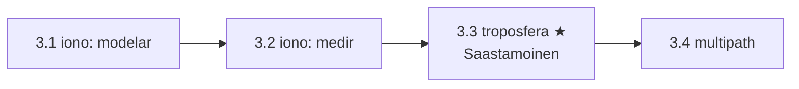

# Clase 3.3 — Troposfera: el error que no se puede restar

**Módulo 3 · Fuentes de error · ~3 h**

## Objetivos

- [ ] Entender por qué la troposfera NO es dispersiva y qué implica (no hay iono-free que valga)
- [ ] Implementar Saastamoinen completo: ZHD (hidrostático) + ZWD (húmedo)
- [ ] Entender por qué el ZHD es exacto con presión medida (equilibrio hidrostático) y el ZWD no
- [ ] Aplicar el mapeo 1/sin(el) y compararlo con la oblicuidad ionosférica (×11.5 vs ×3)
- [ ] Inyectar el modelo en el motor PVT de la 1.5 y medir cada troposfera en la vertical
- [ ] Cerrar la comparación del módulo: tropo (grande y mansa) vs iono (grande y salvaje)

## ¿Dónde estamos?



La cascada de la 1.5 ya lo mostraba: quitarle la troposfera al fix lo
manda de 1.95 a 8.58 m. Pero la tratamos con una sola línea de código
(`2.3·exp(−h/7160)/sin(el)`) y funcionó. Esta clase explica *por qué*
algo tan grande se deja domar tan fácil — y construye el modelo de
verdad (Saastamoinen), separando la parte hidrostática (96%, exacta con
la presión) de la húmeda (4%, la rebelde). El contraste con la ionosfera
es la moraleja del módulo.

## Los datos

Los mismos de siempre (nada que bajar). Sin sensores meteorológicos en
la estación, usamos atmósfera estándar (ISA) ajustada a la altura de
LPGS + climatología de invierno (10 °C, 70% RH).

```bash
python3 clases/mod3-errores/clase3.3-troposfera/lab/soluciones/lab_tropo_solucion.py
```

## Teoría

### 1. Gas neutro: el retardo que no depende de f

Los ~10 km inferiores de la atmósfera retrasan la señal porque el aire
tiene índice de refracción n > 1. A diferencia del plasma ionosférico,
el aire neutro tiene sus resonancias en el infrarrojo y el óptico —
lejísimos de la banda L — así que el retardo es **el mismo en E1, E5a o
cualquier frecuencia GNSS**: no dispersivo. Consecuencias directas: (1)
no existe combinación de frecuencias que lo elimine; (2) tampoco hay
divergencia que lo *mida* (afecta código y fase por igual, con el mismo
signo). La única defensa es el modelo — y por suerte alcanza.

### 2. ZHD: la física hidrostática regala un modelo exacto

El retardo cenital se parte en dos. La parte **hidrostática** (seca)
integra la densidad del aire en la vertical — y el equilibrio
hidrostático dice que esa integral ES la presión en superficie dividida
por la gravedad. Saastamoinen (1972):

$$ \mathrm{ZHD} = \frac{0.0022768\,P}{1 - 0.00266\cos(2\varphi) - 0.00028\,h_{km}} \approx 2.3\ \mathrm{m} $$

Con P medida por un barómetro, el ZHD queda clavado a ~1 mm. La
sensibilidad es **2.28 mm/hPa**: de una tormenta (960 hPa) a un
anticiclón (1040), el retardo cambia ±9 cm — por eso hasta la presión de
un modelo meteorológico alcanza para nivel cm.

### 3. ZWD: el vapor es el rebelde

La parte **húmeda** depende del vapor de agua, que NO está en equilibrio
hidrostático (se evapora, condensa y viaja en horas):

$$ \mathrm{ZWD} = 0.002277\left(\frac{1255}{T} + 0.05\right)e \approx 0.05\text{–}0.4\ \mathrm{m} $$

con e la presión parcial de vapor. Es chico (4–15% del total) pero
concentra casi todo el error del modelo (~1–4 cm). En geodesia fina y
PPP directamente se **estima** como incógnita en el filtro — y ese
subproducto vale oro (ver caso real).

### 4. El mapeo: la capa pegada al suelo

Para pasar de cenital a oblicuo, el modelo plano-paralelo da
m(el) = **1/sin(el)**: 2.0 a 30°, 3.9 a 15°, **11.5 a 5°** — mucho más
brutal que el ×3 de la iono, porque la tropo está pegada al suelo y el
rayo rasante la atraviesa casi horizontal (la iono, a 350 km, se salva
por la curvatura terrestre). El 1/sin vale hasta ~10°; por debajo, la
curvatura y la refracción piden funciones serias (Niell, GMF, VMF) que
separan coeficientes secos y húmedos.

### 5. La tabla final del módulo

| | tamaño | comportamiento | defensa | residuo |
|---|---|---|---|---|
| ionosfera | 2–30 m | salvaje (sol, hora, tormentas) | medir (2 frec.) | ~ruido ×2.6 |
| troposfera | 2.3–27 m | mansa (hidrostática) | modelar (1 fórmula) | ~cm |

Grande + predecible ⇒ se modela. Grande + salvaje ⇒ se mide. Ese
criterio ordena todo el diseño de receptores.

## Lab guiado

1. `lab/lab_tropo_TODO.ipynb` — completá ZHD, ZWD y el mapeo; el motor
   PVT recibe tu modelo por **inyección** (`pvt.tropo = tu_funcion`).
2. Solución en `lab/soluciones/` — la corrida completa 12:00–13:00.
3. Figuras: `python3 img/make_figures.py`.

**Tabla de validación** (LPGS, invierno, ISA):

| Chequeo | Valor esperado |
|---|---|
| h elipsoidal → P (ISA) | 29.9 m → 1009.7 hPa |
| ZHD / ZWD / cenital total | 2.301 / 0.088 / 2.389 m |
| vs mínimo de la 1.5 | +0.098 m (el ZWD que no tenía) |
| mapeo a 30° / 15° / 5° | 2.00 / 3.86 / 11.47 |
| oblicuo a 5° | 27.4 m |
| RMS U: sin → mínimo → Saastamoinen | 6.65 → 1.42 → 1.44 m |
| residuos: sin → con modelo | 0.77 → 0.58 m |

## Ejercicios a mano

**E1.** Calculá el ZHD en LPGS con P = 990 hPa (tormenta) y P = 1030 hPa
(anticiclón). ¿Cuánto vale la diferencia y cómo se relaciona con la
sensibilidad 2.28 mm/hPa? ¿Necesitás un barómetro de precisión?

**E2.** Derivá el mapeo 1/sin(el) del modelo de capa plano-paralela
(camino oblicuo L vs espesor vertical H). ¿Qué dos efectos lo rompen por
debajo de ~10° de elevación?

**E3.** El ZWD se convierte a agua precipitable como PWV ≈ Π·ZWD con
Π ≈ 0.15. ¿Cuánta agua "ve" tu antena hoy (ZWD = 0.088 m)? ¿Y en una
tarde tropical con ZWD = 0.40 m?

## Estimaciones Fermi

**F1.** Sin barómetro usás ISA, que puede errar ±20 hPa según el clima
del día. Estimá el error de ZHD y su efecto en la vertical del fix
(mapeo típico ~1.5–2 con tus elevaciones). ¿Se justifica el sensor?

**F2.** Un frente frío mete un gradiente de presión de ~5 hPa entre tu
estación GBAS y un avión a 30 km en final. Estimá el error diferencial
de tropo a 5° de elevación. ¿Por qué los threat models de GBAS incluyen
"anomalous troposphere"?

**F3.** La red RAMSAC tiene decenas de estaciones GNSS permanentes.
Si cada una entrega un ZWD cada 15 min con ~1 cm de error (≈1.5 mm de
PWV), estimá la resolución espacial y temporal del "radar de vapor"
resultante y comparalo con los radiosondeos (2 por día, pocos sitios).

## Preguntas conceptuales

**C1.** ¿Por qué la troposfera no es dispersiva en banda L y la
ionosfera sí? (Cerrá el checkpoint del módulo con las dos físicas.)
**C2.** ¿Por qué el ZHD es *exacto* conociendo la presión y el ZWD no
tiene arreglo equivalente? (Pista: equilibrio hidrostático.)
**C3.** Si la tropo afecta código y fase por igual, no hay divergencia
que la mida. ¿Cómo hace PPP para estimar el ZWD igual? ¿Con qué
incógnita se correlaciona y qué costo tiene?
**C4.** En tu corrida, Saastamoinen empató con el modelo mínimo
(1.44 vs 1.42 m). ¿Dónde quedó escondida la diferencia de +10 cm
cenitales? ¿Cuándo dejaría de ser empate?
**C5.** El retardo tropo se calcula EN el receptor con datos locales (no
viene en la señal). ¿Qué implica eso para un spoofer? ¿Y qué observable
tropo aparece en los threat models de GBAS?

## Pregunta de entrevista

*"¿Por qué la troposfera no se puede eliminar con dos frecuencias y qué
se hace en su lugar?"* — Guía: gas neutro no dispersivo (resonancias
fuera de banda L) ⇒ mismo retardo en todas las frecuencias ⇒ ninguna
combinación lo cancela. Defensa: ZHD por física hidrostática con presión
(mm), ZWD por modelo (cm) o estimado como incógnita (PPP/geodesia),
mapeo por función de elevación. El residuo golpea la vertical; por eso
la altura GNSS siempre es la componente floja.

## Mini-simulacro (12 min)

1. Escribí ZHD y ZWD de Saastamoinen. ¿Qué mide cada uno?
2. ¿Por qué la presión determina el ZHD a ~1 mm?
3. m(5°) = ? Compará con la F ionosférica y explicá la diferencia física.
4. En tu corrida: ¿cuánto valía la troposfera en la vertical? ¿Y el
   salto mínimo→Saastamoinen? ¿Por qué?
5. V/F: "en PPP la troposfera se elimina". Matizá.

## Figuras

| | |
|---|---|
| `img/fig1_mapeo_oblicuo.svg` | Retardo vs elevación + amplificación tropo (×11.5) vs iono (×3) |
| `img/fig2_tres_tropos.svg` | El PVT con tres troposferas: la vertical explota ×4.7 sin modelo |
| `img/fig3_zhd_zwd.svg` | 96% hidrostático / 4% húmedo + sensibilidad 2.28 mm/hPa |

## Caso real — GNSS meteorology: tu error es el dato de otro

El ZWD que acá tratamos como estorbo es, para la meteorología, una
medición de lujo: el vapor de agua integrado (PWV ≈ 0.15·ZWD) es la
variable peor observada del pronóstico numérico, y una estación GNSS la
entrega cada pocos minutos, con cielo nublado, de noche y a costo
marginal cero. Europa lo operacionalizó con E-GVAP (cientos de
estaciones alimentando los modelos de los servicios meteorológicos),
Japón asimila su red GEONET (~1300 estaciones) para pronóstico de
lluvias intensas, y en Argentina la red RAMSAC del IGN produce
exactamente este observable — LPGS, la estación de todo tu módulo, es
parte de esa infraestructura. El giro conceptual es precioso: la
geodesia estima el ZWD para *descartarlo* y la meteorología lo estima
para *quedárselo* — el error de una disciplina es la señal de la otra.
Para tu perfil de integridad, la tropo es "la buena de la película"
(acotada, local, no atacable por la señal), con una excepción de manual:
los gradientes anómalos de frentes figuran en los threat models de GBAS
porque rompen la hipótesis de que estación y avión ven la misma
atmósfera.

## Glosario

**ZTD/ZHD/ZWD** retardo cenital total / hidrostático / húmedo ·
**Saastamoinen** modelo clásico (1972) de ambos términos · **función de
mapeo** m(el) que convierte cenital en oblicuo (1/sin, Niell, GMF, VMF) ·
**ISA** atmósfera estándar internacional · **e** presión parcial de
vapor · **PWV/IWV** agua precipitable / vapor integrado (≈ 0.15·ZWD) ·
**E-GVAP / RAMSAC** redes GNSS-meteo (Europa / Argentina) · **inyección
de dependencias** reemplazar `pvt.tropo` para cambiar el modelo del
motor sin tocarlo.

## Cheat sheet

```
ZHD = 0.0022768*P / (1 - 0.00266*cos(2*lat) - 0.00028*h_km)  ~ 2.3 m
ZWD = 0.002277*(1255/T + 0.05)*e                             ~ 0.05-0.4 m
sensibilidad ZHD: 2.28 mm/hPa  |  e = RH * 6.11*exp(17.27*Tc/(237.3+Tc))
mapeo simple: 1/sin(el) -> 2.0 (30) / 3.86 (15) / 11.47 (5 grados)
no dispersiva: ni se elimina (2 frec) ni se mide (divergencia) -> modelo
tropo residual y ZWD: incognita en PPP  |  PWV = 0.15*ZWD (meteo GNSS)
```

## Errores comunes

1. Aplicar el mapeo húmedo al ZHD (los mapeos serios separan md y mw).
2. Usar 1/sin(el) debajo de 5–10° y creerle (curvatura + refracción).
3. Confundir h elipsoidal con altitud sobre el nivel del mar en la ISA
   (acá da igual a nivel cm; en montaña no).
4. Olvidar que la tropo afecta código Y fase con el MISMO signo (la iono
   los separa; la tropo no — no hay divergencia tropo).
5. Meter T en °C en el ZWD (va en kelvin).
6. Creer que el empate mínimo≈Saastamoinen del lab generaliza: con fase
   (mm) o en verano húmedo (ZWD ×4) la diferencia aparece.

## Referencias

- Saastamoinen (1972), *Atmospheric correction for the troposphere and
  stratosphere in radio ranging of satellites*
- Niell (1996), *Global mapping functions for the atmosphere delay*
- Bevis et al. (1992), *GPS meteorology: remote sensing of atmospheric
  water vapor* — el paper fundacional del caso real
- ESA *GNSS Data Processing Vol. I* — retardo troposférico
- Navipedia — Tropospheric Delay / Mapping of Niell
- IGN Argentina — red RAMSAC

## Para tu bitácora

Completá `bitacora.md` contra la tabla. **Rúbrica**: ⭐ implementás
ZHD+ZWD+mapeo y reproducís la tabla · ⭐⭐ + corrés los tres sabores por
inyección y explicás el ×4.7 de la vertical y el empate
mínimo≈Saastamoinen · ⭐⭐⭐ + agregás el ZTD residual como 5ª incógnita
del Gauss-Newton (columna m(el) en el jacobiano) y mostrás qué pasa con
la correlación vertical–tropo; o implementás la mapping function de
Niell y la comparás con 1/sin a 5–10°.

Próximo paso → **Clase 3.4 (multipath y ruido)**: el último error del
módulo — el único que no viene del cielo sino de TU entorno, y el que la
combinación código−fase (C4/C5 de las clases anteriores) deja desnudo.
