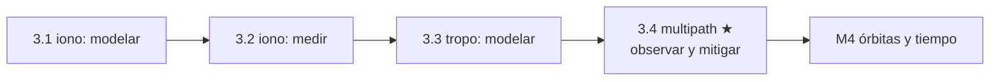

# Clase 3.4 — Multipath y ruido: el error que vive en tu antena

**Módulo 3 · Fuentes de error · ~3.5 h**

## Objetivos

- [ ] Entender el mecanismo: réplicas reflejadas que sesgan el correlador de código
- [ ] Explicar la asimetría código/fase (decímetros vs λ/4 ≈ 5 cm) y explotarla
- [ ] Derivar la combinación MP: código − fases = multipath + ruido (adiós geometría, relojes, tropo e iono)
- [ ] Medir MP1/MP5 en LPGS: magnitudes, firma en elevación, el σ_P del curso por fin medido
- [ ] Demostrar la repetición sideral GALILEO: la geometría (y sus reflejos) vuelve cada 10 días
- [ ] Cerrar el módulo: la tabla de las cuatro fuentes y su defensa

## ¿Dónde estamos?



Iono y tropo venían del cielo y afectaban a cualquier receptor de la
zona por igual. El multipath no: es la firma de TU entorno — el suelo,
el techo, el mástil de al lado — y por eso ninguna corrección
transmitida puede salvarte. La buena noticia: la asimetría entre código
y fase lo deja desnudo, y su carácter geométrico (determinista, no
aleatorio) lo vuelve predecible... si sabés cuándo vuelve el satélite.
Spoiler: Galileo tarda 10 días.

## Los datos

Día 166 (el de siempre) **más el día 176** para la repetición sideral:

```bash
python3 tools/fetch_data.py --date 2026-06-25 --que obs,brdc
python3 clases/mod3-errores/clase3.4-multipath/lab/soluciones/lab_multipath_solucion.py
```

## Teoría

### 1. El mecanismo: un eco que sesga el correlador

La antena recibe la señal directa (LOS) más réplicas reflejadas,
retrasadas Δ = 2h·sin(el) para un reflector horizontal a distancia h por
debajo. El correlador de código busca el pico de la señal compuesta: la
réplica deforma el pico y **sesga la medida** hasta ~medio chip para
reflejos lejanos. Como la geometría satélite–reflector–antena cambia
lento, el error no es ruido blanco: **oscila** con períodos de minutos
(el fading que vas a ver en E30).

### 2. La asimetría código/fase

El código E1 tiene chips de 293 m: un eco puede sesgarlo decímetros o
metros. La fase es una sinusoide de λ = 19 cm: la suma de fasores
(directo + reflejo más débil) puede correr la fase **a lo sumo λ/4 ≈
4.8 cm** — matemáticamente acotado. Esa desigualdad brutal (dm vs cm) es
la palanca de esta clase: la fase es una regla casi perfecta contra la
cual el código confiesa.

### 3. La combinación MP: el multipath desnudo

Con P₁ = ρ + I, Φ₁ = ρ − I + B₁, Φ₅ = ρ − γI + B₅, despejando I de las
dos fases y eliminándolo de P₁ − Φ₁:

$$ MP_1 = P_1 - \left(1+\tfrac{2}{\gamma-1}\right)\Phi_1 + \tfrac{2}{\gamma-1}\Phi_5 + \mathrm{cte} $$

Con γ = 1.7933: MP₁ = P₁ − 3.521·Φ₁ + 2.521·Φ₅ (y MP₅ = P₅ − 4.521·Φ₁ +
3.521·Φ₅). La combinación **elimina geometría, relojes, tropo e iono**;
la constante (ambigüedades + sesgos) se resta por arco continuo. Lo que
queda: multipath de código + ruido. Es EL observable de control de
calidad de estaciones GNSS desde los 90 (TEQC lo estandarizó).

### 4. Firma en elevación y mitigación

Los reflejos dominantes vienen del suelo ⇒ el multipath **vive cerca
del horizonte** (en LPGS: 34 cm bajo 30°, 11 cm sobre 60°). Mitigación
en capas: elegir el sitio, antena **choke ring** (mata reflejos que
llegan desde abajo — LPGS la tiene, por eso sus números son buenos),
máscara de elevación (el cutoff de 10° que usás desde la 1.5),
correladores estrechos en el receptor, y suavizado/filtrado en el
procesamiento. El chip corto de E5a (29 m, 10× menor) recorta los
reflejos lejanos: ~20–25% de mejora en elevaciones medias/altas.

### 5. La memoria geométrica: cada constelación con su calendario

El multipath es determinista: misma geometría + mismo entorno ⇒ mismo
error. ¿Y cuándo se repite la geometría? Cuando el satélite completa un
número entero de órbitas en un número entero de días sidéreos:

| constelación | período orbital | ciclo de repetición | shift vs reloj civil |
|---|---|---|---|
| GPS | ~11 h 58 m (2 rev/día) | **1 día sidéreo** | −236 s/día |
| Galileo | ~14 h 05 m | **10 días** (17 rev) | −2359 s / 10 días |

Por eso el "sidereal filtering" clásico de GPS resta el error de ayer —
y con Galileo hay que esperar 10 días para el mismo truco. Tu lab lo
demuestra: E30 del día 166 correlaciona 0.60 con E30 del día 176
corrido −2430 s (teórico −2359), y ~0 sin corrimiento.

### 6. La tabla final del módulo

| fuente | origen | carácter | defensa |
|---|---|---|---|
| ionosfera | el cielo (plasma) | grande y salvaje | **medir** (2 frec.) |
| troposfera | el cielo (gas neutro) | grande y mansa | **modelar** (física) |
| multipath | TU entorno | local y determinista | **mitigar + observar** |
| ruido | tu receptor | blanco | **promediar** (√N) |

Nada global te salva del multipath: no viaja en la señal ni en la
corrección de nadie. Sitio, antena y procesamiento — o convertirlo en
sensor (ver caso real).

## Lab guiado

1. `lab/lab_multipath_TODO.ipynb` — completá los coeficientes y las
   combinaciones; la firma de elevación sale sola.
2. Solución en `lab/soluciones/` — agrega la repetición sideral 166↔176.
3. Figuras: `python3 img/make_figures.py`.

**Tabla de validación** (LPGS, día 166, 12:00–13:30):

| Chequeo | Valor esperado |
|---|---|
| coeficientes MP1 / MP5 | 3.521, 2.521 / 4.521, 3.521 |
| RMS MP1 / MP5 global | 25.1 / 23.3 cm |
| σ ruido (dif/√2) E1 / E5a | 26.1 / 20.7 cm |
| firma: MP1 a 10–20° vs 60–90° | 34.3 vs 10.6 cm (×3.2) |
| ventaja E5a a 45–60° | 10.5 vs 14.4 cm (~27%) |
| sideral: lag óptimo / teórico | −2430 s / −2359 s |
| correlación con y sin corrimiento | 0.60 vs −0.03 |

## Ejercicios a mano

**E1.** Derivá los coeficientes de MP₁ partiendo de P₁, Φ₁, Φ₅ (despejá
I de las fases). Verificá que eliminan geometría, reloj, tropo e iono, y
calculá los de MP₅.

**E2.** Demostrá que el multipath de FASE está acotado por λ/4: sumá el
fasor directo (amplitud 1) y un reflejo (amplitud α < 1, fase
cualquiera) y maximizá el corrimiento de fase resultante. ¿Cuántos cm
son en E1 y en E5a?

**E3.** Un reflector horizontal (el suelo) está h = 2 m por debajo de la
antena. Calculá el retardo extra del eco Δ = 2h·sin(el) a 10°, 30° y
90°. ¿En qué unidades del chip de E1 y de E5a queda? ¿Cuál código sufre
más ese eco?

## Estimaciones Fermi

**F1.** El fading del multipath oscila con frecuencia
f ≈ (2h/λ)·d(sin el)/dt. Para h = 2 m, λ = 19 cm y un satélite que sube
0.1°/min cerca de 20° de elevación: ¿cuál es el período de oscilación?
¿Se ve con muestreo de 30 s? (Es la base de GNSS-IR, el caso real.)

**F2.** El multipath tiene tiempo de correlación de ~minutos: promediar
N épocas de 30 s NO lo baja como 1/√N hasta que superás ese tiempo.
Estimá cuánto baja el RMS de 34 cm (elevación baja) al promediar 1 min,
5 min, 20 min. ¿Dónde está el codo?

**F3.** Verificá los shifts de la tabla: GPS 2 órbitas en un día sidéreo
(86164 s) y Galileo 17 órbitas en 10 días sidéreos. ¿Cuántos segundos
por día (GPS) y por ciclo (Galileo) se adelanta la geometría respecto
del reloj civil? ¿A qué hora habría que mirar el día 186 para ver de
nuevo a E30?

## Preguntas conceptuales

**C1.** ¿Por qué el multipath no se puede transmitir como corrección
(estilo Klobuchar o SBAS)? Cerrá la serie del módulo: iono
global-corregible, tropo local-modelable, multipath local-¿qué?
**C2.** ¿Por qué la constante del MP se resta POR ARCO y qué le pasa al
observable cuando hay un salto de ciclo en Φ₁ o Φ₅? ¿Cómo lo detecta
`sub_arcos`?
**C3.** En tu corrida, σ(dif)/√2 ≈ RMS total. ¿Qué te dice eso del
tiempo de correlación del "multipath" de LPGS a 30 s? ¿Qué esperarías en
una estación SIN choke ring al lado de una chapa?
**C4.** ¿Por qué la ventaja del chip corto de E5a aparece en elevaciones
medias/altas pero se esfuma debajo de 20°?
**C5.** Un spoofer de UNA antena transmite todos los "satélites" por el
mismo canal físico: ¿qué pasa con el multipath de cada canal? ¿Cómo
usarías MP1 por satélite (o la correlación entre canales) como detector?
¿Y qué rol juega la firma sideral como "huella del entorno legítimo"?

## Pregunta de entrevista

*"¿Cómo reducirías el multipath en una estación de referencia?"* — Guía
en capas: **sitio** (lejos de superficies, horizonte limpio), **antena**
(choke ring / ground plane, polarización RHCP que rechaza el reflejo
invertido), **receptor** (correladores estrechos, tracking robusto),
**procesamiento** (máscara de elevación, pesado por elevación/C-N0,
sidereal filtering con el calendario de CADA constelación), y
**monitoreo** (MP1/MP5 como QC continuo — exactamente tu lab). Bonus de
integridad: el multipath residual entra en los presupuestos como error
correlacionado en el tiempo, no blanco.

## Mini-simulacro (12 min)

1. Escribí MP₁ con sus coeficientes numéricos. ¿Qué elimina y qué deja?
2. ¿Por qué el multipath de fase ≤ λ/4 y el de código puede ser 100×
   mayor?
3. ¿Cada cuánto se repite la geometría Galileo y por qué (números)?
4. En tu corrida: ¿RMS MP1 global, y abajo vs arriba de 30°?
5. V/F: "el multipath es ruido aleatorio". Refutalo con tu figura 3.

## Figuras

| | |
|---|---|
| `img/fig1_series_elevacion.svg` | E29 (68°, ±20 cm) vs E30 (25°, ±1 m): el multipath vive abajo |
| `img/fig2_elevacion_rms.svg` | La firma ×3.2 en elevación + el σ_P del curso medido |
| `img/fig3_sideral.svg` | E30 hoy vs E30 en 10 días: el mismo reflejo, correlación 0.60 |

## Caso real — GNSS-IR: el multipath como instrumento

La reflectometría GNSS (GNSS-IR) da vuelta esta clase entera: si el
fading del multipath depende de la altura antena–reflector
(f ≈ 2h/λ·d sin el/dt, tu F1), entonces **medir la frecuencia del fading
es medir h**. Con eso, estaciones geodésicas comunes se convirtieron en
sensores de profundidad de nieve (h baja cuando nieva), humedad de suelo
(la fase del patrón cambia con la constante dieléctrica) y nivel del mar
(mareógrafos GNSS en estaciones costeras) — redes enteras como PBO/EarthScope
publican estos productos operativamente. Es el segundo "error de uno,
dato de otro" del módulo, y el más irónico: el enemigo de la clase es el
instrumento. La otra cara, para tu perfil: el **sidereal filtering** usa
la memoria geométrica para restar el multipath de ayer (GPS) o de hace
10 días (Galileo) en monitoreo de deformación de presas y volcanes — y
esa misma memoria es una *huella del entorno legítimo*: un spoofer de
una antena no puede reproducir el patrón de multipath por satélite que
tu sitio imprime, ni su calendario sideral (tu C5).

## Glosario

**multipath (MP)** error por réplicas reflejadas · **LOS/NLOS** línea de
vista directa / solo reflejo · **combinación MP** código − fases: MP +
ruido + cte · **fading** oscilación del error por interferencia
directo-reflejo · **choke ring** antena con anillos que rechazan
reflejos desde abajo · **sidereal filtering** restar el error de la
repetición geométrica anterior · **ciclo de repetición** 1 día sidéreo
(GPS), 10 días (Galileo) · **GNSS-IR** reflectometría: el fading como
sensor · **TEQC/anubis** herramientas QC que reportan MP1/MP2.

## Cheat sheet

```
MP1 = P1 − 3.521·Φ1 + 2.521·Φ5      (k = 2/(γ−1) = 2.521)
MP5 = P5 − 4.521·Φ1 + 3.521·Φ5      (k' = 2γ/(γ−1) = 4.521)
elimina geometría+relojes+tropo+iono | queda MP+ruido+cte(por arco)
fase acotada: ≤ λ/4 = 4.8 cm (E1)   | código: hasta ~chip/2
retardo del eco: Δ = 2h·sin(el)     | fading: f ≈ (2h/λ)·d(sin el)/dt
repetición: GPS 1 día sidéreo (−236 s/d) | Galileo 10 días (−2359 s)
QC estándar: RMS de MP por banda y elevación
```

## Errores comunes

1. Olvidar que georinex da la fase en CICLOS (× λ antes de combinar).
2. Restar UNA media global en vez de por arco (las ambigüedades cambian
   por arco: te inventás multipath).
3. No partir el arco en un salto de ciclo (un escalón de metros
   contamina todo el detrend).
4. Esperar la repetición sideral de Galileo al día siguiente (es a los
   10 días; al otro día la correlación da ~0).
5. Interpretar σ(dif)/√2 como "el ruido puro" sin mirar el tiempo de
   correlación del multipath a tu cadencia.
6. Comparar MP1 entre estaciones sin igualar máscara de elevación (el
   RMS depende brutalmente de cuánto horizonte dejás entrar).

## Referencias

- Estey & Meertens (1999), *TEQC: the multi-purpose toolkit for
  GPS/GLONASS data* — el MP1/MP2 canónico
- Braasch, *Multipath*, en Springer Handbook of GNSS (2017)
- Larson et al. — serie GNSS-IR (nieve, suelo, nivel del mar)
- Choi et al. (2004), *Modified sidereal filtering* — la repetición GPS
- Navipedia — Multipath / Galileo ground track repeat (10 días)

## Para tu bitácora

Completá `bitacora.md` contra la tabla. **Rúbrica**: ⭐ implementás
MP1/MP5 y reproducís RMS y firma de elevación · ⭐⭐ + corrés la
repetición sideral 166↔176 y explicás el lag de −2430 s con el ciclo de
17 órbitas · ⭐⭐⭐ + GNSS-IR de juguete: espectro de MP1 vs sin(el) del
satélite más bajo (Lomb–Scargle o FFT sobre grilla) y estimá la altura
de la antena de LPGS sobre su reflector; o repetí el análisis con CORD y
comparó la calidad de ambos sitios.

**Fin del módulo 3.** Checkpoints antes de seguir: (1) ¿por qué la iono
es dispersiva y la tropo no, y qué habilita eso? (2) ¿qué signo tiene la
iono en código vs fase? Si los tenés, seguís con el **módulo 4: órbitas y tiempo** — de dónde
salen las efemérides y relojes que venís usando desde la 1.5. (La
autenticación OSNMA te espera en el módulo 6, con la integridad del 5
en el medio: primero entender qué transmite el sistema, después cuánto
confiar, y al final cómo verificarlo criptográficamente.)
