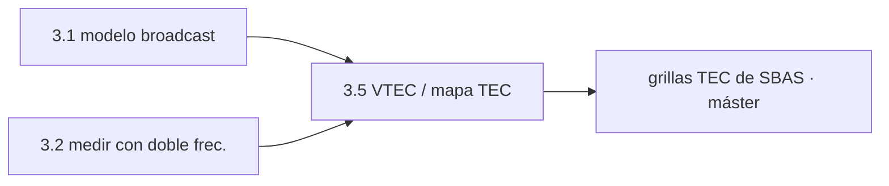

# Clase 3.5 — De medir la ionosfera a estimarla: VTEC y mapas TEC

> Bloque del máster: B4 — System · Algoritmos de estimación de la ionosfera

**Objetivo en una frase**: dar el salto de *medir* la ionosfera con doble
frecuencia (3.2) a *estimarla como sistema* — convertir el retardo en VTEC
sobre el punto ionosférico, la semilla de los mapas TEC (IGS/SBAS).

**Tiempo estimado**: 2.5 h (teoría 50' · lab-lite 60' · cierre 40'). Conceptual: la estimación completa a nivel sistema es teoría del máster; acá llegás con la pieza.

## 1. Objetivos

- [ ] Convertir el retardo iono medido (3.2) en TEC oblicuo (STEC).
- [ ] Proyectar a TEC vertical (VTEC) con la función de oblicuidad.
- [ ] Ubicar cada VTEC en su punto ionosférico (IPP).
- [ ] Entender cómo esos VTEC se interpolan en un mapa TEC (IGS/SBAS).

## 2. ¿Dónde estamos?

Cierra la escalera de la ionosfera del path: 3.1 la **modela** (Klobuchar),
3.2 la **mide** (doble frecuencia), 3.5 la **estima como sistema** (VTEC →
mapa). Es un ítem B4 cuya versión completa es del máster; acá llegás con la
semilla funcionando sobre datos reales.



## 3. Teoría (con blancos B1–B5)

### 1. De retardo a TEC

La doble frecuencia (3.2) mide el retardo iono en L1: $I_1 = (P_5-P_1)/(\gamma-1)$.
Y el retardo se relaciona con el **TEC** (contenido total de electrones) por
$I_1 = \frac{40.3}{f_1^2}\,\text{TEC}$. Despejando, cada satélite te da un
**STEC** (TEC oblicuo, a lo largo del rayo).

### 2. Oblicuo a vertical (VTEC)

El STEC depende del ángulo (un rayo rasante cruza más ionosfera). Para
comparar entre satélites se proyecta a **VTEC** (vertical) con la **función
de oblicuidad** (modelo de capa fina a ~350 km). El VTEC es (casi)
independiente de la geometría: representa la ionosfera *sobre un punto*.

### 3. El punto ionosférico (IPP)

Ese "punto" es el **IPP**: donde el rayo cruza la capa fina. Cada VTEC se
ubica en su IPP (lat, lon). Un receptor con 8 satélites produce 8 VTEC en 8
IPP distintos: un muestreo disperso de la ionosfera sobre su región.

### 4. Del VTEC al mapa TEC

Con **muchos** receptores y satélites, esos VTEC dispersos se **interpolan**
en una grilla: el **mapa TEC** (global tipo IGS, regional tipo SBAS/EGNOS).
Ese mapa es lo que el sistema transmite a los receptores **monofrecuencia**
(que no pueden medir la iono, 3.1): les "presta" la doble frecuencia.

### Lectura activa (B1–B5)

<details><summary>Completá y verificá</summary>

- **B1.** El retardo se relaciona con el TEC por el factor ______/f².
- **B2.** El STEC es oblicuo; se pasa a ______ con la función de oblicuidad.
- **B3.** El VTEC se ubica en el ______ (donde el rayo cruza la capa a ~350 km).
- **B4.** Muchos VTEC dispersos se ______ en una grilla: el mapa TEC.
- **B5.** El mapa sirve para corregir a receptores ______ (que no miden la iono).

Respuestas: B1 40.3 · B2 vertical (VTEC) · B3 IPP · B4 interpolan · B5 monofrecuencia
</details>

## 4. Lab-lite

```bash
python3 clases/mod3-errores/clase3.5-iono-sistema/lab/lab_iono_sistema_TODO.py
```

Convertís el retardo medido en VTEC sobre datos reales (LPGS, día 166).
Solución en `lab/soluciones/`.

### Tabla de validación (día 166, 12:00–12:30, satélites >20°)

| Métrica | Valor de referencia |
|---|---|
| Muestras VTEC | ~**415** |
| VTEC mediana | **~12 TECU** |
| Retardo vertical L1 | **~2.0 m** |

12 TECU es un valor típico de latitud media; la dispersión (6–17) refleja
distintos IPP y la variabilidad de la ionosfera — justo lo que un mapa
captura espacialmente.

## 5. Ejercicios a mano

**E1.** 12 TECU × 0.162 m/TECU = ¿cuánto retardo vertical en L1? ¿Y oblicuo
a 20° de elevación (÷ oblicuidad)?

**E2.** ¿Por qué el VTEC es mejor que el STEC para armar un mapa?

**E3.** ¿Por qué un receptor monofrecuencia necesita el mapa TEC del sistema
y uno de doble frecuencia no?

## 6. Estimaciones Fermi

**F1.** Si un receptor ve 8 satélites, ¿cuántos puntos (IPP) aporta al mapa
por época? Con 300 estaciones IGS, ¿cuántos IPP por época a nivel global?

**F2.** La ionosfera varía en escalas de ~1 h y cientos de km. ¿Cada cuánto
y con qué densidad de IPP hay que muestrear para un mapa útil?

## 7. Preguntas conceptuales

<details><summary>C1. ¿Por qué el VTEC "normaliza" el STEC?</summary>

El STEC depende de cuánta ionosfera atravesó el rayo (ángulo). El VTEC lo
proyecta a la vertical, quitando ese efecto geométrico: así dos satélites
distintos sobre el mismo IPP dan VTEC comparables → se pueden interpolar.
</details>

<details><summary>C2. ¿Qué relación hay entre este mapa y SBAS (5.3)?</summary>

SBAS transmite correcciones ionosféricas en grilla (más los parámetros de
confianza) para receptores monofrecuencia de aviación. Ese es el mapa TEC
"operacional" con integridad: la 5.3 usa su output, la 3.5 muestra su
insumo.
</details>

<details><summary>C3. ¿Por qué esto es "semilla" y no la estimación completa?</summary>

La estimación real a nivel sistema resuelve además los sesgos de hardware
(DCB de satélite y receptor), usa modelos 3D y asimilación, y produce
integridad. Acá llegás con el VTEC crudo bien entendido: la base sobre la
que el máster construye.
</details>

## 8. Pregunta de entrevista

> "Explicá cómo se pasa de una medición de doble frecuencia a un mapa TEC.
> ¿Qué es el VTEC, el IPP y para qué sirve el mapa?"

**Mini-caso**: te piden estimar la ionosfera regional sobre Argentina con
las estaciones RAMSAC. ¿Qué medís, cómo lo proyectás y qué te falta para un
mapa con integridad?

## 9. Mini-simulacro (10 min)

1. ¿Cómo se obtiene STEC de la doble frecuencia?
2. STEC → VTEC: ¿con qué y por qué?
3. ¿Qué es el IPP?
4. ¿Cómo se arma el mapa TEC?
5. ¿Para quién es el mapa?

<details><summary>Respuestas</summary>

1. STEC=I1/(40.3/f1²)/1e16 con I1=(P5−P1)/(γ−1). 2. con la oblicuidad, para
quitar el efecto geométrico y poder comparar/interpolar. 3. el punto donde
el rayo cruza la capa fina (~350 km). 4. interpolando VTEC de muchos IPP en
una grilla. 5. receptores monofrecuencia (SBAS).
</details>

## 10. Caso real — los mapas TEC del IGS y el clima espacial

El IGS publica **mapas globales de ionosfera (GIM)** en formato IONEX desde
finales de los 90, generados exactamente así: miles de receptores de doble
frecuencia aportan VTEC en sus IPP, y los centros de análisis los
interpolan en una grilla global cada ~15 min–2 h. Esos mapas son la
referencia del **clima espacial** (tormentas ionosféricas como la de mayo
2024 que vio tu clase 3.1) y el insumo de SBAS para aviación. Tu lab-lite
produce el ladrillo elemental de ese edificio: un VTEC bien calibrado sobre
un punto. Escalar a un mapa es sumar estaciones e interpolar — y ahí entra
la teoría de estimación del máster.

## 11. Glosario ES/EN

| ES | EN | Nota |
|---|---|---|
| TEC | TEC | contenido total de electrones (TECU = 1e16 e/m²) |
| STEC / VTEC | slant / vertical TEC | oblicuo / vertical |
| IPP | ionospheric pierce point | dónde el rayo cruza la capa fina |
| función de oblicuidad | mapping function | proyecta STEC↔VTEC |
| mapa TEC / GIM | TEC map / GIM | grilla global de VTEC (IONEX) |
| DCB | DCB | sesgos de código de hardware (a resolver en el sistema) |

## 12. Cheat sheet

```text
Retardo↔TEC   I1 = (40.3/f1²)·TEC   →  STEC[TECU] = I1/(40.3/f1²)/1e16
I1 medido     (P5 − P1)/(γ − 1)      (doble frecuencia, 3.2)
STEC→VTEC     VTEC = STEC · oblicuidad(el)   (capa fina ~350 km)
IPP           donde el rayo cruza la capa → (lat, lon) del VTEC
Mapa TEC      interpolar muchos VTEC/IPP → grilla (IGS global / SBAS regional)
Uso           corregir a receptores MONOFRECUENCIA (los de doble ya la miden)
Ref 166       VTEC ~12 TECU sobre LPGS → ~2 m de retardo vertical
```

## 13. Errores comunes

1. Mapear STEC en vez de VTEC (el STEC depende del ángulo, no es comparable).
2. Olvidar la máscara de elevación: a baja elevación el VTEC es ruidoso.
3. Ignorar los DCB de hardware (el sistema real los estima; acá se omiten).
4. Confundir el modelo (Klobuchar, 3.1) con la estimación (medida, 3.5).
5. Creer que el mapa es para todos: es sobre todo para monofrecuencia.

## 14. Referencias

- IGS — mapas globales de ionosfera (GIM), formato IONEX.
- Sanz Subirana et al., ESA Vol. I — cap. de ionosfera y TEC.
- Navipedia — "Ionospheric Delay", "TEC Mapping".
- Clases 3.1 (modelo), 3.2 (medición), 5.3 (SBAS usa el mapa).

## 15. Rúbrica de autoevaluación

- ⭐ Explico STEC, VTEC e IPP y la relación retardo↔TEC.
- ⭐⭐ Calculo VTEC desde datos reales y obtengo ~12 TECU.
- ⭐⭐⭐ Explico cómo se arma un mapa TEC y para qué sirve (SBAS/monofrecuencia).

## 16. Para tu bitácora

Copiá [`bitacora.md`](bitacora.md): tu VTEC vs la tabla y una frase sobre
cómo se pasa de un VTEC puntual a un mapa TEC. Con esto cerrás la escalera
de la ionosfera (3.1 → 3.2 → 3.5).
