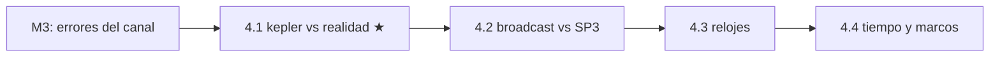

# Clase 4.1 — Propagador kepleriano vs realidad

**Módulo 4 · Órbitas y tiempo · ~3 h**

## Objetivos

- [ ] Entender por qué la efeméride broadcast tiene 16 parámetros y no 6
- [ ] Identificar qué perturbación absorbe cada corrección del ICD (Δn, Cxx, IDOT)
- [ ] Medir el peso de cada corrección propagando con y sin ella
- [ ] Ver la firma temporal de cada término (qué se anula en Toe y qué no)
- [ ] Cuantificar el salto en los empalmes entre efemérides consecutivas
- [ ] Entender por qué la broadcast se re-emite cada ~3 h y no se extrapola

## ¿Dónde estamos?



Cerramos el módulo de errores viendo cómo la señal se degrada en el
camino (iono, tropo, multipath). Ahora subimos al origen: la **posición
del satélite** y **su reloj**, las dos entradas que el PVT da por
sabidas. En la clase 0.3 resolviste Kepler; en la 1.3/1.5 lo usaste con
la broadcast. Hoy respondemos por qué esa broadcast no es una simple
elipse — y qué tan lejos de la realidad está el modelo de dos cuerpos.

## Los datos

Los mismos de siempre: la BRDC del día 166. No hay nada que descargar
(las órbitas precisas SP3 llegan en la 4.2).

```bash
python3 clases/mod4-orbitas/clase4.1-kepler/lab/soluciones/lab_kepler_solucion.py
```

## Teoría

### 1. Seis parámetros bastan... para dos cuerpos

Una órbita kepleriana pura queda definida por seis elementos: semieje
mayor, excentricidad, inclinación, ascensión del nodo, argumento del
perigeo y anomalía. Con eso y la ley de Kepler, propagás a cualquier
instante. Pero eso vale para **dos masas puntuales**. La realidad tiene
más actores.

### 2. Las perturbaciones que rompen la elipse

Sobre un satélite MEO (Galileo a ~23200 km de altura, 29600 km de
radio) actúan, de mayor a menor:

- **Achatamiento terrestre (J2)**: la Tierra no es una esfera; su
  abultamiento ecuatorial es la perturbación dominante. Hace precesar el
  nodo y el perigeo, y mete oscilaciones de período orbital.
- **Atracción luni-solar**: el Sol y la Luna tiran del satélite;
  inclinan y deforman la órbita lentamente.
- **Presión de radiación solar**: los fotones empujan; depende de la
  geometría Sol-satélite y del modelo del cuerpo (el famoso "box-wing").
- Mareas, relatividad, etc.: más chicas, pero POD las incluye.

Ninguna es despreciable a nivel métrico. Una elipse pura propagada medio
día se va **kilómetros**.

### 3. La solución del ICD: un kepleriano con parches

En vez de transmitir un modelo de fuerzas (imposible en 500 bits), el
segmento de control **ajusta** un conjunto de parámetros keplerianos +
correcciones para que reproduzcan la órbita real sobre un arco corto:

| corrección | qué absorbe | firma temporal |
|---|---|---|
| **Δn** (DeltaN) | error de fase a lo largo de la órbita | ∝ tk (cero en Toe, crece) |
| **Cus, Cuc** | perturbación en el argumento de latitud | oscila (2φ) |
| **Crs, Crc** | perturbación en el radio | oscila (2φ) |
| **Cis, Cic** | perturbación en la inclinación | oscila (2φ) |
| **IDOT** | deriva de la inclinación (luni-solar) | ∝ tk |
| **OmegaDot** | precesión del nodo (J2) | ∝ tk |

Los seis armónicos Cxx corrigen sobre todo J2; como el achatamiento
actúa **siempre**, esos términos NO se anulan en Toe (a diferencia de Δn
e IDOT, que son ∝ tk). Esa diferencia de firma es la que vas a ver.

### 4. Arco de validez y re-emisión

Cada juego de parámetros vale ~3-4 h. Fuera de esa ventana, el ajuste ya
no sigue a la órbita real y el error crece rápido. Por eso la broadcast
**se re-emite** con parámetros frescos cada pocas horas, y el receptor
elige la efeméride con Toe más cercano (tu `elegir_efemeride`). El salto
entre efemérides consecutivas —lo que el operador re-ajustó— es una
medida directa de cuánto "se movió" la realidad respecto del modelo
viejo: en Galileo, sub-métrico.

## Lab guiado

1. `lab/lab_kepler_TODO.ipynb` — armá el propagador con perillas y medí
   cada corrección.
2. Solución en `lab/soluciones/` — agrega empalmes y extrapolación a 12 h.
3. Figuras: `python3 img/make_figures.py`.

**Tabla de validación** (E05, Galileo, día 166):

| Chequeo | Valor esperado |
|---|---|
| órbita | a ≈ 29600 km, e ≈ 3.4e-4, i ≈ 55.5° |
| residuo sin Δn (máx / en Toe) | 546 / 0 m |
| residuo sin armónicos (máx / en Toe) | 442 / 208 m |
| residuo sin IDOT (máx / en Toe) | 73 / 0 m |
| residuo solo 2 cuerpos (máx) | 239 m |
| salto medio en empalmes | 0.73 m (máx 1.72) |
| elipse pura extrapolada 2 / 6 / 12 h | 187 / 2080 / 3603 m |

(Que "2 cuerpos" dé MENOS que "sin Δn" no es error: al apagar todo, los
términos se cancelan parcialmente entre sí — ver C2.)

## Ejercicios a mano

**E1.** La velocidad angular media de un MEO Galileo es
n₀ = √(μ/a³). Calculala con a = 29600 km y μ = 3.986e14, y sacá el
período orbital. ¿Cuántas vueltas da en un día sidéreo? (Conecta con la
repetición de 10 días de la 3.4.)

**E2.** El término Δn corrige el movimiento medio. Si Δn ≈ 2.5e-9 rad/s,
¿cuánto error de anomalía acumula en 2 h? Multiplicá por el radio para
estimar el error posicional a lo largo de la órbita. ¿Coincide con el
orden de los 546 m del lab?

**E3.** La precesión del nodo por J2 vale aproximadamente
Ω̇ = −1.5·n·J2·(R_T/a)²·cos(i), con J2 = 1.08e-3 y R_T = 6378 km.
Calculala para Galileo (i = 56°) y compará con OmegaDot del mensaje.
¿Por qué el ICD la transmite como parámetro en vez de que el receptor la
calcule?

## Estimaciones Fermi

**F1.** Un error de 500 m en la posición del satélite, ¿cuánto error de
rango produce en el peor caso (satélite en el horizonte, error radial) y
en el mejor (error tangencial)? ¿Por qué la componente radial de la
órbita importa más que las otras dos para el PVT?

**F2.** La broadcast se re-emite cada ~3 h con ~0.7 m de salto. Si en vez
de eso el operador quisiera un solo juego de parámetros válido 24 h con
el mismo error, ¿de qué orden tendría que ser la precisión del modelo?
¿Por qué es más barato re-emitir seguido?

**F3.** POD (Precise Orbit Determination) llega a pocos cm usando redes
de decenas de estaciones. Estimá cuántas mediciones de rango acumula una
red de 30 estaciones sobre un satélite en un arco de 24 h (una cada
30 s) y por qué esa redundancia permite bajar de 0.7 m (broadcast) a
0.03 m (SP3, la 4.2).

## Preguntas conceptuales

**C1.** ¿Por qué la broadcast transmite parámetros ajustados y no un
modelo de fuerzas? ¿Qué ventaja tiene para el receptor (que solo tiene
que evaluar Kepler + correcciones)?
**C2.** En el lab, apagar TODO (2 cuerpos, 239 m) da menos residuo que
apagar solo Δn (546 m). ¿Cómo puede ser que quitar más correcciones
mejore el número? (Pista: los términos no son independientes; se
compensan.)
**C3.** Los armónicos Cxx no se anulan en Toe pero Δn e IDOT sí. ¿Qué
dice eso sobre la naturaleza física de lo que corrige cada uno
(permanente vs acumulativo)?
**C4.** El salto en el empalme entre efemérides es sub-métrico en
Galileo. ¿Qué pasaría con ese salto si el arco de validez fuera de 12 h
en vez de 3 h? ¿Y qué tiene que ver con la calidad del segmento de
control?
**C5.** Un atacante que quiera spoofear la posición de un satélite puede
manipular los parámetros de efeméride del mensaje. ¿Esto lo protege
OSNMA (M6)? ¿Y qué chequeo de "sanidad física" —del estilo de este lab—
podría detectar una efeméride falsa aunque estuviera bien formada?

## Pregunta de entrevista

*"¿Qué diferencia hay entre la efeméride broadcast y una órbita precisa,
y de dónde viene esa diferencia?"* — Guía: la broadcast es un ajuste
kepleriano + correcciones sobre un arco corto, transmitido en el
mensaje, con precisión sub-métrica a métrica y latencia cero. La precisa
(SP3) viene de POD con redes globales, tablas de posición cada 5-15 min,
precisión de pocos cm, pero con latencia (horas a semanas). La
diferencia son las perturbaciones que la broadcast no alcanza a seguir
con un solo juego de parámetros y que POD modela con física detallada +
redundancia de observaciones. La 4.2 mide esa diferencia.

## Mini-simulacro (12 min)

1. ¿Por qué 6 parámetros no bastan para una órbita GNSS real?
2. Nombrá las tres perturbaciones principales de un MEO, de mayor a
   menor.
3. ¿Qué corrección del ICD se anula en Toe y cuál no? ¿Por qué?
4. En tu corrida: ¿cuánto valía Δn en el arco? ¿Y la elipse pura a 12 h?
5. V/F: "la broadcast es una elipse de dos cuerpos". Corregilo.

## Figuras

| | |
|---|---|
| `img/fig1_correcciones.svg` | El residuo de cada corrección en el arco ±2 h: firmas distintas |
| `img/fig2_toe_empalme.svg` | Qué se anula en Toe y qué no + el salto sub-métrico en empalmes |
| `img/fig3_extrapolacion.svg` | La elipse pura acumula km: por qué se re-emite cada 3 h |

## Caso real — POD y el ecosistema IGS

Lo que en este lab tratás como "la verdad" (la broadcast completa) es en
realidad el escalón más bajo de precisión orbital. Por encima está la
**Determinación Precisa de Órbitas (POD)**: el IGS y sus centros de
análisis (CODE en Berna, GFZ, ESA/ESOC, entre otros) toman las
observaciones de cientos de estaciones permanentes distribuidas por el
planeta, modelan todas las fuerzas con detalle (gravedad de alto grado,
luni-solar, presión de radiación con modelos del cuerpo del satélite,
mareas terrestres y oceánicas, relatividad) y ajustan órbitas de pocos
centímetros que se publican como archivos SP3. Ese producto es la
columna vertebral de todo lo que necesita precisión real —PPP, geodesia,
estudios de deformación, el marco de referencia terrestre ITRF mismo— y
es lo que vas a descargar en la 4.2 para medir, con números, cuánto le
erra la broadcast. Galileo, con su combinación de máseres de hidrógeno y
una constelación joven bien determinada, suele estar entre las órbitas
mejor conocidas. Para tu perfil: la posición del satélite es un dato
que, si se corrompe (efeméride falsa), degrada el PVT sin que ningún
modelo de canal lo note — un chequeo de consistencia física de la
efeméride, del estilo de este lab, es una capa de defensa complementaria
a la autenticación criptográfica del mensaje (M6).

## Glosario

**efeméride broadcast** parámetros orbitales del mensaje de navegación ·
**elemento kepleriano** uno de los 6 que definen una órbita de dos
cuerpos · **Toe** time of ephemeris, época de referencia de la órbita ·
**Δn / IDOT / Cxx** correcciones del ICD al movimiento medio /
inclinación / armónicos · **J2** coeficiente del achatamiento terrestre
(perturbación dominante) · **perturbación** fuerza que aparta la órbita
de la elipse ideal · **arco de validez** ventana donde la efeméride es
precisa (~3 h) · **POD** determinación precisa de órbitas · **SP3**
formato de órbitas precisas (posición cada 5-15 min) · **MEO** órbita
terrestre media (donde viven GPS/Galileo).

## Cheat sheet

```
kepleriano puro: 6 elementos (a, e, i, Ω, ω, ν) + ley de Kepler
broadcast ICD: + Δn, IDOT, OmegaDot, 6×Cxx (parches de perturbaciones)
J2 (achatamiento): la perturbación dominante — precesa nodo y perigeo
firma temporal: Δn, IDOT ∝ tk (0 en Toe) | Cxx oscilan (0 en Toe NO)
arco de validez: ~3 h -> se re-emite; NO se extrapola (km en 12 h)
n0 = sqrt(mu/a^3) | mu = 3.986e14 | Galileo a~29600 km, T~14 h
broadcast: sub-metrico a metrico, latencia 0 | SP3 (POD): ~cm, con latencia
```

## Errores comunes

1. Creer que la broadcast es una elipse de dos cuerpos (son 16
   parámetros: kepleriano + parches).
2. Extrapolar una efeméride fuera de su arco de validez (crece a km).
3. Olvidar que la corrección de reloj (af0/af1/af2) es aparte de la
   órbita — la vemos en la 4.3.
4. Confundir Toe (época de la órbita) con Toc (época del reloj): pueden
   diferir.
5. Pensar que apagar más correcciones siempre empeora el número (se
   cancelan parcialmente entre sí).
6. Ignorar que la componente RADIAL del error orbital pesa más en el
   rango que las tangenciales.

## Referencias

- Galileo OS SIS ICD — algoritmo de efemérides y correcciones
- ESA *GNSS Data Processing Vol. I* — órbitas y perturbaciones
- Montenbruck & Gill, *Satellite Orbits* — el texto de perturbaciones
- IGS / MGEX — productos de órbita precisa (SP3)
- Navipedia — GPS/Galileo Satellite Coordinates Computation

## Para tu bitácora

Completá `bitacora.md` contra la tabla. **Rúbrica**: ⭐ armás el
propagador con perillas y reproducís los residuos de cada corrección ·
⭐⭐ + explicás la firma temporal (qué se anula en Toe) y el salto
sub-métrico de los empalmes · ⭐⭐⭐ + calculás la precesión del nodo por
J2 con la fórmula analítica y la comparás con el OmegaDot transmitido; o
descomponés el residuo en componentes radial/along-track/cross-track
(RTN) y mostrás cuál domina.

Próximo paso → **Clase 4.2 (broadcast vs SP3)**: bajamos las órbitas
precisas de verdad (CODE MGEX), las interpolamos con Lagrange y medimos,
con números, cuánto le erra la broadcast a la realidad.
