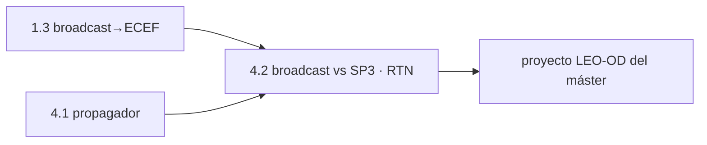

# Clase 4.2 — Broadcast vs órbitas precisas: cuánto y en qué dirección erra

> Bloque del máster: B4 — System · Algoritmos de órbita (POD / OD&TS)

**Objetivo en una frase**: medir el error de la efeméride broadcast contra
el SP3 preciso, **descompuesto en Radial/Along/Cross (RTN)**, y ver por
qué la radial es la que le importa al usuario — por constelación.

**Tiempo estimado**: 3–3.5 h (teoría 50' · lab 100' · ejercicios y cierre 40').

## 1. Objetivos

- [ ] Interpolar el SP3 (Lagrange) y propagar la broadcast (motor de 1.3).
- [ ] Descomponer la diferencia en Radial, Along-track y Cross-track.
- [ ] Comparar Galileo vs GPS y entender por qué difieren.
- [ ] Saber por qué la componente radial domina el error de rango (SISRE).

## 2. ¿Dónde estamos?

Continúa el 4.1 (propagador kepleriano): ahora en vez de apagar
correcciones del ICD, comparamos la broadcast completa contra la **verdad**
(SP3). Reusa `kepler_a_ecef` de 1.3 y el SP3/CLK de 0.4. Es la antesala del
POD real (estimar la órbita desde observaciones), que es el proyecto LEO-OD
del máster.



## 3. Teoría (con blancos B1–B5)

### 1. Dos órbitas del mismo satélite

La **broadcast** la calcula el segmento de control y la sube al satélite;
disponible al instante, error de ~1–2 m. El **SP3** lo calcula una red
global *a posteriori* con error de ~2–3 cm — nuestra **verdad de
referencia**. La diferencia es el error de la broadcast.

### 2. RTN: no todo error pesa igual

Descomponemos la diferencia en tres ejes ligados a la órbita:

- **Radial (R)**: a lo largo de la línea Tierra→satélite.
- **Along-track (A)**: en la dirección del movimiento.
- **Cross-track (C)**: normal al plano orbital.

$$R = \frac{\mathbf{r}}{|\mathbf{r}|},\quad C = \frac{\mathbf{r}\times\mathbf{v}}{|\mathbf{r}\times\mathbf{v}|},\quad A = C\times R$$

### 3. Por qué la radial manda (SISRE)

El usuario mide **rango** (distancia al satélite). Un error radial va casi
enteramente al rango; un error along/cross es casi perpendicular a la línea
de vista, así que **se proyecta poco**. Por eso el "Signal-In-Space Range
Error" (SISRE) pesa la radial mucho más que las otras: es lo que de verdad
degrada tu posición.

### 4. Galileo vs GPS

Galileo suele tener mejor órbita broadcast que GPS (segmento de control más
moderno, mejor modelado). Lo vas a medir: en el día 166, Galileo ~0.9 m 3D
vs GPS ~2 m — con la radial dominando en ambos.

### Lectura activa (B1–B5)

<details><summary>Completá y verificá</summary>

- **B1.** El SP3 es la ______ de referencia (~cm); la broadcast erra ~______ m.
- **B2.** La terna RTN: radial (línea al satélite), along (dirección del ______) y cross (normal al ______).
- **B3.** El error ______ es el que más entra en el rango al usuario.
- **B4.** Los errores along/cross se proyectan ______ en la línea de vista.
- **B5.** En el día 166, ______ tiene mejor órbita broadcast que GPS.

Respuestas: B1 verdad / 1–2 · B2 movimiento / plano orbital · B3 radial · B4 poco · B5 Galileo
</details>

## 4. Lab

```bash
python3 clases/mod4-orbitas/clase4.2-pod/lab/lab_pod_TODO.py
```

Propagás la broadcast, interpolás el SP3, y armás la RTN de la diferencia.
Solución en `lab/soluciones/` (compara Galileo y GPS).

### Tabla de validación (día 166, 10:00–14:00)

| Componente | Galileo | GPS |
|---|---|---|
| RMS radial | **0.82 m** | **1.43 m** |
| RMS along-track | 0.28 m | 1.27 m |
| RMS cross-track | 0.20 m | 0.66 m |
| **Diferencia 3D** | **0.89 m** | **2.03 m** |

Coincide con el ~1 m que la clase 1.3 midió para Galileo. La radial domina
en ambos, y Galileo queda claramente mejor que GPS ese día.

## 5. Ejercicios a mano

**E1.** Un satélite tiene error radial 1 m y along-track 3 m. Si el
satélite está en el cénit, ¿cuánto de cada uno entra en tu rango? ¿Y a baja
elevación?

**E2.** El along-track domina el **envejecimiento** de la efeméride (lo
viste en 4.1: 569 m a 12 h). ¿Por qué la comparación acá, dentro del arco
de validez, muestra along-track chico?

**E3.** ¿Por qué el SP3 sirve como "verdad" si también es una estimación?

## 6. Estimaciones Fermi

**F1.** Con radial 0.8 m y la constelación repartida en el cielo, ¿qué
orden de error de posición esperás que aporte la órbita broadcast sola?
Compará con los ~1.8 m del PVT completo (1.5).

**F2.** El SP3 da posiciones cada 5 min. Un satélite MEO se mueve ~3.7 km/s:
¿cuánto avanza entre dos épocas SP3? ¿Por qué hace falta interpolar con
Lagrange de orden alto y no lineal?

## 7. Preguntas conceptuales

<details><summary>C1. ¿Por qué la radial pesa más que along/cross en el rango?</summary>

Porque el rango es la proyección del error sobre la línea de vista
receptor→satélite, que es casi radial. Un error radial entra ~1:1; along y
cross son casi perpendiculares → se proyectan poco (SISRE ≈ mayormente
radial + reloj).
</details>

<details><summary>C2. ¿Qué es POD y en qué se diferencia de esto?</summary>

POD (Precise Orbit Determination) es **estimar** la órbita desde
observaciones (lo que hace el segmento de control / los centros de
análisis). Acá solo **comparamos** dos órbitas ya dadas. El POD propio es
el proyecto LEO-OD del máster.
</details>

<details><summary>C3. ¿Por qué Galileo suele ganarle a GPS en órbita broadcast?</summary>

Segmento de control más nuevo, mejor modelado de fuerzas y relojes más
estables (PHM). No es una ley: depende del día y del satélite, pero es la
tendencia (y lo mediste).
</details>

## 8. Pregunta de entrevista

> "¿Qué es la descomposición RTN de un error orbital y por qué al usuario
> le importa sobre todo la radial? ¿Cómo compararías la calidad de la
> órbita broadcast de dos constelaciones?"

**Mini-caso**: te dan broadcast y SP3 de una semana. ¿Cómo reportarías la
salud orbital de cada satélite y detectarías uno con mala efeméride?

## 9. Mini-simulacro (12 min)

1. Definí R, A, C y cómo se calculan.
2. ¿Cuál pesa en el rango y por qué?
3. SP3 vs broadcast: precisión y latencia de cada uno.
4. ¿Por qué interpolar el SP3 con Lagrange de orden alto?
5. Galileo vs GPS día 166: ¿quién ganó y en qué orden de magnitud?

<details><summary>Respuestas</summary>

1. R=r/|r|, C=(r×v)/|r×v|, A=C×R. 2. la radial, porque el rango es casi la
proyección radial. 3. SP3 ~cm/~2 sem; broadcast ~1–2 m/instantáneo. 4.
porque el movimiento entre épocas de 5 min es muy no lineal (curvatura
orbital). 5. Galileo (~0.9 m) mejor que GPS (~2 m 3D).
</details>

## 10. Caso real — el "SISRE" y el ranking de constelaciones

Los centros de monitoreo publican mensualmente el **SISRE** (Signal-In-
Space Range Error) de cada constelación: es exactamente esta comparación
broadcast-vs-preciso, ponderando la radial y el reloj por cómo entran al
rango. Durante años Galileo ha figurado entre los mejores SISRE (a menudo
por debajo de GPS), gracias a su segmento de control moderno y sus máseres
de hidrógeno. Tu lab reproduce el corazón de ese cálculo en una tarde: la
diferencia RTN por satélite, día 166, con Galileo ~0.9 m contra GPS ~2 m.
Es la métrica con la que la industria compara sistemas — y la base del
proyecto LEO-OD, donde en vez de comparar órbitas las **estimás**.

## 11. Glosario ES/EN

| ES | EN | Nota |
|---|---|---|
| POD | Precise Orbit Determination | estimar la órbita desde observaciones |
| RTN | RTN / RAC | radial, along-track, cross-track |
| SISRE | SISRE | error de rango en el espacio (pondera radial+reloj) |
| broadcast / preciso | broadcast / precise | efeméride emitida / SP3 post-procesado |
| arco de validez | fit interval | ventana donde la efeméride es válida (~±2 h) |
| interpolación de Lagrange | Lagrange interpolation | reconstruir la órbita entre épocas SP3 |

## 12. Cheat sheet

```text
RTN         R=r/|r| · C=(r×v)/|r×v| · A=C×R
SISRE       ≈ pesa la RADIAL y el reloj (along/cross se proyectan poco al rango)
broadcast   ~1-2 m, instantáneo    SP3   ~2-3 cm, ~2 semanas de latencia
interp SP3  Lagrange ~10 nodos (el movimiento entre épocas de 5 min es no lineal)
Ref 166     Galileo R0.82 A0.28 C0.20 → 3D 0.89 m | GPS R1.43 A1.27 C0.66 → 3D 2.03 m
```

## 13. Errores comunes

1. Interpolar el SP3 linealmente: la órbita curva → error de metros. Usá Lagrange de orden alto.
2. Mezclar unidades: SP3 en km, propagación en m.
3. Comparar fuera del arco de validez de la efeméride (ahí domina el envejecimiento, 4.1).
4. Creer que along/cross no importan: importan para POD y para el envejecimiento, aunque pesen poco en el rango instantáneo.
5. Tomar el SP3 como "perfecto": es ~cm, excelente pero no exacto.

## 14. Referencias

- Montenbruck et al., *Springer Handbook of GNSS* — cap. de órbitas y SISRE.
- IGS/MGEX — productos SP3/CLK y reportes de SISRE.
- Navipedia — "Precise GNSS Satellite Coordinates", "SISRE".
- Clases 1.3 (broadcast→ECEF), 4.1 (propagador), 7.4 (SP3 en PPP).

## 15. Rúbrica de autoevaluación

- ⭐ Explico RTN y por qué la radial pesa en el rango.
- ⭐⭐ Corro el lab y obtengo la RTN de Galileo y GPS con la radial dominando.
- ⭐⭐⭐ Interpreto el ranking Galileo/GPS y lo conecto con SISRE y con el POD del máster.

## 16. Para tu bitácora

Copiá [`bitacora.md`](bitacora.md): tu RTN de Galileo y GPS vs la tabla, y
una frase sobre por qué la radial es la que te arruina la posición.
