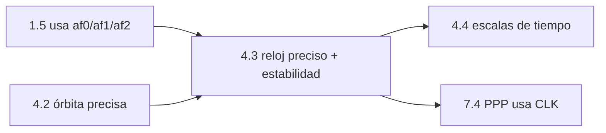

# Clase 4.3 — Relojes: broadcast vs precisos, y RAFS vs PHM

> Bloque del máster: B4 — System · Sincronización de relojes y escalas de tiempo atómicas

**Objetivo en una frase**: comparar la corrección de reloj broadcast
(af0/af1/af2) contra el reloj preciso CLK por satélite, y medir la
**estabilidad** para distinguir las familias de reloj a bordo (rubidio
RAFS vs máser de hidrógeno PHM).

**Tiempo estimado**: 3 h (teoría 50' · lab 90' · ejercicios y cierre 40').

## 1. Objetivos

- [ ] Evaluar la corrección de reloj broadcast (polinomio af0/af1/af2).
- [ ] Compararla contra el reloj preciso CLK y cuantificar el error en rango.
- [ ] Medir la estabilidad (proxy de Allan) por satélite.
- [ ] Distinguir PHM (más estable) de RAFS por su firma de estabilidad.

## 2. ¿Dónde estamos?

El reloj es la otra mitad del mensaje del satélite (la órbita fue 4.2). En
1.5 aplicaste af0/af1/af2 sin cuestionarlos; acá los medís contra la verdad
(CLK). Prepara 4.4 (escalas de tiempo) y conecta con PPP (7.4, que usa
justamente los CLK precisos + relatividad).



## 3. Teoría (con blancos B1–B5)

### 1. El reloj broadcast

Cada satélite transmite tres coeficientes: **af0** (sesgo), **af1**
(deriva) y **af2** (envejecimiento), referidos a un instante `toc`:

$$\delta t_{sat}(t) = af_0 + af_1(t - t_{oc}) + af_2 (t - t_{oc})^2$$

Es un modelo de segundo grado: bueno por unas horas, se re-emite seguido.

### 2. El reloj preciso

El producto **CLK** trae el reloj de cada satélite cada 30 s, calculado por
la red global a ~0.1 ns. Es la verdad contra la cual medir la broadcast.
Ojo: como en PPP (7.4), los CLK **no** incluyen la relatividad periódica.

### 3. Estabilidad: la firma del reloj físico

Más allá del error absoluto, importa **cuán parejo tictaquea** el reloj: su
**estabilidad**, que se mide con la desviación de Allan $\sigma_y(\tau)$. Un
reloj más estable necesita menos correcciones y da mejor SISRE.

### 4. RAFS vs PHM

Galileo lleva dos tipos de reloj a bordo: **RAFS** (Rubidium Atomic
Frequency Standard, rubidio) y **PHM** (Passive Hydrogen Maser). El PHM es
**~un orden de magnitud más estable** que el RAFS a mediano plazo — por eso
suele ser el reloj primario. En tu lab, los satélites se separan en dos
grupos por su $\sigma_y$: esa es la huella observable del hardware.

### Lectura activa (B1–B5)

<details><summary>Completá y verificá</summary>

- **B1.** El reloj broadcast es un polinomio de grado ______ (af0, af1, af2).
- **B2.** Los coeficientes se refieren a un instante ______ (toc).
- **B3.** El CLK preciso da el reloj cada ______ s a ~0.1 ns.
- **B4.** La ______ de Allan mide cuán estable tictaquea un reloj.
- **B5.** El ______ es ~10× más estable que el RAFS a mediano plazo.

Respuestas: B1 dos (2) · B2 toc · B3 30 · B4 desviación · B5 PHM
</details>

## 4. Lab

```bash
python3 clases/mod4-orbitas/clase4.3-relojes/lab/lab_relojes_TODO.py
```

Evaluás el reloj broadcast, lo comparás con el CLK, y medís la estabilidad.
Solución en `lab/soluciones/`.

### Tabla de validación (día 166, 10:00–14:00, Galileo)

| Métrica | Valor de referencia |
|---|---|
| Satélites comparados | **30** |
| Error broadcast−preciso (mediana, en rango) | **1.75 m** |
| Más estable (σy a 300 s) | **E34 ≈ 1.2×10⁻¹¹** (probable PHM) |
| Menos estable | **E19 ≈ 1.3×10⁻¹⁰** (probable RAFS) |
| Razón peor/mejor | **≈ ×11.6** |

El error de reloj broadcast (~1.75 m) es del mismo orden que el orbital
(4.2) — juntos forman el SISRE. La dispersión ×11.6 en estabilidad revela
las dos familias de reloj.

## 5. Ejercicios a mano

**E1.** af0 = −0.75 ms para E21. ¿Cuántos metros de rango son? ¿Por qué el
receptor DEBE aplicarlo (qué pasa si lo ignora)?

**E2.** Un reloj con σy = 10⁻¹¹ a 300 s: ¿cuánto error de tiempo acumula en
esos 300 s? ¿Y en metros? Compará RAFS (10⁻¹⁰) vs PHM (10⁻¹¹).

**E3.** ¿Por qué el af2 (envejecimiento) suele ser diminuto pero no cero?

## 6. Estimaciones Fermi

**F1.** El reloj broadcast se re-emite cada ~10 min (Galileo). Con σy ~10⁻¹¹
¿cuánto podría derivar entre actualizaciones y por qué eso fija el ritmo de
re-emisión?

**F2.** Si un reloj se corrige a 1.75 m (~6 ns), ¿cuántas veces peor es que
el CLK preciso (~0.1 ns)? ¿Qué gana el PPP usando el preciso?

## 7. Preguntas conceptuales

<details><summary>C1. ¿Por qué el reloj del satélite es tan crítico?</summary>

Porque el rango se mide por tiempo de vuelo: 1 ns de error de reloj = 30 cm
de rango. El reloj es, junto con la radial, el término dominante del SISRE.
</details>

<details><summary>C2. ¿Qué diferencia hay entre error absoluto y estabilidad?</summary>

El error absoluto (bias) se corrige con af0. La **estabilidad** es cuán
predecible es su evolución: un reloj estable se modela bien con el
polinomio y necesita menos actualizaciones. El PHM es más estable → mejor.
</details>

<details><summary>C3. ¿Por qué los CLK precisos no traen la relatividad periódica?</summary>

Por convención: se define el reloj consistente con la órbita, dejando la
corrección periódica −2(r·v)/c² al usuario (igual que la broadcast). Si la
olvidás en PPP, el error salta (lo viste en 7.4).
</details>

## 8. Pregunta de entrevista

> "Explicá el reloj broadcast de un satélite y cómo evaluarías su calidad.
> ¿Qué es la estabilidad de Allan y por qué Galileo lleva RAFS y PHM?"

**Mini-caso**: detectás un satélite con σy 5× peor que sus pares. ¿Es
necesariamente un problema? ¿Qué mirarías antes de marcarlo como no sano?

## 9. Mini-simulacro (12 min)

1. Escribí el modelo de reloj broadcast y qué es cada coeficiente.
2. 1 ns de error de reloj → ¿cuántos metros?
3. ¿Qué mide la desviación de Allan?
4. RAFS vs PHM: ¿cuál es más estable y por cuánto?
5. ¿Por qué el error de reloj entra directo al rango (SISRE)?

<details><summary>Respuestas</summary>

1. δt=af0+af1(t−toc)+af2(t−toc)²; sesgo, deriva, envejecimiento. 2. ~30 cm.
3. la estabilidad de frecuencia del reloj a un tau dado. 4. PHM, ~10×. 5.
el rango es tiempo de vuelo × c: el error de reloj se suma 1:1 al rango.
</details>

## 10. Caso real — los máseres de Galileo y por qué importan

Galileo fue la primera constelación en volar **máseres pasivos de
hidrógeno** como reloj primario operativo, junto con rubidios de respaldo.
Esa apuesta por relojes más estables es una de las razones por las que
Galileo suele encabezar los rankings de SISRE (junto con su segmento de
control, 4.2). Tu lab lo hace visible: al ordenar los 30 satélites por
estabilidad, se separan en dos poblaciones —los más estables (PHM) y los
menos (RAFS)— con un factor ~10 entre ellas. Es hardware espacial leído
desde tu escritorio, con un archivo de texto de relojes.

## 11. Glosario ES/EN

| ES | EN | Nota |
|---|---|---|
| sesgo / deriva / envejecimiento | bias / drift / aging | af0 / af1 / af2 |
| reloj preciso | precise clock (CLK) | ~0.1 ns, cada 30 s |
| estabilidad | stability | qué tan parejo tictaquea |
| desviación de Allan | Allan deviation σy(τ) | métrica de estabilidad por tau |
| RAFS / PHM | RAFS / PHM | rubidio / máser pasivo de hidrógeno |
| toc | clock reference time | instante de referencia del polinomio |

## 12. Cheat sheet

```text
Reloj broadcast   δt(t) = af0 + af1(t−toc) + af2(t−toc)²   (bias, drift, aging)
Reloj preciso     CLK, ~0.1 ns, cada 30 s (NO trae la relatividad periódica)
1 ns              = 30 cm de rango       →  el reloj entra 1:1 en el SISRE
Estabilidad       σy(τ) de Allan; PHM ~10× más estable que RAFS
Ref 166 (E)       error broadcast−preciso mediana 1.75 m · dispersión σy ×11.6
```

## 13. Errores comunes

1. Confundir bias (se corrige con af0) con estabilidad (cuán predecible es).
2. Olvidar la relatividad periódica al usar CLK precisos (7.4).
3. Comparar σy a distintos τ: la estabilidad depende del tau de promediado.
4. Marcar un satélite como "malo" solo por σy alto sin mirar salud/uso.
5. Mezclar unidades: reloj en segundos, rango en metros (×c).

## 14. Referencias

- Galileo OS SIS ICD — modelo de reloj (af0/af1/af2) y BGD.
- Riley, *Handbook of Frequency Stability Analysis* — desviación de Allan.
- IGS/MGEX — productos CLK.
- Clases 1.5 (uso del reloj), 4.2 (órbita), 7.4 (CLK en PPP).

## 15. Rúbrica de autoevaluación

- ⭐ Explico af0/af1/af2 y por qué 1 ns = 30 cm.
- ⭐⭐ Corro el lab, obtengo el error ~1.75 m y la dispersión de estabilidad.
- ⭐⭐⭐ Identifico las dos familias de reloj por su σy y lo conecto con el SISRE de Galileo.

## 16. Para tu bitácora

Copiá [`bitacora.md`](bitacora.md): tu error de reloj y la razón de
estabilidad peor/mejor vs la tabla, y una frase sobre por qué el PHM
importa.
