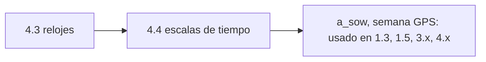

# Clase 4.4 — Escalas de tiempo y marcos de referencia

> Bloque del máster: B4 — System · Sincronización de relojes y escalas de tiempo atómicas

**Objetivo en una frase**: dominar las escalas de tiempo GNSS (TAI, UTC,
GPST, GST), los segundos intercalares, el GGTO y la diferencia ECEF/ECI,
y dejarlo todo en un `timescales.py` con tests.

**Tiempo estimado**: 2.5–3 h (teoría 60' · lab 70' · ejercicios y cierre 40').

## 1. Objetivos

- [ ] Convertir entre TAI, UTC, GPST y GST con segundos intercalares.
- [ ] Entender por qué GPST no tiene leaps y UTC sí (GPST−UTC=18 s hoy).
- [ ] Manejar semana/segundo-de-semana y el GGTO GPS↔Galileo.
- [ ] Distinguir ECEF de ECI (y saber que ITRF≈WGS84 a cm).

## 2. ¿Dónde estamos?

El tiempo es el sustrato de todo el path: el rango es tiempo de vuelo, el
reloj (4.3) vive en una escala, y el `a_sow` que usás desde 1.3 es una
conversión de estas. Esta clase formaliza lo que venías usando implícito y
lo deja como herramienta (`timescales.py`).



## 3. Teoría (con blancos B1–B5)

### 1. La familia de escalas

- **TAI** (Tiempo Atómico Internacional): la referencia atómica pura,
  monótona, sin saltos.
- **UTC**: TAI menos los **segundos intercalares** (ΔAT). Salta de a 1 s
  para seguir la rotación de la Tierra. Hoy ΔAT = **37 s** (sin leaps
  nuevos desde 2017).
- **GPST** (GPS Time): TAI − 19 s, **fija** (no tiene leaps). Época
  1980-01-06. Por eso GPST − UTC = ΔAT − 19 = **18 s** hoy.
- **GST** (Galileo System Time): prácticamente igual a GPST (ambas
  ancladas a TAI−19); difieren en el **GGTO**, de nanosegundos.

### 2. Por qué GPST no tiene leaps

Porque el posicionamiento necesita una escala **continua**: un salto de 1 s
sería 300 000 km de error de rango. GNSS usa tiempo atómico fijo (GPST/GST)
y deja la conversión a UTC (con leaps) para mostrarle la hora "de reloj de
pared" al usuario.

### 3. Semana y segundo de semana

GPST se cuenta como (**semana GPS** desde 1980-01-06, **segundo de
semana** 0–604800). Es el formato en el que viven Toe, toc y tus `t_sow`.
El rollover de 10 bits (caso de la clase 0.4) vive acá.

### 4. GGTO y marcos

El **GGTO** (GPS-Galileo Time Offset) es el pequeño desfase (ns) entre
GPST y GST; un receptor multi-constelación lo estima o lo lee del mensaje
(si no, agrega una incógnita). En el espacio: **ECI** (inercial, no rota)
para la dinámica orbital; **ECEF** (rota con la Tierra) para posiciones de
usuario — se pasa de uno a otro rotando por el ángulo de rotación terrestre
(es el Sagnac de 1.5, visto como cambio de marco). **ITRF** y **WGS84**
coinciden a nivel centímetro.

### Lectura activa (B1–B5)

<details><summary>Completá y verificá</summary>

- **B1.** UTC = TAI − ______ (segundos intercalares); hoy vale 37.
- **B2.** GPST = TAI − ______ s, y no tiene leaps → es ______.
- **B3.** Por eso GPST − UTC = ______ s hoy.
- **B4.** El ______ es el desfase (ns) entre GPST y GST.
- **B5.** ECI no rota (dinámica orbital); ECEF ______ con la Tierra (usuario).

Respuestas: B1 ΔAT · B2 19 / continua (fija) · B3 18 · B4 GGTO · B5 rota
</details>

## 4. Lab (entregable: timescales.py con tests)

```bash
python3 clases/mod4-orbitas/clase4.4-tiempo/lab/timescales_TODO.py
```

Completás las conversiones y los asserts las validan. La solución de
referencia `lab/soluciones/timescales.py` trae 8 tests y es reutilizable
como módulo en el resto del path.

### Tabla de validación

| Chequeo | Valor de referencia |
|---|---|
| ΔAT en 2026 | **37 s** |
| GPST − UTC hoy | **18 s** |
| GPST = TAI − | **19 s** (constante) |
| 2026-06-15 12:00 UTC | **semana 2423**, sow 86400+43218 |
| ECEF↔ECI | rotación (preserva norma, invertible) |
| Tests | **8/8 pasan** |

## 5. Ejercicios a mano

**E1.** Son las 12:00:00 UTC del 2026-06-15. ¿Qué hora es en GPST? ¿Y en
TAI? (usá ΔAT=37).

**E2.** Un receptor mezcla GPS y Galileo sin conocer el GGTO. ¿Qué le pasa
a su solución si lo ignora? ¿Cuál es la alternativa (pista: una incógnita
más)?

**E3.** Si mañana se agregara un leap second (ΔAT=38), ¿cambia GPST?
¿Cambia GPST−UTC? ¿Cambia UTC?

## 6. Estimaciones Fermi

**F1.** Un salto de 1 s sin corregir en una escala de posicionamiento: ¿a
cuántos km de error de rango equivale? ¿Por qué GPST es fija?

**F2.** El GGTO típico es ~few ns. ¿A cuántos cm de rango equivale? ¿Por
qué igual conviene estimarlo en un receptor de precisión?

## 7. Preguntas conceptuales

<details><summary>C1. ¿Por qué UTC tiene leaps y GPST no?</summary>

UTC sigue la rotación (irregular) de la Tierra → se ajusta con leaps para
no alejarse del día solar. GPST prioriza continuidad para medir tiempo de
vuelo: un salto sería catastrófico (300 000 km). Cada escala optimiza algo
distinto.
</details>

<details><summary>C2. ¿Qué es el GGTO y qué alternativa hay?</summary>

El offset (ns) entre GPST y GST. Si el receptor no lo conoce, en vez de
asumir 0 (error) **agrega el sesgo inter-sistema como incógnita** en el
PVT: cuesta un grado de libertad pero evita el error. Muchos receptores lo
hacen por sistema.
</details>

<details><summary>C3. ¿ECEF o ECI para propagar una órbita?</summary>

ECI (inercial): las leyes de Newton valen en un marco no rotante. Para dar
la posición al usuario se pasa a ECEF (rota con la Tierra). El puente es la
rotación por el ángulo terrestre — el mismo efecto Sagnac de 1.5.
</details>

## 8. Pregunta de entrevista

> "¿Por qué GPST no tiene leap seconds y UTC sí? ¿Qué es el GGTO y cómo lo
> maneja un receptor multi-constelación?"

**Mini-caso**: un sistema de timestamping legal exige UTC exacto. ¿Cómo lo
derivás de un receptor GNSS, y qué pasa alrededor de un leap second?

## 9. Mini-simulacro (10 min)

1. TAI, UTC, GPST, GST: definí cada una en una frase.
2. GPST − UTC hoy y por qué.
3. ¿Qué es un segundo intercalar y cuándo fue el último?
4. GGTO: qué es y cómo se maneja.
5. ECEF vs ECI: cuál para dinámica, cuál para usuario.

<details><summary>Respuestas</summary>

1. TAI atómica pura; UTC=TAI−ΔAT con leaps; GPST=TAI−19 fija; GST≈GPST±GGTO.
2. 18 s (ΔAT−19). 3. ajuste de 1 s para seguir la rotación; último 2017. 4.
offset ns GPS↔Galileo; se lee del mensaje o se estima como incógnita. 5.
ECI dinámica, ECEF usuario.
</details>

## 10. Caso real — el leap second y los sistemas que se caen

El 30 de junio de 2015 se insertó un leap second (ΔAT pasó a 36). Varios
sistemas mal preparados fallaron: sitios web, plataformas de trading y hasta
routers, porque su software no supo qué hacer con un minuto de 61 segundos.
GNSS, en cambio, **no se inmutó**: GPST y GST son continuas, el leap solo
afecta la conversión a UTC que se hace al final. Es la lección de esta
clase: separar la escala de trabajo (atómica, continua) de la escala de
presentación (UTC, con saltos). Desde 2017 no hubo más leaps, y hay una
resolución internacional para eliminarlos hacia 2035 — pero el diseño de
GNSS ya los había hecho irrelevantes para el posicionamiento.

## 11. Glosario ES/EN

| ES | EN | Nota |
|---|---|---|
| tiempo atómico internacional | TAI | referencia atómica, monótona |
| tiempo universal coordinado | UTC | TAI − ΔAT (con leaps) |
| tiempo GPS / Galileo | GPST / GST | TAI − 19, fijas |
| segundo intercalar | leap second | ajuste de 1 s en UTC |
| GGTO | GGTO | GPS-Galileo Time Offset (ns) |
| ECEF / ECI | ECEF / ECI | fijo a la Tierra / inercial |
| ITRF / WGS84 | ITRF / WGS84 | marcos terrestres (≈ a cm) |

## 12. Cheat sheet

```text
TAI       atómica pura           UTC = TAI − ΔAT (ΔAT=37 en 2026, con leaps)
GPST      = TAI − 19 (fija)      GST ≈ GPST ± GGTO (ns)
GPST−UTC  = ΔAT − 19 = 18 s hoy
semana    (semana GPS, sow 0..604800) desde 1980-01-06 ; rollover 10 bits (0.4)
GGTO      offset ns GPS↔Galileo → leer del mensaje o estimar como incógnita
marcos    ECI (dinámica, no rota) ↔ ECEF (usuario, rota) ; ITRF ≈ WGS84 (cm)
```

## 13. Errores comunes

1. Sumar/restar leaps a GPST (no tiene: es fija).
2. Usar UTC para tiempo de vuelo: hay que trabajar en GPST/GST continuas.
3. Asumir GGTO=0 en multi-GNSS de precisión (mejor estimarlo).
4. Confundir ECEF con ECI al propagar órbitas (Newton vale en ECI).
5. Olvidar el rollover de semana (el caso de 0.4).

## 14. Referencias

- ESA, *GNSS Data Processing Vol. I* — cap. de tiempo y marcos de referencia.
- Navipedia — "Time References in GNSS", "Reference Frames in GNSS", "GGTO".
- BIPM — segundos intercalares (Circular T).
- Clases 0.4 (rollover), 1.3/1.5 (a_sow, Sagnac), 4.3 (relojes).

## 15. Rúbrica de autoevaluación

- ⭐ Explico las 4 escalas y por qué GPST−UTC=18 s.
- ⭐⭐ Completo timescales.py y paso los 8 tests.
- ⭐⭐⭐ Manejo GGTO y ECEF/ECI en un caso, y explico el leap second de 2015.

## 16. Para tu bitácora

Copiá [`bitacora.md`](bitacora.md): confirmá que tus 8 tests pasan y
escribí una frase sobre por qué GNSS ignoró el leap de 2015.
