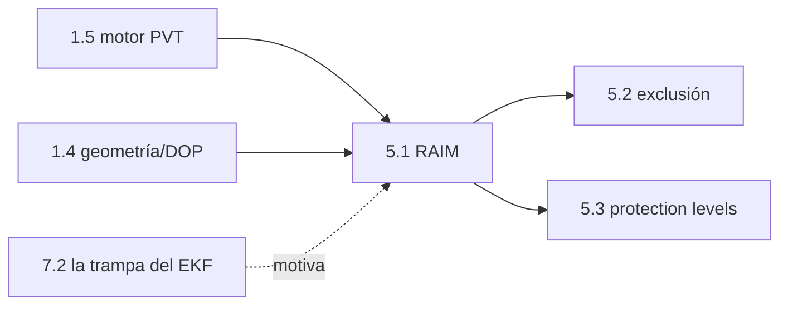

# Clase 5.1 — RAIM por residuos: la solución que se audita sola

> Bloque del máster: B2 — Advanced · Técnicas de fiabilidad e integridad para aplicaciones críticas

El salto mental del módulo: dejar de preguntar *"¿dónde estoy?"* y empezar
a preguntar **"¿puedo confiar en donde digo que estoy?"**. RAIM usa la
redundancia (más satélites que incógnitas) para que los residuos delaten
mediciones envenenadas — el perro guardián que la trampa de la 7.2 pedía
a gritos.

**Tiempo estimado**: 3–3.5 h (teoría 45' · lab 75' · ejercicios 45' · cierre 30').

## 1. Objetivos

- [ ] Construir el estadístico $T = \mathbf{r}^\top\mathbf{r}/\sigma^2 \sim \chi^2(n-4)$ y su umbral por $P_{fa}$
- [ ] Correrlo sobre las 121 épocas reales y explicar las que disparan
- [ ] Inyectar fallos de 20/50/100 m y medir detección y daño (error 3D)
- [ ] Barrer el bias mínimo detectable y entender de qué depende la "zona ciega"

## 2. Dónde estás en el mapa



## 3. Teoría (completá los blancos con el lab)

### 3.1 La redundancia es información

Con $n$ satélites y 4 incógnitas sobran $n-4$ grados de libertad. El LSQ
reparte las mediciones lo mejor posible; lo que **no puede explicar**
queda en los residuos $\mathbf{r} = \mathbf{P} - (\hat{d} + c\hat{\delta t})$.
Si todo es ruido gaussiano $\sigma$, entonces
$T = \mathbf{r}^\top\mathbf{r}/\sigma^2$ sigue una distribución ______
con $n-4$ grados — y su media es exactamente ______ (el lab lo mide: 3.0
con dof 3).

### 3.2 El umbral: comprando confianza con falsas alarmas

Fijás la probabilidad de falsa alarma ($P_{fa} = 10^{-3}$) y el umbral
sale de la inversa de la $\chi^2$: acá **16.3**. Todo T por encima =
alarma. Es un contrato estadístico: ~1 época cada 1000 gritará sin
motivo… si el modelo de ruido es cierto — que en datos reales no lo es
del todo: las 3/121 que disparan resultan épocas genuinamente ______.

### 3.3 Fallo chico, daño grande: la relación T ↔ error

Un bias $b$ en un satélite empuja T como $\sim b^2$ (cuadrático: 20 m →
278, 100 m → 6581) y el error 3D como $\sim$ ______ (lineal: la
"pendiente" geométrica, 100 m → 33.5 m de daño). Esa pareja
(detectabilidad, daño) por satélite es la semilla del protection level.

### 3.4 Los límites del perro guardián

Detectar ≠ identificar (¿CUÁL satélite?: 5.2) y el T no ve fallos que
caben en el ruido: acá la zona ciega termina en ~4 m porque hay 8 sats
y σ=1, pero con 5 satélites rasantes y σ real de multipath la ciega se
agranda — cuantificar el peor caso sin conocer el fallo es el ______ (5.3).

## 4. Lab

```bash
python3 clases/mod5-integridad/clase5.1-raim/lab/lab_raim_TODO.py         # tu turno
python3 clases/mod5-integridad/clase5.1-raim/lab/soluciones/lab_raim_solucion.py
```

### Tabla de validación (tus números deben coincidir)

| Chequeo | Valor de referencia |
|---|---|
| T en 121 épocas limpias | media **3.0** (=dof) · máx 63.4 |
| Umbral $\chi^2$(dof=3, $P_{fa}$=1e-3) | **16.3** · disparan 3/121 |
| Época 12:00 (8 sats) | T limpio **8.4** · err 1.96 m |
| Bias 20 / 50 / 100 m en E07 | T = **278 / 1663 / 6581** → detectados |
| Daño 3D con 20 / 50 / 100 m | 6.7 / 16.7 / **33.5 m** |
| Bias mínimo detectable (barrido) | **4 m** |

## 5. Ejercicios a mano

**E1.** Con dof=3: ¿cuánto vale la media de T sin fallos? ¿Y su varianza
(2·dof)? ¿A cuántos "sigmas" queda el umbral 16.3?

**E2.** El daño fue 33.5 m con bias de 100 m: calculá la "pendiente"
(slope) de E07 ≈ 0.335. Si el peor slope de la época fuera 0.5, ¿qué
error te puede meter un fallo justo debajo del umbral de detección?

**E3.** ¿Por qué T crece ~cuadrático con el bias? (Pista: r absorbe una
fracción fija de b, y T es suma de r².)

## 6. Estimaciones Fermi

**F1.** Con $P_{fa}=10^{-3}$ por época cada 30 s: ¿cuántas falsas
alarmas por día de operación continua? (~3/día: por eso aviación usa
umbrales mucho más estrictos y paga con zona ciega más grande.)

**F2.** ¿Qué dof te queda con 5 satélites? ¿Y la media de T? ¿Cuánto
más difícil es distinguir un fallo del ruido?

## 7. Preguntas conceptuales

Respuestas en `soluciones.md` — primero por escrito.

**C1.** ¿Por qué RAIM necesita ≥5 satélites para detectar y ≥6 para
identificar/excluir?

**C2.** Las 3 épocas que disparan sin fallo inyectado, ¿son un problema
del RAIM o del modelo de ruido? ¿Qué harías con ellas en un receptor?

**C3.** ¿Por qué el estadístico no distingue UN fallo grande de DOS
medianos? ¿Qué hipótesis rompe eso (adelanto ARAIM)?

## 8. Pregunta de entrevista

> "Explicá RAIM en 90 segundos: qué mide, qué garantiza y qué NO
> garantiza."

**Mini-caso**: tu receptor de flota reporta fix continuo pero T=40
durante 10 minutos. ¿Qué hacés: descartás épocas, excluís satélite, o
bajás la bandera de servicio? ¿Con qué información decidís?

## 9. Mini-simulacro (10 min, aprobás con 4/5)

1. Definí T y su distribución sin fallos.
2. ¿De dónde sale el umbral y qué compra $P_{fa}$ más chica?
3. Bias 20 m → T 278: ¿qué da bias 40 m, aprox? ¿Por qué?
4. ¿Qué es la zona ciega y de qué 3 cosas depende?
5. Detectar vs identificar vs excluir: qué necesita cada nivel.

## 10. Caso real — 1995-2000: RAIM o no volabas

Cuando la aviación adoptó GPS como medio suplementario, la condición
regulatoria fue exactamente esta clase: sin RAIM operativo (suficientes
satélites con buena geometría para auto-auditarse), el GPS **no podía
usarse** como fuente primaria en aproximaciones. Los despachantes
corrían "predicciones RAIM" pre-vuelo — disponibilidad del perro
guardián, no del posicionamiento — y con SA activa (visión-global) los
agujeros eran frecuentes. La lección que institucionalizó: **una
solución sin integridad no es una solución operacional** — el fix de tu
7.2 con 3 SVs habría pasado cualquier control… menos éste.

## 11. Glosario ES/EN

| ES | EN | Nota |
|---|---|---|
| integridad | integrity | confianza cuantificada y garantizada |
| residuo post-ajuste | post-fit residual | lo que el LSQ no puede explicar |
| estadístico de prueba | test statistic (T) | $\mathbf{r}^\top\mathbf{r}/\sigma^2$ |
| falsa alarma / detección fallida | false alarm / missed detection | los dos platillos de la balanza |
| zona ciega | (detection) blind zone | biases dentro del ruido |
| pendiente (de fallo) | (failure) slope | daño por unidad de bias |
| grados de libertad | degrees of freedom | $n-4$ |

## 12. Cheat sheet

```text
Estadístico:   T = rᵀr/σ²  ~  χ²(n−4)   (media = dof; var = 2·dof)
Umbral:        chi2.ppf(1−Pfa, n−4)     (Pfa=1e-3, dof=3 → 16.3)
Escalas:       T ~ b² (cuadrático) · error 3D ~ slope·b (lineal)
Números 166:   T̄=3.0 · máx 63.4 · disparan 3/121 · b_min 4 m
Daño E07:      slope ≈ 0.335 (100 m → 33.5 m de error 3D)
Niveles:       detectar ≥5 sats · identificar/excluir ≥6 (5.2)
```

## 13. Errores comunes

1. Usar σ optimista: infla T y llena todo de alarmas (o al revés).
2. Confundir residuos post-fit con el error (el LSQ ya escondió parte).
3. Creer que T identifica al culpable (solo grita; señalar es 5.2).
4. Olvidar que el fallo también sesga la solución ANTES de detectarse.
5. Tratar las alarmas de datos reales como "falsas" sin mirarlas.

## 14. Referencias

- ESA *GNSS Data Processing Vol. I* — sección de integridad/RAIM.
- Navipedia: *RAIM*, *Integrity*.
- Kaplan & Hegarty — cap. de integridad (umbralado y slopes).
- RTCA DO-208/DO-229 (concepto: requisitos RAIM en aviación; solo contexto).

## 15. Flashcards y bitácora

- `flashcards_anki.csv` — deck sugerido `GNSS::M5::5.1`.
- `bitacora.md` — tus números vs la tabla de validación.

## 16. Rúbrica de cierre

La clase se marca `[x]` en el README del repo **solo** si:

- [ ] Blancos de §3 completados · TODOs verdes sin mirar la solución.
- [ ] Números de la tabla §4 reproducidos.
- [ ] E1–E3 en papel · simulacro ≥ 4/5 · entrevista < 2 min.
- [ ] Podés explicar por qué las 3 épocas que disparan no son "falsas".
