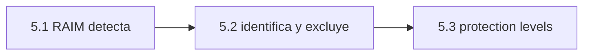

# Clase 5.2 — Identificación y exclusión: señalar al culpable

> Bloque del máster: B2 — Advanced · Técnicas de fiabilidad e integridad para aplicaciones críticas

El RAIM de 5.1 grita "hay un fallo"; esta clase aprende a **señalarlo y
sacarlo**: resolver $n$ subconjuntos dejando un satélite afuera por vez —
el subconjunto cuyo estadístico se **desploma** es el que dejó afuera al
culpable. Después: excluir, re-resolver, verificar que volviste a nominal.

**Tiempo estimado**: 2.5–3 h.

## 1. Objetivos

- [ ] Construir los $n$ estadísticos leave-one-out y leer su patrón
- [ ] Identificar al culpable (bias 50 m en E07) y cuantificar la separación
- [ ] Excluir, re-resolver y verificar la recuperación (T y error nominales)
- [ ] Medir desde qué bias la identificación es confiable (vs detección)

## 2. Dónde estás en el mapa



## 3. Teoría (completá los blancos con el lab)

### 3.1 El patrón leave-one-out

Con fallo en el satélite $j$: el subconjunto sin $j$ queda **limpio** →
$T_{(j)}$ chico (χ² nominal); cualquier otro subconjunto retiene el
fallo → $T_{(k)}$ sigue ______. En el lab: 1663 → **8.3** sin E07, y
~1500 sin cualquier otro. La firma es inconfundible… si el fallo es
único.

### 3.2 El costo de señalar

Detectar exige que T sobresalga (desde 4 m acá); identificar exige
además que el mínimo se **separe** del segundo mínimo (acá pedimos 3×):
recién desde ~______ m. Regla: señalar cuesta más que gritar — entre 4 y
10 m sabés que algo anda mal pero no *quién*.

### 3.3 La joya del experimento: excluir al inocente

Mirá la fila de E30: excluirlo BAJA T a 542 pero el error **sube a
83 m** — sacaste un satélite sano que estaba conteniendo el daño
geométrico del fallo. Excluir por prueba y error sin el patrón completo
es ______ que no excluir: la geometría también vota (1.4).

### 3.4 Los grados de libertad de nuevo

Excluir uno deja $n-1$ satélites que deben seguir siendo redundantes
(≥5) para verificar la exclusión: por eso identificar pide $n \geq$ ______.

## 4. Lab

```bash
python3 clases/mod5-integridad/clase5.2-exclusion/lab/lab_exclusion_TODO.py
python3 clases/mod5-integridad/clase5.2-exclusion/lab/soluciones/lab_exclusion_solucion.py
```

### Tabla de validación

| Chequeo | Valor de referencia |
|---|---|
| Conjunto completo (bias 50 m en E07) | T = **1663** · err 16.68 m |
| Subconjunto sin E07 | T = **8.3** · err **1.98 m** (se desploma) |
| Subconjunto sin E30 (¡el inocente!) | T = 542 · err **83 m** |
| Separación mín/2º mín | > **×100** |
| Post-exclusión | T = 8.3 < 16.3 · err 1.98 m |
| Identificación confiable desde | **10 m** (detección era 4 m) |

## 5. Ejercicios a mano

**E1.** Con 8 sats, ¿cuántos subconjuntos leave-one-out resolvés? ¿Y si
sospecharas fallos dobles (combinatoria)?

**E2.** ¿Por qué T sin E30 baja a 542 si E30 está sano? (Pista: al sacar
un sat, el LSQ redistribuye el bias entre menos testigos.)

**E3.** dof del subconjunto: 7 sats → 3. ¿Umbral χ²(0.999, 3)? ¿Vale el
mismo 16.3 de 5.1 para validar la exclusión?

## 6. Estimaciones Fermi

**F1.** Fallos dobles con 8 sats: C(8,2)=28 subconjuntos de 6. ¿Y con
12 sats multi-constelación y fallos triples? (~220): el costo explota —
la motivación computacional de ARAIM.

**F2.** Si cada subconjunto cuesta 1 GN (~5 iteraciones × álgebra 4×4),
¿cuántos GN/s corre tu receptor para RAIM+FDE continuo a 1 Hz? (~10-30:
trivial hoy, carísimo en los 90.)

## 7. Preguntas conceptuales

**C1.** ¿Por qué la exclusión debe VERIFICARSE (re-chequear T del
subconjunto) y no solo aplicarse?

**C2.** Dos satélites fallados a la vez: ¿qué patrón ven tus 8
subconjuntos? ¿Se desploma alguno?

**C3.** ¿Qué relación hay entre la fila de E30 (err 83 m) y los slopes
de 5.1?

## 8. Pregunta de entrevista

> "Tenés detección positiva y 8 satélites: contame tu algoritmo de FDE
> (fault detection & exclusion) paso a paso, con sus salidas posibles."

**Mini-caso**: identificás y excluís a E07, pero 5 minutos después T
vuelve a disparar. Hipótesis: ¿mismo sat (¿lo readmitís?), otro sat, o
modelo? ¿Qué política de re-admisión usás?

## 9. Mini-simulacro (10 min, aprobás con 4/5)

1. El patrón leave-one-out con fallo único, de memoria.
2. ¿Por qué identificar pide ≥6 satélites?
3. ¿Qué significa que T sin un INOCENTE también baje (E30)?
4. Criterio de separación: ¿por qué no basta el mínimo a secas?
5. Post-exclusión: ¿qué dos cosas verificás antes de confiar?

## 10. Caso real — SVN-23 (2004): el fallo que el FDE textbook atrapa

El 1° de enero de 2004, el reloj del GPS SVN-23 se degradó y su rango
acumuló kilómetros de error durante ~3 horas antes de que el segmento de
control lo marcara unhealthy. Receptores con FDE: detectaron (T por las
nubes), identificaron (leave-one-out se desplomaba sin SVN-23) y
excluyeron — usuarios sin RAIM navegaron kilómetros corridos. Es EL caso
de manual de fallo único de satélite: exactamente el patrón de esta
clase, con la lección operativa de que el sistema tarda (horas) y tu
receptor no puede esperarlo.

## 11. Glosario ES/EN

| ES | EN |
|---|---|
| detección e identificación de fallos | FDI |
| detección y exclusión | FDE |
| subconjunto (leave-one-out) | subset solution |
| separación (de hipótesis) | separation |
| re-admisión | reinclusion |
| fallo único/múltiple | single/multiple fault |

## 12. Cheat sheet

```text
Patrón:      T_full alto · T_(culpable) se desploma · resto sigue alto
Números:     1663 -> 8.3 (sin E07) · sin E30: T 542 pero err 83 m (¡trampa!)
Criterios:   identificar = mínimo + separación (2º/1º > 3)
Costos:      detectar 4 m · identificar 10 m · (siempre con esta geometría)
dof:         detectar ≥5 · excluir ≥6 · verificar post-exclusión ≥5
FDE loop:    T>umbral -> n subconjuntos -> mínimo+separación -> excluir
             -> re-resolver -> re-chequear -> (bandera si no se puede)
```

## 13. Errores comunes

1. Excluir el subconjunto de T mínimo sin exigir separación.
2. No verificar post-exclusión (¿y si eran dos fallos?).
3. Leer "T bajó al excluir X" como culpabilidad de X (fila E30).
4. Olvidar recalcular el umbral con el dof del subconjunto.
5. Excluir para siempre (política de re-admisión ausente).

## 14. Referencias

- ESA Vol. I — FDE. · Navipedia: *RAIM* (FDI/FDE).
- Kaplan & Hegarty — cap. integridad (subset methods).
- El incidente SVN-23 (2004): reportes públicos del FAA/USCG.

## 15. Flashcards y bitácora

- `flashcards_anki.csv` — deck `GNSS::M5::5.2` · `bitacora.md`.

## 16. Rúbrica de cierre

- [ ] Blancos §3 · TODOs verdes sin mirar solución · tabla §4 reproducida.
- [ ] E1–E3 en papel · simulacro ≥ 4/5.
- [ ] Podés explicar la fila de E30 sin titubear (la trampa del inocente).
