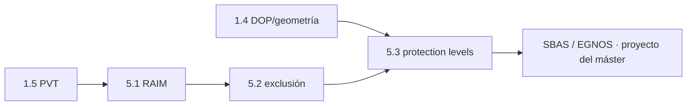

# Clase 5.3 — Protection levels: de "da bien" a "puedo garantizarlo"

> Bloque del máster: B2 — Advanced · Fiabilidad e integridad para aplicaciones críticas

**Objetivo en una frase**: convertir la detección de fallos de 5.1/5.2 en
una **cota de error garantizada** (HPL/VPL) y decidir con ella si una
operación crítica está *disponible* — el núcleo conceptual de SBAS/EGNOS y
la aviación.

**Tiempo estimado**: 3–3.5 h (teoría 60' · lab 90' · ejercicios y cierre 40').

## 1. Objetivos

- [ ] Distinguir exactitud, integridad, continuidad y disponibilidad.
- [ ] Entender el par **Protection Level / Alert Limit** y el riesgo de integridad.
- [ ] Calcular HPL/VPL por RAIM clásico (método del *slope*) sobre geometría real.
- [ ] Medir la **disponibilidad de integridad** de una operación LPV-200 (HAL=40, VAL=35).

## 2. ¿Dónde estamos?

Cierra la línea de integridad de usuario: 5.1 detecta que hay un fallo,
5.2 dice cuál y lo excluye, **5.3 acota cuánto podría estar equivocada la
posición aunque no haya alarma**. Reusa el motor PVT de 1.5, la geometría
de 1.4 y el estadístico de 5.1. Es la base de la clase de sistema (SBAS) y
del proyecto SBAS del máster.



## 3. Teoría (con blancos B1–B5)

### 1. Las cuatro palabras de la integridad

- **Exactitud (accuracy)**: qué tan cerca está la posición de la verdad *en promedio*.
- **Integridad (integrity)**: la confianza de que el error **no supera** un límite sin avisar. Es lo que agrega esta clase.
- **Continuidad**: que el servicio no se interrumpa durante la operación.
- **Disponibilidad**: la fracción del tiempo en que las tres anteriores se cumplen.

### 2. Protection Level vs Alert Limit

El **Protection Level (PL)** es una cota estadística del error de
posición que el receptor **calcula en tiempo real** a partir de la
geometría y el modelo de ruido: garantiza (a un riesgo de integridad
dado) que el error real es menor que el PL. El **Alert Limit (AL)** lo
fija la *operación* (aviación, agricultura): el máximo error tolerable.

$$\text{operación disponible} \iff PL < AL$$

Si PL ≥ AL, el receptor **se declara no disponible** (mejor no dar
servicio que dar uno inseguro). El HPL/HAL es horizontal; el VPL/VAL,
vertical (siempre más exigente).

### 3. El método del *slope*

Un fallo no detectable (justo bajo el umbral de 5.1) produce el **máximo
error de posición por unidad de estadístico**. Ese factor es el *slope*
de cada satélite:

$$\text{slope}_{H,i} = \frac{\sqrt{S_{0,i}^2 + S_{1,i}^2}}{\sqrt{1 - P_{ii}}}, \qquad S = (G^\top G)^{-1}G^\top,\quad P = GS$$

con $G$ la matriz de geometría **en ENU**. El HPL es el peor slope por el
*pbias*:

$$HPL = \text{slope}_{H,\max}\cdot p_{bias}$$

### 4. El pbias

$p_{bias} = \sqrt{\lambda}$, donde $\lambda$ es la **no-centralidad** de
una chi-cuadrado que hace que un fallo se detecte con la probabilidad
objetivo ($P_{MD}$) al umbral que fija la falsa alarma ($P_{FA}$, de 5.1).
Traduce "cuán grande tiene que ser un fallo para que se me escape" en
metros.

### Lectura activa (B1–B5)

<details><summary>Completá y verificá</summary>

- **B1.** Integridad = confianza de que el error no supera un ______ sin avisar.
- **B2.** La operación está disponible cuando ______ < ______.
- **B3.** El slope mide el error de posición por unidad de ______ (el estadístico de 5.1).
- **B4.** El VPL casi siempre supera al HPL porque la geometría vertical es ______ (peor VDOP).
- **B5.** Si PL ≥ AL el receptor se declara ______ (no da servicio inseguro).

Respuestas: B1 límite (alert limit) · B2 PL < AL · B3 estadístico (test statistic) · B4 más débil · B5 no disponible
</details>

## 4. Lab

```bash
python3 clases/mod5-integridad/clase5.3-protection-levels/lab/lab_protection_TODO.py
```

Construís G en ENU, calculás HPL/VPL por slope y medís disponibilidad
contra LPV-200. Solución en `lab/soluciones/`.

### Tabla de validación (día 166, 12:00–13:00, LPGS)

| Métrica | Valor de referencia |
|---|---|
| Épocas con RAIM (≥5 sats) | **121** |
| HPL mediana / máx | **6.72 / 13.29 m** |
| VPL mediana / máx | **17.03 / 20.86 m** |
| pbias (no-centralidad) | **≈ 6.71** |
| Disponibilidad LPV-200 (HAL 40, VAL 35) | **100 %** |

El VPL supera al HPL en toda época (geometría vertical más débil), y con
cielo abierto la disponibilidad es total — el caso interesante aparece al
enmascarar satélites (ejercicio E2).

## 5. Ejercicios a mano

**E1.** Si HAL=40 m y tu HPL=45 m, ¿la operación está disponible? ¿Y si
bajás la exigencia a una operación con HAL=185 m (NPA)?

**E2.** Con menos satélites el slope máximo crece. Explicá por qué
enmascarar los satélites bajos (subir el cutoff a 25°) puede **empeorar**
la disponibilidad aunque mejore el multipath (conexión con 3.4).

**E3.** ¿Por qué el VAL (35 m) es más chico que el HAL (40 m) y aun así es
más difícil de cumplir?

## 6. Estimaciones Fermi

**F1.** Un jet en aproximación baja ~3°: a 200 pies (~60 m) sobre pista,
¿cuánto margen vertical de error tolera antes de tocar fuera de la zona?
Relacioná con VAL=35 m.

**F2.** Si el riesgo de integridad objetivo es $2\times10^{-7}$ por
aproximación y hay ~10⁶ aproximaciones/año en un país, ¿cuántos eventos
de integridad "aceptables" son al año?

## 7. Preguntas conceptuales

<details><summary>C1. ¿Puede el error real superar al PL?</summary>

Sí, pero solo con probabilidad ≤ el **riesgo de integridad** de diseño
(p.ej. $10^{-7}$). El PL no es un máximo absoluto: es una cota
*estadística*. Por eso se diseña con márgenes enormes.
</details>

<details><summary>C2. ¿Por qué "no disponible" es una respuesta segura?</summary>

Porque la alternativa —dar una posición cuyo error no podés acotar— es
peligrosa en una operación crítica. Integridad prioriza *no engañar* sobre
*siempre responder*.
</details>

<details><summary>C3. ¿Qué agrega SBAS/EGNOS a este cálculo?</summary>

Correcciones (mejor exactitud) y, sobre todo, **parámetros de confianza**
por satélite (los σ que EGNOS transmite): afinan el PL y lo hacen
certificable para aviación. Es la clase de sistema.
</details>

## 8. Pregunta de entrevista

> "¿Qué es un protection level, cómo se relaciona con el alert limit, y
> por qué un receptor puede declararse 'no disponible' aunque esté dando
> una posición perfectamente razonable?"

**Mini-caso**: te piden habilitar aproximaciones LPV en un aeropuerto de
montaña. ¿Qué mirás: exactitud o integridad? ¿Qué hacés si el VPL se pasa
del VAL solo en ciertas horas del día?

## 9. Mini-simulacro (12 min)

1. Definí las 4 palabras de integridad en una frase cada una.
2. ¿Cuándo está disponible una operación? Escribí la desigualdad.
3. ¿Qué representa el slope y de qué depende su máximo?
4. ¿Por qué el pbias necesita PFA y PMD?
5. VPL 17 m, VAL 35 m: ¿disponible? ¿y si el VAL fuera 15 m?

<details><summary>Respuestas</summary>

1. ver §3.1. 2. PL < AL. 3. error de posición por unidad de estadístico;
su máximo depende de la geometría (peor satélite). 4. PFA fija el umbral;
PMD fija cuán grande debe ser el fallo para detectarse → juntos dan λ.
5. sí (17<35); con VAL=15 no (17>15) → no disponible.
</details>

## 10. Caso real — por qué EGNOS existe: la aviación necesita integridad, no solo exactitud

Un GPS de mano da ~5 m de exactitud, suficiente para navegar en auto.
Pero la aviación civil no puede usarlo para aproximaciones con guía
vertical: no porque sea *impreciso*, sino porque **no acota su propio
error con garantía**. EGNOS (el SBAS europeo) se creó justamente para
eso: transmite correcciones y, sobre todo, los parámetros de confianza
que permiten calcular un VPL *certificable*. Gracias a eso miles de
aproximaciones LPV-200 operan hoy en aeropuertos sin ILS. La lección de
la clase: en aplicaciones críticas, **integridad > exactitud** — de nada
sirve una posición buena si no podés jurar cuán buena es.

## 11. Glosario ES/EN

| ES | EN | Nota |
|---|---|---|
| nivel de protección | protection level (HPL/VPL) | cota estadística del error, calculada por el receptor |
| límite de alerta | alert limit (HAL/VAL) | máximo error tolerable de la operación |
| riesgo de integridad | integrity risk | prob. de superar el PL sin aviso |
| exactitud / integridad | accuracy / integrity | promedio vs garantía |
| continuidad / disponibilidad | continuity / availability | sin cortes / fracción de tiempo útil |
| slope | slope | error de posición por unidad de estadístico |
| pbias | pbias | fallo mínimo detectable, en unidades de σ |
| LPV-200 | LPV-200 | aproximación con guía vertical (HAL 40, VAL 35 m) |

## 12. Cheat sheet

```text
Disponible          PL < AL           (HPL<HAL y VPL<VAL)
HPL                 slope_H,max · pbias
S, P                S=(GᵀG)⁻¹Gᵀ ;  P=G S (hat) ;  1-Pii = sensibilidad del residuo i
slope_H,i           ‖S[:2,i]‖ / √(1-Pii)     (V: |S[2,i]| / √(1-Pii))
pbias               √λ ; λ = no-centralidad ncx2(dof) que da PMD al umbral chi2(PFA)
LPV-200             HAL=40 m · VAL=35 m
Jerarquía           exactitud < integridad (en apps críticas)
Ref 166 (12-13h)    HPL med 6.72 · VPL med 17.03 · disp 100%
```

## 13. Errores comunes

1. Confundir exactitud con integridad: un sistema puede ser exacto y **no íntegro** (no acota su error).
2. Creer que el PL es un máximo absoluto: es estadístico, con un riesgo residual.
3. Usar DOP como si fuera PL: el DOP es geometría; el PL además incluye el fallo mínimo detectable (pbias).
4. Olvidar que VPL suele mandar: la vertical es la que limita las aproximaciones.
5. Calcular G en ECEF y leer "vertical" de ahí: hay que rotar a **ENU**.

## 14. Referencias

- ESA, *GNSS Data Processing Vol. I* — cap. de integridad y RAIM.
- RTCA DO-229 / DO-208 — MOPS de SBAS (definición de HPL/VPL, alert limits).
- Navipedia — "RAIM", "Protection Levels", "Integrity".
- Clases 1.4 (geometría), 5.1 (estadístico), 5.2 (exclusión).

## 15. Errores comunes de implementación → ver §13. Rúbrica de autoevaluación

- ⭐ Explico PL vs AL y las 4 palabras de integridad.
- ⭐⭐ Corro el lab y obtengo HPL/VPL y la disponibilidad de referencia.
- ⭐⭐⭐ Analizo cómo cambia la disponibilidad al variar máscara de elevación u operación (HAL/VAL), y lo conecto con SBAS.

## 16. Para tu bitácora

Copiá [`bitacora.md`](bitacora.md): tus HPL/VPL vs la tabla, y una frase
sobre por qué "no disponible" puede ser la respuesta correcta.
