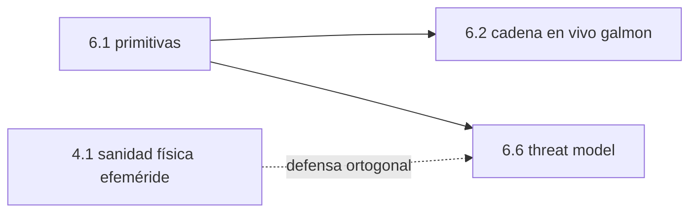

# Clase 6.1 — OSNMA: las tres primitivas criptográficas

> Bloque del máster: B3 — Signals · Autenticación Galileo OSNMA / SAS

**Objetivo en una frase**: implementar y verificar las tres piezas que
hacen que Galileo pueda **autenticar** su mensaje de navegación —cadena
TESLA, árbol de Merkle y firma ECDSA P-256— antes de correrlas contra el
feed real (6.2).

**Tiempo estimado**: 3.5–4 h (teoría 70' · lab 110' · ejercicios y cierre 40').

## 1. Objetivos

- [ ] Construir y verificar una cadena TESLA (revelación diferida de claves).
- [ ] Probar la inclusión de una clave pública en un árbol de Merkle.
- [ ] Firmar y verificar el DSM-KROOT con ECDSA P-256.
- [ ] Encadenar las tres en una cadena de confianza Merkle→ECDSA→TESLA→tag.

## 2. ¿Dónde estamos?

Abre el módulo de seguridad de señal (el diferencial del perfil). Reusa el
vocabulario de la señal Galileo (mod2) y prepara 6.2 (la misma cadena, pero
en vivo con galmon) y 6.6 (qué protege y qué no). Es criptografía aplicada
a GNSS: se apoya en la librería `cryptography` (verificada en 0.1).



## 3. Teoría (con blancos B1–B5)

### 1. El problema: autenticar sin cifrar

El mensaje de navegación es **público** (cualquiera debe poder usarlo). No
se trata de ocultarlo sino de **probar que lo emitió Galileo** y no un
spoofer. OSNMA agrega tags de autenticación sin cambiar el dato.

### 2. TESLA: confianza con el tiempo como aliado

Una **cadena TESLA** es una secuencia de claves donde cada una es el hash
de la siguiente: $K_i = H(K_{i+1})$. La raíz $K_0$ (**KROOT**) se conoce de
antemano. Las claves se **revelan con retardo**: primero llega el *tag* de
los datos, y solo *después* la clave que lo generó. Como nadie puede
invertir el hash, un atacante no puede fabricar la clave antes de tiempo.
La seguridad depende de una **sincronización de tiempo "suficientemente
buena"** (loose time sync): el receptor debe saber que la clave llegó
*después* del tag.

### 3. Merkle: una raíz para muchas claves públicas

Un **árbol de Merkle** resume muchas claves públicas en una sola **raíz**
(embebida en el receptor). Para probar que una clave pertenece al conjunto
basta un **camino de hashes hermanos** (log₂ n), no todo el árbol. Así
Galileo puede rotar claves públicas sin re-embeder nada.

### 4. ECDSA: la firma de la autoridad

La **KROOT** de cada cadena TESLA se firma con **ECDSA P-256** usando la
clave privada de la autoridad; el receptor la verifica con la pública
(cuya inclusión probó por Merkle). Así la confianza fluye: raíz Merkle →
clave pública → firma → KROOT → claves TESLA → tags → datos autenticados.

### Lectura activa (B1–B5)

<details><summary>Completá y verificá</summary>

- **B1.** OSNMA **autentica**, no ______ (el mensaje sigue siendo público).
- **B2.** En TESLA cada clave es el ______ de la siguiente; la raíz es la KROOT.
- **B3.** Las claves TESLA se revelan con ______, por eso hace falta *loose time sync*.
- **B4.** El árbol de ______ resume muchas claves públicas en una raíz embebida.
- **B5.** La KROOT se firma con ______ P-256 y el receptor la verifica.

Respuestas: B1 cifra · B2 hash · B3 retardo (revelación diferida) · B4 Merkle · B5 ECDSA
</details>

## 4. Lab

```bash
python3 clases/mod6-seguridad/clase6.1-osnma/lab/lab_osnma_TODO.py
```

Implementás las tres primitivas y las verificás con vectores autogenerados
(reproducibles). Solución en `lab/soluciones/`.

### Tabla de validación

| Primitiva | Chequeo |
|---|---|
| TESLA | clave válida verifica; clave falsa NO; tag depende de la clave |
| Merkle | hojas 0/3/7 incluidas; hoja falsa NO |
| ECDSA P-256 | firma válida verifica; KROOT alterada NO |
| Cadena completa | Merkle→ECDSA→TESLA→tag encadena — **4/4 bloques OK** |

Vectores autogenerados: correr contra los **vectores oficiales / feed real**
es la clase 6.2 (requiere red). La lógica es idéntica; acá se prueba el
mecanismo de forma reproducible.

## 5. Ejercicios a mano

**E1.** En una cadena TESLA de 50 claves, te revelan la clave 7. ¿Cuántos
hashes hacés para verificarla contra la KROOT? ¿Y para la clave 30?

**E2.** Un árbol de Merkle de 1024 hojas: ¿cuántos hashes hermanos tiene la
prueba de inclusión de una hoja? ¿Por qué es mejor que enviar las 1024?

**E3.** ¿Por qué un atacante no puede fabricar la clave TESLA de la próxima
época aunque conozca todas las anteriores? (pista: sentido del hash).

## 6. Estimaciones Fermi

**F1.** Si cada tag OSNMA son ~10 bytes y llegan varios por subframe,
¿cuánto ancho de banda extra sobre el mensaje de navegación? ¿Por qué eso
importa en una señal lenta como E1-B?

**F2.** SHA-256 tiene 2²⁵⁶ salidas. ¿Por qué eso hace inviable "adivinar"
una clave TESLA por fuerza bruta antes de que se revele?

## 7. Preguntas conceptuales

<details><summary>C1. ¿Por qué el retardo es esencial en TESLA?</summary>

Porque si la clave llegara junto con el tag, un spoofer podría reusarla al
instante para falsificar datos. Revelándola *después*, cuando el receptor
ya "selló" el tiempo de llegada del tag, la clave ya no sirve para
falsificar el pasado. El tiempo es la defensa.
</details>

<details><summary>C2. ¿Qué gana Merkle sobre embeber todas las claves?</summary>

Escala y flexibilidad: una sola raíz (32 bytes) cubre miles de claves;
rotar o agregar claves no exige actualizar el receptor. La prueba de
inclusión es logarítmica.
</details>

<details><summary>C3. ¿OSNMA evita el spoofing?</summary>

Autentica los **datos** de navegación (efemérides, reloj), no el **rango**.
Un replay/meaconing dentro de la ventana temporal sigue siendo posible: por
eso 6.6 la combina con consistencia física (4.1) y autenticación de señal
(SAS). OSNMA es necesaria, no suficiente.
</details>

## 8. Pregunta de entrevista

> "Explicá las tres primitivas de OSNMA y cómo se encadenan. ¿Por qué TESLA
> necesita sincronización de tiempo y qué ataque NO evita?"

**Mini-caso**: diseñás un receptor OSNMA. ¿Qué embebés de fábrica, qué
recibís por la señal, y en qué orden verificás para no confiar en nada sin
probar?

## 9. Mini-simulacro (12 min)

1. ¿Qué es una cadena TESLA y cómo se verifica una clave?
2. ¿Qué prueba un camino de Merkle y contra qué?
3. ¿Qué firma ECDSA en OSNMA?
4. Ordená la cadena de confianza completa.
5. ¿Qué autentica OSNMA y qué no?

<details><summary>Respuestas</summary>

1. claves K_i=H(K_{i+1}); se verifica hasheando la revelada hasta la KROOT.
2. que una clave pública pertenece al conjunto, contra la raíz embebida. 3.
la KROOT (DSM-KROOT) de la cadena TESLA. 4. raíz Merkle→pubkey→firma→KROOT→
claves TESLA→tags→datos. 5. autentica los datos de navegación, no el rango
(replay sigue siendo vector).
</details>

## 10. Caso real — OSNMA en servicio (2023) y por qué llegó

Galileo declaró OSNMA en **servicio inicial en 2023**, siendo el primer
GNSS abierto con autenticación del mensaje de navegación en producción. El
motivo es concreto: el spoofing de GNSS pasó de curiosidad académica
(TEXBAT, 2012, clase 6.3) a incidente cotidiano (desvíos de rutas de aviación
y marítimas por *GPS spoofing* en zonas de conflicto). OSNMA no frena todos
los ataques —no autentica el rango— pero eleva enormemente el costo de
falsificar datos de efemérides/reloj, que es un vector clásico. Tu lab
implementa exactamente el corazón criptográfico de ese servicio; la 6.2 lo
corre contra la constelación real vía galmon.

## 11. Glosario ES/EN

| ES | EN | Nota |
|---|---|---|
| autenticación | authentication | probar el origen, sin cifrar |
| cadena TESLA | TESLA chain | claves encadenadas por hash, reveladas con retardo |
| KROOT | KROOT | raíz de la cadena TESLA |
| árbol de Merkle | Merkle tree | resume claves en una raíz; prueba de inclusión |
| DSM-KROOT | DSM-KROOT | mensaje que trae la KROOT firmada |
| loose time sync | loose time sync | sincronización de tiempo suficiente para TESLA |
| tag / MAC | tag / MAC | código que autentica los datos con la clave |

## 12. Cheat sheet

```text
TESLA     K_i = H(K_{i+1}) ; KROOT=K0 ; revelar con retardo ; verificar hasheando hasta KROOT
Merkle    raíz embebida ; prueba de inclusión = camino de hermanos (log2 n)
ECDSA     P-256 firma la KROOT ; receptor verifica con pubkey (probada por Merkle)
Confianza raíz Merkle → pubkey → firma → KROOT → claves TESLA → tags → datos
OSNMA     autentica DATOS de navegación, NO el rango (replay sigue vivo → 6.6)
Depende   de loose time sync (la clave debe llegar DESPUÉS del tag)
```

## 13. Errores comunes

1. Creer que OSNMA cifra: solo **autentica** (el mensaje sigue público).
2. Aceptar una clave TESLA sin verificar el **retardo**: rompe la seguridad.
3. Confiar en una pubkey sin probar su inclusión Merkle.
4. Pensar que OSNMA frena el replay/meaconing: no autentica el rango (6.6).
5. Olvidar el *loose time sync*: sin tiempo confiable, TESLA no protege.

## 14. Referencias

- Galileo OSNMA SIS ICD + OSNMA Receiver Guidelines (GSC) — la fuente normativa.
- Perrig et al., *The TESLA Broadcast Authentication Protocol* — el protocolo base.
- RFC 6962 (Certificate Transparency) — árboles de Merkle en la práctica.
- Clases 6.2 (cadena en vivo), 6.6 (threat model), 4.1 (sanidad física).

## 15. Rúbrica de autoevaluación

- ⭐ Explico las tres primitivas y qué hace cada una.
- ⭐⭐ Implemento y verifico TESLA, Merkle y ECDSA con vectores propios (4/4).
- ⭐⭐⭐ Encadeno la confianza completa y argumento qué ataque OSNMA no evita.

## 16. Para tu bitácora

Copiá [`bitacora.md`](bitacora.md): confirmá los 4/4 bloques y escribí una
frase sobre por qué el retardo temporal es lo que hace segura a TESLA.
