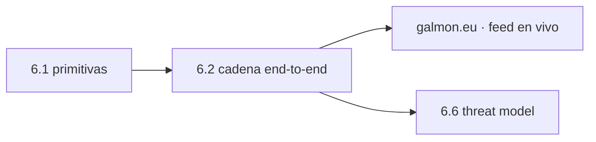

# Clase 6.2 — La cadena de confianza OSNMA de punta a punta

> Bloque del máster: B3 — Signals · Autenticación Galileo OSNMA / SAS

**Objetivo en una frase**: encadenar las tres primitivas de 6.1 en el flujo
operativo real —de la raíz de Merkle embebida hasta cada dato de navegación
autenticado— y verificar un stream frame a frame, incluido uno manipulado.

**Tiempo estimado**: 3.5 h (teoría 60' · lab 100' · ejercicios y cierre 40').

## 1. Objetivos

- [ ] Montar la cadena Merkle→ECDSA→TESLA→tags completa.
- [ ] Verificar un stream de subframes como lo hace un receptor OSNMA.
- [ ] Detectar un frame con datos alterados (el tag no cierra).
- [ ] Entender la revelación diferida y el relevo de cadena (Chain ID).

## 2. ¿Dónde estamos?

Toma las primitivas sueltas de 6.1 y las hace funcionar juntas, en el orden
y con la lógica reales. Es el paso previo a conectar el feed en vivo de
galmon. Prepara 6.6 (qué protege esta cadena y qué no).



## 3. Teoría (con blancos B1–B5)

### 1. La confianza fluye desde una sola ancla

El receptor solo confía de fábrica en **una cosa**: la **raíz de Merkle**
embebida. Todo lo demás se prueba contra ella, en orden:

$$\text{raíz Merkle} \to \text{pubkey} \to \text{firma KROOT} \to \text{KROOT} \to \text{claves TESLA} \to \text{tags} \to \text{datos}$$

### 2. Por qué cada eslabón

- **Merkle**: prueba que la clave pública activa es legítima (está en el árbol).
- **ECDSA**: esa pública firmó la **KROOT** → la raíz TESLA es de Galileo.
- **TESLA**: cada clave revelada pertenece a la cadena (hash hasta KROOT).
- **Tag**: la clave autentica los **datos** de ese subframe (MAC).

Si cualquier eslabón falla, se corta ahí: no se autentica nada aguas abajo.

### 3. Revelación diferida en el stream

El tag de la época *e* usa la clave de *e*, pero esa clave se **revela en
e+1**. El receptor guarda el tag y espera; al llegar la clave, verifica que
es de la cadena y que el tag cierra. Un atacante no puede adelantar la clave
(hash de un solo sentido, 6.1) → no puede falsificar en tiempo real.

### 4. Relevo de cadena (Chain ID)

Cada cierto tiempo el sistema **rota** la cadena TESLA (nueva KROOT). El
mensaje trae un **Chain ID**; el receptor debe reconocer el relevo, validar
la nueva KROOT (nueva firma) y recién entonces seguir. La operativa real
incluye logs de qué se autenticó y cuándo.

### Lectura activa (B1–B5)

<details><summary>Completá y verificá</summary>

- **B1.** Lo único embebido/confiable de fábrica es la ______ de Merkle.
- **B2.** La firma ECDSA ancla la ______ a la autoridad legítima.
- **B3.** El tag no ______ si los datos fueron alterados → frame rechazado.
- **B4.** La clave TESLA de la época e se revela en ______.
- **B5.** El ______ ID señala el relevo de cadena TESLA.

Respuestas: B1 raíz · B2 KROOT · B3 cierra · B4 e+1 · B5 Chain
</details>

## 4. Lab

```bash
python3 clases/mod6-seguridad/clase6.2-cadena/lab/lab_cadena_TODO.py
```

Verificás un stream reproducible frame a frame; un frame manipulado debe
fallar. Solución en `lab/soluciones/`.

### Tabla de validación

| Chequeo | Valor de referencia |
|---|---|
| Stream limpio | **20 autenticados / 0 rechazados** |
| Frame manipulado (época 10) | **19 / 1** (el alterado falla) |
| Clave TESLA falsa vs KROOT | **rechazada** |

### Conectar al feed real (galmon, requiere red)

[galmon.eu](https://galmon.eu) publica telemetría Galileo en vivo con los
campos OSNMA (DSM-KROOT, tags, claves TESLA). La verificación es **idéntica**
a este lab; solo cambia la fuente (parsear el feed según el OSNMA SIS ICD /
Receiver Guidelines). El núcleo sintético prueba tu verificador antes de
enchufarlo a datos vivos.

## 5. Ejercicios a mano

**E1.** ¿Por qué el receptor verifica de la raíz hacia afuera y no al revés?

**E2.** Un frame llega con la clave TESLA correcta pero los datos alterados.
¿Qué eslabón lo atrapa y cómo?

**E3.** ¿Por qué la revelación diferida impide falsificar en tiempo real
aunque el atacante vea todas las claves ya reveladas?

## 6. Estimaciones Fermi

**F1.** Si una cadena TESLA dura 1 día con claves cada 30 s, ¿cuántas claves
tiene? ¿Cuántos hashes hace el receptor para verificar la última?

**F2.** El overhead OSNMA en E1-B (250 bps) es de ~40 bits por subframe.
¿Qué fracción del ancho de banda del mensaje consume?

## 7. Preguntas conceptuales

<details><summary>C1. ¿Por qué hace falta la firma ECDSA si ya está TESLA?</summary>

TESLA prueba que las claves pertenecen a **una** raíz, pero no que esa raíz
sea de Galileo. La firma ECDSA (con pubkey probada por Merkle) ancla la
KROOT a la **autoridad legítima**. Sin ella, un atacante podría armar su
propia cadena TESLA consistente.
</details>

<details><summary>C2. ¿Qué pasa si el receptor pierde el relevo de cadena?</summary>

Deja de poder autenticar (la nueva KROOT no valida contra la clave/firma que
tenía). Debe re-sincronizar: leer el nuevo DSM-KROOT, verificar su firma, y
retomar. Por eso el Chain ID y los logs importan.
</details>

<details><summary>C3. ¿Esta cadena evita el spoofing de rango?</summary>

No. Autentica los **datos** (efemérides, reloj). Un replay/meaconing de la
señal auténtica con retardo mueve el rango sin tocar los datos → OSNMA no lo
ve. Por eso 6.6 la combina con consistencia (6.4) y sanidad física (4.1).
</details>

## 8. Pregunta de entrevista

> "Recorré la cadena de confianza de OSNMA de punta a punta. ¿En qué orden
> verifica un receptor y por qué? ¿Qué detecta y qué no?"

**Mini-caso**: tu receptor autentica bien un rato y de golpe rechaza todo.
¿Qué mirás primero (relevo de cadena, pérdida de sync de tiempo, ataque)?

## 9. Mini-simulacro (12 min)

1. Ordená la cadena de confianza completa.
2. ¿Por qué se verifica desde la raíz embebida?
3. ¿Cuándo se revela la clave TESLA respecto del tag?
4. ¿Cómo se detecta un dato alterado?
5. ¿Qué es el Chain ID?

<details><summary>Respuestas</summary>

1. raíz Merkle→pubkey→firma→KROOT→TESLA→tags→datos. 2. es lo único confiable
de fábrica. 3. la clave se revela un subframe después del tag. 4. el tag no
cierra sobre los datos alterados. 5. el identificador de la cadena TESLA
vigente (señala relevos).
</details>

## 10. Caso real — OSNMA de fase de prueba a servicio, y galmon

Entre 2021 y 2023 OSNMA estuvo en **fase pública de prueba**: cualquiera con
un receptor compatible (o parseando galmon) podía verificar la cadena real y
reportar. Esa apertura —rara en un sistema de seguridad— aceleró la adopción
y la confianza: investigadores de todo el mundo corrieron exactamente la
verificación de esta clase contra la constelación viva antes de la
declaración de servicio (2023). galmon, el agregador comunitario de
telemetría Galileo, fue una de las ventanas clave. Tu lab es ese verificador
en miniatura: cuando lo enchufás a galmon, estás haciendo lo mismo que la
comunidad hizo para auditar OSNMA en producción.

## 11. Glosario ES/EN

| ES | EN | Nota |
|---|---|---|
| cadena de confianza | trust chain | de la raíz embebida al dato autenticado |
| DSM-KROOT | DSM-KROOT | mensaje con la KROOT firmada |
| revelación diferida | delayed disclosure | la clave llega después del tag |
| Chain ID | Chain ID | identificador de la cadena TESLA vigente |
| relevo de cadena | chain renewal | rotación de la cadena/KROOT |
| galmon | galmon | agregador de telemetría Galileo en vivo |

## 12. Cheat sheet

```text
Cadena        raíz Merkle → pubkey → firma ECDSA → KROOT → claves TESLA → tags → datos
Ancla         solo la raíz de Merkle está embebida; todo se prueba contra ella
Orden         verificar de la raíz hacia afuera; si un eslabón falla, cortar
Diferida      clave de la época e se revela en e+1 (guardar tag, esperar clave)
Chain ID      señala relevo de cadena → validar nueva KROOT antes de seguir
Feed real     galmon.eu (misma lógica, otra fuente)
Ref lab       limpio 20/0 · manipulado 19/1 · clave falsa rechazada
```

## 13. Errores comunes

1. Confiar en la pubkey o el KROOT sin probarlos contra la raíz (romper el orden).
2. Aceptar la clave TESLA sin verificar el retardo (revelación diferida).
3. No manejar el relevo de cadena → el receptor "se queda sin autenticar".
4. Creer que autenticar los datos autentica el rango (no: replay vive, 6.6).
5. Enchufar a galmon sin haber validado el verificador con datos reproducibles.

## 14. Referencias

- Galileo OSNMA SIS ICD + OSNMA Receiver Guidelines (GSC) — formato y flujo.
- galmon.eu — telemetría Galileo en vivo.
- Fernández-Hernández et al. — diseño de OSNMA.
- Clases 6.1 (primitivas), 6.6 (threat model), 4.1 (sanidad física).

## 15. Rúbrica de autoevaluación

- ⭐ Ordeno la cadena de confianza y explico cada eslabón.
- ⭐⭐ Verifico un stream (limpio y manipulado) con el resultado de referencia.
- ⭐⭐⭐ Manejo relevo de cadena y explico qué NO autentica OSNMA (camino a 6.6/galmon).

## 16. Para tu bitácora

Copiá [`bitacora.md`](bitacora.md): tus resultados limpio/manipulado vs la
tabla, y una frase sobre por qué se verifica desde la raíz embebida.
