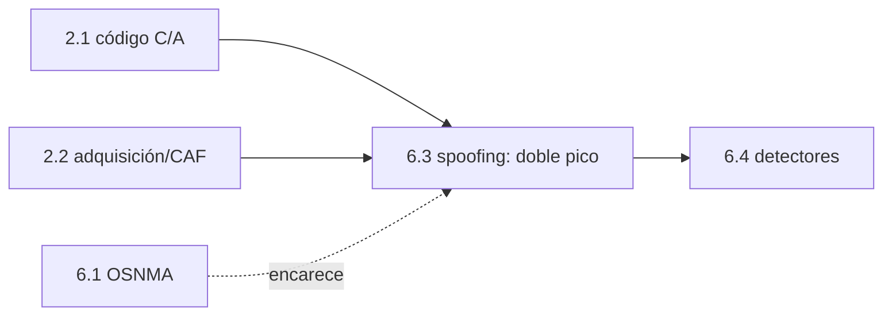

# Clase 6.3 — Anatomía de un spoofing: el pico falso que te secuestra

> Bloque del máster: B3 — Signals · Análisis de interferencias y spoofing

**Objetivo en una frase**: reconocer la firma de un ataque de spoofing en
la adquisición —un segundo pico en la CAF que crece junto al auténtico y
arrastra al receptor— reproduciéndolo de forma sintética y, opcionalmente,
sobre el dataset real TEXBAT.

**Tiempo estimado**: 3–3.5 h (teoría 50' · lab 100' · ejercicios y cierre 40').

## 1. Objetivos

- [ ] Entender cómo un spoofer captura el lazo de tracking (lift-off).
- [ ] Reproducir el **doble pico** en la función de ambigüedad (CAF).
- [ ] Ver por qué el pico falso debe superar al auténtico.
- [ ] Conectar la firma con los detectores (6.4) y con OSNMA (6.1).

## 2. ¿Dónde estamos?

Aplica la adquisición de 2.2 a un escenario adversario. Es la "causa" que
los detectores de 6.4 ven como "síntoma", y el ataque que OSNMA (6.1) busca
encarecer. Reusa el código C/A de 2.1.



## 3. Teoría (con blancos B1–B5)

### 1. Spoofing = engañar, no negar

A diferencia del jamming (6.5, que ahoga), el spoofing **inyecta señales
falsas creíbles**: el receptor calcula una posición/tiempo equivocados
**sin sospechar**. Es el ataque silencioso.

### 2. La firma: doble pico en la CAF

Cuando el spoofer transmite una réplica del código de un satélite, la
adquisición (2.2) ve **dos** picos: el auténtico y el falso, en distinto
desfase de código (y quizá Doppler). Es la huella inconfundible del ataque.

### 3. La captura del lazo (lift-off)

Un spoofer hábil **alinea** su pico con el auténtico, y luego **sube la
potencia** y **desliza** despacio el código: el lazo de tracking, que
engancha el pico más alto, lo sigue suavemente hasta la posición falsa
**sin perder enganche** (sin discontinuidad detectable). Por eso el pico
falso tiene que ser más fuerte.

### 4. Qué lo delata y qué no

El doble pico y la subida de potencia delatan a un spoofer **barato**
(detectores de 6.4: C/N0, cruce). Un spoofer **sofisticado** que iguale
potencia y sea coherente evade los físicos: ahí entra OSNMA (6.1), que
autentica los datos — aunque no el rango (replay sigue vivo, 6.6).

### Lectura activa (B1–B5)

<details><summary>Completá y verificá</summary>

- **B1.** El spoofing ______ (no niega como el jamming).
- **B2.** Su firma en la adquisición es un ______ pico en la CAF.
- **B3.** El pico falso debe ser más ______ para que el correlador lo prefiera.
- **B4.** La captura del lazo alinea y luego ______ la potencia sin discontinuidad.
- **B5.** OSNMA encarece el spoofing de ______, pero no autentica el ______.

Respuestas: B1 engaña · B2 segundo (doble) · B3 fuerte · B4 sube (aumenta) · B5 datos / rango
</details>

## 4. Lab

```bash
python3 clases/mod6-seguridad/clase6.3-spoofing/lab/lab_spoofing_TODO.py
```

Construís la señal auténtico+falso sobre el código C/A real y ves el doble
pico. Solución en `lab/soluciones/`.

### Tabla de validación (sintético reproducible)

| Chequeo | Valor de referencia |
|---|---|
| Limpio | **1 pico** (2º/1º ≈ 0.11, ruido) |
| Atacado | **2 picos**: auténtico (chip 100), falso (chip 140) |
| Razón falso/auténtico | **~1.56×** |
| Firma de doble pico | **SÍ** |

### Escenario real: TEXBAT (opcional, descarga aparte)

El dataset de referencia es **TEXBAT** (Texas Spoofing Test Battery, UT
Austin). Los escenarios clásicos (ds2, ds3, ...) pesan varios GB. Para
bajarlos (requiere tu red y disco):

```bash
# los archivos están en el repositorio público del Radionavigation Lab (UT Austin);
# ver https://radionavlab.ae.utexas.edu/texbat/ para los enlaces vigentes.
# Guardalos en data/raw/texbat/ y adaptá la adquisición de 2.2 para leerlos.
```

La firma es idéntica a la sintética: el pico falso crece junto al auténtico.
Si no bajás TEXBAT, el núcleo sintético cubre el concepto completo.

## 5. Ejercicios a mano

**E1.** ¿Por qué un spoofer que transmite un pico **más débil** que el
auténtico no logra capturar el receptor?

**E2.** El pico falso está a 40 chips del auténtico. A 293 m/chip (E1),
¿cuántos metros de error de posición induce si el receptor lo sigue?

**E3.** ¿Por qué el spoofing es más peligroso que el jamming para un buque?

## 6. Estimaciones Fermi

**F1.** Un spoofer quiere desviar un dron 500 m. ¿Cuántos chips de C/A debe
deslizar el pico (a ~300 m/chip)? ¿Lo haría de golpe o gradual y por qué?

**F2.** Si el receptor reacquiere cada 1 s y el spoofer desliza 1 chip/s,
¿cuánto tarda en llevarlo 1 km? ¿Es detectable como velocidad anómala (6.4)?

## 7. Preguntas conceptuales

<details><summary>C1. ¿Por qué el doble pico es la firma clave?</summary>

Porque físicamente no puede haber dos réplicas del mismo código llegando
con distinto retardo salvo por multipath (que es débil y cercano) o por un
segundo transmisor: el spoofer. Un pico falso fuerte y separado no es
natural.
</details>

<details><summary>C2. ¿Multipath o spoofing?</summary>

El multipath da picos secundarios **débiles y muy cercanos** (ecos), nunca
más fuertes que el directo. Un pico secundario **más fuerte** o alejado es
spoofing. La distinción es parte del arte de 6.4.
</details>

<details><summary>C3. ¿OSNMA detiene esto?</summary>

Encarece el spoofing de **datos** (no podés falsificar la efeméride sin la
clave), pero no autentica el **rango**: un replay de la señal auténtica con
retardo puede mover la posición sin tocar los datos. Por eso 6.6 combina
cripto + consistencia + sanidad física (4.1).
</details>

## 8. Pregunta de entrevista

> "Describí la firma de un ataque de spoofing en la adquisición y cómo un
> spoofer captura el lazo de tracking. ¿Cómo lo distinguís de multipath y
> qué defensas hay?"

**Mini-caso**: analizás una captura y ves un pico secundario 2 dB más
fuerte que el principal, a 50 chips. ¿Spoofing o multipath? ¿Qué más
mirarías (C/N0, constelaciones cruzadas)?

## 9. Mini-simulacro (12 min)

1. ¿Cuál es la firma de spoofing en la CAF?
2. ¿Por qué el pico falso debe ser más fuerte?
3. ¿Cómo se captura el lazo sin discontinuidad?
4. Multipath vs spoofing: ¿cómo los distinguís?
5. ¿Qué encarece OSNMA y qué no?

<details><summary>Respuestas</summary>

1. un segundo pico (falso) además del auténtico. 2. el correlador engancha
el más alto. 3. alinear y subir potencia/deslizar despacio. 4. multipath:
ecos débiles y cercanos; spoofing: pico fuerte/alejado. 5. encarece el
spoofing de datos, no autentica el rango.
</details>

## 10. Caso real — TEXBAT y el secuestro del yate (2013)

El Radionavigation Lab de UT Austin (Humphreys) no solo publicó **TEXBAT**
(2012), el dataset con el que se validan detectores hasta hoy; en 2013
demostró en vivo el **spoofing de un yate de 65 m** en el Mediterráneo:
tomaron el control de su GNSS y lo desviaron de rumbo sin que la
tripulación notara nada en sus instrumentos. La técnica fue exactamente la
de esta clase: alinear un pico falso con el auténtico y arrastrarlo. Ese
experimento marcó el paso del spoofing de la teoría a la agenda de
seguridad nacional, y es la razón directa de que Galileo desarrollara OSNMA
(6.1). Tu lab reproduce el corazón del ataque; TEXBAT te deja verlo sobre
señal real.

## 11. Glosario ES/EN

| ES | EN | Nota |
|---|---|---|
| spoofing | spoofing | señales falsas que engañan |
| CAF | CAF / ambiguity function | superficie de correlación código×Doppler |
| captura de lazo | lift-off / lock takeover | arrastrar el tracking a la señal falsa |
| replay / meaconing | replay / meaconing | re-emitir la señal auténtica con retardo |
| TEXBAT | TEXBAT | dataset de escenarios de spoofing (UT Austin) |
| doble pico | double peak | firma del spoofing en la adquisición |

## 12. Cheat sheet

```text
Spoofing      engaña (vs jamming que niega) — silencioso y peligroso
Firma         DOBLE pico en la CAF: auténtico + falso (más fuerte, otro desfase)
Captura       alinear con el auténtico → subir potencia y deslizar despacio (sin salto)
Multipath≠spoof  multipath: ecos débiles y cercanos ; spoof: pico fuerte/alejado
Defensas      OSNMA (datos, 6.1) + detectores (C/N0, cruce, 6.4) + sanidad efeméride (4.1)
Dataset real  TEXBAT (UT Austin) ; núcleo sintético reproducible acá
Ref lab       atacado: picos en 100 y 140, falso 1.56× el auténtico
```

## 13. Errores comunes

1. Confundir un eco de multipath (débil, cercano) con spoofing (fuerte, separado).
2. Creer que OSNMA frena todo spoofing: no autentica el rango (replay vive).
3. Pensar que el spoofer da un salto brusco: los buenos arrastran sin discontinuidad.
4. Ignorar el C/N0: la captura sube la potencia (6.4 lo ve).
5. Asumir que hace falta TEXBAT para entender: el sintético cubre el concepto.

## 14. Referencias

- Humphreys et al., *Assessing the Spoofing Threat* (ION GNSS 2008) y TEXBAT (2012).
- Radionavigation Lab, UT Austin — TEXBAT y el spoofing del yate (2013).
- Navipedia — "GNSS Spoofing".
- Clases 2.2 (adquisición/CAF), 6.1 (OSNMA), 6.4 (detectores), 6.6 (threat model).

## 15. Rúbrica de autoevaluación

- ⭐ Explico la firma de doble pico y por qué el falso es más fuerte.
- ⭐⭐ Reproduzco el doble pico en el lab y lo distingo de multipath.
- ⭐⭐⭐ Conecto el ataque con detectores + OSNMA y explico qué NO cubre la cripto.

## 16. Para tu bitácora

Copiá [`bitacora.md`](bitacora.md): tus picos vs la tabla, y una frase
sobre por qué el pico falso tiene que superar al auténtico.
