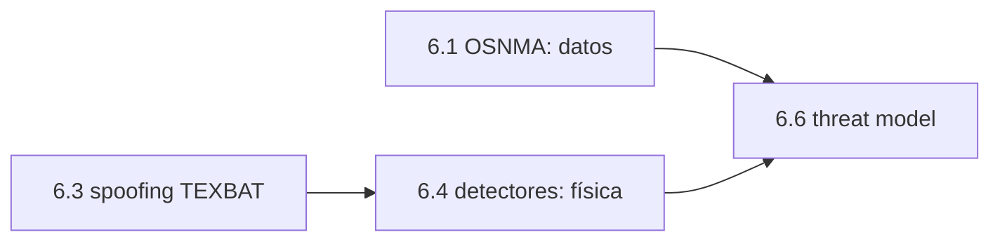

# Clase 6.4 — Detectores de consistencia: cazar al spoofer por su física

> Bloque del máster: B3 — Signals · Análisis de interferencias y spoofing

**Objetivo en una frase**: sin criptografía, detectar un spoofing por sus
huellas físicas (salto de C/N0, deriva de reloj, salto de posición,
inconsistencia entre constelaciones) y entender por qué se combinan con
OSNMA (6.1).

**Tiempo estimado**: 3 h (teoría 50' · lab 90' · ejercicios y cierre 40').

## 1. Objetivos

- [ ] Implementar 4 detectores de consistencia clásicos.
- [ ] Calibrar umbrales para baja falsa alarma y alta detección.
- [ ] Ver qué ataques evaden a cada detector (spoofing gradual).
- [ ] Entender por qué detectores + criptografía se complementan.

## 2. ¿Dónde estamos?

Segunda línea de defensa (la primera es OSNMA, 6.1): mientras la cripto
autentica los **datos**, estos chequeos vigilan el **rango y la física**.
Reusa el C/N0 de mod2 y prepara 6.3 (spoofing real TEXBAT) y 6.6 (threat
model, que los integra).



## 3. Teoría (con blancos B1–B5)

### 1. El spoofer deja huellas

Para que tu receptor "crea" señales falsas, el spoofer tiene que **ganarle**
al correlador auténtico y **arrastrar** suavemente tu solución. Ambas cosas
dejan rastro físico: potencia anormal, dinámica imposible, incoherencia
entre sistemas.

### 2. Los cuatro chequeos

- **Salto de C/N0**: para ganar, el spoofer llega más fuerte → el C/N0 sube
  varios dB en muchos satélites a la vez (antinatural).
- **Deriva de reloj**: el spoofer arrastra el tiempo del receptor → el
  sesgo de reloj se mueve raro.
- **Salto de posición/velocidad**: la solución "salta" a dinámicas no
  físicas (un peatón a 200 km/h).
- **Cruce entre constelaciones**: un spoofer barato falsifica GPS pero no
  Galileo coherentemente → discrepan.

### 3. Falsa alarma vs detección

Todo detector balancea: umbral bajo → detecta todo pero también salta sin
ataque (falsa alarma); umbral alto → poca falsa alarma pero se le escapan
ataques. Se calibra para **baja falsa alarma** manteniendo la detección
(igual que el PFA de RAIM en 5.1).

### 4. Por qué no alcanza con detectores

Un spoofer **sofisticado** puede igualar potencia (evade C/N0), arrastrar
despacio (evade los detectores de tasa) y —si tiene los medios— falsificar
varias constelaciones. Por eso los detectores físicos se **combinan con
OSNMA** (autentica los datos) y con la sanidad de efeméride (4.1): defensa
en capas.

### Lectura activa (B1–B5)

<details><summary>Completá y verificá</summary>

- **B1.** Para ganar el correlador, el spoofer sube la ______ → salta el C/N0.
- **B2.** Un spoofer barato falsifica una ______, no ambas coherentemente.
- **B3.** Umbral bajo → mucha ______; umbral alto → se escapan ataques.
- **B4.** Un ataque ______ evade los detectores de tasa (rampa = aceleración ~0).
- **B5.** Detectores físicos + ______ (cripto) = defensa en capas.

Respuestas: B1 potencia · B2 constelación · B3 falsa alarma · B4 gradual · B5 OSNMA
</details>

## 4. Lab

```bash
python3 clases/mod6-seguridad/clase6.4-detectores/lab/lab_detectores_TODO.py
```

Sobre series sintéticas (limpia vs atacada, deterministas) implementás los
detectores y medís falsa alarma y detección. Solución en `lab/soluciones/`.

### Tabla de validación

| Métrica | Valor de referencia |
|---|---|
| Falsa alarma (datos limpios) | **0.5 %** |
| Detección (durante el ataque) | **100 %** |
| Latencia de detección | **0 s** |
| Detectores que cazan el ataque gradual | **C/N0 y cruce** (no los de tasa) |

El hallazgo clave: el ataque es **gradual**, así que los detectores de tasa
(aceleración de reloj, salto de velocidad) no disparan; lo cazan el salto de
C/N0 y el cruce GPS/Galileo. Ningún detector solo alcanza.

## 5. Ejercicios a mano

**E1.** ¿Por qué un salto de C/N0 simultáneo en 8 satélites es más
sospechoso que en uno solo?

**E2.** Un spoofer iguala exactamente la potencia auténtica. ¿Qué detector
pierde efecto y cuál sigue sirviendo?

**E3.** ¿Por qué el cruce GPS/Galileo es caro de burlar para el atacante?

## 6. Estimaciones Fermi

**F1.** Si el detector de C/N0 tiene falsa alarma 0.5 % y corre a 1 Hz,
¿cuántas falsas alarmas por hora? ¿Es tolerable para alertar a un piloto?

**F2.** Un peatón real acelera < 2 m/s². Si el spoofer arrastra la posición
a 0.3 m/s² adicional, ¿en cuánto tiempo genera 100 m de error? ¿Lo
notarías?

## 7. Preguntas conceptuales

<details><summary>C1. ¿Por qué el C/N0 es un "observable centinela"?</summary>

Porque es barato de medir y difícil de mover sin delatarse: un ataque que
sube potencia lo mueve. Es el primer indicio anti-spoofing, aunque un
atacante que iguale potencia lo evade.
</details>

<details><summary>C2. ¿Detectores o criptografía?</summary>

Ambos. OSNMA autentica los **datos** (no el rango); los detectores vigilan
el **rango y la física** (no prueban origen). Se complementan: juntos
cubren lo que cada uno no puede.
</details>

<details><summary>C3. ¿Por qué calibrar la falsa alarma es tan importante?</summary>

Un detector con alta falsa alarma se **ignora** (como una alarma de auto
que suena sola). La utilidad operativa depende de disparar casi solo cuando
hay ataque real.
</details>

## 8. Pregunta de entrevista

> "Nombrá detectores de spoofing que no usen criptografía, decí qué ataque
> caza cada uno y cuál evade un spoofer sofisticado. ¿Cómo se combinan con
> OSNMA?"

**Mini-caso**: un buque reporta que su GPS "salta" cerca de un puerto en
conflicto. ¿Qué chequeos correrías para confirmar spoofing y cuáles
descartarían un simple multipath?

## 9. Mini-simulacro (12 min)

1. ¿Qué hace el spoofer con la potencia y cómo se detecta?
2. ¿Por qué funciona el cruce entre constelaciones?
3. Falsa alarma vs detección: el trade-off.
4. ¿Qué ataque evade los detectores de tasa?
5. ¿Cómo se combinan detectores y OSNMA?

<details><summary>Respuestas</summary>

1. la sube para ganar el correlador → salto de C/N0. 2. un spoofer barato
falsifica una constelación, no ambas coherentes. 3. umbral bajo detecta
todo pero salta solo; alto, al revés. 4. el gradual (rampa). 5. cripto
autentica datos, detectores vigilan rango/física: capas.
</details>

## 10. Caso real — el spoofing del Mar Negro (2017) y los círculos en el aeropuerto

En 2017 decenas de barcos en el Mar Negro reportaron posiciones GPS
idénticas y falsas (tierra adentro, en un aeropuerto). Fue uno de los
primeros casos documentados de spoofing masivo en el "mundo real". Los
patrones —muchos receptores saltando al mismo punto, C/N0 anómalo,
posiciones físicamente imposibles— son exactamente lo que cazan los
detectores de esta clase. Desde entonces el *GPS spoofing* se volvió
común en zonas de conflicto, afectando aviación comercial. La lección: los
detectores de consistencia son la red de seguridad barata que corre
**siempre**, incluso donde no hay OSNMA (GPS no la tiene); la cripto de
Galileo (6.1) es la capa que eleva el costo del ataque.

## 11. Glosario ES/EN

| ES | EN | Nota |
|---|---|---|
| spoofing | spoofing | señales falsas que engañan al receptor |
| meaconing | meaconing | re-emitir señales reales con retardo |
| C/N0 | C/N0 | densidad de potencia portadora/ruido (dB-Hz) |
| falsa alarma | false alarm | disparo del detector sin ataque |
| detección | detection (probability) | fracción de ataques detectados |
| observable centinela | sentinel observable | el que delata el ataque (C/N0) |
| defensa en capas | defense in depth | combinar cripto + física |

## 12. Cheat sheet

```text
Detectores   C/N0 (salto de potencia) · reloj (deriva) · salto pos/vel · cruce GPS/GAL
Trade-off    umbral bajo → detecta + falsa alarma ; alto → menos falsa alarma, se escapan
Evade tasa   ataque gradual (rampa) ; lo cazan C/N0 y cruce
Combinar     detectores (rango/física) + OSNMA (datos) + sanidad efeméride (4.1)
Ref lab      falsa alarma 0.5% · detección 100% · latencia 0 s
```

## 13. Errores comunes

1. Confiar en un solo detector: cada uno tiene su punto ciego.
2. Umbral demasiado bajo → falsa alarma → se ignora el sistema.
3. Confundir multipath con spoofing (el multipath no sube C/N0 coherente ni descoordina constelaciones).
4. Creer que los detectores prueban origen: solo detectan incoherencia (eso lo hace la cripto).
5. Olvidar que un spoofer sofisticado evade los físicos → hace falta OSNMA.

## 14. Referencias

- Humphreys et al. — trabajos de spoofing y detección (Radionavigation Lab, UT Austin).
- Psiaki & Humphreys, *GNSS Spoofing and Detection* (Proc. IEEE).
- Navipedia — "GNSS Spoofing".
- Clases 6.1 (OSNMA), 6.3 (TEXBAT), 6.6 (threat model), 2.2 (C/N0).

## 15. Rúbrica de autoevaluación

- ⭐ Nombro los 4 detectores y qué caza cada uno.
- ⭐⭐ Corro el lab con baja falsa alarma y alta detección.
- ⭐⭐⭐ Explico qué evade un spoofer sofisticado y por qué se combinan detectores + OSNMA.

## 16. Para tu bitácora

Copiá [`bitacora.md`](bitacora.md): tu falsa alarma/detección vs la tabla,
y una frase sobre por qué un ataque gradual evade los detectores de tasa.
