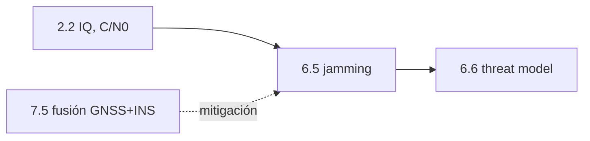

# Clase 6.5 — Jamming: cuando ahogar la señal es tan fácil como barata

> Bloque del máster: B3 — Signals · Análisis de interferencias y spoofing

**Objetivo en una frase**: generar interferencia (CW y chirp) sobre IQ
sintética, verla en el espectrograma, detectarla por energía/AGC y medir
cómo derrumba el C/N0 y el tracking.

**Tiempo estimado**: 3 h (teoría 50' · lab 90' · ejercicios y cierre 40').

## 1. Objetivos

- [ ] Generar IQ con un jammer CW y uno chirp.
- [ ] Ver el espectrograma y reconocer la firma de cada jammer.
- [ ] Detectar por energía/AGC con baja falsa alarma.
- [ ] Medir la caída de C/N0 y la pérdida de tracking.

## 2. ¿Dónde estamos?

La otra cara de la seguridad de señal: el spoofing engaña (6.3, 6.4), el
**jamming niega**. Reusa la señal IQ de mod2 y el concepto de C/N0. Cierra,
con 6.4, la parte de amenazas de RF antes del threat model (6.6).



## 3. Teoría (con blancos B1–B5)

### 1. Jamming vs spoofing

**Jamming** = ahogar la señal con potencia/ruido para que el receptor no
enganche nada. **Spoofing** = inyectar señales falsas creíbles. El jammer
es ruidoso y fácil de detectar; el spoofer es sutil. Un martillo vs un
carterista.

### 2. Por qué basta tan poca potencia

La señal GNSS llega **feblísima** (~10⁻¹⁶ W) tras viajar 20 000 km. Un
jammer de 1 W a 100 m la supera por ~130 dB (J/S enorme). Por eso un
dispositivo diminuto y barato ("personal privacy device" de camión) niega
GNSS en cientos de metros — y afecta aeropuertos enteros.

### 3. Tipos y sus firmas

- **CW** (tono continuo): una línea fija en el espectro; se puede recortar
  con un filtro **notch**.
- **Chirp**: barre la frecuencia rápido → llena toda la banda; ningún notch
  fijo lo saca. Es el jammer barato más común y más efectivo.

### 4. Detección y efecto

Detectar es fácil: el **AGC** (control de ganancia) se satura y la energía
por bloque salta. El efecto: el jammer sube el **piso de ruido**, así que
el **C/N0** (señal sobre ruido) se derrumba y, bajo ~30 dB-Hz, los lazos
DLL/PLL pierden el satélite. Ojo: mirar el **pico** del espectro engaña
(se engancha al jammer); hay que mirar la señal en su bin sobre el piso.

### Lectura activa (B1–B5)

<details><summary>Completá y verificá</summary>

- **B1.** El jamming ______ el servicio; el spoofing lo ______.
- **B2.** Basta poca potencia porque la señal GNSS llega ______ desde 20 000 km.
- **B3.** El jammer ______ (tono) se recorta con notch; el ______ barre la banda.
- **B4.** El jammer sube el ______ de ruido → el C/N0 cae.
- **B5.** Bajo ~30 dB-Hz de C/N0 el ______ pierde enganche.

Respuestas: B1 niega / engaña · B2 feblísima · B3 CW / chirp · B4 piso · B5 tracking (lazo)
</details>

## 4. Lab

```bash
python3 clases/mod6-seguridad/clase6.5-jamming/lab/lab_jamming_TODO.py
```

Generás IQ con jammer, detectás por energía y medís el efecto. Solución en
`lab/soluciones/` (incluye espectrograma y C/N0).

### Tabla de validación

| Métrica | Valor de referencia |
|---|---|
| Subida de potencia (J/S) | **~30 dB** |
| Detección por energía | **100 %** (falsa alarma 0 %) |
| Caída de C/N0 | **~26 dB-Hz** |
| Tracking | **PERDIDO** (C/N0 ~28 dB-Hz < 30) |

## 5. Ejercicios a mano

**E1.** Jamming vs spoofing: ¿cuál es más fácil de detectar y por qué? ¿Cuál
es más peligroso para una aproximación de aviación?

**E2.** ¿Por qué un filtro notch mata un CW pero no un chirp?

**E3.** El C/N0 cae 26 dB-Hz. Si el umbral de tracking es 30 dB-Hz y el
nominal 45, ¿queda margen? ¿Qué le pasa al receptor?

## 6. Estimaciones Fermi

**F1.** Un jammer de 10 mW en la guantera de un auto: con la señal GNSS a
−160 dBW, ¿a qué distancia el J/S sigue por encima de 40 dB (tracking
imposible)?

**F2.** Un aeropuerto detecta jamming intermitente. Si cada evento dura 30 s
y hay 20 por día, ¿qué fracción del tiempo el GNSS es inutilizable? ¿Por qué
igual es un problema de seguridad?

## 7. Preguntas conceptuales

<details><summary>C1. ¿Por qué el jamming es fácil de detectar pero difícil de mitigar?</summary>

Detectarlo: el AGC/energía salta, imposible de ocultar. Mitigarlo: hay que
recuperar una señal ahogada — filtros notch (solo CW), antenas CRPA que
apuntan nulos al jammer (caras), o puentear con INS (7.5). Ninguna es
trivial ni universal.
</details>

<details><summary>C2. ¿Por qué el chirp es el jammer barato preferido?</summary>

Con un oscilador que barre rápido cubre toda la banda con hardware mínimo,
evadiendo los notch fijos. Máximo daño por dólar.
</details>

<details><summary>C3. ¿Cómo ayuda la fusión GNSS+INS (7.5) contra el jamming?</summary>

No evita el jamming, pero lo **sobrevive**: cuando el GNSS se ahoga, el INS
puentea (como un corte), por decenas de segundos. Es mitigación, no
inmunidad.
</details>

## 8. Pregunta de entrevista

> "Diferenciá jamming de spoofing. ¿Cómo detectás un jammer, por qué basta
> tan poca potencia, y qué mitigaciones conocés?"

**Mini-caso**: un puerto reporta pérdida de GNSS recurrente a cierta hora.
¿Cómo confirmarías jamming (vs una falla del receptor) y qué recomendarías?

## 9. Mini-simulacro (12 min)

1. Jamming vs spoofing en una frase.
2. ¿Cómo se detecta un jammer sin decodificar nada?
3. ¿Por qué el C/N0 cae aunque suba la potencia del canal?
4. CW vs chirp: firma y mitigación.
5. ¿Por qué un jammer chico niega GNSS en gran área?

<details><summary>Respuestas</summary>

1. jamming niega, spoofing engaña. 2. el AGC/energía salta. 3. sube el piso
de ruido → señal/ruido cae. 4. CW línea fija (notch); chirp barre (evade
notch). 5. la señal llega feblísima desde 20 000 km, poca potencia la
supera.
</details>

## 10. Caso real — los aeropuertos y los "privacy jammers" de camión

En Newark (EE.UU.) el sistema de aumentación del aeropuerto sufría
interrupciones diarias e inexplicables hasta que se rastreó la causa: un
camionero que pasaba por una autopista cercana con un **jammer de GPS de
guantera** (ilegal, ~10 dólares) para que su empleador no lo rastreara. Ese
dispositivo diminuto degradaba el GNSS de un aeropuerto internacional al
pasar. Es la lección de esta clase en estado puro: la señal GNSS es tan
débil que un jammer trivial la ahoga, y detectarlo (energía/AGC) es fácil,
pero ubicarlo y mitigarlo es un problema operativo real. Por eso la
resiliencia PNT (INS, 7.5; multi-constelación; eLORAN) es política de Estado.

## 11. Glosario ES/EN

| ES | EN | Nota |
|---|---|---|
| jamming / interferencia | jamming / interference | ahogar la señal con potencia |
| J/S | jam-to-signal ratio | potencia jammer / señal |
| CW / chirp | CW / chirp | tono fijo / barrido de frecuencia |
| espectrograma | spectrogram | energía por frecuencia y tiempo |
| AGC | AGC | control automático de ganancia (delata el jammer) |
| notch | notch filter | recorta una frecuencia (mata el CW) |
| CRPA | CRPA | antena con nulos controlados (anti-jamming) |

## 12. Cheat sheet

```text
Jamming     niega (ahoga)   Spoofing   engaña (señal falsa)
Detección   AGC/energía salta (no hace falta decodificar)
Efecto      sube el PISO de ruido → C/N0 cae → bajo ~30 dB-Hz se pierde el tracking
CW vs chirp CW: línea fija, notch la mata ; chirp: barre la banda, evade el notch
Poca pot.   señal ~1e-16 W desde 20 000 km → jammer chico gana por ~130 dB (J/S)
Mitigación  notch (CW) · CRPA (nulos) · fusión INS (7.5, puentea)
Ref lab     +30 dB potencia · detección 100% · C/N0 −26 dB-Hz · tracking perdido
```

## 13. Errores comunes

1. Estimar C/N0 por el pico del espectro: se engancha al jammer (da alto falso). Usá la señal en su bin sobre el piso.
2. Creer que detectar jamming es difícil: el AGC lo delata al instante.
3. Pensar que un notch resuelve todo: solo sirve para CW, no para chirp.
4. Confundir jamming (potencia, niega) con spoofing (datos falsos, engaña).
5. Subestimar jammers baratos: uno de guantera afecta un aeropuerto.

## 14. Referencias

- Kaplan & Hegarty — cap. de interferencia y jamming.
- Navipedia — "GNSS Interference", "Jamming".
- FAA/Volpe — reportes de interferencia GPS (caso Newark).
- Clases 2.2 (IQ, C/N0), 6.4 (detectores), 7.5 (fusión como mitigación).

## 15. Rúbrica de autoevaluación

- ⭐ Distingo jamming de spoofing y explico por qué basta poca potencia.
- ⭐⭐ Corro el lab, detecto el jammer y mido la caída de C/N0.
- ⭐⭐⭐ Analizo CW vs chirp, sus mitigaciones, y conecto con la resiliencia PNT.

## 16. Para tu bitácora

Copiá [`bitacora.md`](bitacora.md): tu detección y caída de C/N0 vs la
tabla, y una frase sobre por qué el C/N0 cae aunque suba la potencia total.
