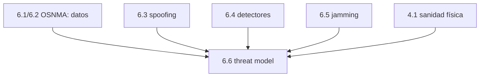

# Clase 6.6 — Threat model: qué protege cada capa y qué queda afuera

> Bloque del máster: B3 — Signals · Autenticación Galileo OSNMA / SAS

**Objetivo en una frase**: construir el modelo de amenazas de la seguridad
GNSS como una matriz ataque × defensa, entender por qué **OSNMA autentica
datos y no rango**, y justificar la defensa **en capas** (cripto + señal +
consistencia + física).

**Tiempo estimado**: 2.5–3 h (teoría 60' · lab/ADR 70' · ejercicios y cierre 40').

## 1. Objetivos

- [ ] Mapear los ataques (falsificar datos, spoofing de rango, replay, jamming, lift-off) contra las defensas.
- [ ] Entender el límite de OSNMA (no autentica el rango).
- [ ] Justificar la defensa en capas y el residuo de cada ataque.
- [ ] Escribir un threat model estilo ADR.

## 2. ¿Dónde estamos?

Cierre del módulo de seguridad: integra OSNMA (6.1/6.2), spoofing (6.3),
detectores (6.4), jamming (6.5) y la sanidad física de efeméride (4.1) en
una visión de sistema. Es también la "cadena de integridad de usuario" que
el máster conecta con el monitoreo de tierra (B4).



## 3. Teoría (con blancos B1–B5)

### 1. Autenticar datos ≠ autenticar rango

OSNMA prueba que la **efeméride y el reloj** los emitió Galileo (6.1/6.2).
Pero la posición sale del **rango** (tiempo de vuelo), y OSNMA no lo
autentica: un atacante que **re-emita** la señal auténtica con sus tags
válidos, con retardo, mueve tu posición **sin tocar los datos**. Ese es el
agujero conceptual clave.

### 2. Las capas de defensa

- **OSNMA** (cripto, nivel datos): falsificación de efeméride/reloj.
- **SAS/ACAS** (autenticación a nivel de **señal**, sobre E6-C): la señal
  lleva un secreto → ayuda contra spoofing de rango y replay.
- **Detectores de consistencia** (6.4): C/N0, deriva de reloj, salto de
  posición, cruce entre constelaciones. Baratos, siempre corriendo.
- **Sanidad física de efeméride** (4.1): órbita plausible (semieje MEO,
  sin saltos imposibles). Ortogonal a la cripto.

### 3. Ninguna capa alcanza sola

Cada ataque tiene un **residuo** tras las defensas. El jamming ni siquiera
se autentica (no se puede autenticar lo que no llega): se **detecta** (6.5)
y se **sobrevive** con INS (7.5). La seguridad es un **sistema**, no una
casilla marcada.

### 4. Por qué documentarlo (ADR)

Escribir el threat model explícito —qué mitiga cada capa, qué residuo
queda— evita la falsa sensación de "tenemos OSNMA, estamos seguros". Obliga
a razonar en sistema y a priorizar. Es una decisión de arquitectura (ADR).

### Lectura activa (B1–B5)

<details><summary>Completá y verificá</summary>

- **B1.** OSNMA autentica los ______, no el ______.
- **B2.** Un ______ re-emite la señal auténtica con retardo y evade OSNMA.
- **B3.** ______ autentica a nivel de señal (E6-C) y ayuda contra el rango.
- **B4.** La sanidad física de efeméride (4.1) es una defensa ______ a la cripto.
- **B5.** El jamming no se autentica: se ______ y se sobrevive con INS.

Respuestas: B1 datos / rango · B2 replay (meaconing) · B3 SAS/ACAS · B4 ortogonal · B5 detecta
</details>

## 4. Lab (threat model como código + ADR)

```bash
python3 clases/mod6-seguridad/clase6.6-threat-model/lab/lab_threat_TODO.py
```

Validás la coherencia de la matriz ataque × defensa (ningún ataque sin
defensa; OSNMA no "cubre" el rango). Solución en `lab/soluciones/` +
`soluciones.md` trae el ADR completo.

### Tabla de validación (cobertura por capa)

| Capa | Ataques que toca |
|---|---|
| Detectores (6.4) | **5/5** (aunque un spoofer sofisticado los evade) |
| SAS/ACAS | **3/5** |
| Sanidad física (4.1) | **2/5** |
| OSNMA | **1/5** (solo datos) |

El dato que ordena todo: **OSNMA sola cubre 1 de 5**. Sin las otras capas,
la mayoría de los ataques pasan.

## 5. Ejercicios a mano

**E1.** ¿Por qué un replay de la señal auténtica pasa OSNMA? ¿Qué capa lo
atrapa?

**E2.** Clasificá cada ataque como "engaño" o "negación" y decí qué tipo de
defensa aplica a cada clase.

**E3.** Escribí en 3 líneas el residuo del "spoofing de rango" tras aplicar
todas las capas.

## 6. Estimaciones Fermi

**F1.** Si OSNMA eleva el costo de falsificar datos de "gratis" a "hace
falta romper ECDSA P-256", ¿por qué el atacante se mueve al replay en vez de
atacar la cripto?

**F2.** Un sistema crítico exige detectar cualquier ataque en < 5 s. Con
detectores a 1 Hz y OSNMA que autentica cada ~30 s, ¿qué capa da la alerta
temprana?

## 7. Preguntas conceptuales

<details><summary>C1. ¿Por qué "tenemos OSNMA" no significa "estamos seguros"?</summary>

Porque OSNMA cubre un solo vector (datos). El rango, el replay y el jamming
quedan afuera. Confiar solo en OSNMA deja la puerta abierta al ataque más
práctico (replay), que no toca los datos.
</details>

<details><summary>C2. ¿Qué agrega SAS/ACAS que OSNMA no puede?</summary>

Autenticación a nivel de **señal**: un componente secreto en la propia
forma de onda (E6-C) que un replay no puede reproducir sin conocerlo. Ataca
el rango, no solo los datos.
</details>

<details><summary>C3. ¿Por qué la física (4.1) es tan valiosa aunque no sea cripto?</summary>

Es **ortogonal**: un atacante que domine la criptografía igual tiene que
producir una órbita físicamente coherente (semieje MEO, sin saltos). Romper
dos defensas independientes es mucho más caro que romper una.
</details>

## 8. Pregunta de entrevista

> "¿Qué ataque NO mitiga OSNMA y por qué? Diseñá una defensa en capas para
> un receptor crítico y justificá el residuo de cada amenaza."

**Mini-caso**: te contratan para asegurar el PNT de una terminal portuaria.
¿Qué capas combinás, en qué orden de prioridad, y qué le decís al cliente
que **no** podés garantizar?

## 9. Mini-simulacro (12 min)

1. ¿Qué autentica OSNMA y qué no?
2. ¿Qué es un replay y por qué evade OSNMA?
3. ¿Qué aporta SAS/ACAS?
4. ¿Por qué la sanidad física es ortogonal?
5. ¿Cómo se maneja el jamming (no se autentica)?

<details><summary>Respuestas</summary>

1. datos sí, rango no. 2. re-emitir la señal auténtica con retardo; sus
tags son válidos. 3. autenticación de señal (rango). 4. no es cripto:
chequea coherencia orbital, independiente. 5. se detecta (AGC) y se
sobrevive con INS (7.5).
</details>

## 10. Caso real — por qué OSNMA es necesaria pero no suficiente

Cuando Galileo declaró OSNMA en servicio (2023), la comunicación fue
cuidadosa: OSNMA **eleva el costo** de falsificar datos de navegación, pero
los organismos de aviación y defensa aclararon que **no reemplaza** la
detección de spoofing ni la resiliencia PNT. La razón es exactamente el
threat model de esta clase: los incidentes reales de spoofing (Mar Negro
2017, zonas de conflicto) suelen ser **replay/meaconing** —re-emitir señal
real con retardo—, que OSNMA no ve. Por eso los receptores serios combinan
OSNMA con detección de consistencia, autenticación de señal (SAS, en
desarrollo) y fusión con sensores no-GNSS. La lección final del módulo:
seguridad es un sistema en capas, y el trabajo del ingeniero es conocer el
residuo de cada una.

## 11. Glosario ES/EN

| ES | EN | Nota |
|---|---|---|
| modelo de amenazas | threat model | mapa ataque × defensa × residuo |
| autenticación de datos | data authentication | OSNMA (efeméride, reloj) |
| autenticación de señal | signal authentication | SAS/ACAS (rango) |
| replay / meaconing | replay / meaconing | re-emitir señal real con retardo |
| defensa en capas | defense in depth | combinar capas independientes |
| residuo | residual risk | lo que sigue posible tras las defensas |
| ADR | ADR | Architecture Decision Record |

## 12. Cheat sheet

```text
OSNMA        autentica DATOS (efeméride/reloj), NO el rango
Replay       re-emite señal auténtica con retardo → evade OSNMA (tags válidos)
SAS/ACAS     autenticación de SEÑAL (E6-C) → ataca el rango
Detectores   C/N0, reloj, salto, cruce (6.4) — baratos, siempre corriendo
Física       sanidad de efeméride (4.1) — defensa ORTOGONAL a la cripto
Jamming      no se autentica → se detecta (6.5) y se sobrevive con INS (7.5)
Cobertura    detectores 5/5 · SAS 3/5 · física 2/5 · OSNMA 1/5 → defensa en capas
```

## 13. Errores comunes

1. Creer que OSNMA frena el spoofing de rango o el replay (no: solo datos).
2. Confiar en una sola capa: cada ataque tiene su residuo.
3. Olvidar la capa física (4.1): es la más barata y ortogonal a la cripto.
4. Tratar el jamming como algo a "autenticar": es negación, se detecta y se sobrevive.
5. No documentar el residuo → falsa sensación de seguridad.

## 14. Referencias

- Galileo OSNMA SIS ICD + Receiver Guidelines — alcance y límites de OSNMA.
- ESA/GSA — SAS/ACAS (autenticación de señal) — estado del arte.
- Psiaki & Humphreys — taxonomía de ataques y defensas GNSS.
- Clases 6.1/6.2 (OSNMA), 6.3 (spoofing), 6.4 (detectores), 6.5 (jamming), 4.1 (física), 7.5 (INS).

## 15. Rúbrica de autoevaluación

- ⭐ Explico qué autentica OSNMA y qué no.
- ⭐⭐ Construyo/valido la matriz ataque × defensa y justifico los residuos.
- ⭐⭐⭐ Diseño una defensa en capas para un caso y comunico honestamente qué no se garantiza.

## 16. Para tu bitácora

Copiá [`bitacora.md`](bitacora.md): tu cobertura por capa vs la tabla, y
escribí tu propio ADR de una página sobre la seguridad del receptor.
