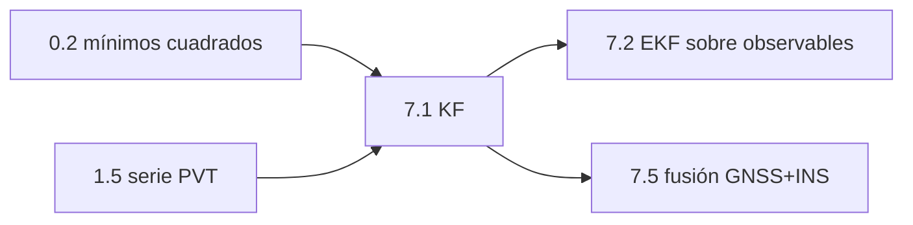

# Clase 7.1 — Filtro de Kalman desde cero (el promedio que aprendió física)

> Bloque del máster: B2 — Advanced · Modelos avanzados de estimación: KF, EKF

El LSQ de la 1.5 resuelve cada época **como si la anterior no existiera**.
El filtro de Kalman es la corrección de esa amnesia: arrastra un estado y
su incertidumbre, predice con un modelo de dinámica y corrige con cada
medición — el punto medio óptimo entre "creerle al modelo" y "creerle al
dato". Acá se construye a mano (1D → 3D) y se suelta sobre la **serie
real de 121 soluciones** de tu motor 1.5.

**Tiempo estimado**: 3.5–4 h (teoría 60' · lab 90' · ejercicios 45' · cierre 30').

## 1. Objetivos

- [ ] Escribir el ciclo predicción/corrección y explicar qué es la ganancia $K$
- [ ] Ver que el KF de una constante ES el promedio recursivo (y por qué generaliza)
- [ ] Filtrar la serie ENU real del 1.5 con modelo de velocidad constante
- [ ] Usar las **innovaciones** como detector de modelo mal puesto (test de blancura)
- [ ] Distinguir qué arregla el KF (ruido), qué no (sesgo) y qué no debe tocar (error correlacionado)

## 2. Dónde estás en el mapa



Requiere la covarianza de 0.2 y la serie de 1.5; alimenta el EKF (7.2)
y la fusión (7.5).

## 3. Teoría (completá los blancos con el lab)

### 3.1 Las dos personalidades del filtro

Un KF alterna dos pasos sobre el estado $\mathbf{x}$ y su covarianza $P$:

$$\textbf{predicción:}\quad \mathbf{x}^- = F\,\mathbf{x} \qquad P^- = F P F^\top + Q$$
$$\textbf{corrección:}\quad K = P^- H^\top (H P^- H^\top + R)^{-1} \qquad \mathbf{x} = \mathbf{x}^- + K\,(\mathbf{z} - H\mathbf{x}^-)$$

$F$ (dinámica: cómo evoluciona el estado solo), $H$ (medición: qué parte
del estado se observa), $Q$ (cuánto desconfío de mi dinámica), $R$
(cuánto desconfío de la medición). La ganancia $K$ reparte la confianza:
$Q$ chico y $R$ grande → el filtro le cree al ______; al revés → le cree
al ______.

### 3.2 El caso más simple lo explica todo

Para estimar una constante ($F=1$, $Q=0$): la ganancia se apaga sola
como $K_n = 1/n$ y el KF reproduce **exactamente el promedio** — pero
recursivo: no guarda las mediciones, solo el estado y su varianza. El
promedio es un KF sin física; el KF es un promedio ______ física.

### 3.3 La innovación: el dato que audita al modelo

$\mathbf{y} = \mathbf{z} - H\mathbf{x}^-$ es lo que la medición
*sorprende* al modelo. Si el modelo está bien puesto, las innovaciones
son **blancas** (sin memoria: $\rho(1) \approx 0$). Si suavizás de más
($Q$ demasiado chico), el filtro se atrasa y las innovaciones se
correlacionan en ______ — el test de blancura te delata antes de que
mientas con un gráfico lindo.

### 3.4 Lo que el KF no puede hacer

- Un **sesgo** constante pasa intacto: el filtro converge al promedio,
  y si el promedio está corrido, el KF está corrido (fino, pero corrido).
- El error **correlacionado** (iono residual, multipath que ondula en
  minutos) no es ruido blanco: promediarlo agresivamente = mentir. En la
  serie real vas a ver que el scatter baja ~×2 **y ahí se planta** — el
  resto no es ruido, es señal de error con memoria (mod3).

## 4. Lab

```bash
python3 clases/mod7-estimacion/clase7.1-kalman/lab/lab_kalman_TODO.py     # tu turno
python3 clases/mod7-estimacion/clase7.1-kalman/lab/soluciones/lab_kalman_solucion.py
```

### Tabla de validación (tus números deben coincidir)

| Parte | Métrica | Valor de referencia |
|---|---|---|
| A | KF de constante vs promedio (50 med., σ=1) | **5.0141 vs 5.0151** (idénticos a <5 mm) |
| B | rampa v=0.7, σ=2: RMS crudo → KF | **1.76 → 0.82 m** · v estimada **0.690** |
| C | scatter E/N/U crudo (serie real) | 0.66 / 0.69 / 1.50 m |
| C | scatter E/N/U filtrado | **0.45 / 0.47 / 0.65 m** (~×2 menos) |
| C | RMS vs oficial: crudo → KF | 0.72/0.75/1.45 → **0.62/0.56/0.69 m** |
| C | velocidad estimada (estación quieta) | (+7.5, −1.9, −4.8) mm/s ≈ 0 |
| C | innovaciones ρ(1) | **−0.16 / −0.00 / −0.07** (blancas) |

## 5. Ejercicios a mano

**E1.** KF escalar de una constante, 3 pasos a mano: $P_0=100$, $R=1$,
mediciones 4, 6, 5. Calculá $K$ y $x$ en cada paso y verificá que
$x_3$ = promedio(4,6,5) = 5.

**E2.** ¿Por qué $Q=0$ en E1 hace que $K_n \to 0$? ¿Qué pasaría con la
estimación si la "constante" empezara a moverse?

**E3.** Escribí $F$ y $Q$ (modelo de aceleración blanca) para estado
(pos, vel) con $\Delta t = 30$ s y $\sigma_a = 10^{-4}$ m/s². ¿Qué tan
lejos deja moverse a una "estación quieta" en una época?

## 6. Estimaciones Fermi

**F1.** La serie tiene 121 épocas con σ_U ≈ 1.5 m. Si el error FUERA
blanco, ¿qué scatter final esperarías del promedio? (~1.5/√121 ≈ 0.14 m.)
El KF se queda en 0.65 m: ¿cuánta "blancura" le falta al error real?

**F2.** ¿Cada cuántas épocas se "renueva" el error correlacionado si
ρ(1 época) del error crudo es ~0.9? (τ ≈ −Δt/ln ρ ≈ 5 min: el iono
residual y el multipath ondulan en minutos, no en segundos.)

## 7. Preguntas conceptuales

Respuestas en `soluciones.md` — primero por escrito.

**C1.** ¿Por qué el KF necesita DOS matrices de ruido ($Q$ y $R$) y qué
pasa si inflás cada una?

**C2.** ¿Por qué "innovaciones blancas" es el certificado de que el
filtro está bien puesto — y qué delata un ρ(1) positivo vs negativo?

**C3.** El KF redujo el RMS de U de 1.45 a 0.69 m pero E quedó en 0.62:
¿por qué el piso de cada eje es distinto y qué clase del path explica
ese piso?

## 8. Pregunta de entrevista

> "Explicá el filtro de Kalman sin matrices: ¿qué guarda, qué predice,
> qué corrige y cómo decide a quién creerle?"

**Mini-caso**: tu receptor de tractor pierde GNSS 10 s al pasar bajo
árboles. ¿Qué hace el KF durante el hueco y qué le pasa a $P$? ¿Por qué
eso habilita la fusión con IMU (7.5)?

## 9. Mini-simulacro (12 min, aprobás con 4/5)

1. Escribí el ciclo completo del KF (5 ecuaciones) de memoria.
2. $Q$ chico y $R$ grande: ¿a quién le cree el filtro? ¿Y al revés?
3. ¿Qué es la innovación y qué distribución debe tener si todo está bien?
4. ¿Por qué el KF no corrige el sesgo de la serie?
5. En estático, ¿qué velocidad debe estimar y qué indica si no lo hace?

## 10. Caso real — 1961: el filtro que llevó gente a la Luna

El paper de Kalman es de 1960; un año después Stanley Schmidt (NASA
Ames) lo adaptó al problema de navegar a la Luna — inventando de paso el
**EKF** (7.2), porque la dinámica orbital es no lineal. El computador de
guiado del Apollo corría un KF con **estado de 6–7 variables** en ~2 KB
de RAM: fusionaba sextante y acelerómetros, predecía con mecánica
orbital (¡la 0.3!) y corregía con cada marca de estrella. Moraleja
doble: (a) el KF nació espacial y volvió a GNSS por herencia directa;
(b) si cupo en el Apollo, tu excusa de cómputo no existe.

## 11. Glosario ES/EN

| ES | EN | Nota |
|---|---|---|
| estado / covarianza del estado | state / state covariance | $\mathbf{x}$, $P$ |
| predicción / corrección | predict / update | las dos personalidades |
| matriz de transición | state transition matrix ($F$) | la dinámica |
| ruido de proceso / de medición | process / measurement noise ($Q$/$R$) | las dos desconfianzas |
| ganancia de Kalman | Kalman gain ($K$) | el árbitro |
| innovación | innovation / residual | $\mathbf{z} - H\mathbf{x}^-$ |
| blancura (de innovaciones) | whiteness | $\rho(1)\approx 0$ |
| velocidad constante | constant velocity (CV) model | el modelo de esta clase |

## 12. Cheat sheet

```text
Predicción:   x⁻ = F·x            P⁻ = F·P·Fᵀ + Q
Corrección:   K  = P⁻Hᵀ(HP⁻Hᵀ+R)⁻¹
              x  = x⁻ + K·(z − H·x⁻)      P = (I − KH)·P⁻
Sintonía:     Q chico → creo al modelo · R chico → creo al dato
CV (pos,vel): F = [[1,dt],[0,1]]   Q = σa²·[[dt⁴/4,dt³/2],[dt³/2,dt²]]
Diagnóstico:  innovaciones blancas (ρ(1)≈0) = modelo bien puesto
Límites:      sesgo pasa intacto · error correlacionado NO es promediable
Serie 1.5:    scatter ×2 menos (0.65 m en U) · v ≈ 0 · ρ(1) ≈ −0.16/0/−0.07
```

## 13. Errores comunes

1. Confundir $Q$ con $R$ (o sintonizar uno para tapar el otro).
2. Evaluar el filtro por lo "lisa" que queda la curva — el juez son las
   innovaciones, no la estética.
3. Esperar que el KF arregle sesgos (converge al promedio, corrido y todo).
4. Promediar error correlacionado como si fuera blanco (F1 vs realidad).
5. Olvidar propagar $P$ en los huecos de datos (crece — y debe crecer).
6. Inicializar $P_0$ chico con $x_0$ malo: el filtro tarda en soltarse.

## 14. Referencias

- Kalman, R.E. (1960), *A New Approach to Linear Filtering and Prediction Problems* — el original, legible.
- ESA *GNSS Data Processing Vol. I* — sección de filtrado (KF aplicado a GNSS).
- Navipedia: *Kalman Filter*.
- Bar-Shalom et al., *Estimation with Applications to Tracking and Navigation* — cap. 5 (modelos CV/CA y sintonía de Q).

## 15. Flashcards y bitácora

- `flashcards_anki.csv` — deck sugerido `GNSS::M7::7.1`.
- `bitacora.md` — tus números vs la tabla de validación.

## 16. Rúbrica de cierre

La clase se marca `[x]` en el README del repo **solo** si:

- [ ] Blancos de la teoría (§3) completados y cotejados.
- [ ] Los 4 TODO del lab pasan sus auto-tests **sin haber abierto la solución**.
- [ ] Tus números coinciden con la tabla de validación (§4).
- [ ] E1 hecho a mano y verificado (x₃ = 5 exacto).
- [ ] Mini-simulacro ≥ 4/5 · flashcards a Anki · entrevista < 2 min.
- [ ] Podés explicar por qué el scatter se planta en ~0.5 m y qué lo causa.
