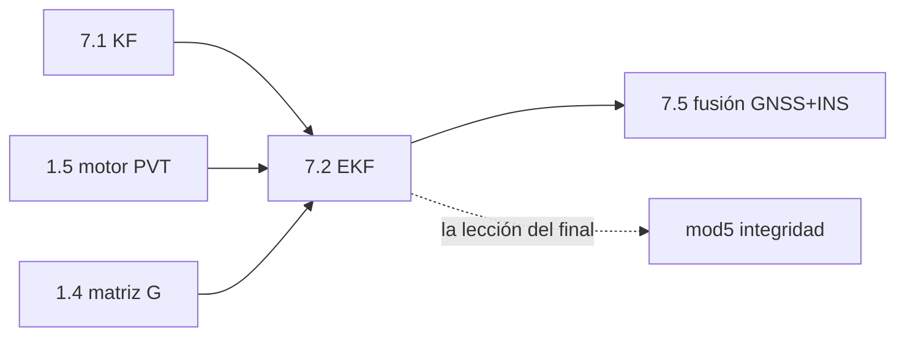

# Clase 7.2 — EKF sobre pseudodistancias y Doppler (el filtro come observables)

> Bloque del máster: B2 — Advanced · Modelos avanzados de estimación: KF, EKF

En la 7.1 el filtro comía *soluciones*; acá come **observables crudos**:
la medición es no lineal (la raíz de la pseudodistancia), el jacobiano es
la matriz de geometría de la 1.4, y el **Doppler** entra como observable
de velocidad y deriva de reloj. Bonus de datos reales: el receptor de
LPGS deriva −196 m/s y pega **saltos de milisegundo** — tu filtro tiene
que descubrir ambos. Y el final incómodo: con 3 satélites el EKF sigue
"resolviendo"… con 395 km de error y una covarianza que jura que son 135 m.

**Tiempo estimado**: 4–5 h (teoría 60' · lab 120' · ejercicios 45' · cierre 30').

## 1. Objetivos

- [ ] Plantear el EKF: misma maquinaria de la 7.1 con $h(\mathbf{x})$ no lineal y $H$ = jacobiano local
- [ ] Modelar el Doppler: $\dot\rho = \mathbf{u}\cdot(\mathbf{v}_s - \mathbf{v})$ + deriva de reloj
- [ ] Estimar 8 estados (pos, vel, $c\delta t$, $c\dot{\delta t}$) desde arranque frío (GN inicializa)
- [ ] Detectar y absorber los saltos de milisegundo del reloj del receptor
- [ ] Demostrar la ventaja Y el peligro de 3 satélites: solución sin observabilidad = overconfidence

## 2. Dónde estás en el mapa



## 3. Teoría (completá los blancos con el lab)

### 3.1 De KF a EKF: una sola diferencia

La medición ya no es $H\mathbf{x}$ sino $h(\mathbf{x})$ no lineal. El EKF
linealiza **en el estado actual**: $H = \partial h/\partial \mathbf{x}$
evaluado en $\mathbf{x}^-$ — la foto local de la 0.2. La corrección del
EKF es exactamente ______ paso de Gauss-Newton; por eso arrancar desde el
centro de la Tierra requiere iterarla (o inicializar con un GN completo,
que es lo que hace el lab).

### 3.2 Las dos filas de cada satélite

$$h_P = |\mathbf{s} - \mathbf{p}| + c\delta t \qquad
H_P = (-\mathbf{u},\; \mathbf{0},\; 1,\; 0)$$
$$h_D = \mathbf{u}\cdot(\mathbf{v}_s - \mathbf{v}) + c\dot{\delta t} \qquad
H_D = (\mathbf{0},\; -\mathbf{u},\; 0,\; 1)$$

La fila del código es la matriz de geometría de la ______ ; la del
Doppler es la MISMA geometría aplicada a las velocidades. El rango-rate
medido sale del Doppler como $\dot\rho = -\lambda_1 D$ (Doppler positivo
= acercándose). La velocidad del satélite se obtiene derivando el
propagador de la 1.3 numéricamente (derivada ______, ±0.5 s).

### 3.3 El reloj real: deriva y saltos

El oscilador de LPGS deriva $\approx$ ______ m/s (−0.65 µs/s): en 25
minutos acumula 1 ms y el firmware **resetea** — la pseudodistancia salta
±299 792.458 m de un tick a otro. El detector: si la innovación mediana
de los códigos es ~$k \cdot c \cdot 1$ms, el salto va **al estado**
$c\delta t$, jamás a la posición. El Doppler (derivado de fase) no salta:
por eso la deriva se estima continua a través del reset.

### 3.4 La trampa de los 3 satélites

Con 3 códigos + 3 Doppler hay 6 mediciones para 8 estados: queda una
dirección **inobservable** que el modelo rellena. El fix sigue saliendo
(el LSQ ni eso puede), pero el error corre por esa dirección y — peor —
los supuestos de ruido blanco se rompen, así que $P$ ya no sabe lo que
no sabe: el filtro queda **overconfident** ×~3000. Moraleja: la
covarianza es un juramento condicional a los supuestos; el perro
guardián externo es la ______ (mod5).

## 4. Lab

```bash
python3 clases/mod7-estimacion/clase7.2-ekf/lab/lab_ekf_TODO.py           # tu turno
python3 clases/mod7-estimacion/clase7.2-ekf/lab/soluciones/lab_ekf_solucion.py
```

### Tabla de validación (tus números deben coincidir)

| Chequeo | Valor de referencia |
|---|---|
| Diagnóstico Doppler en POS_OFICIAL | modo común **−195.99 m/s**, spread **0.012 m/s** |
| Inicialización GN (época 1, desde el centro) | 3D **8.6 m** |
| EKF época 2 / 3D medio convergido / final | **1.5 / 1.21 / 1.56 m** (LSQ suelto: 1.95) |
| \|v\| media (estación quieta) | **20 mm/s** |
| Deriva de reloj estimada | **−196.126 m/s** (a través de los saltos de ms) |
| [B] 3 SVs: error a 5 / 30 min | **73 km / 395 km** |
| [B] σ_pos del filtro al final | **135 m** → overconfidence **×~2900** |

## 5. Ejercicios a mano

**E1.** Escribí la fila completa $H$ (8 columnas) de un satélite con
$\mathbf{u} = (0.6, 0.8, 0)$: la del código y la del Doppler.

**E2.** El receptor deriva −196 m/s. ¿Cada cuánto acumula 1 ms? ¿Qué
signo tiene el salto de pseudodistancia cuando el firmware resetea?

**E3.** Doppler máximo de un Galileo (v ≈ 3.67 km/s órbita, geometría
rasante): $f_D = f_1 v_r / c$ con $v_r \approx 0.9$ km/s → ¿cuántos kHz?
¿Y en m/s de rango-rate? (Cotejá con la grilla ±5 kHz de la 2.2.)

## 6. Estimaciones Fermi

**F1.** El spread del diagnóstico Doppler fue 0.012 m/s. ¿Qué precisión
de velocidad esperás con 8 satélites promediando? (~mm/s: por eso el
Doppler es EL observable de velocidad.)

**F2.** En [B], el error creció ~73 km en 5 min ≈ 240 m/s. ¿Qué tan
lejos está eso de la deriva de reloj (−196 m/s)? ¿Casualidad? (Pista:
la dirección inobservable mezcla posición con reloj.)

## 7. Preguntas conceptuales

Respuestas en `soluciones.md` — primero por escrito.

**C1.** ¿Por qué el EKF necesita recalcular $H$ en cada época y el KF de
la 7.1 no?

**C2.** ¿Por qué el salto de ms debe absorberse en $c\delta t$ y qué
pasaría si se lo comiera la posición?

**C3.** En [B], ¿por qué $P$ no refleja el error real? ¿Qué supuesto
roto la deja ciega?

## 8. Pregunta de entrevista

> "¿Qué gana un EKF sobre pseudodistancias respecto de LSQ época a época
> + KF encima (7.1)? ¿Y qué riesgo nuevo introduce?"

**Mini-caso**: tu dron pierde 5 de 8 satélites al entrar a un cañón
urbano. ¿Seguís navegando con 3? ¿Qué le decís al piloto sobre la
confianza del fix? ¿Qué agregás para no mentirle? (7.5 y mod5.)

## 9. Mini-simulacro (12 min, aprobás con 4/5)

1. Las dos filas de $H$ por satélite, de memoria.
2. ¿De dónde sale la velocidad del satélite y con qué precisión?
3. ¿Qué observable detecta el salto de ms y cuál lo atraviesa limpio?
4. ¿Por qué GN inicializa y el EKF continúa (y no al revés)?
5. 6 mediciones, 8 estados: ¿qué queda sin observar y quién lo rellena?

## 10. Caso real — el EKF nació ANTES que el KF "puro" aplicado

Stanley Schmidt (NASA Ames) recibió a Kalman en 1960 y vio el problema:
la dinámica lunar es no lineal — el filtro lineal no aplicaba directo.
Su solución (linealizar alrededor de la trayectoria estimada) ES el EKF,
y voló en el Apollo antes de que "Kalman filter" fuera estándar en
libros. Medio siglo después, tu receptor GNSS, el ESC de tu auto y
cada dron repiten el mismo patrón: **la teoría elegante (KF) vive
adentro de una aproximación pragmática (EKF) que funciona porque
alguien vigila sus supuestos** — el trabajo del ingeniero, no del
teorema.

## 11. Glosario ES/EN

| ES | EN | Nota |
|---|---|---|
| EKF | extended Kalman filter | KF con $h(\mathbf{x})$ linealizada local |
| rango-rate | range rate / pseudorange rate | $\dot\rho = -\lambda D$ |
| deriva de reloj | clock drift | acá: −196 m/s = −0.65 µs/s |
| salto de milisegundo | millisecond clock jump | reset del firmware, ±c·1ms |
| observabilidad | observability | qué direcciones del estado ven las mediciones |
| overconfidence | overconfidence | $P \ll$ error real: supuestos rotos |
| IEKF | iterated EKF | la corrección re-linealizada = GN |
| arranque frío/caliente | cold/warm start | GN inicializa, EKF continúa |

## 12. Cheat sheet

```text
Estados (8):   p(3) · v(3) · c·δt · c·δṫ
Fila código:   h = |s−p| + cδt        H = (−u, 0, 1, 0)
Fila Doppler:  h = u·(vs−v) + cδṫ     H = (0, −u, 0, 1)
Rango-rate:    ρ̇ = −λ₁·D1X   (λ₁ = 19.03 cm; D>0 = acercándose)
v_sat:         (r(t+½) − r(t−½)) / 1  del propagador 1.3 (ECEF ya rota)
Salto de ms:   mediana(innov códigos) ≈ k·299 792.458 m → sumar a cδt
LPGS real:     deriva −196.13 m/s · salto cada ~25 min
La lección:    3 SVs → fix sí, verdad no: P overconfident ×3000 → mod5
```

## 13. Errores comunes

1. Signo del Doppler (probar ±λD "hasta que ande" en vez de razonarlo).
2. Olvidar la velocidad del satélite (~3.7 km/s: domina el rango-rate).
3. Dejar que el salto de ms caiga en posición/velocidad (basta mirar
   qué estado puede moverse 300 km en 30 s: ninguno físico).
4. $P_0$ de deriva chica "porque el reloj es bueno" (−196 m/s dice hola).
5. Confundir el σ de $P$ con el error real fuera de los supuestos.
6. Linealizar una vez desde el centro de la Tierra (iterar o inicializar).

## 14. Referencias

- ESA *GNSS Data Processing Vol. I* — filtrado y modelos de reloj de receptor.
- Navipedia: *Kalman Filter*, *Doppler shift*.
- Bar-Shalom, *Estimation…* — cap. 10 (EKF y sus patologías).
- Groves, *Principles of GNSS, Inertial, and Multisensor…* — cap. 9 (EKF GNSS: estados y modelos exactamente como acá).

## 15. Flashcards y bitácora

- `flashcards_anki.csv` — deck sugerido `GNSS::M7::7.2`.
- `bitacora.md` — tus números vs la tabla de validación.

## 16. Rúbrica de cierre

La clase se marca `[x]` en el README del repo **solo** si:

- [ ] Blancos de la teoría (§3) completados y cotejados.
- [ ] Los 4 TODO del lab pasan sus auto-tests **sin haber abierto la solución**.
- [ ] Tus números coinciden con la tabla de validación (§4).
- [ ] El diagnóstico Doppler (modo común/spread) reproducido y explicado.
- [ ] Mini-simulacro ≥ 4/5 · flashcards · entrevista < 2 min.
- [ ] Podés contar la historia de [B] (395 km vs σ=135 m) como argumento de integridad.
