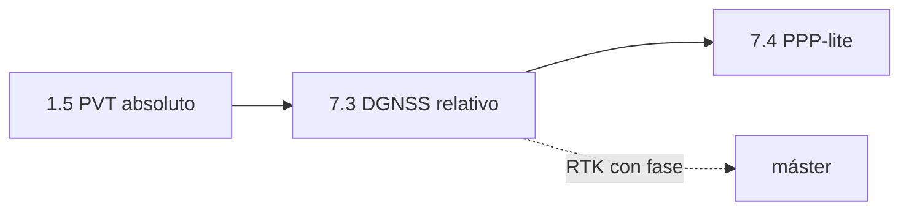

# Clase 7.3 — DGNSS: una estación conocida corrige a otra

> Bloque del máster: B2 — Advanced · Técnicas diferenciales (estaciones de referencia)

**Objetivo en una frase**: usar una estación de coordenadas conocidas
(LPGS) para generar correcciones de pseudodistancia que mejoran a un rover
(CORD), y medir sobre datos reales **qué cancela y qué no** un baseline de
715 km.

**Tiempo estimado**: 3–3.5 h (teoría 50' · lab 100' · ejercicios y cierre 40').

## 1. Objetivos

- [ ] Entender la corrección diferencial de pseudodistancia (PRC) y por qué cancela errores comunes.
- [ ] Implementar DGNSS: base con coords conocidas → PRC → rover las aplica.
- [ ] Medir la mejora real sobre el baseline La Plata–Córdoba (715 km).
- [ ] Explicar cuantitativamente por qué el DGNSS operativo usa **baselines cortos**.

## 2. ¿Dónde estamos?

Primer salto de precisión del path: pasa del posicionamiento absoluto (1.5)
al **relativo**. Reusa el motor PVT de 1.5 y prepara el terreno para PPP
(7.4, precisión centimétrica por otra vía) y RTK (fase, en el máster).



## 3. Teoría (con blancos B1–B5)

### 1. Errores comunes vs locales

Dos receptores que ven el **mismo satélite** sufren errores parecidos si
están cerca: el reloj del satélite es **idéntico** (error común), la
órbita casi idéntica, y la ionosfera/troposfera **parecidas si el
baseline es corto**. El ruido y el multipath, en cambio, son **locales**
(propios de cada antena).

### 2. La corrección diferencial (PRC)

La base conoce su posición, así que puede calcular el **rango geométrico
verdadero** a cada satélite y compararlo con lo que midió:

$$PRC_i = \underbrace{\lVert \mathbf{s}_i - \mathbf{base}\rVert}_{\text{verdad}} - \underbrace{P^{corr}_{base,i}}_{\text{medido y corregido}}$$

Ese $PRC_i$ **captura todo el error común** visto en la base. El rover le
suma el $PRC_i$ a su propia pseudodistancia y resuelve: los errores
comunes se cancelan.

### 3. Por qué el baseline importa

Cuanto más lejos el rover de la base, más **decorrelacionan** los errores
atmosféricos: la iono/tropo que la base mide ya no son las que el rover
sufre. El reloj del satélite y la órbita siguen siendo comunes (el
satélite es uno solo), pero la atmósfera no. Por eso el DGNSS operativo
(marítimo, aeroportuario) usa **baselines de decenas de km**, no cientos.

### 4. Monofrecuencia a propósito

Este lab usa **E1 sola** (no iono-free): así la ionosfera es un error
grande y real en el standalone, y el diferencial tiene algo sustancial
que corregir. Con iono-free (3.2) la iono ya está removida y el
diferencial rinde mucho menos — lo comprobás en el ejercicio E3.

### Lectura activa (B1–B5)

<details><summary>Completá y verificá</summary>

- **B1.** El reloj del satélite es un error ______ entre base y rover (se cancela).
- **B2.** El multipath y el ruido son errores ______ (no se cancelan con DGNSS).
- **B3.** PRC = rango geométrico verdadero − pseudodistancia ______ de la base.
- **B4.** Con el baseline creciendo, iono y tropo ______ → queda residual.
- **B5.** Se usa E1 monofrecuencia porque con iono-free la iono ya está ______.

Respuestas: B1 común · B2 locales · B3 corregida (medida) · B4 decorrelacionan · B5 removida
</details>

## 4. Lab

```bash
python3 clases/mod7-estimacion/clase7.3-dgnss/lab/lab_dgnss_TODO.py
```

La base LPGS genera PRC por satélite; el rover CORD las aplica. Comparás
el RMS del rover con y sin corrección. Solución en `lab/soluciones/`.

### Tabla de validación (día 166, 12:00–13:00, E1)

| Métrica | Valor de referencia |
|---|---|
| Baseline LPGS–CORD | **715 km** |
| Épocas comunes | **121** |
| RMS 3D rover standalone (E1) | **4.46 m** |
| RMS 3D rover DGNSS | **1.09 m** |
| Mejora | **76 % (×4.1)** |

El residual de ~1 m (no centímetros) **es** la lección: sobre 715 km el
reloj/órbita se cancelan pero la atmósfera decorrelaciona. Con baseline
corto bajaría a decímetros.

## 5. Ejercicios a mano

**E1.** Si el error de reloj de un satélite es +8 m y base y rover lo ven
igual, ¿cuánto de ese error queda tras el diferencial? ¿Y si el multipath
del rover es 3 m (que la base no ve)?

**E2.** El baseline es 715 km. Si la iono decorrelaciona ~1–2 mm por km,
estimá el residual atmosférico esperable y comparalo con el 1.09 m medido.

**E3.** ¿Por qué con observables iono-free (como en 3.2) el DGNSS mejoraría
mucho menos? ¿Qué error común quedaría por cancelar?

## 6. Estimaciones Fermi

**F1.** Un puerto usa DGNSS con baseline de 20 km. Si a 715 km el residual
es ~1 m y decorrelaciona ~linealmente, ¿qué residual esperás a 20 km?

**F2.** La base emite PRC cada 1 s. ¿Cuántas correcciones por satélite por
hora manda, y por qué la *edad* de la corrección importa (satélite
moviéndose a ~3.7 km/s)?

## 7. Preguntas conceptuales

<details><summary>C1. ¿Por qué DGNSS no llega a centímetros como RTK?</summary>

Porque corrige **código**, cuyo ruido es de decímetros-metros. RTK usa la
**fase de portadora** (mm) resolviendo ambigüedades enteras — otra liga,
la del máster.
</details>

<details><summary>C2. ¿Qué pasa con un error que solo ve el rover?</summary>

No se cancela: el multipath y el ruido locales del rover quedan intactos
(la base no los ve, no puede corregirlos). Por eso DGNSS mejora el sesgo
común pero no el ruido propio.
</details>

<details><summary>C3. ¿Por qué la base necesita coordenadas conocidas?</summary>

Porque el PRC se calcula contra el rango geométrico **verdadero**; sin la
posición exacta de la base no hay "verdad" contra la cual comparar.
</details>

## 8. Pregunta de entrevista

> "Explicá DGNSS: qué corrige, qué no, y por qué el operativo usa
> baselines cortos. ¿En qué se diferencia de RTK y de PPP?"

**Mini-caso**: agricultura de precisión en Córdoba con una base propia a
15 km. ¿DGNSS de código alcanza para guiado de tractor (~30 cm)? ¿Qué
cambiarías para llegar a cm?

## 9. Mini-simulacro (12 min)

1. Escribí la fórmula del PRC y qué errores absorbe.
2. Común vs local: clasificá reloj de satélite, órbita, iono, multipath, ruido.
3. ¿Por qué el residual del lab es ~1 m y no cm?
4. ¿Qué gana y qué pierde usar E1 sola vs iono-free en DGNSS?
5. DGNSS vs RTK vs PPP en una línea cada uno.

<details><summary>Respuestas</summary>

1. PRC=‖s−base‖−P_corr_base; absorbe reloj sat, órbita, atmósfera de la
base. 2. común: reloj sat, órbita, (iono/tropo si baseline corto); local:
multipath, ruido. 3. baseline 715 km → atmósfera decorrelaciona. 4. E1:
más error que corregir (iono) → más mejora aparente; iono-free ya la
removió. 5. DGNSS: código, m→dm; RTK: fase+ambigüedades, cm, baseline
corto; PPP: productos precisos globales, sin base, converge lento.
</details>

## 10. Caso real — el DGNSS marítimo y los radiofaros

Antes de que existiera el SBAS, la navegación marítima de precisión usaba
redes de **radiofaros DGNSS** en la costa: estaciones de referencia en
puertos y faros que transmitían PRC por radio de onda media a los barcos
cercanos. El diseño respetaba exactamente lo de esta clase: cobertura de
**decenas a ~200 km** por estación, porque más lejos la corrección pierde
valor. Muchas de esas redes siguen operativas como respaldo. Tu lab, con
715 km, muestra el borde del mapa: la corrección todavía ayuda (76 %),
pero el residual de 1 m avisa por qué nadie pone la base tan lejos.

## 11. Glosario ES/EN

| ES | EN | Nota |
|---|---|---|
| diferencial | differential (DGNSS) | corregir un rover con una base conocida |
| corrección de pseudodistancia | pseudorange correction (PRC) | el número que manda la base por satélite |
| base / rover | base / rover | estación conocida / receptor a posicionar |
| baseline | baseline | distancia base–rover |
| error común / local | common / local error | se cancela / no se cancela |
| decorrelación | decorrelation | pérdida de similitud con la distancia |
| RTK | RTK | diferencial de fase, precisión cm |

## 12. Cheat sheet

```text
PRC_i           ‖s_i − base‖ − P_corr_base,i     (base con coords conocidas)
rover           P_rover,i + PRC_i → resolver PVT
cancela         reloj de satélite, órbita (comunes); iono/tropo si baseline corto
NO cancela      multipath y ruido locales del rover
baseline largo  atmósfera decorrelaciona → residual crece
DGNSS < RTK     código (dm-m) vs fase con ambigüedades (cm)
Ref 166 (E1)    715 km · standalone 4.46 m → DGNSS 1.09 m · mejora 76%
```

## 13. Errores comunes

1. Aplicar PRC de un satélite a otro: cada corrección es **por satélite**.
2. Esperar centímetros de DGNSS de código: eso es RTK (fase).
3. Usar iono-free y sorprenderse de que el diferencial casi no mejore: la iono ya estaba removida.
4. Olvidar que el multipath del rover **no** se corrige.
5. Ignorar la *edad* de la corrección: con satélites y relojes moviéndose, una PRC vieja degrada.

## 14. Referencias

- ESA, *GNSS Data Processing Vol. I* — cap. de posicionamiento diferencial.
- RTCM SC-104 — formato estándar de correcciones DGNSS/RTK.
- Navipedia — "DGNSS", "RTK Fundamentals".
- Clases 1.5 (motor PVT), 3.2 (iono-free), 7.4 (PPP).

## 15. Rúbrica de autoevaluación

- ⭐ Explico PRC y la diferencia común/local.
- ⭐⭐ Corro el lab y obtengo la mejora del 76 % sobre el baseline real.
- ⭐⭐⭐ Predigo el residual a otro baseline y justifico DGNSS vs RTK vs PPP para un caso.

## 16. Para tu bitácora

Copiá [`bitacora.md`](bitacora.md): tu RMS con/sin DGNSS vs la tabla, y
una frase sobre por qué el residual no baja a centímetros acá.
