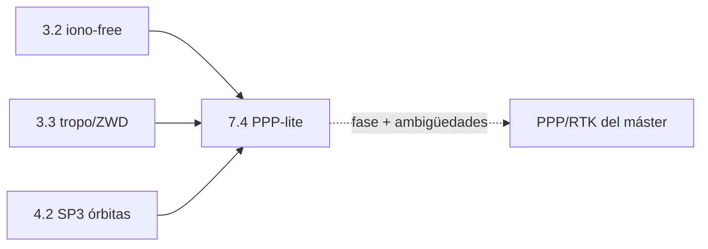

# Clase 7.4 — PPP-lite: productos precisos y por qué el código tiene techo

> Bloque del máster: B2 — Advanced · Técnicas de precisión centimétrica

**Objetivo en una frase**: reemplazar la efeméride broadcast por órbitas
SP3 y relojes CLK precisos (más la relatividad que los CLK no traen),
estimar el retardo húmedo, y **medir por qué el PPP de solo código no
llega a centímetros** — la fase es imprescindible.

**Tiempo estimado**: 3.5–4 h (teoría 70' · lab 110' · ejercicios y cierre 40').

## 1. Objetivos

- [ ] Sustituir broadcast por SP3 (órbita) + CLK (reloj) precisos.
- [ ] Agregar la **corrección relativista periódica** que los CLK omiten.
- [ ] Estimar el ZWD (retardo húmedo) como parámetro batch.
- [ ] Comprobar que el código puro queda en el metro, y argumentar por qué PPP real necesita fase.

## 2. ¿Dónde estamos?

Segunda vía de precisión (la otra es DGNSS, 7.3), pero **sin base**: usa
productos globales. Reusa el motor de 1.5, la iono-free de 3.2 y la tropo
de 3.3, y consume el SP3/CLK que bajaste en 0.4.



## 3. Teoría (con blancos B1–B5)

### 1. Broadcast vs preciso

La broadcast trae órbita+reloj con error de ~1–2 m (lo mediste en 1.3/4.1).
Los **productos precisos** (SP3 órbita ~2–3 cm, CLK reloj ~0.1 ns) los
calcula una red global *a posteriori*. PPP los usa para quitar el error de
órbita/reloj del satélite casi por completo.

### 2. La trampa de la relatividad

Los relojes precisos CLK **no incluyen** la corrección relativista
periódica $-2(\mathbf{r}\cdot\mathbf{v})/c^2$ (la broadcast tampoco, la
aplica el usuario). Si te la olvidás, aparece un error que en Galileo es
de ~decenas de cm (en GPS, por su mayor excentricidad, llega a metros).
Hay que calcularla con la **velocidad** del satélite (derivada del SP3).

### 3. La troposfera como incógnita

El ZHD (seco) se modela a ~mm con presión; el **ZWD** (húmedo) es rebelde
(clase 3.3). En PPP se lo **estima**. Pero con **código y una sola época**
el ZWD es casi inobservable (su mapeo $1/\sin(el)$ se confunde con el
reloj y la vertical): hay que estimarlo en **batch** (uno para toda la
sesión) o con un filtro (7.1).

### 4. El techo del código

Aun con órbita y reloj perfectos, la pseudodistancia de código tiene
ruido y multipath de **decímetros a metros**. Por eso el PPP de código se
queda en el metro; el PPP real llega a **centímetros** usando la **fase de
portadora** (ruido de mm) y resolviendo sus ambigüedades enteras — eso es
el proyecto del máster.

### Lectura activa (B1–B5)

<details><summary>Completá y verificá</summary>

- **B1.** El SP3 da órbita a ~cm; la broadcast, a ~______ m.
- **B2.** Los relojes CLK no traen la corrección ______ periódica: hay que sumarla.
- **B3.** Esa corrección se calcula con la ______ del satélite (derivada del SP3).
- **B4.** El ZWD con código y una época es casi ______; se estima en batch.
- **B5.** El código puro tiene techo en el ______; para cm hace falta la ______.

Respuestas: B1 1–2 · B2 relativista · B3 velocidad · B4 inobservable · B5 metro / fase
</details>

## 4. Lab

```bash
python3 clases/mod7-estimacion/clase7.4-ppp/lab/lab_ppp_TODO.py
```

Los lectores de SP3/CLK y la interpolación Lagrange ya están en la
solución; vos completás el reloj preciso (con relatividad) y el PVT.
Solución en `lab/soluciones/`.

### Tabla de validación (día 166, 12:00–13:00, LPGS)

| Métrica | Valor de referencia |
|---|---|
| Épocas PPP-lite | **121** |
| RMS 3D con ZWD=0 | **1.88 m** |
| ZWD óptimo (batch) | **14 cm** |
| RMS 3D con ZWD óptimo | **1.83 m** |
| Referencia broadcast (1.5) | ~1.95 m |

La mejora sobre broadcast es **modesta** (1.95 → 1.83 m) y ese es el
punto: con código, órbita/reloj perfectos casi no mueven la aguja porque
manda el ruido/multipath. El ZWD de 14 cm es físicamente sensato.

## 5. Ejercicios a mano

**E1.** El ZWD óptimo dio 14 cm. Con un mapeo $1/\sin(el)$, ¿cuánto retardo
húmedo agrega a un satélite a 30° de elevación? ¿Y a 10°?

**E2.** Órbita broadcast ~1.5 m, precisa ~3 cm. Si el error de posición es
~proporcional al de órbita, ¿por qué el RMS igual no baja de ~1.8 m?
(pista: ¿qué otro error domina en código?)

**E3.** La relatividad de Galileo dio ~8 cm (E21). ¿Por qué en GPS sería
de metros? (pista: excentricidad, clase 0.3).

## 6. Estimaciones Fermi

**F1.** El ruido de código E1 es ~0.3 m por medición; con ~8 satélites y
buena geometría, ¿qué RMS de posición esperás por ruido solo? Compará con
1.83 m.

**F2.** La fase de portadora tiene ruido ~2 mm. Si el PPP con fase
alcanzara ese nivel, ¿cuántas veces mejor que el código sería? ¿Por qué no
es "gratis" (pista: ambigüedades)?

## 7. Preguntas conceptuales

<details><summary>C1. ¿Por qué PPP no necesita una estación base como DGNSS?</summary>

Porque usa **productos globales** (SP3/CLK) que ya contienen el estado
preciso de cada satélite; el error común no se cancela contra un vecino
sino que se **modela** directamente. La contra: converge lento y depende
de productos externos.
</details>

<details><summary>C2. ¿Qué pasa si te olvidás la relatividad periódica?</summary>

Aparece un sesgo de reloj que en Galileo es de ~dm y en GPS de ~m,
oscilando con el período orbital. Es el bug clásico de PPP: los CLK no la
traen. (Lo viste: sin ella el RMS saltaba a ~11 m.)
</details>

<details><summary>C3. ¿Por qué el ZWD se estima en batch y no por época?</summary>

Con código, en una sola época el ZWD es casi inobservable (correlado con
el reloj y la vertical). Con toda la sesión (o un filtro) la geometría
cambia y lo vuelve observable. Es la puerta al KF (7.1).
</details>

## 8. Pregunta de entrevista

> "¿Qué es PPP, en qué se diferencia de DGNSS y RTK, y por qué el PPP de
> solo código no llega a centímetros?"

**Mini-caso**: te dan una estación quieta 24 h y productos MGEX finales.
¿Cómo estimarías su posición a mejor que un metro? ¿Qué te falta para cm?

## 9. Mini-simulacro (12 min)

1. SP3 vs CLK: ¿qué trae cada uno y con qué precisión?
2. ¿Qué corrección omiten los CLK y con qué se calcula?
3. ¿Por qué el ZWD se estima batch y no por época en código?
4. ¿Por qué PPP-lite apenas mejora al broadcast?
5. PPP vs DGNSS vs RTK en una línea cada uno.

<details><summary>Respuestas</summary>

1. SP3 órbita (~cm, cada 5 min); CLK reloj (~0.1 ns, cada 30 s). 2. la
relativista periódica −2(r·v)/c², con la velocidad del SP3. 3. es casi
inobservable por época (correlado con reloj/vertical). 4. porque el ruido/
multipath del código domina; órbita/reloj ya no eran el cuello. 5. PPP:
productos globales, sin base, converge lento; DGNSS: base cercana, código;
RTK: fase+ambigüedades, cm.
</details>

## 10. Caso real — por qué el PPP tardó en llegar al agro y hoy sí

Durante años la precisión centimétrica exigía RTK con base propia y
enlace de radio (caro, corto alcance). El PPP prometía cm **sin base**,
pero su talón era la convergencia (decenas de minutos) y la dependencia
de productos y correcciones de fase. Con las constelaciones actuales
(multi-GNSS, más geometría) y servicios de corrección PPP-RTK por satélite
o internet, hoy el PPP converge en minutos y habilita guiado de maquinaria
sin instalar bases. Tu lab muestra el piso de esa historia: con **solo
código** ya tenés el metro sin base — el salto a cm es exactamente lo que
agrega la fase, y es donde entra el proyecto PPP del máster.

## 11. Glosario ES/EN

| ES | EN | Nota |
|---|---|---|
| PPP | Precise Point Positioning | posicionamiento preciso sin base |
| producto preciso | precise product | SP3 (órbita), CLK (reloj) |
| relatividad periódica | periodic relativistic corr. | −2(r·v)/c², no está en los CLK |
| ZHD / ZWD | zenith hydrostatic/wet delay | seco (modelable) / húmedo (se estima) |
| convergencia | convergence | tiempo hasta la precisión objetivo |
| ambigüedad de fase | phase ambiguity | ciclos enteros, el salto a cm |

## 12. Cheat sheet

```text
Broadcast órbita/reloj   ~1-2 m       Precisos SP3/CLK   órbita ~cm, reloj ~0.1 ns
Reloj preciso total      CLK + (−2(r·v)/c²)   ← los CLK NO traen la relatividad
Velocidad del satélite   derivada de la interpolación SP3 (Lagrange)
ZWD                      estimar en BATCH (por época es inobservable con código)
Techo del código         ~metro (ruido+multipath); cm ⇒ fase de portadora
Ref 166 (12-13h)         ZWD=0: 1.88 m · ZWD 14 cm: 1.83 m · broadcast ~1.95 m
```

## 13. Errores comunes

1. Olvidar la relatividad periódica con relojes precisos (salta a ~m/dm).
2. Estimar ZWD por época con código: sale ruido (±metros) — hay que batch/filtro.
3. Esperar cm del PPP de código: el techo es el metro; cm ⇒ fase.
4. Mezclar SP3 de un centro con CLK de otro: usá el par consistente (acá COD/COD).
5. Interpolar SP3 con orden bajo o cerca del borde del día: usá Lagrange de ~10 nodos centrados.

## 14. Referencias

- ESA, *GNSS Data Processing Vol. I* — cap. de PPP y productos precisos.
- Kouba, *A Guide to Using IGS Products* — SP3/CLK, relatividad, convergencia.
- Navipedia — "Precise Point Positioning", "Relativistic Clock Correction".
- Clases 3.2 (iono-free), 3.3 (tropo/ZWD), 4.2 (SP3), 7.3 (DGNSS).

## 15. Rúbrica de autoevaluación

- ⭐ Explico SP3/CLK y por qué PPP no necesita base.
- ⭐⭐ Corro el lab, obtengo ~1.8 m y el ZWD batch, y agrego la relatividad.
- ⭐⭐⭐ Argumento cuantitativamente el techo del código y qué agrega la fase (camino a cm).

## 16. Para tu bitácora

Copiá [`bitacora.md`](bitacora.md): tu RMS y ZWD vs la tabla, y una frase
sobre por qué órbita/reloj perfectos no bastan para llegar a centímetros.
