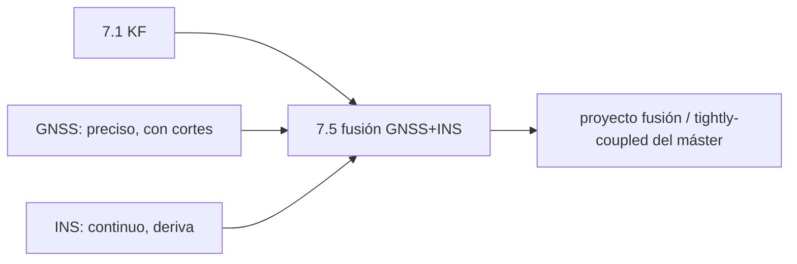

# Clase 7.5 — Fusión GNSS+INS: cada sensor tapa el agujero del otro

> Bloque del máster: B2 — Advanced · Técnicas de resiliencia: sensor fusion

**Objetivo en una frase**: fusionar un GNSS (preciso pero con cortes) con
un INS (continuo pero que deriva) mediante un filtro de Kalman
loosely-coupled, y ver cómo el resultado supera a **cada sensor por
separado**.

**Tiempo estimado**: 3–3.5 h (teoría 50' · lab 100' · ejercicios y cierre 40'). Depende de la clase 7.1 (KF).

## 1. Objetivos

- [ ] Entender la complementariedad GNSS (ancla, con cortes) ↔ INS (continuo, deriva).
- [ ] Implementar un KF loosely-coupled: predecir con IMU, corregir con GNSS.
- [ ] Medir cómo el INS **puentea** cortes de GNSS y el GNSS **frena** la deriva del INS.
- [ ] Cuantificar que la fusión bate a GNSS-solo y a INS-solo.

## 2. ¿Dónde estamos?

Cierre del path de estimación: aplica el KF de 7.1 a una **fusión de
sensores**, la puerta de entrada al proyecto de fusión del máster. Es la
respuesta de resiliencia PNT: cuando el GNSS se cae (túnel, jamming), el
INS sostiene.



## 3. Teoría (con blancos B1–B5)

### 1. Dos sensores complementarios

- **GNSS**: da posición **absoluta** con error acotado (~m), pero a baja
  tasa y con **cortes** (túneles, cañones urbanos, jamming).
- **INS** (acelerómetros/giróscopos): da movimiento **relativo** a alta
  tasa y sin cortes, pero **integra** — cualquier sesgo o ruido se acumula
  y la posición **deriva** sin límite.

Juntos se tapan: el GNSS acota la deriva del INS; el INS puentea los
cortes del GNSS.

### 2. Loosely-coupled

En el acoplamiento **débil** (loosely-coupled) el GNSS entrega su
**solución de posición** ya resuelta (el PVT de 1.5), y el KF la usa como
medición. En el **fuerte** (tightly-coupled, el del máster) el KF ingiere
las **pseudodistancias** crudas y sigue funcionando con <4 satélites —
más potente y más complejo.

### 3. El KF de fusión

Estado $[x, y, v_x, v_y]$. La **predicción** usa la aceleración del IMU
como entrada de control:

$$\mathbf{x}_k = F\mathbf{x}_{k-1} + B\,\mathbf{a}_{med}, \qquad B = \begin{bmatrix}\tfrac12 dt^2 & 0\\ 0 & \tfrac12 dt^2\\ dt & 0\\ 0 & dt\end{bmatrix}$$

La **corrección** entra solo cuando hay fix GNSS ($H$ observa la
posición). Durante un corte, el filtro **solo predice** con el IMU: ahí se
ve el puenteo.

### 4. Q y R: a quién creerle

$R$ (ruido de la medición GNSS) y $Q$ (ruido del proceso, la
imperfección del IMU) fijan el balance. $R$ grande → el filtro confía más
en el IMU; $Q$ grande → confía más en el GNSS. Mal calibrados, el filtro
diverge o ignora un sensor (conexión con las innovaciones de 7.1).

### Lectura activa (B1–B5)

<details><summary>Completá y verificá</summary>

- **B1.** El GNSS da posición ______ con cortes; el INS, movimiento ______ sin cortes pero que deriva.
- **B2.** En loosely-coupled el GNSS entrega su ______ ya resuelta; en tightly-coupled, las ______ crudas.
- **B3.** Durante un corte de GNSS el KF solo ______ con el IMU.
- **B4.** R grande hace que el filtro confíe más en el ______; Q grande, en el ______.
- **B5.** El INS solo deriva porque ______ el ruido y el sesgo del acelerómetro.

Respuestas: B1 absoluta / relativo · B2 solución (posición) / pseudodistancias · B3 predice · B4 IMU / GNSS · B5 integra (acumula)
</details>

## 4. Lab

```bash
python3 clases/mod7-estimacion/clase7.5-fusion/lab/lab_fusion_TODO.py
```

Trayectoria sintética + IMU con sesgo/ruido + GNSS a 1 Hz con un corte de
30 s. Completás las matrices del KF y el ciclo predecir/corregir. Todo
determinista (seed 42). Solución en `lab/soluciones/`.

### Tabla de validación (seed 42, corte 50–80 s)

| Métrica | Valor de referencia |
|---|---|
| RMS GNSS solo (en cada fix) | **4.41 m** |
| RMS INS solo (deriva libre) | **117.90 m** |
| RMS fusión KF | **3.70 m** |
| Error máx en el corte — INS solo | **117.82 m** |
| Error máx en el corte — fusión KF | **10.16 m** |

La fusión bate a ambos: mejor que el GNSS (usa el IMU entre fixes) y
muchísimo mejor que el INS (el GNSS lo re-ancla). En el corte, el INS se
va a 118 m mientras el KF se mantiene en 10 m.

## 5. Ejercicios a mano

**E1.** El INS deriva como $\tfrac12 a_{bias} t^2$. Con un sesgo de
0.02 m/s² sin corregir, ¿cuánto error de posición acumula en los 30 s de
corte? Compará con los ~118 m del lab (que suman las dos componentes).

**E2.** Si el GNSS diera fix cada 0.1 s (misma tasa que el IMU), ¿para qué
seguiría sirviendo el INS?

**E3.** ¿Qué cambia si el corte dura 5 minutos en vez de 30 s? ¿Por qué la
fusión loosely-coupled igual termina degradándose?

## 6. Estimaciones Fermi

**F1.** Un auto en un túnel de 2 km a 80 km/h: ¿cuánto tarda? Con deriva de
INS de grado automóvil (~1–5 m tras un minuto), ¿saldría "en el carril
correcto"?

**F2.** El IMU corre a 10 Hz y el GNSS a 1 Hz. ¿Cuántas predicciones hace
el KF por cada corrección? ¿Por qué eso justifica el INS aunque el GNSS
esté sano?

## 7. Preguntas conceptuales

<details><summary>C1. ¿Por qué el INS "deriva" y el GNSS no?</summary>

El INS mide aceleración e **integra dos veces** para posición: todo sesgo
o ruido se acumula (crece con $t^2$). El GNSS mide posición absoluta cada
época: su error no se acumula, oscila alrededor de la verdad.
</details>

<details><summary>C2. ¿Qué agrega tightly-coupled sobre loosely-coupled?</summary>

Ingiere pseudodistancias crudas, así que **sigue funcionando con menos de
4 satélites** (cañón urbano con 2–3 a la vista): cada pseudodistancia
aporta, aunque no alcancen para un PVT completo. Más robusto, más complejo.
</details>

<details><summary>C3. ¿Por qué mal calibrar Q/R rompe la fusión?</summary>

Si R es muy chico el filtro sobre-confía en un GNSS ruidoso y salta; si Q
es muy chico, ignora que el IMU deriva y no corrige a tiempo. El
diagnóstico es la secuencia de innovaciones (7.1): debe ser blanca.
</details>

## 8. Pregunta de entrevista

> "Explicá cómo se fusionan GNSS e INS y por qué el resultado es mejor que
> cualquiera de los dos. ¿Qué diferencia loosely de tightly-coupled?"

**Mini-caso**: dron de reparto que atraviesa zonas con jamming
intermitente. ¿Qué arquitectura de fusión elegís y qué pasa si el jamming
dura más que la deriva tolerable del INS?

## 9. Mini-simulacro (12 min)

1. GNSS vs INS: fortaleza y debilidad de cada uno.
2. ¿Qué hace el KF durante un corte de GNSS?
3. Loosely vs tightly-coupled en una línea.
4. ¿Por qué el INS deriva con $t^2$?
5. Q grande vs R grande: ¿a quién le cree el filtro?

<details><summary>Respuestas</summary>

1. GNSS: absoluto, acotado, con cortes; INS: continuo, alta tasa, deriva.
2. solo predice con el IMU (puentea). 3. loosely usa la posición GNSS;
tightly, las pseudodistancias crudas (<4 sats). 4. integra dos veces el
sesgo/ruido de aceleración. 5. Q grande → cree al GNSS; R grande → cree al
INS.
</details>

## 10. Caso real — por qué tu teléfono no se pierde en el túnel

Cuando entrás a un túnel o a un estacionamiento subterráneo, el mapa del
teléfono sigue moviéndose unos segundos "a ciegas": eso es fusión
GNSS+INS (los acelerómetros y el giróscopo del propio teléfono, más la
velocidad de las ruedas en autos con integración). Funciona bien por
**decenas de segundos** —justo lo que dura un túnel corto— porque la
deriva del INS de bajo costo se dispara rápido. Es exactamente lo que
muestra tu lab: en el corte de 30 s la fusión aguanta en ~10 m, pero si
el corte durara minutos, el INS de consumo se iría (E3). Por eso los
sistemas críticos usan IMU de mayor grado y tightly-coupling.

## 11. Glosario ES/EN

| ES | EN | Nota |
|---|---|---|
| fusión de sensores | sensor fusion | combinar fuentes complementarias |
| INS / IMU | INS / IMU | sistema/unidad de navegación inercial |
| loosely / tightly-coupled | loosely / tightly-coupled | fusiona posición / pseudodistancias |
| dead-reckoning | dead reckoning | navegar integrando el movimiento |
| deriva | drift | error que crece con el tiempo (INS) |
| entrada de control | control input | la aceleración del IMU en la predicción |

## 12. Cheat sheet

```text
GNSS      posición absoluta, error acotado (~m), baja tasa, con CORTES
INS       movimiento relativo, alta tasa, sin cortes, DERIVA (~t²)
KF fusión estado [x,y,vx,vy]; predice con IMU (F,B·a); corrige con GNSS (H) si hay fix
corte     el KF solo predice → el INS puentea; al volver el GNSS re-ancla
Q / R     Q grande → cree al GNSS ; R grande → cree al INS
loosely   usa la solución de posición GNSS   tightly → pseudodistancias (<4 sats)
Ref seed42  GNSS 4.41 · INS 117.9 · fusión 3.70 m ; corte: INS 118 vs KF 10 m
```

## 13. Errores comunes

1. Olvidar el sesgo del acelerómetro: es la causa principal de la deriva $t^2$.
2. Creer que la fusión "promedia": el KF **pondera** por incertidumbre (Q/R), no promedia.
3. Esperar que loosely-coupled sirva con <4 satélites: para eso es tightly.
4. Q/R mal calibrados → el filtro ignora un sensor o diverge (mirá las innovaciones, 7.1).
5. Pensar que el INS "arregla" cortes largos: la deriva lo limita a decenas de segundos (IMU de consumo).

## 14. Referencias

- Groves, *Principles of GNSS, Inertial, and Multisensor Integrated Navigation Systems* — el texto de referencia.
- ESA, *GNSS Data Processing Vol. I* — integración GNSS/INS.
- Navipedia — "GNSS/INS Integration".
- Clases 7.1 (KF), 7.2 (EKF), 1.5 (el PVT que alimenta el loosely-coupled).

## 15. Rúbrica de autoevaluación

- ⭐ Explico la complementariedad GNSS↔INS y qué es la deriva.
- ⭐⭐ Corro el lab y obtengo la fusión batiendo a cada sensor, con el corte acotado.
- ⭐⭐⭐ Analizo el efecto de Q/R y de la duración del corte, y distingo loosely/tightly para un caso.

## 16. Para tu bitácora

Copiá [`bitacora.md`](bitacora.md): tus RMS de los tres (GNSS/INS/fusión)
vs la tabla, y una frase sobre por qué el INS solo no alcanza.
