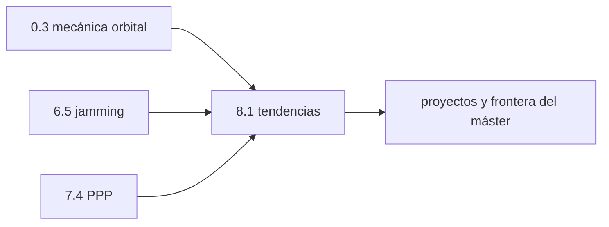

# Clase 8.1 — Future & Trends: LEO-PNT, navegación lunar y SatCom

> Bloque del máster: B5 — Future & Trends

**Objetivo en una frase**: entender hacia dónde va el PNT —posicionamiento
desde órbita baja (LEO-PNT), navegación lunar (Moonlight/LunaNet) y la
convergencia con SatCom— y cuantificar por qué LEO cambia el juego.

**Tiempo estimado**: 2–2.5 h (lectura 60' · lab-lite 30' · cierre 30'). Bloque de lectura: sin labs obligatorios en el máster; acá un lab-lite para anclar los números.

## 1. Objetivos

- [ ] Cuantificar las ventajas y costos de LEO-PNT vs MEO.
- [ ] Entender el problema de navegación lunar (Moonlight/LunaNet).
- [ ] Situar Alternative PNT y SatCom en el mapa de resiliencia.
- [ ] Conectar las tendencias con lo aprendido en el path.

## 2. ¿Dónde estamos?

Cierre conceptual del path: mira hacia adelante con las herramientas que ya
tenés. Reusa la física orbital de 0.3, el jamming de 6.5 (LEO como
anti-jamming) y el PPP de 7.4 (LEO acelera la convergencia).



## 3. Teoría (con blancos B1–B5)

### 1. LEO-PNT: la señal baja de altura

Poner PNT en **órbita baja** (~550 km, vs ~23 000 km de MEO) tiene dos
ventajas enormes: la señal llega **~30 dB más fuerte** (ley cuadrática
inversa) — intrínsecamente **anti-jamming** — y la **geometría cambia
rápido** (período ~1.6 h vs 14 h), lo que **acelera la convergencia del
PPP** de decenas de minutos a minutos. Ejemplos: demostraciones de ESA,
constelaciones comerciales como Xona.

### 2. El costo de LEO

Nada es gratis: los satélites cruzan el cielo en **minutos** → **hand-over
veloz** (adquirir/soltar constantemente), **Doppler ~2× mayor**, y hacen
falta **cientos** de satélites (no decenas) para cobertura global continua.

### 3. Navegación lunar

Las misiones lunares (Artemis) necesitan PNT alrededor de la Luna, que **no
tiene GNSS**. **Moonlight** (ESA) y **LunaNet** (NASA/ESA) proponen llevar
la infraestructura: satélites lunares de navegación y comunicación. El
desafío técnico central es el **POD en órbita lunar** (4.2) sin una red de
estaciones que rodee la Luna.

### 4. Alternative PNT y SatCom

La resiliencia PNT (ante jamming/spoofing, mod6) empuja hacia **fuentes
alternativas**: LEO-PNT, señales de oportunidad, eLORAN, INS (7.5). Y las
megaconstelaciones de **SatCom** (comunicaciones LEO) difuminan la frontera:
pueden llevar PNT como servicio secundario. El futuro es **multi-fuente**.

### Lectura activa (B1–B5)

<details><summary>Completá y verificá</summary>

- **B1.** LEO está a ~550 km; la señal llega ~______ dB más fuerte que en MEO.
- **B2.** LEO acelera la convergencia del ______ porque la geometría cambia rápido.
- **B3.** El costo de LEO: hand-over veloz, más Doppler y ______ satélites.
- **B4.** ______ (ESA) y LunaNet llevan navegación alrededor de la Luna.
- **B5.** La resiliencia PNT empuja hacia fuentes ______ del GNSS clásico.

Respuestas: B1 30 · B2 PPP · B3 muchos más (cientos) · B4 Moonlight · B5 alternativas
</details>

## 4. Lab-lite

```bash
python3 clases/mod8-futuro/clase8.1-tendencias/lab/lab_futuro_TODO.py
```

Cuantificás período, Doppler y ventaja de potencia LEO vs MEO con física de
0.3. Solución en `lab/soluciones/`.

### Tabla de validación

| Métrica | MEO (Galileo) | LEO-PNT |
|---|---|---|
| Período | ~14 h | ~1.6 h |
| Velocidad | 3.67 km/s | 7.59 km/s |
| Doppler máx (L1) | ±19 kHz | ±40 kHz |
| Ventaja de potencia LEO | — | **+33 dB** |

Los +33 dB coinciden con la cifra citada (~30 dB) para LEO-PNT: por eso es
anti-jamming por diseño.

## 5. Ejercicios a mano

**E1.** Con la 3ª ley (0.3), verificá el período de LEO a 550 km. ¿Cuántas
vueltas a la Tierra da por día?

**E2.** Si LEO llega +30 dB más fuerte, ¿cuánta más potencia necesita un
jammer para ahogarla frente a la señal MEO? (en veces, no dB).

**E3.** ¿Por qué el POD lunar es más difícil que el terrestre?

## 6. Estimaciones Fermi

**F1.** Para cobertura global continua con satélites que se ven ~10 min
cada uno, ¿cuántos satélites LEO del orden hacen falta? Compará con los ~30
de Galileo.

**F2.** Un satélite LEO a 7.6 km/s: ¿cuánto tarda en cruzar de horizonte a
horizonte visto desde el suelo? ¿Por qué eso exige hand-over rápido?

## 7. Preguntas conceptuales

<details><summary>C1. ¿Por qué LEO es anti-jamming "gratis"?</summary>

Por la distancia: a ~40× más cerca, la señal llega ~30 dB más fuerte. Un
jammer necesita ~1000× más potencia para lograr el mismo J/S que contra la
débil señal MEO. La física juega a favor.
</details>

<details><summary>C2. ¿Por qué la navegación lunar no puede copiar GNSS tal cual?</summary>

No hay red de estaciones terrestres alrededor de la Luna para el POD, ni
constelación lunar establecida, y la dinámica orbital lunar (sin atmósfera
pero con un campo gravitatorio irregular) es distinta. Hay que rediseñar la
arquitectura.
</details>

<details><summary>C3. ¿LEO-PNT reemplaza al GNSS clásico?</summary>

Más bien lo **complementa**: aporta resiliencia (anti-jamming) y velocidad
de convergencia, pero exige muchos satélites y hand-over complejo. El futuro
es multi-fuente: MEO + LEO + INS + señales de oportunidad.
</details>

## 8. Pregunta de entrevista

> "¿Qué aporta LEO-PNT sobre el GNSS clásico y cuáles son sus costos?
> ¿Por qué la navegación lunar es un problema nuevo y no solo 'GPS en la
> Luna'?"

**Mini-caso**: te piden diseñar la arquitectura PNT de una base lunar.
¿Qué llevás de la Tierra (conceptos del path) y qué tenés que reinventar?

## 9. Mini-simulacro (8 min)

1. Dos ventajas y dos costos de LEO-PNT.
2. ¿Por qué LEO es anti-jamming?
3. ¿Qué son Moonlight y LunaNet?
4. ¿Por qué el POD lunar es difícil?
5. ¿LEO reemplaza o complementa al GNSS?

<details><summary>Respuestas</summary>

1. ventajas: +30 dB (anti-jamming), convergencia PPP rápida; costos:
hand-over veloz, muchos satélites. 2. la señal llega ~30 dB más fuerte por
la cercanía. 3. navegación/comunicación alrededor de la Luna (ESA / NASA).
4. sin red terrestre que rodee la Luna para el POD. 5. complementa
(resiliencia multi-fuente).
</details>

## 10. Caso real — Xona y la carrera del LEO-PNT

Empresas como **Xona Space Systems** (constelación "Pulsar") están
desplegando LEO-PNT comercial, y ESA lanzó su iniciativa **LEO-PNT** con
demostradores. El argumento es exactamente el de esta clase: la señal ~30 dB
más fuerte resiste el jamming que hoy afecta rutas de aviación y marítimas
(mod6), y la geometría veloz da PPP en minutos para agricultura y
autonomía. El costo —cientos de satélites y hand-over constante— es el
mismo que enfrentan las megaconstelaciones de SatCom, de ahí que muchos
propongan fusionar ambos servicios. Es el frente donde el GNSS "clásico" que
estudiaste se encuentra con la nueva economía espacial.

## 11. Glosario ES/EN

| ES | EN | Nota |
|---|---|---|
| LEO-PNT | LEO-PNT | posicionamiento desde órbita baja |
| PNT alternativo | Alternative PNT | fuentes no-GNSS de posición/tiempo |
| hand-over | hand-over | cambio de satélite al servicio |
| navegación lunar | lunar navigation | Moonlight (ESA), LunaNet (NASA/ESA) |
| señal de oportunidad | signal of opportunity | usar señales no diseñadas para PNT |
| resiliencia PNT | PNT resilience | robustez ante jamming/spoofing/fallos |

## 12. Cheat sheet

```text
LEO-PNT     ~550 km · período ~1.6 h · +~30 dB de señal (anti-jamming) · PPP converge rápido
Costo LEO   hand-over veloz · Doppler ~2× · cientos de satélites
Lunar       Moonlight (ESA) / LunaNet (NASA/ESA) · desafío: POD sin red terrestre lunar
Alt-PNT     LEO + INS (7.5) + señales de oportunidad + eLORAN → resiliencia multi-fuente
SatCom      megaconstelaciones LEO pueden llevar PNT secundario (frontera difusa)
Ref lab     LEO período 1.6 h · Doppler ±40 kHz · +33 dB vs MEO
```

## 13. Errores comunes

1. Creer que LEO-PNT reemplaza al GNSS: lo complementa (resiliencia).
2. Olvidar el costo: cientos de satélites y hand-over constante.
3. Pensar "GPS en la Luna": el POD lunar es un problema nuevo (sin red terrestre).
4. Ignorar que la ventaja de +30 dB es geometría pura (distancia), no magia.
5. Separar PNT de SatCom: la frontera se está borrando.

## 14. Referencias

- ESA — iniciativa LEO-PNT y Moonlight; NASA/ESA — LunaNet.
- Xona Space Systems — constelación Pulsar (LEO-PNT comercial).
- Navipedia — "Future GNSS", "LEO-PNT".
- Clases 0.3 (órbitas), 6.5 (jamming), 7.4 (PPP), 7.5 (INS/resiliencia).

## 15. Rúbrica de autoevaluación

- ⭐ Explico las ventajas y costos de LEO-PNT.
- ⭐⭐ Cuantifico período, Doppler y potencia LEO vs MEO en el lab.
- ⭐⭐⭐ Diseño conceptualmente una arquitectura PNT (lunar o resiliente) usando el path.

## 16. Para tu bitácora

Copiá [`bitacora.md`](bitacora.md): tus números LEO vs MEO y una frase
sobre el trade-off señal/geometría contra cantidad/hand-over. Con esto
cerrás el recorrido conceptual del path.
